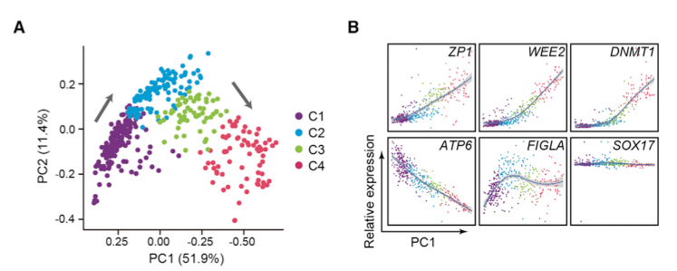
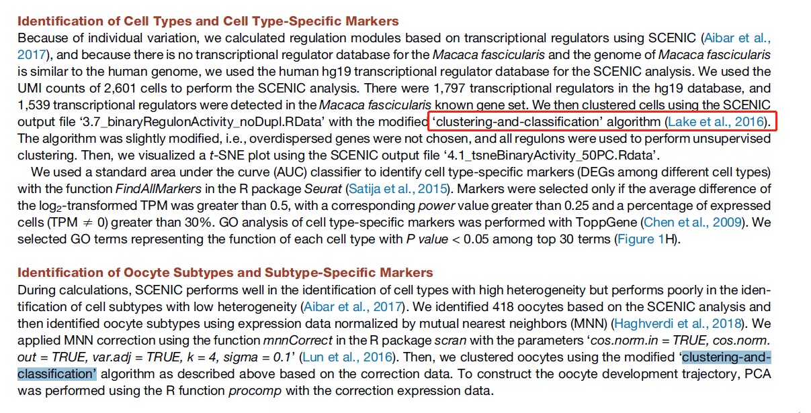
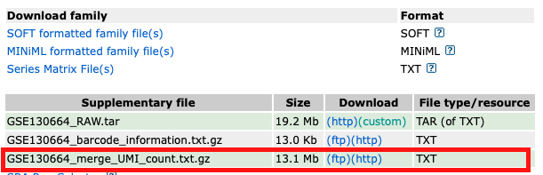

欢迎关注“小丫画图”公众号，回复“小白”，看小视频，实现点鼠标跑代码。

小丫微信: epigenomics  E-mail: figureya@126.com

作者：Hazard

小丫编辑校验

```{r setup, include=FALSE}
knitr::opts_chunk$set(echo = TRUE)
```

# 需求描述

这个PCA很特别



出自<https://linkinghub.elsevier.com/retrieve/pii/S0092867420300568>

Figure 3. Dynamic Gene-Expression Patterns of Oocyte Subtypes at Stepwise Developmental Stages
(A) PCA plot showing four oocyte subtypes based on gene-expression patterns exhibited by PC1 and PC2.
(B) Relative gene-expression patterns of representative genes essential for oocyte development along the PC1 dimension.

# 应用场景

单细胞RNA-seq，从PCA结果就能看出基因表达模式跟细胞类型的关系。

原文：Principal component analysis (PCA) revealed that the four oocyte subtypes were distributed along the principal component 1 (PC1) dimension (Figure 3A; Table S2). 

Consistently, the relative expression levels of **genes known to be essential for follicular development also varied along PC1 axis** (Figures 3B and S3A). Genes promoting follicle development, such as ZP1, BMP15, and GDF9, were progressively **upregulated from oocyte subtype C1 to C4**. Meiotic M phase genes WEE2 and AURKA as well as DNA methyltransferase, DNMT1 and DNMT3A, were also gradually upregulated from subtype C1 to C4 (Figures 3B and S3A). 

# 环境设置

使用国内镜像安装包

```{r eval=FALSE}
options("repos"= c(CRAN="https://mirrors.tuna.tsinghua.edu.cn/CRAN/"))
options(BioC_mirror="http://mirrors.tuna.tsinghua.edu.cn/bioconductor/")
install.packages("leiden")
install.packages("spatstat")
install.packages("uwot")
install.packages("ggbeeswarm")
```

加载包

```{r}
library(Seurat)
library(magrittr)
library(ggplot2)
Sys.setenv(LANGUAGE = "en") #显示英文报错信息
options(stringsAsFactors = FALSE) #禁止chr转成factor
```

# 输入文件

sc.seurat.Rdata，单细胞RNA-seq预处理获得的文件。出自FigureYa206scHeatmap，文件较大，已上传至微云<https://share.weiyun.com/vZiSM9pB>

怎样获得这个文件？拖到文末看“附：单细胞RNA-seq数据预处理”

```{r}
(load("sc.seurat.Rdata"))
```

# PCA

## 原文采用的聚类方法

例文的非监督聚类方法比较特殊，以SCENIC的分析结果作为输入（SCENIC的用法可参考FigureYa194pySCENIC），用modified ‘clustering-and-classification’ algorithm (Lake et al., 2016) 给细胞做聚类。clustering-and-classification也是个很有趣的半监督聚类算法，如果有需要，我们后面再众筹。



## 我们用Seurat自带的无监督聚类

```{r}
## 提取oocytes subtype的细胞的数据
# 从文章附件获得oocytes subtype的细胞ID（191 young oocytes, 227 old oocytes）
# 这里用到第一列cell ID，用于提取oocytes subtype的细胞
meta_oo <- readxl::read_excel(path = "1-s2.0-S0092867420300568-mmc2.xlsx", sheet = 2) 
sc_oo <- sc[,meta_oo$cell] # only 414 (not 418?! ) cells in the metadata 

## 自己的数据，就不涉及取子集，直接用sc就好，用下面这行代替上面两行：
# sc_oo <- sc

sc_oo_mnn <- batchelor::mnnCorrect(# mmnCorrect is no longer in scran 
  as.SingleCellExperiment(sc_oo),
  batch = sc_oo$individual,
  k = 4, 
  sigma = 0.1, cos.norm.in = T, cos.norm.out = T, 
  var.adj = T
)
prData <- SummarizedExperiment::assay(sc_oo_mnn)

# HVGs
sc_oo %<>% FindVariableFeatures(selection.method = "mvp", mean.cutoff = c(1,8))
VariableFeatures(sc_oo) %>% length()

# PCA
prres <- prcomp(prData[VariableFeatures(sc_oo), ] %>% t, scale. = F)
#prres <- prcomp(prData %>% t, scale. = F)
#prres$x <- sc_oo@reductions$pca@cell.embeddings

# unsupervised clustering based on mnn matrix
sc_oo %<>% ScaleData 
sc_oo@assays$RNA@scale.data <- prData[rownames(sc_oo@assays$RNA@scale.data), colnames(sc_oo@assays$RNA@scale.data)]
sc_oo %<>% RunPCA
ElbowPlot(sc_oo)

sc_oo %<>% FindNeighbors(dims = 1:15) %>% FindClusters(resolution = 0.6)

pca.pv <- sc_oo@reductions$pca
# 每个基因的主成分
# pca.pv@feature.loadings
dim(pca.pv@feature.loadings)
```

# 开始画图

## 画Fig. 3A

```{r}
#计算坐标轴标签
pc1.pv <- paste0(round(pca.pv@stdev[1], digits = 3) * 100, "%")
pc2.pv <- paste0(round(pca.pv@stdev[2], digits = 3) * 100, "%")

# 修改seurat_clusters的名字
sc_oo@meta.data$seurat_clusters <- factor(sc_oo@meta.data$seurat_clusters, 
                                          levels = c("0", "1", "2", "3"), 
                                          labels = c("C1", "C2", "C3", "C4"))

# 画图
PCAPlot(sc_oo, group.by = "seurat_clusters") +
  scale_color_manual(values = c("darkmagenta", "steelblue", "chartreuse3", "red")) +
  xlab(paste0("PC1 (", pc1.pv,")")) + 
  ylab(paste0("PC2 (", pc2.pv,")")) 

# 保存到文件
ggsave("PCA_A.pdf", width = 6, height = 5)
```

## 画Fig. 3B

用Seurat自带的无监督聚类获得的seurat_clusters画图

```{r}
#ggplot() + geom_point(mapping = aes(prres$x[,1],  prres$x[,2], color = sc_oo$seurat_clusters))

markers <- c("ZP1", "WEE2", "DNMT1", "ATP6", "FIGLA", "SOX17")
reshape2::melt(cbind(sc_oo@meta.data[,"seurat_clusters", drop = F],
                     PC1 = -prres$x[,1],
                     GetAssayData(sc_oo)[markers,] %>% t
                     #SummarizedExperiment::assay(sc_oo_mnn)[markers,] %>% t
), 
id.vars = c("seurat_clusters", "PC1")) %>%
  ggplot(mapping = aes(PC1, value)) +
  ylab("Relative expression") +
  geom_point(mapping = aes(color = seurat_clusters)) +
  geom_smooth() +
  scale_color_manual(values = c("darkmagenta", "steelblue", "chartreuse3", "red")) +
  facet_wrap(~variable, scales = "free_y") +
  theme_classic() +
  theme(panel.border = element_rect(fill = NA),
        axis.text.x = element_blank(),
        axis.ticks.x = element_blank())
ggsave("PCA_B.pdf", width = 7, height = 4)
```

## 跟原文对比

1-s2.0-S0092867420300568-mmc2.xlsx的第二列是细胞所在的cluster，是原文采用的聚类方法获得的cluster信息，用它跟我们做的“Seurat自带的无监督聚类”的结果对比。

没有完全重复出原文的效果。最可能的原因是mnn算法计算出的数据有差别，或者是作者选用的输入基因是特别的，原文方法中没有描述。

```{r}
meta_oo <- readxl::read_excel(path = "1-s2.0-S0092867420300568-mmc2.xlsx", sheet = 2)
dim(meta_oo)
sc_oo$subtype <- meta_oo$cluster[match(colnames(sc_oo), meta_oo$cell)]

table(sc_oo$subtype, sc_oo$seurat_clusters)
```

用原文聚类获得的subtype画图

```{r}
#ggplot() +
  geom_point(mapping = aes(prres$x[,1],  prres$x[,2], color = sc_oo$subtype))

markers <- c("ZP1", "WEE2", "DNMT1", "ATP6", "FIGLA", "SOX17")
reshape2::melt(cbind(sc_oo@meta.data[,"subtype", drop = F],
        PC1 = -prres$x[,1],
        GetAssayData(sc_oo)[markers,] %>% t
        #SummarizedExperiment::assay(sc_oo_mnn)[markers,] %>% t
        ), 
  id.vars = c("subtype", "PC1")) %>%
  ggplot(mapping = aes(PC1, value)) +
  ylab("Relative expression") +
  geom_point(mapping = aes(color = subtype)) +
  geom_smooth() +
  scale_color_manual(values = c("darkmagenta", "steelblue", "chartreuse3", "red")) +
  facet_wrap(~variable, scales = "free_y") +
  theme_classic() +
  theme(panel.border = element_rect(fill = NA),
        axis.text.x = element_blank(),
        axis.ticks.x = element_blank())
ggsave("PCA_B_ori.pdf", width = 7, height = 4)
```

# 附：单细胞RNA-seq数据预处理

以下代码出自`FigureYa206scHeatmap`，会输出`sc.seurat.Rdata`，可作为以上代码的输入文件。

## 下载单细胞RNA-seq数据

1) UMI count，从NCBI[GSE130664](https://www.ncbi.nlm.nih.gov/geo/query/acc.cgi?acc=GSE130664)下载：`GSE130664_merge_UMI_count.txt.gz`文件。



```{r download, eval=FALSE}
download.file("https://www.ncbi.nlm.nih.gov/geo/download/?acc=GSE130664&format=file&file=GSE130664%5Fmerge%5FUMI%5Fcount%2Etxt%2Egz", 
              destfile = "GSE130664_merge_UMI_count.txt.gz")
```

2) metadata，从[例文的](https://doi.org/10.1016/j.cell.2020.01.009)Supplementary Tables获得：`1-s2.0-S0092867420300568-mmc1.xlsx`

## Read data

```{r preprocessing, eval=FALSE}
umi <- read.table(file = gzfile("GSE130664_merge_UMI_count.txt.gz"), header = T, row.names = 1, sep = "\t")
qc <- readxl::read_excel("1-s2.0-S0092867420300568-mmc1.xlsx", sheet = 2)
meta <- readxl::read_excel("1-s2.0-S0092867420300568-mmc1.xlsx", 3) %>% 
  column_to_rownames("cell")
```

## 数据预处理

See Methods:  
QUANTIFICATION AND STATISTICAL ANALYSIS -> Single-Cell RNA-Seq Data Processing

```{r, eval=FALSE}
# QC of Cells
cells <- qc %>% 
  filter(`Mapping rate` >= 0.2 &
           `Gene number` >= 700 &
           UMI >= 3000) %>%
  pull(Rename)

# seurat object
sc <- CreateSeuratObject(counts = umi[,cells], meta.data = meta)

# expression transformation
sc@assays$RNA@data <- sc@assays$RNA@counts %>% 
  apply(2, function(x){
    log2(10^5*x/sum(x)+1)
    })

# remove other cells
sc <- sc[,sc$cluster != "other"]

# 给cluster改名
sc$cluster_short <- factor(
  plyr::mapvalues(sc$cluster, 
                  c("Oocyte", "Natural killer T cell", "Macrophage",
                    "Granulosa cell", "Endothelial cell", 
                    "Smooth muscle cell", "Stromal cell"),
                  c("OO", "NKT", "M", "GC", "EC", "SMC", "SC")),
  levels = c("OO", "NKT", "M", "GC", "EC", "SMC", "SC"))

# 给cluster自定义颜色
cluster_colors <- setNames(brewer.pal(7, "Set1"), levels(sc$cluster_short))

# 保存一下，便于停下来接着跑
save(sc, cluster_colors, file = "sc.seurat.Rdata")

# 还可以把表达矩阵输出到文件
#write.csv(sc@assays$RNA@data, "easy_input_expr.csv", quote = F)
```

# Session Info

```{r}
sessionInfo()
```