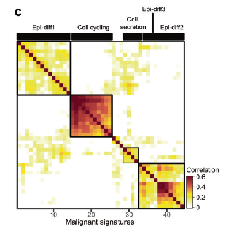
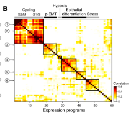

欢迎关注“小丫画图”公众号，回复“小白”，看小视频，实现点鼠标跑代码。

小丫微信: epigenomics  E-mail: figureya@126.com

作者：SRF，她的更多作品看这里<https://k.koudai.com/aEs=L6d=>。

她来自IOBR。为了帮助大家更好地解析免疫微环境，IOBR多位成员一起努力，建立了R包[IOBR](https://mp.weixin.qq.com/s/NuAuZsIRTbfeLworLwZqKw)，使用方法详见公众号[IOBR](https://mp.weixin.qq.com/s/koZDFAGbXFOnmTWxXZUBBQ)，扫码即可关注：


小丫编辑校验

```{r setup, include=FALSE}
knitr::opts_chunk$set(echo = TRUE)
```

# 需求描述

对单细胞癌上皮数据每个样品进行NMF非负矩阵分解后得到的programs后进行无监督聚类，得到主要cluster后，定义其meta-signature，复现出下图。



出自<https://www.nature.com/articles/s41422-020-0374-x>

Fig. 2 Malignant cell clusters and common malignant signatures revealed in NPC.
c A heatmap depicts the pairwise correlations of 44 metagenes derived from 11 tumors. Clustering identified **five coherent malignant gene expression signatures** across the tumors. 

提需求的小伙伴还找到2017年的这篇Cell文章里也有这图：



出自<https://linkinghub.elsevier.com/retrieve/pii/S0092867417312709>

Figure 3. Unbiased Clustering Reveals a Common Program of p-EMT in HNSCC Tumors
(B) Heatmap depicts pairwise correlations of 60 intra-tumoral programs derived from ten tumors, as in (A). Clustering identifies seven coherent expression programs across tumors. Rows in the heatmap that correspond to programs derived from MEEI25 are indicated by arrows and numbered as in (A).

# 应用场景

**提出问题：**像例文这种鼻咽癌的肿瘤样本，异质性较大。如果按照Seurat的降维聚类流程所聚集的类别，主要变异来源于样品，而不是其生物学特性，这不是我们想要的。

**怎样解决这个问题呢？**例文利用NMF找出每个样品不同的生物学功能program后，对program进行聚类，从而找到上皮样品间共有的生物学功能。具体做法：

- 例文共有11个肿瘤组织，7581个恶性上皮细胞。作者做NMF的时候对每个肿瘤都固定了k = 4，总共得到11 X 4个program。
- 然后对这些program进行聚类，找出在癌上皮中共有的生物学功能改变。
- 最后找出这些signature的metagene，对每个MalignantSig里的每个program前100个基因算其平均的gene loading，选择前30个最高loading的基因作为该signature的marker genes；
- 定义metagene这一块大家可以借助以往处理bulk数据的经验，合理即可。

原文：We then applied dimension reduction analyses, specifically non-negative matrix factorization (NMF), and identified a total of 44 **metagenes** that were preferentially co-expressed  by subpopulations of malignant cells across tumors (Supplementary information, Table S4). Then, hierarchical clustering was used to characterize these 44 metagenes into gene expression signatures, and high concordance was shown among five **signatures** (Fig. 2c; Supplementary information, Table S5). For each signature, we then combined the **top 100 genes of each metagene and calculated the average loadings** for each gene. We summarized the total loadings for repetitive genes, retained the original loadings for exclusive genes, and divided the loadings of each gene by the number of metagenes within the signature. Finally, the top 30 genes with the highest loading were defined as the **marker genes for the signature**.

仔细读全文，小丫发现例文的很多图我们都有[相应的FigureYa](https://k.koudai.com/McawGY6=)啦！例如：

- `FigureYa166scCNV`能帮你实现例文1的Figure 1c 和例文2的Figure 1B。用 单细胞RNA-seq数据计算CNV，用来separate the malignant cells from the non-malignant cells with normal karyotypes. 
- `FigureYa194pySCENIC`能帮你实现例文1的Figure 4i，用SCENIC找出potential TFs underlying the regulation across subtypes.
- `FigureYa178receptorLigand`能帮你实现例文1的Figure 6，用CellPhoneDB找出ligand–receptor pairs and molecular interactions among the major cell types.

# 环境设置

使用国内镜像安装包

```{r eval=FALSE}
options("repos"= c(CRAN="https://mirrors.tuna.tsinghua.edu.cn/CRAN/"))
options(BioC_mirror="http://mirrors.tuna.tsinghua.edu.cn/bioconductor/")
install.packages("Seurat")
BiocManager::install("AUCell")
BiocManager::install("GEOquery")
```

加载包

```{r}
library(NMF)
library(data.table)
library(ggsci)
library(pheatmap)
library(AUCell)
library(GEOquery)
library(tidyverse)
library(Seurat)
library(RColorBrewer)
library(corrplot)
Sys.setenv(LANGUAGE = "en") #显示英文报错信息
options(stringsAsFactors = FALSE) #禁止chr转成factor
```

自定义函数，用[clusterProfiler](https://yulab-smu.top/clusterProfiler-book/)做富集分析。

这里用最常用的两种注释数据库做富集分析：KEGG和GO的biological process。
[GO ORA](https://yulab-smu.top/clusterProfiler-book/chapter5.html#go-over-representation-test)
[KEGG ORA](https://yulab-smu.top/clusterProfiler-book/chapter6.html#kegg-over-representation-test)

也可以修改函数，用自己喜欢的注释数据库做富集分析。可参考FigureYa209batchEnrich，找到适合你的数据的注释数据库。

```{r}
Myenrich <- function(genes, category = c("kegg", "gobp"), 
                     geneid = c("SYMBOL", "ENTREZID", "ENSEMBL", "UNIPROT")){
  library(clusterProfiler)
  category <- match.arg(category)
  geneid <- match.arg(geneid)
  if (geneid != "ENTREZID"){
    genes <- bitr(genes, fromType = geneid,toType ="ENTREZID",OrgDb="org.Hs.eg.db") %>% .[, 2] %>% as.character()
  }else{genes <- genes}
  if (category == "kegg"){
    enrich <- enrichKEGG(genes, organism = "hsa",keyType = "kegg",
                            pAdjustMethod = "BH",pvalueCutoff  = 0.05,
                            qvalueCutoff  = 0.05, maxGSSize = 5000)
  }
  if (category == "gobp"){
    enrich <- enrichGO(genes, OrgDb="org.Hs.eg.db",ont= "BP",pAdjustMethod = "BH",
                          pvalueCutoff  = 0.05,qvalueCutoff  = 0.05, readable = TRUE)
  }
  return(enrich)
}
```

# 输入文件

文件较大，已上传至微云<https://share.weiyun.com/mpXIOggi>

数据下载：从GEO数据库下载GSE150430的GSE150430_npc_scRNA_hg19_processed_data.txt.gz文件，<https://www.ncbi.nlm.nih.gov/geo/query/acc.cgi?acc=GSE150430>，解压、预处理。

```{r eval=FALSE}
# 需要大内存，练习时可直接跳到下一步“运行NMF”
dat <- read.table("GSE150430_npc_scRNA_hg19_processed_data.txt", header = T, sep = "\t")
celldat <- dat[1, , drop = F] %>% t() %>% as.data.frame()
epicells <- celldat[celldat$Cell_type == "Malignant", , drop = F] %>% rownames() 
epidat <- dat[-1, ] %>% .[, colnames(.) %in% epicells]
write.table(epidat, file = "GSE150430Malignant.txt", sep = "\t", quote = F)
```

# 运行NMF

对P01样本1834个细胞，选择sd最高的6000个基因进行nmf分析，本FigureYa作者的运行时间约为23min。

作者在运行nmf的时候，nrun选择的是4；一般而言我们还是运行多个run，针对每个样品，选择一个最佳的nrun值。具体怎样选择最佳个数，可以参考FigureYa158MutationPattern。

```{r}
epidat <- read.table("GSE150430Malignant.txt", header = T, sep = "\t")
boxplot(epidat[, 1:6]) # 数据已经经过log转换过的
patients <- str_split(colnames(epidat), "_") %>% sapply(., "[[", 1) %>% unique()
patients

#各个样品其鉴定到的上皮细胞数
table(str_split(colnames(epidat), "_") %>% sapply(., "[[", 1))
```

```{r}
# 参数
topn <- 6000
ranks <- 4
```

耐心等待，小丫的电脑跑了一天。练习时可先跳过这步，直接进入“NMF program聚类”。

```{r eval=FALSE}
# 单细胞数据基因有很空值，为了降低噪音，我们选择sd变化前6000个基因进行NMF
for (i in patients){
  if (!dir.exists("nmfSingle")){
    dir.create("./nmfSingle")
  }
   if (!dir.exists(paste0("nmfSingle/", i))){
    dir.create(paste0("nmfSingle/", i))
  }
  nmfdat <- epidat[, str_detect(colnames(epidat), i)]
  ## Step 02: chose top 6000 genes with highest sds
  nmfdat[nmfdat < 0] <- 0 #小于零的基因值用0代替
  genesd <- apply(nmfdat, 1, sd)
  topNgene <- genesd[order(genesd, decreasing = T)][1:topn]
  nmfdat <- nmfdat[rownames(nmfdat) %in% names(topNgene), ]
  # nrun可以选择在30-50之间
  print(system.time(res_4 <- nmf(nmfdat, rank = ranks, method="brunet", nrun=30, seed=123456))) 
  signature <- NMF::basis(res_4)
  # consensusdat <- res_4@consensus #consensus matrix，可以保存出来自己画样品聚类图
  # 看聚类的轮廓值
  # si <- silhouette(res_4, what = 'consensus')
  # sicluster <- si[1:ncol(nmfdat), ]
  # 保存NMF的一些聚类图
  # tiff(paste0("./nmfSingle/", i, "/consensus_", topn, ".tiff"), 
  #      width = 6*480, height = 4*480, res = 300)
  # consensusmap(res_4)
  # dev.off()
  # tiff(paste0("./nmfSingle/", i, "/basicmap_", topn, ".tiff"), 
  #      width = 8 * 480, height = 4*480, res = 300)
  # basismap(res_4)
  # dev.off()
  # tiff(paste0("./nmfSingle/", i, "/coefmap_", topn, ".tiff"), 
  #      width = 8 * 480, height = 4*480, res = 300)
  # coefmap(res_4)
  # dev.off()
  colnames(signature) <- paste0(i, "_", 1:ranks)
  signature <- as.data.frame(signature)
  # 保存数据
  write.table(signature, paste0("./nmfSingle/", i, "/singature", topn, ".txt"),
              sep = "\t")
  # saveRDS(res_4, file = paste0("./nmfSingle/", i, "/res", ranks, "_", topn, ".rds"))
  print(paste0("NMF for the", i, "is Done!"))
}
```

# NMF program聚类，画图

```{r}
# 提取program
topRank <- 100
programG <- list()
for (i in 1:length(patients)){
  filedir <- paste0("./nmfSingle/", patients[i], "/singature", topn, ".txt")
  geneloading <- read.table(filedir, header = T, sep = "\t")
  geneloading$maxC <- apply(geneloading, 1, which.max) %>% 
    paste0(patients[i], "_", .)
  
  topgenelist <- rownames_to_column(geneloading, var = "gene") %>%
      pivot_longer(., cols = starts_with("P"), 
                  names_to = "program", values_to = "loading")
  
  topgenelist <- dplyr::filter(topgenelist, maxC == program) %>% 
      group_by(maxC) %>% top_n(n = topRank, wt = loading)
  topgenelist <- split(topgenelist$gene, topgenelist$maxC)
  programG <- c(programG, topgenelist)
}

#对上皮细胞进行打分，这里我们选择AUCell
cells_rankings <- AUCell_buildRankings(as.matrix(epidat), nCores = 5, plotStats=TRUE)
cells_AUC <- AUCell_calcAUC(geneSets = programG, cells_rankings, aucMaxRank=nrow(cells_rankings)*0.05)
programAUC <- getAUC(cells_AUC)
```

下面进行聚类

这一步需要自己看聚类结果，调整clusterK的数量。

```{r fig.width=5, fig.height=3}
clusterK = 7
M <- cor(t(programAUC), method = "pearson")

#用corrplot画图，便于标出各cluster的黑色方框
#pdf("scNMF.pdf")
corrplot(M, 
         method = "color", #用颜色展示相关系数，还可以改为"circle" (default), "square", "ellipse", "number", "pie", "shade"
         order = "hclust", 
         hclust.method = "ward.D2", 
         addrect = clusterK, #画黑色方框
         tl.pos = "n", #"n" means don't add textlabel
         col = rev(brewer.pal(n = 8, name = "RdBu"))) # 运行?brewer.pal查看更多配色方案
#dev.off()
```

输出的pdf文件是矢量图，可以用Illustrator等软件打开，根据下面的富集分析结果总结归纳各Signature的功能，添加到图中。

# 提取program

```{r fig.width=16, fig.height=10}
cororder <- corrMatOrder(M, order = "hclust", hclust.method = "ward.D2")
M.hc <- M[cororder, cororder]
tree <- hclust(as.dist(1 - M.hc), method = "ward.D2")
clus <- cutree(tree, clusterK)
table(clus)
head(clus)

# 提取signature
ProSig <- split(names(clus), clus) 
names(ProSig) <- paste0("MalignantSig", names(ProSig))
ProSig <- lapply(ProSig, function(z){
  programG[which(names(programG) %in% z)] %>% unlist() %>% as.character() %>% 
    unique()
})
sapply(ProSig, length)
```

7个program的基因存储在ProSig里面，下面批量做富集分析[Over Representation Analysis(ORA)](https://yulab-smu.top/clusterProfiler-book/chapter2.html#over-representation-analysis)

# 功能注释

原文没有说具体用了哪个数据库，我们用最常用的GO BP和KEGG做富集分析，具体到自己的数据，可以参考FigureYa209batchEnrich，找到最适合自己的注释数据库。

## 用GO的biological process做功能注释

```{r fig.width=16, fig.height=10}
Sigbp <- lapply(ProSig, Myenrich, category = "gobp", geneid = "SYMBOL")

Sigbpplot <- lapply(names(Sigbp), function(z)barplot(Sigbp[[z]], showCategory = 10) +
                   ggtitle(z) + scale_x_discrete(labels=function(x) str_wrap(x, width=40)))
keppcol <- which(sapply(Sigbpplot, function(z)nrow(z$data)) != 0)
if (length(keppcol) != 0){
  Sigbpplot <- Sigbpplot[keppcol]
  cowplot::plot_grid(plotlist = Sigbpplot, ncol = 3) 
}
ggsave(paste0("MalignantSiggobp", "_", topn, ".pdf"), width = 16, height = 10)
```

## 用KEGG做功能注释

```{r fig.width=14, fig.height=10}
Sigkegg <- lapply(ProSig, Myenrich, category = "kegg", geneid = "SYMBOL")

Sigkeggplot <- lapply(names(Sigkegg), function(z)barplot(Sigkegg[[z]], showCategory = 10) +
                   ggtitle(z) + scale_x_discrete(labels=function(x) str_wrap(x, width=30)))
keppcol <- which(sapply(Sigkeggplot, function(z)nrow(z$data)) != 0)
if (length(keppcol) != 0){
  Sigkeggplot <- Sigkeggplot[keppcol]
  cowplot::plot_grid(plotlist = Sigkeggplot, ncol = 3) 
}
ggsave(paste0("MalignantSiggkegg", "_", topn, ".pdf"), width = 16, height = 10)
```

## 归纳总结功能注释：

根据以上富集结果，我们可以定义：

- Sig1：是跟EBV病毒感染有关的免疫反应；
- Sig2-3：都可以定义为Epidif；
- Sig4/7：主要是蛋白质定位合成相关；
- Sig5：Cell cycling；
- Sig6: 细胞呼吸，氧化磷酸化等功能。

具体归纳Signature的功能需要根据癌种以及相关的背景知识加以定义。

输出的pdf文件是矢量图，可以用Illustrator等软件打开`scNMF.pdf`文件，把以上定义添加到图中，为每类进行功能注释。

EBV病毒感染有关的免疫反应在另一篇鼻咽癌单细胞文章中有重点说明；
[Single-cell transcriptomic analysis defines the interplay between tumor cells, viral infection, and the microenvironment in nasopharyngeal carcinoma.](https://pubmed.ncbi.nlm.nih.gov/32901110/)

# 定义metagene

按照原文方法对每个MalignantSig里的每个program前100个基因算其平均的gene loading。
the top 30 genes with the highest loading were defined as the **marker genes for the signature**.

```{r}
metalist <- split(names(clus), clus) 
patientLoading <- lapply(patients, function(z){
  filedir <- paste0("./nmfSingle/", z, "/singature", topn, ".txt")
  geneloading <- read.table(filedir, header = T, sep = "\t")
  data.frame(Gene = rownames(geneloading), geneloading)
})
AllLoading <- Reduce(function(x, y)merge(x = x, y = y, by = "Gene", all = T), patientLoading)
head(AllLoading)
metaGene <- list()
for (i in 1:length(metalist)){
  programs <- metalist[[i]]
  Selgene <- ProSig[[i]]
  metaGene[[i]] <- AllLoading[AllLoading$Gene %in% Selgene, 
                              colnames(AllLoading) %in% c("Gene",  programs)] %>%
    pivot_longer(cols = starts_with("P"), 
                 names_to = "program", values_to = "loading")  %>% na.omit() %>%
    dplyr::group_by(Gene) %>% summarise(Avgloading = mean(loading)) %>% 
    top_n(n = 30, wt = Avgloading) %>% pull(Gene)
}
sapply(metaGene, length)
metaGene
```

# Session Info

```{r}
sessionInfo()
```