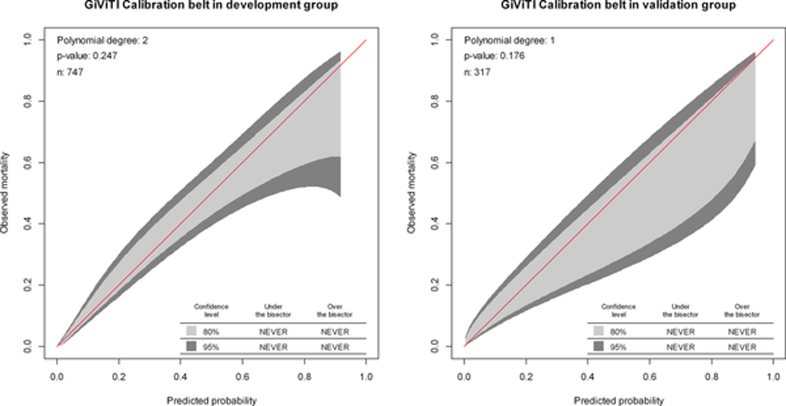
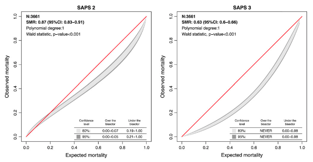
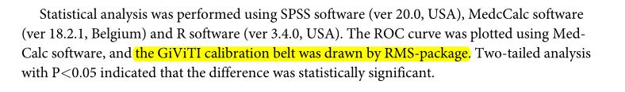
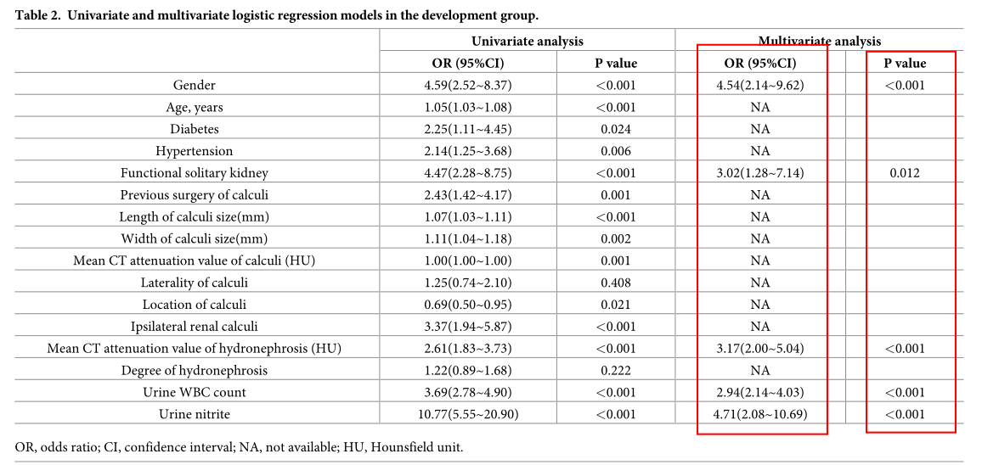
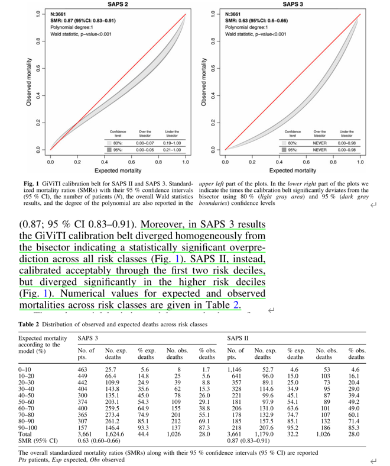
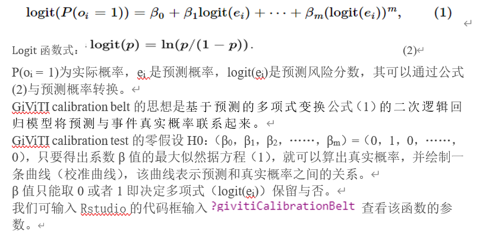
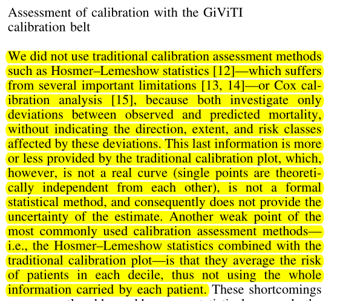
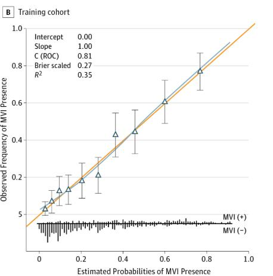
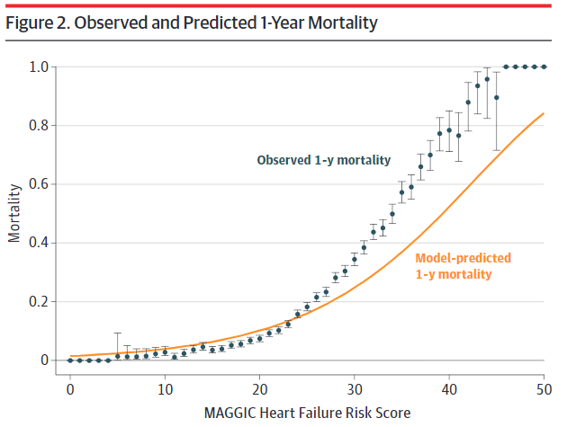

欢迎关注“小丫画图”公众号，回复“小白”，看小视频，实现点鼠标跑代码。

小丫微信: epigenomics  E-mail: figureya@126.com

作者：触手可及，他的更多作品看这里<https://k.koudai.com/16AY=fM6>

小丫编辑校验

```{r setup, include=FALSE}
knitr::opts_chunk$set(echo = TRUE)
```

# 需求描述

用givitiR包复现文章里的图



出自<https://journals.plos.org/plosone/article?id=10.1371/journal.pone.0201515>

Fig 4. Calibration plots of the nomogram for the probability of urosepsis patients with ureteral calculi in the development group and validation group. 

相似的图：



出自<https://link.springer.com/article/10.1007/s00134-012-2578-0>

# 应用场景

**Functions to assess the calibration of logistic regression models** with the GiViTI (Gruppo Italiano per la Valutazione degli interventi in Terapia Intensiva, Italian Group for the Evaluation of the Interventions in Intensive Care Units - see <http://www.giviti.marionegri.it/>) approach. The approach consists in a graphical tool, namely the GiViTI calibration belt, and in the associated statistical test. These tools can be used both to evaluate the internal calibration (i.e. the goodness of fit) and to assess the validity of an externally developed model.

引自givitiR包的[首页简介](https://cran.r-project.org/web/packages/givitiR/index.html)

原文method说是用rms包实现的，rms包功能确实强大，我初步查阅了[rms包的Reference manual](https://cran.r-project.org/web/packages/rms/rms.pdf)并没有发现绘制GiViTI calibration belt的函数，我推测作者应该是写错了，查阅文献后，发现应该是通过givitiR包绘制的。



# 环境设置

使用国内镜像安装包

```{r}
options("repos"= c(CRAN="https://mirrors.tuna.tsinghua.edu.cn/CRAN/"))
options(BioC_mirror="http://mirrors.tuna.tsinghua.edu.cn/bioconductor/")

```

加载包

```{r}
library(givitiR)  # 绘制GiViTI calibration belt
library(foreign)  # 读入sav格式文件
library(rms)      # 拟合模型
library(ResourceSelection) # Hosmer-Lemeshow拟合优度检验

Sys.setenv(LANGUAGE = "en") #显示英文报错信息
options(stringsAsFactors = FALSE) #禁止chr转成factor
```

# 输入文件

例文旨在开发一个预测尿脓毒症的个性化模型，结局事件是尿脓毒症，并且纳入了性别、肾积水平均CT值、功能性孤立肾、尿WBC数、尿亚硝酸盐等五个因素

easyinput_train.csv和easyinput_test.csv，分别为训练集和验证集临床信息。构建模型需要这几列：

- 结局事件：Urosepsis
- 因素：这里有五个Gender、Functional_solitary_kidney、Mean_CT_value_of_hedronephrosis、Urine_WBC_count、Urine_nitrite

另外，PRE_1列是例文模型的预测概率，用我们复现的预测概率值跟它做比较，即可看出我们复现的效果。我们最后也像这样输出预测概率，放到最后一列（见output_*.csv），可作为文章的补充材料。

下载自[训练集](https://ndownloader.figstatic.com/files/12624572)和[验证集](https://ndownloader.figstatic.com/files/12624578)，下载后重命名为train set 和test set，为sav格式（SPSS）。为方便小伙伴套用到自己到数据上，把它们转成csv格式。

```{r eval=FALSE}
# 读入sav格式文件
devedf <- read.spss(file = "development set.sav",
                  use.value.labels = F,    # 如果想显示标签信息可以设置为T
                  to.data.frame = T)
validf <- read.spss(file = "validation set.sav",use.value.labels = F,to.data.frame = T)
# 保存为csv格式，便于套用在自己的数据上
write.csv(devedf, "easyinput_train.csv", quote = F, row.names = F)
write.csv(validf, "easyinput_test.csv", quote = F, row.names = F)
```

```{r}
# 读取输入文件
devedf <- read.csv("easyinput_train.csv")
dim(devedf)
validf <- read.csv("easyinput_test.csv")
dim(validf)
```

# 第一步：拟合模型并验证复现效果

```{r}
# 拟合逻辑回归模型
model <- glm(formula = Urosepsis ~ #结局事件
               # 下面是因素
               Gender +
               Functional_solitary_kidney +
               Mean_CT_value_of_hedronephrosis +
               Urine_WBC_count +
               Urine_nitrite,
             na.action = na.exclude,
             family = binomial(link='logit'),
             data = devedf)

# 获得预测概率值
PpreD <- predict(model,
                 type = 'response') # response gives you the numerical result
# 计算验证集的预测概率
PpreV <- predict(model,
                 validf, #a data frame in which to look for variables with which to predict. If omitted, the fitted linear predictors are used.
                 type = c("response"))
# ?predict.glm # 查看predict函数的用法

# 保存到文件
# 前面是输入文件的内容，最后一列就是我们算出来的预测概率
devedf$PpreD <- PpreD
validf$PpreV <- PpreV
write.csv(devedf, "output_train.csv", quote = F, row.names = F)
write.csv(validf, "output_test.csv", quote = F, row.names = F)
```

跟原文对比，验证我们复现的建模结果

原文Table 2：


```{r}
# 查看模型详情和P-value
summary(model)
# 查看OR值
round(exp(model$coefficients[-1]),digits = 2)
```

OR、P value与原文的Table 2基本一致

```{r}
# 比较复现的预测概率与原文的预测概率
identical(round(as.numeric(PpreD),digits = 6), #我们复现的预测概率
          round(devedf$PRE_1,digits = 6)) #原文的预测概率

# 比较验证集的预测概率与原文的预测概率
cor(round(as.numeric(PpreV),digits = 6), #我们复现的验证集的预测概率
          round(validf$PRE_1,digits = 6)) #原文的预测概率
```

相关性达到0.999999，基本一致

# 第二步：GiViTI calibration belt

givitiCalibrationBelt函数说明，可参考文末所附“GiViTI calibration belt and test原理”。

```{r}
# 训练集
cb <- givitiCalibrationBelt(o = devedf$Urosepsis,      # 表示二分类变量的数值向量（0，1表示，1为结局事件）
                            e = PpreD,                 # 预测概率
                            devel = "internal",        # 指定模型校准的数据集（internal开发集/external验证集）
                            subset = 1:nrow(devedf),   # 取子集
                            confLevels = c(0.8,0.95),  # 指定校准带的置信区间
                            thres = 0.95,              # 前向选择中采用的显著性级别
                            maxDeg = 4,                # 前向选择中考虑的最大自由度
                            nPoints = 200)             # 指定绘制校准带时的点数

#pdf("GiViTI calibration belt in development groups.pdf")
plot.givitiCalibrationBelt(cb, 
                           xlim = c(0,1),ylim = c(0,1),
                           colBis = "red",        # 设置对角线颜色
                           xlab = "Predicted probability",ylab = "Observed mortality",
                           main = "GiViTI calibration belt in development groups",
                           pvalueString = T, nString = T,  # 显示右上方的P值和样本量
                           table = T,                      # 显示图像右下方的置信区间表格
                           tableStrings = NULL,            # 设置打印在右下角列表的四个字符串
                           unableToFitString = "Unable to Fit") # 设置当数据集与校准带不能拟合时的报错信息
#dev.off()
```

**结果解读：**p-value=0.247表明尚不能认为该模型拟合不良。

```{r}
# 验证集
cb2 <- givitiCalibrationBelt(o = validf$Urosepsis, e = PpreV,
                            devel = "external")

#pdf("GiViTI calibration belt in validation groups.pdf")
plot(cb2, main = "GiViTI calibration belt in validation groups",
     xlab = "Predicted probability",
     ylab = "Observed mortality")
#dev.off()
```

提需求的小伙伴提供的例文2[Intensive Care Med. 2012 Aug;38(8):1280-8.](https://pubmed.ncbi.nlm.nih.gov/22584793/) 的结果描述部分，对GiViTI calibration belt的解释值得一看：



# 附：

## GiViTI calibration belt and test原理



想要了解详细的原理可以参考[givitiR package: assessing the calibration of binary outcome models with the GiViTI calibration belt](https://cran.r-project.org/web/packages/givitiR/vignettes/givitiR.html)

- Thres就是在多项式选择（前向选择）时保留的阈值，即当β>Thre时，β取1，保留该多项式

- maxDeg表示方程式1中保留的多项式的最大自由度

## 传统的校准曲线与GiViTI校准曲线的比较

总的来说：与GiViTI校准曲线相比，传统校准曲线（是通过loess拟合的曲线，并不是真实的预测概率分布）只考虑实际死亡率和预测死亡率之间的偏差，而没有指出受这些偏差影响的方向、程度和风险类别，也没有考虑每个个体的偏差。



出自[Intensive Care Med. 2012 Aug;38(8):1280-8.](https://pubmed.ncbi.nlm.nih.gov/22584793/)

传统的校准曲线，画法可参考FigureYa138NiceCalibration



引自 [JAMA Surg. 2016 Apr;151(4):356-63. Fig B](https://jamanetwork.com/journals/jamasurgery/fullarticle/2469647)



强烈推荐此文，出自 [JAMA. 2017 Oct 10;318(14):1377-1384. Fig 2](https://pubmed.ncbi.nlm.nih.gov/29049590/)

# Session Info

```{r}
sessionInfo()
```