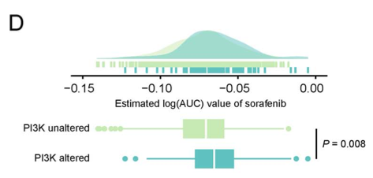

欢迎关注“小丫画图”公众号，回复“小白”，看小视频，实现点鼠标跑代码。

小丫微信: epigenomics  E-mail: figureya@126.com

作者：大鱼海棠

单位：中国药科大学国家天然药物重点实验室，生物统计与计算药学研究中心

小丫编辑校验

```{r setup, include=FALSE}
knitr::opts_chunk$set(echo = TRUE)
```

# 需求描述

用高逼格的方式展示两组之间对于索拉菲尼药物治疗敏感性的差异。。也是出自上次那个药物敏感的文章。。



出自<https://academic.oup.com/bib/advance-article/doi/10.1093/bib/bbaa164/5891146>

Figure 5. Identification of candidate agents with higher drug sensitivity in high-PPS score patients. (D) Comparison of estimated sorafenib’s sensitivity (logAUC) between PI3K-MTOR altered and unaltered groups.

另外，FigureYa212drugTargetV2复现了例文的Figure 5FG，利用细胞系表达谱（CCLE）及药敏结果（PRISM和CTRP），预测癌症样本的药敏结果。

FigureYa213customizeHeatmap复现了Figure 6，实现CMap analysis及画图。

# 应用场景

绘制箱线图时同时给出数据的密度分布图，叠加展示美美哒～

类似的，FigureYa68friends曾画过一半小提琴、一半box plot和散点图。

# 环境设置

使用国内镜像安装包

```{r}
options("repos"= c(CRAN="https://mirrors.tuna.tsinghua.edu.cn/CRAN/"))
options(BioC_mirror="http://mirrors.tuna.tsinghua.edu.cn/bioconductor/")

```

加载包

```{r}
library(ggplot2)
library(data.table)
library(aplot)
library(ggpubr)
library(dplyr)
Sys.setenv(LANGUAGE = "en") #显示英文报错信息
options(stringsAsFactors = FALSE) #禁止chr转成factor
```

# 输入文件

easy_input.csv，包含三列，后两列必需：分组信息Subtype和每个sample对应的AUC。

```{r}
# 加载模拟数据(因为是用ggplot做，所以多个组都可以)
df <- read.table("easy_input.txt",sep = "\t",row.names = NULL,check.names = F,stringsAsFactors = F,header = T)
head(df)

# 计算p值
# 这里是多组，用kruskal.test函数，还可以改为aov
# 如果是两组，可以改为t.test，或wilcox.test
p.val <- kruskal.test(AUC ~ Subtype,
                      data = df)
p.lab <- paste0("P",
                ifelse(p.val$p.value < 0.001, " < 0.001",
                       paste0(" = ",round(p.val$p.value, 3)))) 
p.lab
```

# 开始画图

```{r}
# 设置颜色
green <- "#C7EAB2"
cyan <- "#5FC1C2"
blue <- "#1B90BE"

# 绘制上半部分密度图
p_top <- ggplot(df, aes(x = AUC, color = Subtype, fill = Subtype)) +
  geom_density() +
  # 让箱子的所有位置都颜色统一，如例文所示
  scale_color_manual(values = c(alpha(green,0.7),alpha(cyan,0.7),alpha(blue,0.7))) + # 设置透明色
  scale_fill_manual(values = c(alpha(green,0.7),alpha(cyan,0.7),alpha(blue,0.7))) +
  theme_classic() + # 如果显示采用这一行
  
  # 这里提取输入文件的第一列药物名称，写入x轴标签
  xlab(paste0("Estimated AUC of ", unique(df$Drug))) + 
  # 第一列非必需，可以像下面这样直接写xlab
  #xlab("Estimated AUC of Cisplatin") +
  
  ylab(NULL) + 
  theme(legend.position = "none", 
        legend.title = element_blank(),
        axis.text.x = element_text(size = 12,color = "black"),
        axis.text.y = element_blank(), # 原文不显示纵轴的密度
        #axis.text.y = element_text(size = 12,color = "black"), # 如果要显示采用这一行
        axis.ticks.y = element_blank(),
        axis.line.y = element_blank(),
        panel.background = element_blank(),
        panel.grid.major = element_blank(),
        panel.grid.minor = element_blank()) +
  geom_rug()
p_top

# 画box plot
p_bot <- ggplot(df, aes(Subtype, AUC, fill = Subtype)) + 
  geom_boxplot(aes(col = Subtype)) + 
  scale_fill_manual(values = c(green, cyan, blue)) + 
  scale_color_manual(values = c(green, cyan, blue)) + 
  xlab(NULL) + ylab("Estimated AUC") + 
  theme_void() +
  theme(legend.position = "right",
        legend.title = element_blank(),
        axis.text.x = element_blank(), # 原文不显示箱线图的x轴
        #axis.text.x = element_text(size = 12,color = "black"), # 如要显示箱线图x轴采用这一行
        axis.text.y = element_text(size = 11,color = "black"),
        panel.background = element_blank(),
        panel.grid.major = element_blank(),
        panel.grid.minor = element_blank()) + 
  annotate(geom="text",
           x = 1.5,
           hjust = 1,
           y = max(df$AUC),
           size = 4, angle = 270, fontface = "bold",
           label = p.lab) +
  coord_flip() # 翻转图像

# 用白色标记箱子的基本统计量
dat <- ggplot_build(p_bot)$data[[1]]
p_bot <- p_bot + geom_segment(data=dat, aes(x=xmin, xend=xmax, y=middle, yend=middle), color="white", inherit.aes = F)
p_bot

# 使用aplot拼图，底部箱型图稍微小一些
p <- p_top %>% insert_bottom(p_bot, height = 0.4)
pdf(file = "boxdensity.pdf", width = 6,height = 3)
p
invisible(dev.off())
```

# Session Info

```{r}
sessionInfo()
```