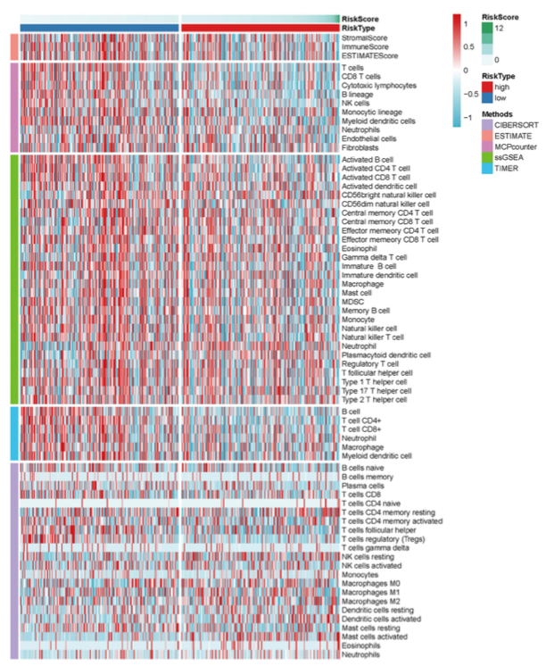

欢迎关注“小丫画图”公众号，回复“小白”，看小视频，实现点鼠标跑代码。

小丫微信: epigenomics  E-mail: figureya@126.com

作者：大鱼海棠，他的更多作品看这里<https://k.koudai.com/OFad8N0w>

单位：中国药科大学国家天然药物重点实验室，生物统计与计算药学研究中心

小丫编辑校验

```{r setup, include=FALSE}
knitr::opts_chunk$set(echo = TRUE)
```

# 需求描述

Ya姐，我能众筹一个多种算法的风险值和免疫细胞相关性热图（文中Figure 7）吗，输入数据都准备好了，直接画图就可以了，谢谢。



出自<https://www.ijbs.com/v17p0702.htm>

Figure 7. Heatmap for immune responses based on CIBERSORT, ESTIMATE, MCPcounter, ssGSEA, and TIMER algorithms among high and low risk group.

# 应用场景

多个热图画在一起。

例文绘制不同免疫富集分析得到结果的综合热图。

不仅限于免疫富集分析结果，还可以用于WGCNA、多组学分析结果的展示。

原文使用了pheatmap的方式对不同的算法做了行注释，我这里提供两种方法；

①原文的pheatmap::pheatmap展示
②采用ComplexHeatmap::pheatmap对不同算法采用不同颜色的热图，后垂直衔接热图展示

图中各种打分的计算方法可参考我们众筹过的FigureYa：

- 计算CIBERSORT得分、ESTIMATE得分，可参考FigureYa211multiCohortImmSubtype<https://k.youshop10.com/VwpAWxx0>
- ssGSEA，可参考FigureYa71ssGSEA<https://k.youshop10.com/hhH631te>
- TIMER，从网站下载TIMER数据可参考FigureYa234panImmune<https://k.youshop10.com/Qis-lxH=>，用immunedeconv包进行TIMER打分可参考FigureYa264epiImmune<https://k.youshop10.com/3FtJ=KyB>

# 环境设置

使用国内镜像安装包

```{r eval=FALSE}
options("repos"= c(CRAN="https://mirrors.tuna.tsinghua.edu.cn/CRAN/"))
options(BioC_mirror="http://mirrors.tuna.tsinghua.edu.cn/bioconductor/")
BiocManager::install("ComplexHeatmap")
BiocManager::install("pheatmap")
```

加载包

```{r}
library(RColorBrewer)
library(circlize)
library(gplots)
library(viridis)
library(oompaBase)

Sys.setenv(LANGUAGE = "en") #显示英文报错信息
options(stringsAsFactors = FALSE) #禁止chr转成factor
```

自定义函数

```{r}
standarize.fun <- function(indata=NULL, halfwidth=NULL, centerFlag=T, scaleFlag=T) {  
  outdata=t(scale(t(indata), center=centerFlag, scale=scaleFlag))
  if (!is.null(halfwidth)) {
    outdata[outdata>halfwidth]=halfwidth
    outdata[outdata<(-halfwidth)]= -halfwidth
  }
  return(outdata)
}
```

# 输入文件

easy_input.csv，画热图所需的数据。这里是多种算法获得的免疫浸润数据，每行一个sample，每列一种免疫细胞。可以灵活替换为其他需要画热图的数据，例如基因表达矩阵，那么这里的免疫细胞就替换为基因/蛋白质/通路等等。

热图自上而下分成一块一块的多个类，两种方式提供分类信息：

- 第一种方式是像`easy_input.csv`这样，分类跟细胞名之间用下划线`_`分隔
- 第二种方式是提供一个文件`easy_input_type.csv`，把细胞和分类（这里指不同算法）作为两列放进去，细胞名的顺序跟easy_input.csv里的细胞顺序一致。

easy_input_group.csv，分组信息和连续变量，用于画热图上方的注释。这里的连续变量是risk score（根据它的大小为sample排序），分组信息是risk type。读懂之后可以按照现有的格式添加更多行注释。

```{r}
# 加载热图数据
hmdat <- read.csv("easy_input.csv",row.names = 1,check.names = F,stringsAsFactors = F,header = T)
# 或许你的数据行列与此相反，就这样转置一下
#hmdat <- t(hmdat)

# 加载分组
risk <- read.csv("easy_input_group.csv",row.names = 1,check.names = F,stringsAsFactors = F,header = T)
rownames(risk) <- paste0(rownames(risk),"-01")
dim(hmdat)
hmdat[1:3,1:3]
dim(risk)
head(risk)

# 从easy_input_type.csv读取分类信息
type <- read.csv("easy_input_type.csv", row.names = 1)
head(type)

# 取出共有样本更新数据
comsam <- intersect(rownames(risk),rownames(hmdat))
hmdat <- hmdat[comsam,]
risk <- risk[comsam,,drop = F]
dim(hmdat)

# 拆分不同算法结果，获得类的名字
#immMethod <- sapply(strsplit(colnames(hmdat),"_",fixed = T),"[",2) #用easy_input.csv列名里的算法信息
immMethod <- type$Methods # 用easy_input_type.csv的算法那一列
```

# 开始画图

## 1. 原文pheatmap版

```{r}
# 用pheatmap画图
library(pheatmap)

# 定义颜色
methods.col <- brewer.pal(n = length(unique(immMethod)),name = "Paired")

# 创建注释
# 列注释，位于热图顶端
annCol <- data.frame(RiskScore = scale(risk$riskScore),
                     RiskType = risk$risk,
                     # 以上是risk score和risk type两种注释，可以按照这样的格式继续添加更多种类的注释信息，记得在下面的annColors里设置颜色
                     row.names = rownames(risk),
                     stringsAsFactors = F)

# 行注释，位于热图左侧
annRow <- data.frame(Methods = factor(immMethod,levels = unique(immMethod)),
                     row.names = colnames(hmdat),
                     stringsAsFactors = F)

# 为各注释信息设置颜色
annColors <- list(Methods = c("TIMER" = methods.col[1], #行注释的颜色
                              "CIBERSORT" = methods.col[2],
                              "CIBERSORT-ABS" = methods.col[3],
                              "QUANTISEQ" = methods.col[4],
                              "MCPCOUNTER" = methods.col[5],
                              "XCELL" = methods.col[6],
                              "EPIC" = methods.col[7]),
                  # 下面是列注释的颜色，可依此设置更多注释的颜色
                  "RiskScore" = greenred(64), 
                  "RiskType" = c("high" = "red","low" = "blue"))

# 数据标准化
indata <- t(hmdat)
indata <- indata[,colSums(indata) > 0] # 确保没有富集全为0的细胞
plotdata <- standarize.fun(indata,halfwidth = 2)

# 样本按risk score排序
samorder <- rownames(risk[order(risk$riskScore),])

# pheatmap绘图
pheatmap::pheatmap(mat = as.matrix(plotdata[,samorder]), # 标准化后的数值矩阵
                   border_color = NA, # 无边框色
                   color = bluered(64), # 热图颜色为红蓝
                   cluster_rows = F, # 行不聚类
                   cluster_cols = F, # 列不聚类
                   show_rownames = T, # 显示行名
                   show_colnames = F, # 不显示列名
                   annotation_col = annCol[samorder,,drop = F], # 列注释
                   annotation_row = annRow, # 行注释
                   annotation_colors = annColors, # 注释颜色
                   gaps_col = table(annCol$RiskType)[2], # 列分割
                   gaps_row = cumsum(table(annRow$Methods)), # 行分割
                   cellwidth = 0.8, # 元素宽度
                   cellheight = 10, # 元素高度
                   filename = "immune heatmap by pheatmap.pdf")
```


## 2. ComplexHeatmap衔接版

ComplexHeatmap里的pheatmap跟pheatmap里的pheatmap用法相同。

本质上还是用pheatmap画图，画颜色不同的多个热图，这样从颜色上就能一目了然地看出热图里的信息多了一层（分类信息，这里是不同算法），然后用ComplexHeatmap把多个热图拼在一起。

```{r}
library(ComplexHeatmap) 
# 最新版ComplexHeatmap好像有一些bug，使用里面的pheatmap函数会报错
# 因此我们从脚本直接加载pheatmap函数
source("pheatmap_translate.R") # 位于当前文件夹，出自ComplexHeatmap_2.7.9.tar.gz

ht_opt$message = FALSE

# 创建注释
annCol <- data.frame(RiskScore = scale(risk$riskScore),
                     RiskType = risk$risk,
                     row.names = rownames(risk),
                     stringsAsFactors = F)
annRow <- data.frame(row.names = colnames(hmdat),
                     Methods = factor(immMethod,levels = unique(immMethod)),
                     stringsAsFactors = F)

annColors <- list("RiskScore" = greenred(64),
                  "RiskType" = c("high" = "red","low" = "blue"))

# 数据标准化
indata <- t(hmdat)
indata <- indata[,colSums(indata) > 0] # 确保没有富集全为0的细胞
plotdata <- standarize.fun(indata,halfwidth = 2)

# 样本按risk score排序
samorder <- rownames(risk[order(risk$riskScore),])

# 拆分各算法的结果
plotdata1 <- plotdata[rownames(annRow[which(annRow$Methods == "TIMER"),,drop = F]),]
plotdata2 <- plotdata[rownames(annRow[which(annRow$Methods == "CIBERSORT"),,drop = F]),]
plotdata3 <- plotdata[rownames(annRow[which(annRow$Methods == "CIBERSORT-ABS"),,drop = F]),]
plotdata4 <- plotdata[rownames(annRow[which(annRow$Methods == "QUANTISEQ"),,drop = F]),]
plotdata5 <- plotdata[rownames(annRow[which(annRow$Methods == "MCPCOUNTER"),,drop = F]),]
plotdata6 <- plotdata[rownames(annRow[which(annRow$Methods == "XCELL"),,drop = F]),]
plotdata7 <- plotdata[rownames(annRow[which(annRow$Methods == "EPIC"),,drop = F]),]

# 分别画7次热图（参数基本同pheatmap里的pheatmap）
hm1 <- pheatmap(mat = as.matrix(plotdata1[,samorder]),
                                border_color = NA,
                                #color = bluered(64), 
                                cluster_rows = F,
                                cluster_cols = F,
                                show_rownames = T,
                                show_colnames = F,
                                annotation_col = annCol[samorder,,drop = F],
                                annotation_colors = annColors,
                                cellwidth = 0.8,
                                cellheight = 10,
                                gaps_col = table(annCol$RiskType)[2],
                                name = "TIMER") # 为子热图的图例命名

hm2 <- pheatmap(mat = as.matrix(plotdata2[,samorder]),
                                border_color = NA,
                                color = greenred(64), 
                                cluster_rows = F,
                                cluster_cols = F,
                                show_rownames = T,
                                show_colnames = F,
                                cellwidth = 0.8,
                                cellheight = 10,
                                gaps_col = table(annCol$RiskType)[2],
                                name = "CIBERSORT")

hm3 <- pheatmap(mat = as.matrix(plotdata3[,samorder]),
                                border_color = NA,
                                color = blueyellow(64), 
                                cluster_rows = F,
                                cluster_cols = F,
                                show_rownames = T,
                                show_colnames = F,
                                cellwidth = 0.8,
                                cellheight = 10,
                                gaps_col = table(annCol$RiskType)[2],
                                name = "CIBERSORT-ABS")

hm4 <- pheatmap(mat = as.matrix(plotdata4[,samorder]),
                                border_color = NA,
                                color = bluered(64), 
                                cluster_rows = F,
                                cluster_cols = F,
                                show_rownames = T,
                                show_colnames = F,
                                cellwidth = 0.8,
                                cellheight = 10,
                                gaps_col = table(annCol$RiskType)[2],
                                name = "QUANTISEQ")

hm5 <- pheatmap(mat = as.matrix(plotdata5[,samorder]),
                                border_color = NA,
                                color = inferno(64), 
                                cluster_rows = F,
                                cluster_cols = F,
                                show_rownames = T,
                                show_colnames = F,
                                cellwidth = 0.8,
                                cellheight = 10,
                                gaps_col = table(annCol$RiskType)[2],
                                name = "MCPCOUNTER")

hm6 <- pheatmap(mat = as.matrix(plotdata6[,samorder]),
                                border_color = NA,
                                color = viridis(64), 
                                cluster_rows = F,
                                cluster_cols = F,
                                show_rownames = T,
                                show_colnames = F,
                                cellwidth = 0.8,
                                cellheight = 10,
                                gaps_col = table(annCol$RiskType)[2],
                                name = "XCELL")

hm7 <- pheatmap(mat = as.matrix(plotdata7[,samorder]),
                                border_color = NA,
                                color = magma(64), 
                                cluster_rows = F,
                                cluster_cols = F,
                                show_rownames = T,
                                show_colnames = F,
                                cellwidth = 0.8,
                                cellheight = 10,
                                gaps_col = table(annCol$RiskType)[2],
                                name = "EPIC")

pdf("immune heatmap by ComplexHeatmap.pdf", width = 10,height = 20) # 保存前请注意RGUI里不能有任何显示的图像，否则不会pdf打不开
draw(hm1 %v% hm2 %v% hm3 %v% hm4 %v% hm5 %v% hm6 %v% hm7, # 垂直连接子热图
     heatmap_legend_side = "bottom", # 热图注释放底部
     annotation_legend_side = "bottom") # 顶部注释放底部
invisible(dev.off())
```


# Session Info

```{r}
sessionInfo()
```