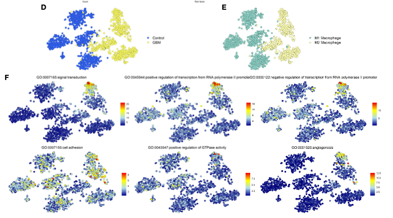
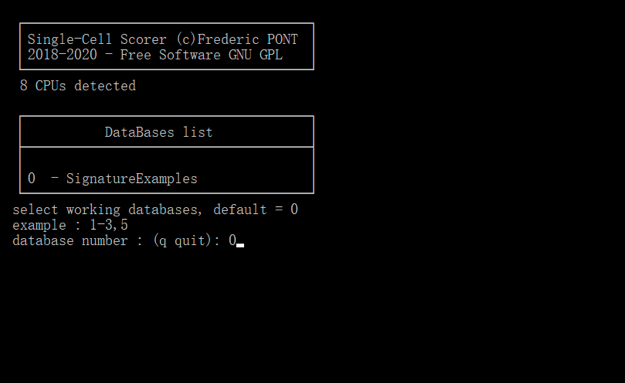

欢迎关注“小丫画图”公众号，回复“小白”，看小视频，实现点鼠标跑代码。

小丫微信: epigenomics  E-mail: figureya@126.com

作者：Byron

小丫编辑校验

```{r setup, include=FALSE}
knitr::opts_chunk$set(echo = TRUE)
```

# 需求描述

tsne降维，标记GO功能



出自<https://www.frontiersin.org/articles/10.3389/fimmu.2020.606164/full>

FIGURE 2 | Functional enrichment analysis. 
(D) The distribution of GBM and Control cells in GSE135437. 
(E) The distribution of status of macrophages in GSE135437. 
(F) The distribution of top-six biological processes in GSE135437.

Almost all **M2 macrophages were in the GBM cells**, 
while **M1 macrophages were in the control cells** (Figures 2D, E). 
Furthermore we explored the **relationship between the biological process and cell types** and found that the signal transduction and angiogenesis enriched in a subgroup of M2 macrophages, however the cell adhesion widely distributed in both control and GBM cells (Figure 2F). 

# 应用场景

单细胞数据，从matrix到分组，用Single-Cell Signature Explorer 软件计算pathway的表达量，相比于FigureYa160scGSVA所用的GSVA运行速度更快。

> 怎样从t-SNE图中解读出有意义的信息？

需要从各个角度对比展示，从而找到能讲故事的角度：

- 用颜色标注各种细胞类群、突出显示其中某一/几种细胞类型、显示分组/分类信息等等。总之把你想要展示的细胞信息放在metadata里，就可以了。方法见下文“ 根据metadata里的信息分组”。
- 展示某一/几个基因（例如marker基因）的表达量跟细胞类型之间的关系，可参考FigureYa27t-SNE。
- 展示pathway的表达量跟细胞类型直接的关系。本文档“用渐变色展示pathway的表达量”部分将用Single-Cell Signature Explorer计算 score。另外，pathway的表达量还可以并用小提琴图的方式展示，并计算pathway在组间的差异显著性，可参考FigureYa160scGSVA。

# 环境设置

使用国内镜像安装包

```{r}
options("repos"= c(CRAN="https://mirrors.tuna.tsinghua.edu.cn/CRAN/"))
options(BioC_mirror="http://mirrors.tuna.tsinghua.edu.cn/bioconductor/")
```

加载包

```{r}
library(tidyverse)
library(Seurat)
library(GO.db)
library(biomaRt)
library(RColorBrewer)

Sys.setenv(LANGUAGE = "en") #显示英文报错信息
options(stringsAsFactors = FALSE) #禁止chr转成factor
```

# 标准的seurat流程

GSE135437，从<https://github.com/rsankowski/sankowski-et-al-microglia>下载数据并解压到当前文件夹

```{r}
#读取作者处理好的数据
(load("data/unnormalized_counts_ctrl_gbm.RData")) # 表达矩阵
(load("data/metadata-ctrl-gbm.RData")) # metadata
```

运行标准的seurat流程

```{r}
metadata = df; rownames(metadata) = df$cell_ID

# 创建Seurat对象
SeuratObj <- CreateSeuratObject(counts = counts_unnorm, 
                                project = "ctrl-gbm", 
                                min.cells = 3, 
                                min.features = 200,
                                meta.data = metadata)

# 提取线粒体基因
SeuratObj[["percent.mt"]] <- PercentageFeatureSet(SeuratObj, pattern = "^MT-")

# 这个地方表达矩阵内无线粒体基因，所以不进行过滤
VlnPlot(SeuratObj, features = c("nFeature_RNA", "nCount_RNA", "percent.mt"), ncol = 3)

# 进行标准化，归一化
SeuratObj = SeuratObj %>%
  NormalizeData() %>%
  FindVariableFeatures() %>%
  ScaleData()

# 运行PCA
SeuratObj = RunPCA(SeuratObj, features = VariableFeatures(object = SeuratObj))

ElbowPlot(SeuratObj)

# 选取前10个PC进行降维
SeuratObj = RunTSNE(SeuratObj,dims = 1:10)
```

# 用不同颜色展示分组

## 根据Patient_ID分组

查看来自不同人的细胞分布情况

```{r}
DimPlot(SeuratObj, 
        reduction = "tsne", 
        group.by = "Patient_ID")
```

可以看出Ctrl在左，GBM在右。下面用两种颜色标注，更直观。

## 根据Diagnosis列分组 - 画图2D

GBM和Ctrl两组

```{r}
DimPlot(SeuratObj, 
        reduction = "tsne", 
        group.by = "Diagnosis", # metadata的Diagnosis列
        cols = c("royalblue3", "yellow2"),
        pt.size = 1.5)
```

## 根据细胞周期分组 - 画图2E

```{r}
# 根据作者文章的定义对巨噬细胞进行分类
Putative_M2_cells <- WhichCells(SeuratObj, expression = CD163 >= 1 | FPR3 >= 1 | SIGLEC1 >= 1)

metadata$MAC_type = ifelse(metadata$cell_ID %in% Putative_M2_cells,"M2","M1")
SeuratObj$MAC_type = metadata$MAC_type

# 复现图2E
DimPlot(SeuratObj, 
        reduction = "tsne", 
        group.by = "MAC_type",
        cols = c("paleturquoise3", "khaki2"),
        pt.size = 1.5)
# 保存数据，后面接着用
#saveRDS(SeuratObj,"./SeuratObj.rds")
```

# 用渐变色展示pathway的表达量 - Single-Cell Signature Explorer score

```{r eval=FALSE}
# 读取前面保存的数据
SeuratObj <- readRDS("./SeuratObj.rds")

# 准备好表达矩阵，作为Single Cell Scorer软件的输入
write.table(t(as.matrix(SeuratObj@assays$RNA@data)), "SeuratObj.tsv", sep="\t", row.names = TRUE, col.names=NA)
```

## 准备基因集

```{r}
ensembl <- useMart("ensembl",dataset="hsapiens_gene_ensembl") #uses human ensembl annotations

# 要展示的GO term
go_id <- c("GO:0007165",#signal transduction
         "GO:0045944",#positive regulation of transcription from RNA polymerase 2 promoter
         "GO:0000122",#negative regulation of transcription from RNA polymerase 2 promoter
         "GO:0007155",#cell adhesion
         "GO:0043547",# positive regulation of GTPase activity
         "GO:0001525")#angiogenesis

# 提取每个GO term里的基因
data <- list()
for (i in go_id) {
  gene.data <- getBM(attributes=c('hgnc_symbol', 'go_id'),
                     filters = 'go', values = i, mart = ensembl)
  gene <- unique(gene.data$hgnc_symbol)
  data[[i]] <- gene
}

# saveRDS(data,"GO_genelist.rds")
```

准备好基因集，保存到`geneset`文件夹下，作为Single Cell Scorer软件的输入

```{r}
for (i in c(1:length(data))) {
  # i = 1
  id = names(data)[i]
  id = gsub(":", "_", id)
  gene = data[[i]]
  gene = data.frame(gene = gene)
  write.table(gene, file=paste0("./geneset/",id,".txt"), quote=FALSE,row.names = F,col.names=F)
}
```

## 使用Single-Cell Signature Explorer进行打分

在此下载 <https://sites.google.com/site/fredsoftwares/products/single-cell-signature-explorer>，下载后文件夹下有操作手册。

The **Single-Cell Signature Scorer** was compiled for GNU Linux and Microsoft©Windows™ 64 bits, and can be compiled for any platform using cross-compilation by Go. <https://academic.oup.com/nar/article/47/21/e133/5531181>

Windows系统下Single-Cell Signature Explorer的使用：

1. 将SeuratObj.tsv软件复制到SingleCellSignatureScorer/data文件夹下

2. 将geneset文件复制到到SingleCellSignatureScorer/databases/SignatureExamples文件夹下，可以替代示例文件

3. 双击SingleCellSignatureScorer_Win64_036.exe，输入0，然后回车



4. 结果在SingleCellSignatureScorer/results中

## 读取打分结果并画图

```{r}
# 读入Single-Cell Signature Explorer算出的score
score <- read.table("./SignatureExamples_SeuratObj.tsv",header = T,row.names = 1)

# 把Single-Cell Signature Explorer算出的score添加进去
SeuratObj = AddMetaData(SeuratObj, score, col.name = colnames(score))

#查看新的的metadata
head(SeuratObj[[]]) 
```

复现图2F

```{r, fig.width=12, fig.height=5}
FeaturePlot(SeuratObj, 
            features = c("GO_0007165","GO_0045944","GO_0000122","GO_0007155","GO_0043547","GO_0001525"), 
            reduction = "tsne",
            ncol = 3, # 画三列
            cols = colorRampPalette(rev(brewer.pal(n = 7, name = "RdYlBu")))(100)) # 或rev(rainbow(5))

ggsave("scScore.pdf", width = 12, height = 5)
```

# 后期处理

输出的pdf文件都是矢量图，可以用矢量图工具打开，编辑文字和图形。例如像例文那样删掉坐标轴等。

# Session Info

```{r}
sessionInfo()
```