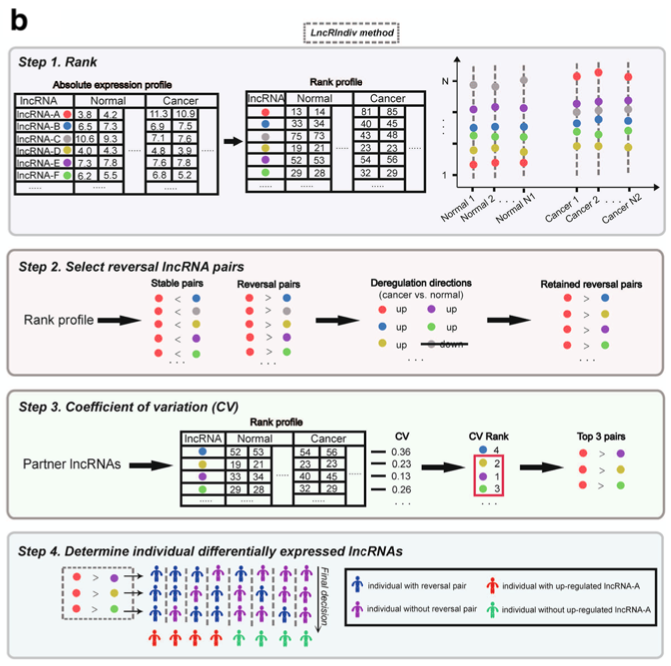
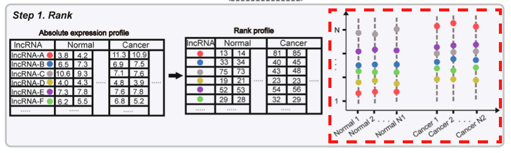
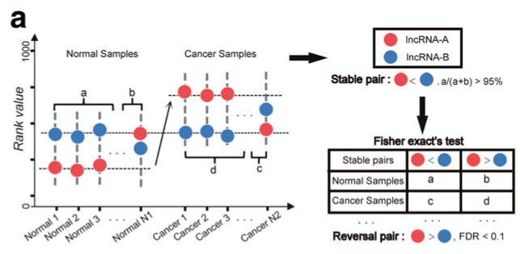
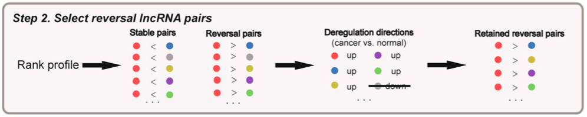
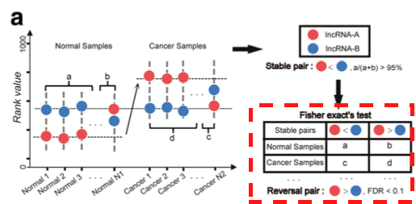
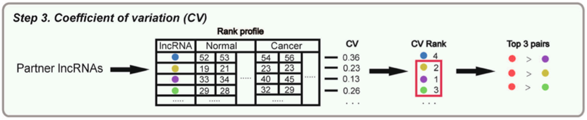
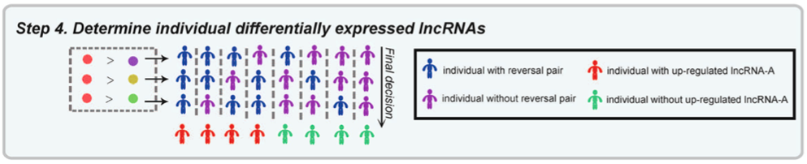

欢迎关注“小丫画图”公众号，回复“小白”，看小视频，实现点鼠标跑代码。

小丫微信: epigenomics  E-mail: figureya@126.com

作者：大鱼海棠，他的更多作品看这里<https://k.koudai.com/OFad8N0w>

单位：中国药科大学国家天然药物重点实验室，生物统计与计算药学研究中心

小丫编辑校验

```{r setup, include=FALSE}
knitr::opts_chunk$set(echo = TRUE)
```

# 需求描述

想众筹按照文中的方法构建基因对预后模型



出自<https://molecular-cancer.biomedcentral.com/articles/10.1186/s12943-017-0666-z>

Fig. 1 Illustration of LncRIndiv method and work-flow of this study. 
b The schematic diagram of **LncRIndiv method**. 
Take lncRNA-A as an example to describe the LncRIndiv method. Circles with different color represent different lncRNAs. 
The **blue and purple** human shapes represent the samples **with or without reversal lncRNA pairs in each line**, respectively. 
The **red and green** human shapes represent the samples are determined as **with and without differential expression of lncRNA-A** by the LncRIndiv method.

# 应用场景

【提出问题】DESeq等方法 detect differentially expressed genes (DEGs) in **sub-groups of cancer samples**, considering the **high heterogeneity** of lncRNA expression among patients, **none have been used in detecting DE lncRNAs in individual patients**. 

【前提假设】作者以前的工作发现 the relative expression rankings of genes (miRNAs) tend to be **highly stable in specific normal** human tissues but **widely disturbed in the corresponding cancer** tissues, and the reversal relationship of rank between genes (miRNAs) expression level can be used to identify DE genes (miRNAs) in individual patient. 
这次用同样的方式来看DE lncRNAs in individual patients

【解决方案】例文建立了一个方法LncRIndiv（detect DE lncRNAs in individual patients），即使用gene-pair进行预后模型构建的方法，也就是通过成对基因来进行预后建模。

例如A和B基因，A表达量 > B表达量设为1，A表达量 < B表达量设为0。筛选出多对基因，都变成0和1的形式，进行预后模型构建。

本文档带你复现这一方法。

【优点】基于排序获得的模型具有平台独立性，只要单样本基因之间表达具有可比性就可以了。
...due to experimental batch effects and platform differences, the **score-based signatures** tend to produce spurious risk classification in independent samples measured by different laboratories and are infeasible in clinical application...
...we found prognostic signatures derived using the **relative genes (miRNAs) expression rankings** within samples, rather than the absolute expression values, are robust in **independent datasets from different laboratories and platforms**.

# 环境设置

使用国内镜像安装包

```{r eval=FALSE}
options("repos"= c(CRAN="https://mirrors.tuna.tsinghua.edu.cn/CRAN/"))
options(BioC_mirror="http://mirrors.tuna.tsinghua.edu.cn/bioconductor/")
install.packages("matlab")
install.packages("EnvStats")
```

加载包

```{r}
library(matlab)
library(EnvStats)
library(pheatmap)

Sys.setenv(LANGUAGE = "en") #显示英文报错信息
options(stringsAsFactors = FALSE) #禁止chr转成factor
```

自定义函数

```{r}
display.progress = function (index, totalN, breakN=20) {
  if ( index %% ceiling(totalN/breakN)  ==0  ) {
    cat(paste(round(index*100/totalN), "% ", sep=""))
  }
}    
```

# 输入文件

这里用的数据是原文的测试数据GSE27262，包括50例样本，25肿瘤和25正常。GEO数据下载和预处理方式可参考FigureYa203combat。

```{r}
# 加载样本信息
Sinfo <- read.table("gse27262.sinfo.txt",sep = "\t",row.names = 1,check.names = F,stringsAsFactors = F,header = T)
# 提取肿瘤和正常样本
tumsam <- rownames(Sinfo[which(substr(Sinfo$Title,30,31) == "T"),])
norsam <- rownames(Sinfo[which(substr(Sinfo$Title,30,31) == "N"),])

# 加载表达谱
Expr <- read.table("gse27262.expr.txt",sep = "\t",row.names = 1,check.names = F,stringsAsFactors = F,header = T)
Expr$gene <- sapply(strsplit(rownames(Expr)," /// "), "[",1)
Expr <- as.data.frame(apply(Expr[,setdiff(colnames(Expr), "gene")], 2, function(x) tapply(x, INDEX=factor(Expr$gene), FUN=mean, na.rm=TRUE)))

# 加载注释文件，用于提取lncRNA
Ginfo <- read.table("overlapTable27.txt",sep = "\t",row.names = 1,check.names = F,stringsAsFactors = F,header = T)

# 提取lncRNA
Lids <- Ginfo[Ginfo$genetype %in% c("non_coding","3prime_overlapping_ncRNA","antisense_RNA","lincRNA","sense_intronic","sense_overlapping","macro_lncRNA","bidirectional_promoter_lncRNA"),]
Lids <- intersect(rownames(Expr),Lids$genename)
Expr <- Expr[Lids,]
```

# 使用gene-pair构建预后模型

## 第一步：表达谱编秩，然后选取在正常样本中秩序一致率达到95%的基因对，即lncRNA1 - lncRNA2方向一致（<0）的基因对出现在超过95%以上的正常样本中

Step 1: The absolute expression profile of lncRNAs is transformed into **rank profile**.



**Stable lncRNA pairs** were defined as patterns of rank, such as lncRNA-A < lncRNA-B, appearing in more than 95% of normal samples (P = 6.26 × 10−23, binomial test, Fig. 1a).



```{r}
# 表达谱编秩，transform absolute expression profile into rank profile
expr.rank <- apply(Expr, 2, rank)

# 自定义函数，找出stable lncRNA pairs
slec_stable_pair_nor <- function(expE,cutoff) { 
  
  gid  <- rownames(expE)
  exp  <- as.matrix(expE)
  len  <- length(gid)-1 
  end  <- length(gid)
  m    <- length(exp[1,]) 
  pair <- matrix(nrow=choose(length(gid),2),ncol=3) 
  j <- 1 
  for (i in 1:len) {
    RE=(exp[i*ones(len-i+1,1),]-exp[(i+1):end,]) < 0 
    if(i == len) {
      ratio <- sum(RE)/m
      pair[j,] <- c(rep(gid[i],end-i),gid[(i+1):end],ratio) 
    } else {
      ratio <- rowSums(RE)/m 
      pair[j:(j+length(RE[,1])-1),] <- c(rep(gid[i],end-i),gid[(i+1):end],ratio) 
      j <- j + length(RE[,1])
    }
  } 
  stable_pair_1 <- pair[pair[,3] >= cutoff,1:2] 
  stable_pair_2 <- pair[pair[,3] <= 1-cutoff,2:1] 
  stable_pair <- rbind.data.frame(stable_pair_1,stable_pair_2) 
  rownames(stable_pair) <- paste0(stable_pair$V1,"-",stable_pair$V2)
  return(list(pair = pair,
              stable_pair = stable_pair,
              stable_pair_1 = stable_pair_1,
              stable_pair_2 = stable_pair_2))
} 

# 找出stable lncRNA pairs in normal samples
stablePairNorm <- slec_stable_pair_nor(expr.rank[,norsam],cutoff = 0.95)$stable_pair
write.table(stablePairNorm,"output_stable lncRNA pair in normal samples.txt",sep = "\t",row.names = T,col.names = NA,quote = F)
```

## 第二步：选取在肿瘤样本中显著相反的基因对

Step 2:Take lncRNA-A as an example. According to the rules in Fig. 1a, there are five reversal pairs with lncRNA-A in cancer samples, including partner lncRNAs lncRNA-B, lncRNA-C, lncRNA-D, lncRNA- E, and lncRNA-F. **Only the partner lncRNAs that have the same dysregulation directions as lncRNA-A in the lncRNA-A reversal pairs are retained.* Here, the dysregulation directions indicated the expression of lncRNA-A is up-regulated in the cancer group comparing with the normal group. In Fig. 1b, the lncRNA-C is removed because of the down-regulation trend.



这里构建了如原文图1a右下角表格里的频数矩阵，记录了上述稳定的基因对在肿瘤以及在正常样本中，lncRNA1 > lncRNA2 和 lncRNA1 < lncRNA2的数目。

对频数矩阵做独立性fisher检验，为了获取在肿瘤样本中方向显著相反的基因对，及在肿瘤样本中富集lncRNA1 > lncRNA2。



```{r}
fdr.cutoff <- 0.1

outTab <- NULL
for (i in 1:nrow(stablePairNorm)) {
  display.progress(index = i, totalN = nrow(stablePairNorm))
  GP1 <- stablePairNorm[i,"V1"]
  GP2 <- stablePairNorm[i,"V2"]
  label <- rownames(stablePairNorm)[i]
  res <- data.frame(diff.tum = expr.rank[GP1,tumsam] - expr.rank[GP2,tumsam],
                    diff.nor = expr.rank[GP1,norsam] - expr.rank[GP2,norsam])

  # 计算当前基因对的失调方向（肿瘤 vs 正常）
  avg1 <- mean(expr.rank[GP1,tumsam]) - mean(expr.rank[GP1,norsam])
  avg2 <- mean(expr.rank[GP2,tumsam]) - mean(expr.rank[GP2,norsam])
  
  res$tum.dirct <- factor(ifelse(res$diff.tum < 0,"a<b.T","a>b.T"),levels = c("a<b.T","a>b.T"))
  res$norm.dirct <- factor(ifelse(res$diff.nor < 0,"a<b.N","a>b.N"),levels = c("a<b.N","a>b.N"))
  
  # 构建矩阵（原文图1a的右下角表格）
  tmp <- matrix(c(as.numeric(table(res$norm.dirct)),as.numeric(table(res$tum.dirct))),
                nrow = 2,byrow = T,
                dimnames = list(c("Normal","Tumor"),c("a<b","a>b")))
  
  # 生成结果
  outTab <- rbind.data.frame(outTab,
                             data.frame(V1 = GP1, # 当前基因对的第一个基因
                                        V2 = GP2, # 当前基因对的第二个基因
                                        avg1 = avg1, # 第一个基因在肿瘤vs正常里的秩水平
                                        avg2 = avg2, # 第二个基因在肿瘤vs正常里的秩水平
                                        dirct = ifelse(avg1*avg2 > 0,"same","different"), # 若基因对的两个基因的失调方向一致则为same，否则为different
                                        altb.N = tmp[1,1],
                                        agtb.N = tmp[1,2],
                                        altb.T = tmp[2,1],
                                        agtb.T = tmp[2,2],
                                        p = fisher.test(tmp)$p.value, # fisher检验结果
                                        row.names = label,
                                        stringsAsFactors = F),
                             stringsAsFactors = F)
}

# 校正p值并选取在正常和肿瘤样本中有差异的基因对
outTab$FDR <- p.adjust(outTab$p,method = "BH")
outSel <- outTab[which(outTab$FDR < fdr.cutoff),]
outSel <- outSel[which(outSel$dirct == "same"),]

# 保存到文件
write.table(outTab,"output_independency test of lncRNA pair between normal and tumor samples.txt",sep = "\t",row.names = T,col.names = NA,quote = F)
write.table(outSel,"output_significant lncRNA pair between normal and tumor samples.txt",sep = "\t",row.names = T,col.names = NA,quote = F)
```

## 第三步：计算lncRNA.A的所有partner在所有样本里的CV，升序排列取前3个表达最稳定的partner用来表征lncRNA.A

Step 3:Then, we calculate the **coefficient of variation (CV)** of rank across cancer and normal samples for each partner lncRNA of lncRNA-A in the lncRNA-A reversal pairs (Fig. 1b). **We hypothesize** that if the rank of partner lncRNA is approximately constant across the cancer and normal samples, the reversal relationship of lncRNA-A and partner lncRNA may occur because of the rank change of lncRNA-A, which could be used as evidence to determine whether lncRNA-A is differentially expressed in individual cancer samples. Then, the partner lncRNAs of lncRNA-A are ranked by the CV in increasing order. If there are more than 3 reversal pairs for lncRNA-A, the **top 3 reversal pairs** are retained; otherwise, all are included for the following analysis. In Fig. 1b, the lncRNA-D, lncRNA-E and lncRNA-F are the top three lncRNAs with the smallest CV and are included in following analysis.



```{r}
n.top <- 3 # 取top3个partner

outTab2 <- NULL
lncA <- unique(outSel$V1)
for (i in lncA) { # 循环每个lncRNA.A
  tmp <- outSel[which(outSel$V1 == i),] # 取出所有pair
  resTab <- NULL
  for (j in tmp$V2) { # 循环每个可能的partner
    expr <- expr.rank[j,]
    expr.cv <- cv(expr) # 计算CV
    resTab <- rbind.data.frame(resTab,
                               data.frame(lncRNA.A = i,
                                          partner = j,
                                          cv = expr.cv,
                                          stringsAsFactors = F),
                               stringsAsFactors = Fa)
  }
  resTab <- resTab[order(resTab$cv,decreasing = F),,drop = F] # 升序排列
  if(nrow(resTab) >= n.top) { # 只取<=n.top个partner
    resTab <- resTab[1:n.top,]
  } 
  outTab2 <- rbind.data.frame(outTab2,
                              resTab,
                              stringsAsFactors = F)
}
write.table(outTab2,"output_lncRNA partner with cv in all samples.txt",sep = "\t",row.names = F,col.names = T,quote = F)
```

## 第四步：检测差异lncRNA（若超过半数lncRNA.A > partner，则该lncRNA.A在该样本中上调，记为1）

Step 4: In this example, the top 3 reversal lncRNA pairs (lncRNA-A > lncRNA-D, lncRNA-A > lncRNA-E and lncRNA-A > lncRNA-F) are used to determine whether lncRNA-A is differentially expressed in an individual patient. **If more than half of the reversal lncRNA pairs are detected in a patient**, we conclude that lncRNA-A is differentially expressed in the patient (red human shape in Fig. 1b).



```{r}
dysTab <- as.data.frame(matrix(NA,nrow = length(lncA),ncol = length(tumsam),byrow = T,
                 dimnames = list(lncA,tumsam)))

for (i in tumsam) { # 循环每个肿瘤样本
  for (j in lncA) { # 循环每个lncRNA.A
    tmp <- outTab2[which(outTab2$lncRNA.A == j),] # 取出该lncRNA.A的对应partner
    pos <- 0
    for (k in tmp$partner) { # 循环每个partner
      if(expr.rank[j,i] - expr.rank[k,i] > 0) { # 判断lncRNA.A的表达是否大于partner的表达
        pos <- pos + 1 # 若大于则增加一次计数
      } else {pos <- pos}
    }
    
    if(pos >= ceiling(0.5 * nrow(tmp))) { # 若计数超过半数的partner
      dysTab[j,i] <- 1 # 则该lncRNA.A在该样本i中为1
      } else {
      dysTab[j,i] <- 0 # 否则为0
      }
  }
}

write.table(dysTab,"output_lncRNA dysregulation matrix in tumor samples.txt",sep = "\t",row.names = T,col.names = NA,quote = F)
```

# 开始画图

## 画个热图瞧一瞧

上面找到的差异基因在各个sample中的上下调情况。

```{r}
pheatmap(dysTab,
         border_color = NA,
         cluster_rows = T,
         cluster_cols = T,
         color = c("black","yellow"),
         show_colnames = T,
         show_rownames = F,
         legend_breaks = c(0,0.5,1),
         legend_labels = c("DN.Reg.","","UP.Reg."),
         filename = "lncRNA dysregulation heatmap.pdf")

save.image(file = "GP.RData")
```

## gene-pair关系的展示

这些gene-pair的关系、CV值，以及上下调方向，可以画个网络图来展示，可参考`FigureYa199crosslink`。

或者用热图、散点图等方式展示基因表达的相关性和p value，Fig. 3 bc，可参考<https://mp.weixin.qq.com/s/D9wheY5QdnOh4JrjIc8-Cg>。

或者用散点图展示基因对在两组样本中的表达趋势，可参考`FigureYa96R2`

## gene-pair 作为诊断marker的效果（Performance evaluation）

生存分析，Fig. 2 abc，可参考`FigureYa1survivalCurve`

高低风险组基因表达量分布，Fig. 2 de，可参考`FigureYa162boxViolin`

Cox regression analyses，Table 2，可参考`FigureYa47HRtable`

# Session Info

```{r}
sessionInfo()
```