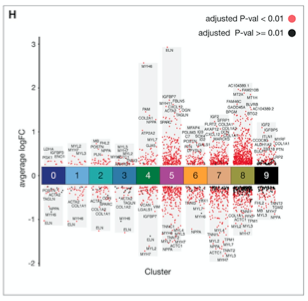

欢迎关注“小丫画图”公众号，回复“小白”，看小视频，实现点鼠标跑代码。

小丫微信: epigenomics  E-mail: figureya@126.com

作者：古潇，他的更多作品看这里<https://k.koudai.com/uH4zuEWC>

小丫编辑校验

```{r setup, include = FALSE}
knitr::opts_chunk$set(echo = TRUE)
```

# 需求描述

单细胞测序分不同的cluster，然后在每个cluster上做DEGs的点图，最好是log2FC为负的标蓝。然后自定义显示想要的点。
输入数据用seurat用的PBMC那个测试数据吧



出自<https://www.sciencedirect.com/science/article/pii/S0092867419312826?via%3Dihub>

Figure 2. Global Spatiotemporal Analysis of Three Cardiac Developmental Stages
(H) Differential gene expression analysis showing up- and down-regulated genes across all ten clusters. An adjusted p value < 0.01 is indicated in red, while an adjusted p value R 0.01 is indicated in black.

# 应用场景

分类展示各cluster的marker gene表达趋势变化的分布情况。

可以像原文那样标注显著上调或下调表达的基因名，或者标注参与某一通路的基因名。

# 环境设置

使用国内镜像安装包

```{r}
options("repos" = c(CRAN="https://mirrors.tuna.tsinghua.edu.cn/CRAN/"))
options(BioC_mirror = "http://mirrors.tuna.tsinghua.edu.cn/bioconductor/")
```

加载包

```{r}
library(dplyr)
library(Seurat)
library(patchwork)
library(reshape2)
library(RColorBrewer)
library(ggplot2)
library(ggrepel) #用于注释文本
library(magrittr)

Sys.setenv(LANGUAGE = "en") #显示英文报错信息
options(stringsAsFactors = FALSE) #禁止chr转成factor
```

# 输入文件及预处理

## 输入文件

这部分与“FigureYa224scMarker”相同

以Seurat官网PBMC数据为例，跟FigureYa111markerGene和FigureYa160scGSVA用的是同一套数据，出自不同作者之手，可相互参考。

下载<https://cf.10xgenomics.com/samples/cell/pbmc3k/pbmc3k_filtered_gene_bc_matrices.tar.gz>，解压到当前文件夹。

预处理过程参考<https://satijalab.org/seurat/v3.2/pbmc3k_tutorial.html>

```bash
# 解压缩
tar -zxvf pbmc3k_filtered_gene_bc_matrices.tar.gz
```

```{r}
# Load the PBMC dataset
pbmc.data <- Read10X(data.dir = "filtered_gene_bc_matrices/hg19/")
# Initialize the Seurat object with the raw (non-normalized data).
pbmc <- CreateSeuratObject(counts = pbmc.data, project = "pbmc3k", min.cells = 3, min.features = 200)
pbmc
```

## 预处理

```{r}
# 进行QC
# 计算mitochondria基因比例
pbmc[["percent.mt"]] <- PercentageFeatureSet(pbmc, pattern = "^MT-")

# Visualize QC metrics as a violin plot
VlnPlot(pbmc, features = c("nFeature_RNA", "nCount_RNA", "percent.mt"), ncol = 3)
plot1 <- FeatureScatter(pbmc, feature1 = "nCount_RNA", feature2 = "percent.mt")
plot2 <- FeatureScatter(pbmc, feature1 = "nCount_RNA", feature2 = "nFeature_RNA")
plot1 + plot2

# Normalizing the data
pbmc <- NormalizeData(pbmc, normalization.method = "LogNormalize", scale.factor = 10000)

#Identification of highly variable features
pbmc <- FindVariableFeatures(pbmc, selection.method = "vst", nfeatures = 2000)

# Identify the 10 most highly variable genes
# top10 <- head(VariableFeatures(pbmc), 10)
# plot variable features with and without labels
# plot1 <- VariableFeaturePlot(pbmc)
# plot2 <- LabelPoints(plot = plot1, points = top10, repel = TRUE)
# plot1 + plot2

# Scale the data
all.genes <- rownames(pbmc)
pbmc <- ScaleData(pbmc, features = all.genes)

# Perform linear dimensional reduction
pbmc <- RunPCA(pbmc, features = VariableFeatures(object = pbmc))
#print(pbmc[["pca"]], dims = 1:5, nfeatures = 5)
VizDimLoadings(pbmc, dims = 1:2, reduction = "pca")
DimPlot(pbmc, reduction = "pca")
DimHeatmap(pbmc, dims = 1:15, cells = 500, balanced = TRUE)

# NOTE: This process can take a long time for big datasets, comment out for expediency. More
# approximate techniques such as those implemented in ElbowPlot() can be used to reduce
# computation time

##以下酌情运行，比较耗时，可以不运行，直接看ElbowPlot
#pbmc <- JackStraw(pbmc, num.replicate = 100)
#pbmc <- ScoreJackStraw(pbmc, dims = 1:20)
#JackStrawPlot(pbmc,dims = 1:20)
ElbowPlot(pbmc)
```

ElbowPlot对主要PC进行排序，“拐弯”处之前的PC均可被选择，这里看到第10个PC处出现拐点，所以后续选择前10个PC进行降维

```{r}
# Cluster the cells
pbmc <- FindNeighbors(pbmc, dims = 1:10)
pbmc <- FindClusters(pbmc, resolution = 0.5)

#Run non-linear dimensional reduction (UMAP/tSNE)
pbmc <- RunUMAP(pbmc, dims = 1:10)
pA1 <- DimPlot(pbmc, reduction = "umap", label = T)+ NoLegend()
ggsave("plotA_1_UMAP_cluster.pdf", plot = pA1, width = 6, height = 6)
```

## 找cluster biomarkers

```{r}
# Finding differentially expressed features (cluster biomarkers)

# find markers for every cluster compared to all remaining cells
pbmc.markers <- FindAllMarkers(pbmc, 
                               min.pct = 0.25, 
                               logfc.threshold = 0.25)
```

> 最新版本的Seurat的cutoff跟以前不一样，Seurat 3.X.X以下用的是自然对数log，Seurat 4.X.X用的是log2，所以用Seurat 4.X.X的话，最后画出的图里的点会更多。

```{r}
# 这里用的Seurat版本是4.0.1
# 如果你用的是Seurat 3.X.X以下版本，需要把本文档所有的avg_log2FC替换为avg_logFC，或者运行下面这行
#pbmc.markers$avg_log2FC <- pbmc.markers$avg_logFC

# 查看top10 marker gene
top10 <- pbmc.markers %>% group_by(cluster) %>% top_n(n = 10, wt = avg_log2FC)
DoHeatmap(pbmc, features = top10$gene) + NoLegend()
```

## 鉴定细胞类型

如果只是为了复现文章中的图，可以不鉴定细胞类型，以下部分可不run，根据结合每个cluster的marker基因和生物学知识确定细胞类型。

为了接近真实情况并结合众筹示例数据，这里不将细胞类型划分的这么详细，进行以下更改

```{r}
# 给每个cluster标注细胞类型
new.cluster.ids <- c("T", "Mono", "T", "B", "T", "Mono", "NK", "DC", "Platelet")
names(new.cluster.ids) <- levels(pbmc)
pbmc <- RenameIdents(pbmc, new.cluster.ids)
# 添加细胞类型至meta data
pbmc@meta.data$celltype <- pbmc@active.ident
DimPlot(pbmc, reduction = "umap", label = TRUE, pt.size = 0.5) + NoLegend()
pA2 <-  pA2 <- DimPlot(pbmc, reduction = "umap", label = F,group.by = "celltype")
ggsave("plotA_1_UMAP_celltype.pdf", plot = pA2, width = 6, height = 6)

# 自定义颜色
colourCount <- length(unique(pbmc@meta.data$celltype))
getPalette <- colorRampPalette(brewer.pal(8, "Dark2"))
celltype_colors <- getPalette(colourCount)
pA2 <- pA2 <- DimPlot(pbmc, reduction = "umap", label = F,group.by = "celltype",cols = celltype_colors)
ggsave("plotA_1_UMAP_celltype_color.pdf", plot = pA2, width = 6,height = 6)

## 拼图
pA_all <- pA1 + pA2 + plot_layout(ncol = 2, widths = c(1, 1))
## 保存
ggsave("plotA_all.pdf", plot = pA_all, width = 12, height = 6)

celltype <- c("T","Mono","B","NK","DC","Platelet")
pbmc@meta.data$celltype <- factor(pbmc@meta.data$celltype, celltype)
saveRDS(pbmc, "pbmc_test_final.rds")
```

## 设置cutoff，定义显著/非显著的上/下调marker gene

```{r}
# 查看每个cluster的marker gene
pbmc.markers %>% group_by(cluster) %>% top_n(n = 2, # 前两个
                                             wt = avg_log2FC)
# 查看每个cluster的marker基因数量
table(pbmc.markers$cluster)

# 根据自己计算的marker基因数量确定log2FC的阈值，这里先定为0.5
pbmc.markers <- subset(pbmc.markers, p_val_adj < 0.05 & abs(avg_log2FC) > 0.5)
pbmc.markers$threshold <- as.factor(ifelse(pbmc.markers$avg_log2FC > 0 , 'Up', 'Down'))
dim(pbmc.markers)
table(pbmc.markers$threshold)

pbmc.markers$adj_p_signi <- as.factor(ifelse(pbmc.markers$p_val_adj < 0.01 , 'Highly', 'Lowly'))
pbmc.markers$thr_signi <- paste0(pbmc.markers$threshold, "_", pbmc.markers$adj_p_signi)
pbmc.markers$cluster %<>% as.vector(.) %>% as.numeric(.)

# 保存到文件
write.csv(pbmc.markers, "output_pbmc.markers.csv", quote = F)
```

# 自定义显示想要展示的基因名

这里挑选log2FC为top5的基因进行展示

```{r}
top_up_label <- pbmc.markers %>% 
  subset(., threshold%in%"Up") %>% 
  group_by(cluster) %>% 
  top_n(n = 5, wt = avg_log2FC) %>% 
  as.data.frame()

top_down_label <- pbmc.markers %>% 
  subset(., threshold %in% "Down") %>% 
  group_by(cluster) %>% 
  top_n(n = -5, wt = avg_log2FC) %>% 
  as.data.frame()

top_label <- rbind(top_up_label,top_down_label)
top_label$thr_signi %<>% 
  factor(., levels = c("Up_Highly","Down_Highly","Up_Lowly","Down_Lowly"))

# 保存到文件，便于小白套用格式
#write.csv(top_label, "easy_input_label.csv", quote = F)
```

也可以基于output_pbmc.markers.csv文件，手动挑选出想要标注名字的基因，例如标注参与某一通路的基因，然后将文件命名为easy_input_label.csv

# 开始画图

```{r}
# 读取修改后的要标注的基因名文件
#top_label <- read.csv("easy_input_label.csv")

### 准备绘制暗灰色背景所需数据 
background_position <- pbmc.markers %>%
  group_by(cluster) %>%
  summarise(Min = min(avg_log2FC) - 0.2, Max = max(avg_log2FC) + 0.2) %>%
  as.data.frame()
background_position$cluster %<>% as.vector(.) %>% as.numeric(.)
background_position$start <- background_position$cluster - 0.4
background_position$end <- background_position$cluster + 0.4

### 准备绘制中间区域cluster彩色bar所需数据
cluster_bar_position <- background_position
cluster_bar_position$start <- cluster_bar_position$cluster - 0.5
cluster_bar_position$end <- cluster_bar_position$cluster + 0.5
cluster_bar_position$cluster %<>% 
  factor(., levels = c(0:max(as.vector(.))))

## 设置填充颜色
cols_thr_signi <- c("Up_Highly" = "#d7301f",
                    "Down_Highly" = "#225ea8",
                    "Up_Lowly" = "black",
                    "Down_Lowly" = "black")
cols_cluster <- c("0" = "#35978f",
                  "1" = "#8dd3c7",
                  "2" = "#ffffb3",
                  "3" = "#bebada",
                  "4" = "#fb8072",
                  "5" = "#80b1d3",
                  "6" = "#fdb462",
                  "7" = "#b3de69",
                  "8" = "#fccde5")

p <- ggplot() +
  geom_rect(data = background_position, aes(xmin = start, xmax = end, ymin = Min,
                                          ymax = Max),
            fill = "#525252", alpha = 0.1) + ###添加灰色背景色
  geom_jitter(data = pbmc.markers, aes(x = cluster, y = avg_log2FC, colour = thr_signi),
              size = 1,position = position_jitter(seed = 1)) +
  scale_color_manual(values = cols_thr_signi) +
  scale_x_continuous(limits = c(-0.5, max(pbmc.markers$cluster) + 0.5),
                     breaks = seq(0, max(pbmc.markers$cluster), 1),
                     label = seq(0, max(pbmc.markers$cluster),1)) + #修改坐标轴显示刻度
  
  # 根据top_label标注基因名
  geom_text_repel(data = top_label, aes(x = cluster, y = avg_log2FC, label = gene),
                  position = position_jitter(seed = 1), show.legend = F, size = 2.5,
                  box.padding = unit(0, "lines")) +
  
  geom_rect(data = cluster_bar_position, aes(xmin = start, xmax = end, ymin = -0.4,
                                           ymax = 0.4, fill = cluster), color = "black", alpha = 1, show.legend = F) +
  scale_fill_manual(values = cols_cluster) +
  labs(x = "Cluster", y = "average log2FC") +
  theme_bw()

plot1 <- p + theme(panel.grid.minor = element_blank(), ##去除网格线
                   panel.grid.major = element_blank(),
                   axis.text.y = element_text(colour = 'black', size = 14),
                   axis.text.x = element_text(colour = 'black', size = 14, vjust = 50), #调整x轴坐标,vjust的值按照最终结果稍加调整
                   panel.border = element_blank(), ## 去掉坐标轴
                   axis.ticks.x = element_blank(), ## 去掉的坐标刻度线
                   axis.line.y = element_line(colour = "black")) #添加y轴坐标轴
ggsave(filename = "Marker_gene_pointplot.pdf", plot = plot1, width = 9, height = 6)
```


# Session Info

```{r}
sessionInfo()
```