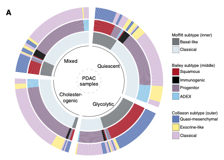

欢迎关注“小丫画图”公众号，回复“小白”，看小视频，实现点鼠标跑代码。

小丫微信: epigenomics  E-mail: figureya@126.com

作者：大鱼海棠，他的更多作品看这里<https://k.koudai.com/OFad8N0w>

单位：中国药科大学国家天然药物重点实验室，生物统计与计算药学研究中心

小丫编辑校验

```{r setup, include=FALSE}
knitr::opts_chunk$set(echo = TRUE)
```

# 需求描述

你好，想众筹一下这个图，用圆圈图的方式展示不同分组的关系。网上没有找到可以实现的代码。最好是R语言做。



出自<https://clincancerres.aacrjournals.org/content/26/1/135>

Figure 3. Alignment of PDAC metabolic subgroups with known gene expression subtypes. 
A, Overlay of metabolic profiles (inner ring) with PDAC expression subtypes (outer rings) based on the Moffitt and colleagues’ (4), Bailey and colleagues’ (2), and Collisson and colleagues’ (3) classifications.

# 应用场景

将亚型（或其他分类变量）之间的映射关系（一致性）以圈状热图注释的方式展现。

我们还众筹过例文的Figure 1ABC，通过基因共识聚类选择共表达的基因集，随后根据表达谱中位数划分四类样本，可参考`FigureYa202consensusGene`

# 环境设置

使用国内镜像安装包

```{r}
options("repos"= c(CRAN="https://mirrors.tuna.tsinghua.edu.cn/CRAN/"))
options(BioC_mirror="http://mirrors.tuna.tsinghua.edu.cn/bioconductor/")

```

加载包

```{r}
library(circlize)
library(gridBase)
library(grid)
library(ComplexHeatmap)
library(SimDesign)

Sys.setenv(LANGUAGE = "en") #显示英文报错信息
options(stringsAsFactors = FALSE) #禁止chr转成factor
```

# 输入文件

easy_input.txt，多组分类信息。也可用于FigureYa25Sankey，画成桑基图。

```{r}
# 加载亚型数据并依次排序
subt <- read.table("easy_input.txt", sep = "\t", row.names = 1, check.names = F, stringsAsFactors = F, header = T)
head(subt)

# 亚型依次排序
subt <- subt[order(subt$TCGA_subtype, 
                   subt$Moffitt_subtype, 
                   subt$`Bailey subtype`, 
                   subt$`Collisson subtype`), ]
```

# 开始画图

用circlize画图，参考作者的电子书<https://jokergoo.github.io/circlize_book/book/>。

看每段开头的注释，了解每段的功能，就可以灵活修改分组的数量、颜色了。

```{r}
# 设置各个亚型的颜色
subtype1.col <- c("#9AAF57", "#6AA1AB", "#E1B52E", "#81552E")
subtype2.col <- c("#717579", "#DFE8EE")
subtype3.col <- c("#9B1C1F", "#8F7999", "black", "#9FC6EC")
subtype4.col <- c("#6978BC", "#F7F07C", "#D3BDDC")

# 映射各亚型各水平的颜色
col_subt1 <- c("Cholesterogenic" = subtype1.col[1],
               "Glycolytic" = subtype1.col[2],
               "Quiescent" = subtype1.col[3],
               "Mixed" = subtype1.col[4])
col_subt2 <- c("Basal-like" = subtype2.col[1], 
               "Classical" = subtype2.col[2])
col_subt3 <- c("Squamous" = subtype3.col[1], 
               "Immunogenic" = subtype3.col[2], 
               "Progenitor" = subtype3.col[3], 
               "ADEX" = subtype3.col[4])
col_subt4 <- c("Quasi-mesenchymal" = subtype4.col[1],
               "Exocrine-like" = subtype4.col[2],
               "Classical" = subtype4.col[3])

# 创建图例
lgd_subt1 <- Legend(title = "TCGA subtype", # 图例title
                    at = names(col_subt1), # 图例的水平
                    legend_gp = gpar(fill = col_subt1)) # 图例所填充的颜色
lgd_subt2 <- Legend(title = "Moffitt subtype", 
                    at = names(col_subt2), 
                    legend_gp = gpar(fill = col_subt2))
lgd_subt3 <- Legend(title = "Bailey subtype", 
                    at = names(col_subt3), 
                    legend_gp = gpar(fill = col_subt3))
lgd_subt4 <- Legend(title = "Collisson subtype", 
                    at = names(col_subt4), 
                    legend_gp = gpar(fill = col_subt4))

# 自定义函数，正式合并图像和图例
circlize_plot = function() {
  circos.heatmap(subt$TCGA_subtype, 
                 split = factor(subt$TCGA_subtype,levels = c("Cholesterogenic", "Glycolytic", "Quiescent", "Mixed")), # 按照亚型因子顺序排列
                 col = col_subt1, 
                 track.height = 0.14,
                 show.sector.labels = TRUE) # 显示区块名
  circos.heatmap(subt$Moffitt_subtype, 
                 split = factor(subt$Moffitt_subtype, levels = c("Basal-like", "Classical")), 
                 col = col_subt2, 
                 track.height = 0.14)
  circos.heatmap(subt$`Bailey subtype`, 
                 split = factor(subt$`Bailey subtype`, levels = c("Squamous", "Immunogenic", "Progenitor", "ADEX")), 
                 col = col_subt3, 
                 track.height = 0.14)
  circos.heatmap(subt$`Collisson subtype`, 
                 split = factor(subt$`Collisson subtype`, levels = c("Quasi-mesenchymal", "Exocrine-like", "Classical")), 
                 col = col_subt4, 
                 track.height = 0.14)
  circos.clear() # 清除图像的连接(注意：每次重新画圈图必须清除图像连接)
}

## 开始画图
plot.new() # 请从这句开始到你想修改/理解的那行代码，整段运行
circle_size = unit(0.8, "snpc") # snpc会设置一个正方形的区域
pushViewport(viewport(x = 0, y = 0.5, 
                      width = circle_size, 
                      height = circle_size,
                      just = c("left", "center")))
par(omi = gridOMI(), new = TRUE)
quiet(circlize_plot())

# 添加正中心的文字
text(0, 0, "PDAC\nsamples", cex = 0.9) # 添加正中心的文字
upViewport()

# 画图例
lgd_list <- packLegend(lgd_subt1, 
                       lgd_subt2, 
                       lgd_subt3, 
                       lgd_subt4, 
                       max_height = unit(0.9*dev.size()[2], "inch"))
draw(lgd_list, x = circle_size, just = "left")

# 直接保存图像到本地
dev.copy2pdf(file = "subtype circos plot.pdf") 
```

# Session Info

```{r}
sessionInfo()
```