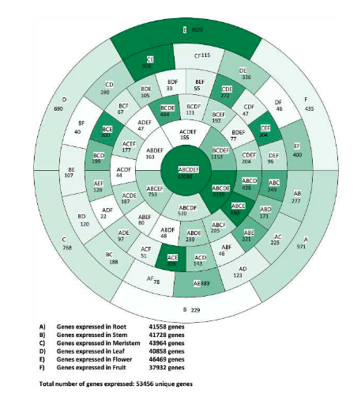

欢迎关注“小丫画图”公众号，回复“小白”，看小视频，实现点鼠标跑代码。

小丫微信: epigenomics  E-mail: figureya@126.com

作者：古潇，他的更多作品看这里<https://k.koudai.com/uH4zuEWC>

小丫编辑校验

```{r setup, include=FALSE}
knitr::opts_chunk$set(echo = TRUE)
```

# 需求描述

丫姐好，我想众筹这幅韦恩图，觉得蛮有意思的



出自<https://www.mdpi.com/2073-4425/11/5/544>

Figure 1. Venn diagram showing the gene expression profile of plant organs. Each compartment indicates the included organs and the number of genes expressed in it. A gene is considered expressed in an organ when its expression is > -2 log2 reads per kilobase per million mapped reads (RPKM) and “not expressed” when its expression is ≤ -2 log2 RPKM.

# 应用场景

展示多组之间的overlap genes、以及每组specific genes，通常会用到venn图（可参考 [FigureYa112venn](https://www.yuque.com/figureya/figureyaplus/figureya112p)），有太多组需要对比的话还可以像例文这样画成环形图。

# 环境设置

使用国内镜像安装包

```{r eval=FALSE}
options("repos"= c(CRAN="https://mirrors.tuna.tsinghua.edu.cn/CRAN/"))
options(BioC_mirror="http://mirrors.tuna.tsinghua.edu.cn/bioconductor/")
install.packages("ggVennDiagram")
```

加载包

```{r}
library(ggVennDiagram) # 找overlap基因
library(ggplot2)
library(magrittr)
library(RColorBrewer)

Sys.setenv(LANGUAGE = "en") #显示英文报错信息
options(stringsAsFactors = FALSE) #禁止chr转成factor
```

# 输入差异表达分析结果

如果你的数据已经找完overlap，并整理成easy_input.csv的格式，就可以跳过这步，直接进入“输入overlap”。

## 输入文件

SKCM_\*_test_result.\*.txt，差异表达分析结果，出自FigureYa118MulticlassDESeq2和FigureYa120MulticlassedgeR。

并不局限于差异表达分析结果文件。只要每个文件中有一列ID即可。

> 怎样获得差异表达分析结果？

- 用[FigureYa59Plus_GEO2DEG](https://www.yuque.com/figureya/figureyaplus/figureya59p)获得芯片的差异表达分析结果文件`easy_input_limma.csv`

- 用FigureYa118MulticlassDESeq2、FigureYa119Multiclasslimma和FigureYa120MulticlassedgeR获得RNA-seq的差异表达分析结果。

```{r}
fnames <- Sys.glob("*.txt") # 读取当前文件夹下的所有txt文件
fnames # 检查一下读取的文件名

#根据自己的数据修改阈值，不根据FDR筛选基因的话就删掉这行
adjcutoff <- 0.05
# 自定义函数读取文件并筛选差异表达基因，只保留基因名
read_cut_ID <- function(file){
  df <- read.table(file, header = T)
  DEG <- df[df$FDR <= adjcutoff, ]$id #不想根据FDR筛选基因的话就删掉这行，改用下一行
  # DEG <- df$id 
}
fdataset <- lapply(fnames, read_cut_ID)

names(fdataset)
# 把组名改为字母ABCD等等
names(fdataset) <- LETTERS[1:length(fnames)]
names(fdataset)
```

## 找overlap

使用ggVennDiagram包里的process_region_data处理数据，统计任意并集元素。

```{r}
set <- process_region_data(venn = Venn(fdataset)) %>% as.data.frame(.)

dt_all <- set[,c("count", "name")]
colnames(dt_all) <- c("num", "name")

# 将ggVennDiagram包里面name列两个元素之间的..删除
dt_all$name <- gsub("\\..", "\\", dt_all$name)

# 根据自己情况决定是否删除没有overlap的区域（即overlap基因数为0），
#dt_all %<>% subset(., num!=0) # 删除overlap基因数为0的区域
```

## 画图

```{r fig.width=10, fig.height=10}
# 给每个区域一样的值，保证每个区域占据长度高度一致
dt_all$value <- 100
dt_all$level <- nchar(dt_all$name)
dt_all$level %<>% factor(., levels = c(1:max(.)) %>% rev())

level <- levels(dt_all$level)
dt_all_final <- c()
for (i in level) {
  dt <- subset(dt_all,level==i)
  dt_all_final <- rbind(dt_all_final, dt)
}
dt_all_final$label <- paste0(dt_all_final$name, "\n", dt_all_final$num)
dt_all_final$name %<>% factor(., levels = .)

p <- ggplot(dt_all_final, aes(x = level, y = value, fill = num)) +
  geom_bar(stat="identity", position = "fill", width = 1, colour = "black")+
  scale_fill_gradientn(colours=c("white", "forestgreen")) +
  geom_text(aes(label = label),color="black", size = 4, position = position_fill(vjust = 0.5))+

  coord_polar(theta="y",direction=-1)+ #direction=-1 逆时针方向
  theme_bw() +
  theme(legend.position='none')+
  theme(panel.grid = element_blank(),
        axis.ticks = element_blank(),
        axis.text = element_blank(),
        axis.title = element_blank(),
        panel.border=element_blank())

p
ggsave(filename = "Circled_Venn_diagram.pdf", plot = p, width = 10, height = 10)
```

# 输入overlap

## 输入文件

easy_input.csv，这里直接用例文提供的各组之间的overlap基因画图（文章附件Supplemental Table S3.csv）。

每种组合放到一列，例如第一列的列名ABCDEF，即ABCDEF组的共有基因，有32030个基因名，对应圆心上的数字32030。以此类推其后各列。

```{r}
df <- read.csv("easy_input.csv")
name <- colnames(df) %>% as.vector(.)
dt_all <- c()
for (i in name) {
  sub_df <- df[,i] %>% .[which(!.%in%"")] #删除空值的元素 # 统计每个区域的元素数量
  dt <- data.frame(name=i, num=length(sub_df))
  dt_all <- rbind(dt_all, dt)
}
```

## 画图

与第一部分相同

```{r fig.width=10, fig.height=10}
# 给每个区域一样的值，保证每个区域占据长度高度一致
dt_all$value <- 100
dt_all$level <- nchar(dt_all$name)
dt_all$level %<>% factor(., levels = c(1:max(.)) %>% rev())

level <- levels(dt_all$level)
dt_all_final <- c()
for (i in level) {
  dt <- subset(dt_all,level==i)
  dt_all_final <- rbind(dt_all_final, dt)
}
dt_all_final$label <- paste0(dt_all_final$name, "\n", dt_all_final$num)
dt_all_final$name %<>% factor(., levels = .)

# 小技巧
# 如果等比例按照基因数量填充颜色，圆心数量远大于其他区域，其他区域都会是很浅的颜色
# 为了达到较好的视觉效果，我们把>1000个基因的区域统一定义为1000
dt_all_final[dt_all_final$num > 1000, ]$num <- 1000 # 根据自己的数据调整，或删掉这行

p <- ggplot(dt_all_final,aes(x = level,y = value,fill = num)) +
  geom_bar(stat="identity",position = "fill", width = 1,colour = "black") +
  scale_fill_gradientn(colours=c("white", "forestgreen")) +
  geom_text(aes(label = label),color="black", size = 4, position = position_fill(vjust = 0.5)) +
  
  # 想和原文一样标签为白色底色的话run下面这句，但效果感觉不好
  #geom_label(aes(label = name),fill="white",color="black", size = 3, 
  #           label.padding = unit(0.15, "lines"),label.r = unit(0,"lines"),
  #           position = position_fill(vjust = 0.5))+ 
  coord_polar(theta="y",direction=-1)+ #direction=-1 逆时针方向 
  theme_bw() +
  theme(legend.position='none') +
  theme(panel.grid = element_blank(),
        axis.ticks = element_blank(),
        axis.text = element_blank(),
        axis.title = element_blank(),
        panel.border = element_blank())
p
ggsave("Circled_Venn_diagram_ori.pdf", plot = p, width = 10,height = 10)
```

# Session Info

```{r}
sessionInfo()
```