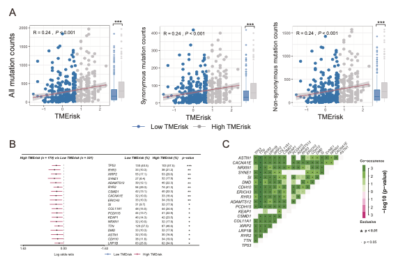
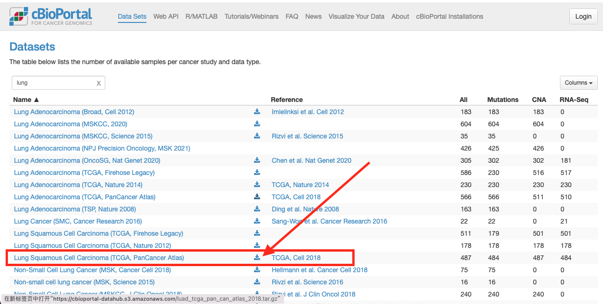

欢迎关注“小丫画图”公众号，回复“小白”，看小视频，实现点鼠标跑代码。

小丫微信: epigenomics  E-mail: figureya@126.com

作者：大鱼海棠，他的更多作品看这里<https://k.koudai.com/OFad8N0w>

单位：中国药科大学国家天然药物重点实验室，生物统计与计算药学研究中心

小丫编辑校验

```{r setup, include=FALSE}
knitr::opts_chunk$set(echo = TRUE)
```

# 需求描述

小丫老师，想众筹下FigA-C，预后模型建立后寻找高低风险组中突变最显著的基因，并计算riskscore与有义和错义突变的相关性，谢谢啦



出自<https://www.nature.com/articles/s41388-021-01853-y>

Fig. 5 TMErisk was related to tumor mutation status. 
A Association between synonymous mutation counts, non-synonymous mutation counts, all mutation counts, and TMErisk score and their distribution in the low- and the high-TMErisk groups. 
B Forest plot of genes mutating differentially in patients of the low- and the high-TMErisk groups. 
C Interaction effect of genes mutating differentially in patients in the low- and the high-TMErisk groups. 

**Mutation status in LUAD patients in the high- and the low-TMErisk groups**

To investigate **TMErisk-related mechanisms** in LUAD, somatic mutations from the TCGA database were also analyzed. When comparing the mutant frequency between samples of the low- and the high-TMErisk groups, **more somatic mutations were observed in the high-TMErisk group**, including non-synonymous and synonymous mutations (Fig. 5A). Meanwhile, maftools analysis results showed that 19 genes mutated more frequently in LUAD patients in the high- TMErisk group, including TP53, ASTN1, RYR2, XIRP2, LRP1B, CSMD1, RYR3, PCDH15, TTN, KEAP1, ADAMTS12, ERICH3, DMD, CDH10, SI, SYNE1, NRXN1, CACNA1E, and COL11A1 (Fig. 5B). Among these genes, eight were expressed differentially between the wild type and the mutant type (Fig. S8). The frequency of mutations in these genes was also shown in Fig. 4. Moreover, significant co-occurrences were observed among mutations of these genes (Fig. 5C). 

# 应用场景

看到免疫浸润跟预后风险的关系，想进一步探究机制，例文作者从突变数据入手。

文章里有多个图可以用我们的FigureYa实现：

- Figure 2B 森林图，可参考FigureYa47HRtable和FigureYa193RiskTable；
- Figure 2C Time-dependent AUC，可参考FigureYa85timeROC；
- Figure 4 Landscape of immune and stromal cell infiltrations，可参考FigureYa230immunelandscape
- Figure 5D 对比的饼图，可参考FigureYa196PanPie

# 环境设置

使用国内镜像安装包

```{r eval=TRUE}
options("repos"= c(CRAN="https://mirrors.tuna.tsinghua.edu.cn/CRAN/"))
options(BioC_mirror="http://mirrors.tuna.tsinghua.edu.cn/bioconductor/")
BiocManager::install("maftools")
install.packages("ggplot2")
```

加载包

```{r}
library(data.table)
library(maftools)
library(tidyverse)
library(magrittr)
library(readxl)
library(stringr)
library(forcats)
library(ggplot2)
library(ggpubr)
library(cowplot)
library(patchwork)

Sys.setenv(LANGUAGE = "en") #显示英文报错信息
options(stringsAsFactors = FALSE) #禁止chr转成factor
```

# 输入文件

以下两个文件较大，已上传至微云<https://share.weiyun.com/ks0OVM7a>。建议按以下方式直接从官网下载：

- 表达数据：TCGA-LUAD.htseq_fpkm.tsv.gz，gene expression RNAseq - HTSeq - FPKM，下载自 [XENA](https://xenabrowser.net/datapages/) [GDC TCGA Lung Adenocarcinoma (LUAD) (15 datasets)](https://xenabrowser.net/datapages/?dataset=TCGA-LUAD.htseq_fpkm.tsv&host=https%3A%2F%2Fgdc.xenahubs.net&removeHub=https%3A%2F%2Fxena.treehouse.gi.ucsc.edu%3A443)，

- 突变数据：data_mutations_extended.txt，下载自[cBioPortal](http://www.cbioportal.org/datasets)，下载luad_tcga_pan_can_atlas_2018.tar.gz文件，解压缩把其中的data_mutations_extended.txt文件移到当前文件夹。



```{r}
# 读取表达谱
fpkm <- fread("TCGA-LUAD.htseq_fpkm.tsv.gz",sep = "\t",check.names = F,stringsAsFactors = F,header = T,data.table = F)
rownames(fpkm) <- fpkm[,1]; fpkm <- fpkm[,-1]

# 加载基因表达注释文件
Ginfo <- read.table("gencode.v22.annotation.gene.probeMap",sep = "\t",row.names = 1,check.names = F,stringsAsFactors = F,header = T)

# 将FPKM的ENSEMBL ID转为Gene Symbol并去重
identical(rownames(Ginfo),rownames(fpkm))
comgene <- intersect(rownames(fpkm),rownames(Ginfo))
fpkm <- fpkm[comgene,]; Ginfo <- Ginfo[comgene,]
fpkm$Gene <- as.character(Ginfo$gene)
fpkm <- fpkm[!duplicated(fpkm$Gene),] # 重复基因去重
rownames(fpkm) <- fpkm$Gene; fpkm <- fpkm[,-ncol(fpkm)]
fpkm <- as.data.frame(round(fpkm,3)) # 取表达的小数点后3位数

# 取出肿瘤样本
tumsam <- colnames(fpkm[,substr(colnames(fpkm),14,16) == "01A"])
```

```{r}
# 读取突变数据，并提取出和表达数据相同的样本
label <- c("Tumor_Sample_Barcode",
           "Hugo_Symbol",
           "Chromosome",
           "Start_Position",
           "End_Position",
           "Variant_Classification",
           "Variant_Type",
           "Reference_Allele",
           "Tumor_Seq_Allele1",
           "Tumor_Seq_Allele2")
maf <- read_tsv("data_mutations_extended.txt", comment = "#") 
maf$Tumor_Sample_Barcode <- paste0(maf$Tumor_Sample_Barcode,"A") # 添加"A"后缀以匹配突变
comsam <- intersect(tumsam,unique(maf$Tumor_Sample_Barcode)) # 取出和表达相同的样本
maf <- maf[which(maf$Tumor_Sample_Barcode %in% comsam),label] # 取出样本和列子集
write.table(maf,"data_mutations_extended_modified.txt",sep = "\t",row.names = F,col.names = T,quote = F) # 输出文件
```

# 计算TMEscore并分为高低两组

```{r}
## 根据原文系数计算TMEscore
coeff <- c(0.7869,-0.4203,0.3138,-0.4006,0.6168,0.6100,-0.8024,-0.7196)
names(coeff) <- c("LOX","OR7E47P","SERPINE1","CX3CR1","GBP1","IRF1","STAP1","CD200R1")
is.element(names(coeff),rownames(fpkm))

indata <- fpkm[names(coeff),tumsam]
indata <- apply(indata, 1, function(x) ifelse(x > median(x), 1, 0)) # 原文将表达转换为二元变量
TME <- apply(indata,1,function(x) {x %*% as.numeric(coeff)}) # 根据lasso系数计算TME得分
TMErisk <- data.frame(TME = TME,
                      risk = ifelse(TME > median(TME),"High","Low"),
                      row.names = names(TME),
                      stringsAsFactors = F)

## 分组，low- and the high-TMErisk groups
hsam <- rownames(TMErisk[which(TMErisk$risk == "High"),])
lsam <- rownames(TMErisk[which(TMErisk$risk == "Low"),])
```

# 突变按non-synonymous and synonymous mutations分类

```{r}
# 提取low- and the high-TMErisk groups的MAF数据
maf.high <- maf[which(maf$Tumor_Sample_Barcode %in% intersect(comsam,hsam)),] # 取出High-TME的MAF数据
maf.low <- maf[which(maf$Tumor_Sample_Barcode %in% intersect(comsam,lsam)),] # 取出Low-TME的MAF数据
write.table(maf.high,"data_mutations_extended_HRisk_modified.txt",sep = "\t",row.names = F,col.names = T,quote = F)
write.table(maf.low,"data_mutations_extended_LRisk_modified.txt",sep = "\t",row.names = F,col.names = T,quote = F)

# 突变按non-synonymous and synonymous mutations分类
# 再次读取maf文件提取突变类型
maf <- read.maf("data_mutations_extended_modified.txt") # 重新读取子集
synMut <- as.character(unique(maf@maf.silent$Variant_Classification)) # 利用maftool的功能取出定义的沉默突变类型
nsynMut <- as.character(unique(maf@data$Variant_Classification)) # 取出maftool定义的非沉默突变类型
allMut <- c(synMut,nsynMut) # 合并得到全部突变类型

# 重新读取MAF对象
synMut.ob <- read.maf("data_mutations_extended_modified.txt",
                      vc_nonSyn = synMut, # 将非沉默类型定义为“沉默突变”，这样返回的对象在“非沉默突变”里记载的就是“沉默突变”，因此会计算沉默突变的TMB
                      removeDuplicatedVariants = F)
nsynMut.ob <- read.maf("data_mutations_extended_modified.txt",
                       vc_nonSyn = nsynMut, # 同理
                       removeDuplicatedVariants = F)
allMut.ob <- read.maf("data_mutations_extended_modified.txt",
                      vc_nonSyn = allMut, # 同理
                      removeDuplicatedVariants = F)

synMut.TMB <- as.data.frame(synMut.ob@variants.per.sample); rownames(synMut.TMB) <- synMut.TMB$Tumor_Sample_Barcode; synMut.TMB <- synMut.TMB[comsam,]
nsynMut.TMB <- as.data.frame(nsynMut.ob@variants.per.sample); rownames(nsynMut.TMB) <- nsynMut.TMB$Tumor_Sample_Barcode; nsynMut.TMB <- nsynMut.TMB[comsam,]
allMut.TMB <- as.data.frame(allMut.ob@variants.per.sample); rownames(allMut.TMB) <- allMut.TMB$Tumor_Sample_Barcode; allMut.TMB <- allMut.TMB[comsam,]

# 合并突变信息、高低风险
synMut.TMB <- cbind.data.frame(synMut.TMB,TMErisk[rownames(synMut.TMB),c("risk","TME")]); synMut.TMB$risk <- factor(synMut.TMB$risk, levels = c("Low","High"))
head(synMut.TMB)
nsynMut.TMB <- cbind.data.frame(nsynMut.TMB,TMErisk[rownames(nsynMut.TMB),c("risk","TME")]); nsynMut.TMB$risk <- factor(nsynMut.TMB$risk, levels = c("Low","High"))
allMut.TMB <- cbind.data.frame(allMut.TMB,TMErisk[rownames(allMut.TMB),c("risk","TME")]); allMut.TMB$risk <- factor(allMut.TMB$risk, levels = c("Low","High"))
```

# 图A

该图分左中右三个图，每个图包含左侧相关性散点图和右侧箱型图。

Association between **synonymous mutation counts, non-synonymous mutation counts, all mutation counts**, and **TMErisk score and their distribution** in the **low- and the high-TMErisk groups**.

```{r}
# 左图 - 所有突变all mutation counts
# 相关性散点图
p1 <- ggscatter(allMut.TMB, 
          x = "TME", y = "Variants",
          color = "risk",
          palette = c(Low = "#3C6FAC",High = "grey60"),
          add = "reg.line",  
          add.params = list(color = "red", fill = "grey50"), 
          conf.int = TRUE) + 
  stat_cor(method = "pearson", label.x = min(na.omit(allMut.TMB$TME)), label.y = max(na.omit(allMut.TMB$Variants))) +
  theme_bw() + 
  ylab("All mutation counts") +
  xlab("TMErisk") + 
  theme(axis.text.x = element_text(hjust = 0.5, size = 10, color = "black"),
        axis.text.y = element_text(size = 10, color = "black"),
        axis.ticks = element_line(size=0.2, color="black"),
        axis.ticks.length = unit(0.2, "cm"),
        legend.position = "none",
        panel.background = element_blank(),
        axis.title = element_text(size = 10),
        axis.text = element_text(size = 10))

# 箱型图
p2 <- ggplot(na.omit(allMut.TMB), aes(x = risk, y = Variants, fill = risk)) + 
  geom_boxplot(aes(col = risk)) + 
  scale_fill_manual(values = alpha(c("#3C6FAC","grey50"),0.8)) + 
  scale_color_manual(values = c("#3C6FAC","grey50")) + 
  xlab("") + ylab("") + 
  theme_bw() +
  theme(legend.position = "none",
        legend.title = element_blank(),
        axis.text.x = element_blank(),
        axis.text.y = element_blank(),
        axis.ticks = element_blank(),
        panel.border = element_blank(),
        panel.grid = element_blank(),
        panel.background = element_blank(),
        axis.title = element_text(size = 10),
        axis.text = element_text(size = 10)) + 
  stat_compare_means(method = "wilcox.test", label = "p.signif", label.y = max(na.omit(allMut.TMB$Variants)) * 0.95, label.x = 1.5, size = 8)

# 合并图像
plot_grid(p1, p2,
          labels = c("","",""), # 无图例
          rel_widths = c(0.8,0.2), # 左边散点图大一些，右边小一些
          axis = "tblr", # 四周对齐
          align = 'h', # 水平摆放
          ncol = 2, # 两列
          scale = c(1,1), greedy = T)
ggsave(filename = "scatter and boxplot for all mutation counts.pdf", width = 5,height = 4)

# 中间的图 - 沉默突变synonymous mutation counts
# 相关性散点图
p1 <- ggscatter(synMut.TMB, 
                x = "TME", y = "Variants",
                color = "risk",
                palette = c(Low = "#3C6FAC",High = "grey60"),
                add = "reg.line",  
                add.params = list(color = "red", fill = "grey50"), 
                conf.int = TRUE) + 
  stat_cor(method = "pearson", label.x = min(na.omit(synMut.TMB$TME)), label.y = max(na.omit(synMut.TMB$Variants))) +
  theme_bw() + 
  ylab("Synonymous mutation counts") +
  xlab("TMErisk") + 
  theme(axis.text.x = element_text(hjust = 0.5, size = 10, color = "black"),
        axis.text.y = element_text(size = 10, color = "black"),
        axis.ticks = element_line(size=0.2, color="black"),
        axis.ticks.length = unit(0.2, "cm"),
        legend.position = "none",
        panel.background = element_blank(),
        axis.title = element_text(size = 10),
        axis.text = element_text(size = 10))

# 箱型图
p2 <- ggplot(na.omit(synMut.TMB), aes(x = risk, y = Variants, fill = risk)) + 
  geom_boxplot(aes(col = risk)) + 
  scale_fill_manual(values = alpha(c("#3C6FAC","grey50"),0.8)) + 
  scale_color_manual(values = c("#3C6FAC","grey50")) + 
  xlab("") + ylab("") + 
  theme_bw() +
  theme(legend.position = "none",
        legend.title = element_blank(),
        axis.text.x = element_blank(),
        axis.text.y = element_blank(),
        axis.ticks = element_blank(),
        panel.border = element_blank(),
        panel.grid = element_blank(),
        panel.background = element_blank(),
        axis.title = element_text(size = 10),
        axis.text = element_text(size = 10)) + 
  stat_compare_means(method = "wilcox.test", label = "p.signif", label.y = max(na.omit(synMut.TMB$Variants)) * 0.95, label.x = 1.5, size = 8)

# 合并图像
plot_grid(p1, p2,
          labels = c("","",""),
          rel_widths = c(0.8,0.2),
          axis = "tblr",
          align = 'h',ncol = 2,scale = c(1,1), greedy = T)
ggsave(filename = "scatter and boxplot for synonymous mutation counts.pdf", width = 5,height = 4)

# 右图 - 非沉默突变 non-synonymous mutation counts
# 相关性散点图
p1 <- ggscatter(nsynMut.TMB, 
                x = "TME", y = "Variants",
                color = "risk",
                palette = c(Low = "#3C6FAC",High = "grey60"),
                add = "reg.line",  
                add.params = list(color = "red", fill = "grey50"), 
                conf.int = TRUE) + 
  stat_cor(method = "pearson", label.x = min(na.omit(nsynMut.TMB$TME)), label.y = max(na.omit(nsynMut.TMB$Variants))) +
  theme_bw() + 
  ylab("Non-synonymous mutation counts") +
  xlab("TMErisk") + 
  theme(axis.text.x = element_text(hjust = 0.5, size = 10, color = "black"),
        axis.text.y = element_text(size = 10, color = "black"),
        axis.ticks = element_line(size=0.2, color="black"),
        axis.ticks.length = unit(0.2, "cm"),
        legend.position = "none",
        panel.background = element_blank(),
        axis.title = element_text(size = 10),
        axis.text = element_text(size = 10))

# 箱型图
p2 <- ggplot(na.omit(nsynMut.TMB), aes(x = risk, y = Variants, fill = risk)) + 
  geom_boxplot(aes(col = risk)) + 
  scale_fill_manual(values = alpha(c("#3C6FAC","grey50"),0.8)) + 
  scale_color_manual(values = c("#3C6FAC","grey50")) + 
  xlab("") + ylab("") + 
  theme_bw() +
  theme(legend.position = "none",
        legend.title = element_blank(),
        axis.text.x = element_blank(),
        axis.text.y = element_blank(),
        axis.ticks = element_blank(),
        panel.border = element_blank(),
        panel.grid = element_blank(),
        panel.background = element_blank(),
        axis.title = element_text(size = 10),
        axis.text = element_text(size = 10)) + 
  stat_compare_means(method = "wilcox.test", label = "p.signif", label.y = max(na.omit(nsynMut.TMB$Variants)) * 0.95, label.x = 1.5, size = 8)

# 合并图像
plot_grid(p1, p2,
          labels = c("","",""),
          rel_widths = c(0.8,0.2),
          axis = "tblr",
          align = 'h',ncol = 2,scale = c(1,1), greedy = T)
ggsave(filename = "scatter and boxplot for non-synonymous mutation counts.pdf", width = 5,height = 4)
```

# 图B

Forest plot of genes mutating differentially in patients of the low- and the high-TMErisk groups. 

```{r}
allMut.hrisk.ob <- read.maf("data_mutations_extended_HRisk_modified.txt", # 重新读取High TME的MAF文件
                            vc_nonSyn = nsynMut, # 按照原文的结果应该是用的非沉默突变
                            removeDuplicatedVariants = F)
allMut.lrisk.ob <- read.maf("data_mutations_extended_LRisk_modified.txt",
                            vc_nonSyn = nsynMut,
                            removeDuplicatedVariants = F)
h.vs.l <- mafCompare(m1 = allMut.lrisk.ob, 
                     m2 = allMut.hrisk.ob, 
                     m1Name = 'Low TMErisk', 
                     m2Name = 'High TMErisk', 
                     minMut = 30) # 按照原文的图，最少突变应该不少于30个
write.table(as.data.frame(h.vs.l$results),file = "fisher test regarding non-synonymous mutations of TME risk group.txt",sep = "\t",row.names = F,col.names = T,quote = F)
pdf("forestplot.pdf", width = 8,height = 6)
forestPlot(mafCompareRes = h.vs.l, pVal = 0.05) # 保留检验显著的结果
invisible(dev.off())
```


# 图C

Interaction effect of genes mutating differentially in patients in the low- and the high-TMErisk groups. 

```{r}
tmp <- as.data.frame(h.vs.l$results)
pdf("mutual exclusivity plot.pdf", width = 6,height = 6)
res <- somaticInteractions(maf = nsynMut.ob, 
                           genes = as.character(tmp[tmp$pval < 0.05,"Hugo_Symbol"]),# 取出上面分析得到的显著基因
                           showCounts = FALSE, # 不展示OR值
                           showSum = FALSE, # 不展示突变综述
                           pvalue = c(0.05, 0.01), # p值的区间（原文这里也有问题，P<0.05显著的是.，但是这个函数好像没有修改的参数）
                           colPal = "PiYG") # 选择原文配色
invisible(dev.off())
write.table(as.data.frame(res),file = "mutual exclusivity test regarding non-synonymous mutations.txt",sep = "\t",row.names = F,col.names = T,quote = F)
```


# Session Info

```{r}
sessionInfo()
```