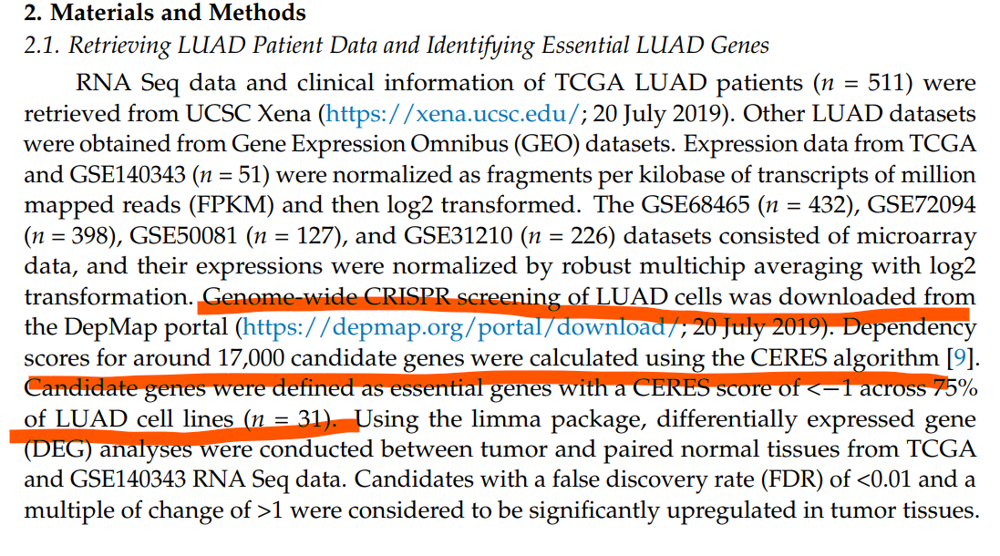
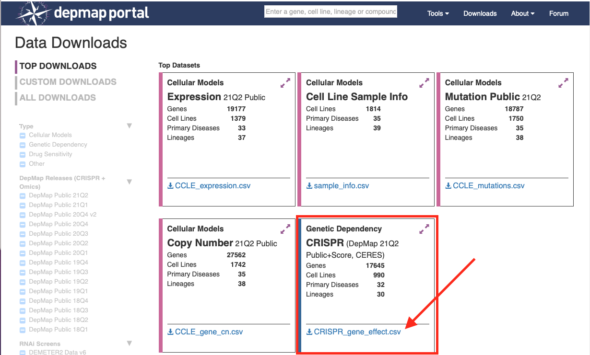

欢迎关注“小丫画图”公众号，回复“小白”，看小视频，实现点鼠标跑代码。

小丫微信: epigenomics  E-mail: figureya@126.com

作者：大鱼海棠，他的更多作品看这里<https://k.koudai.com/OFad8N0w>

单位：中国药科大学国家天然药物重点实验室，生物统计与计算药学研究中心

小丫编辑校验

```{r setup, include=FALSE}
knitr::opts_chunk$set(echo = TRUE)
```

# 需求描述

小丫姐，想众筹下这个算法，利用CRISPR数据库，筛选出某种肿瘤细胞影响生长的基因，再结合TCGA数据库，对湿实验的指导意义非常大。谢谢啦



出自<https://www.mdpi.com/2072-6694/13/9/2128>

# 应用场景

癌症依赖关系图谱（简称DepMap）基于CRISPR screening技术，筛选出对数百种癌细胞生长必需的基因。例文进一步结合TCGA表达数据，给癌症做分子分型。

These findings may allow us to refine the preexisting subtype classification of LUAD, and also guide us in identifying tumors that may be vulnerable to specific treatments.

Figure 1C相关性展示可参考我们之前众筹过的美图<https://mp.weixin.qq.com/s/D9wheY5QdnOh4JrjIc8-Cg>，<https://k.koudai.com/Eig1YOB4>

Figure 1D候选基因功能富集分析结果的展示可参考<https://k.koudai.com/sm2p0xYn>

Figure 2的Consensus clustering可参考FigureYa202consensusGene<https://k.koudai.com/ze0XWeSL>

# 环境设置

使用国内镜像安装包

```{r}
options("repos"= c(CRAN="https://mirrors.tuna.tsinghua.edu.cn/CRAN/"))
options(BioC_mirror="http://mirrors.tuna.tsinghua.edu.cn/bioconductor/")

```

加载包

```{r}
library(data.table)
library(limma)
library(ComplexHeatmap)
library(ClassDiscovery)
library(pheatmap)
Sys.setenv(LANGUAGE = "en") #显示英文报错信息
options(stringsAsFactors = FALSE) #禁止chr转成factor
```

自定义函数

```{r}
# 自定义函数
standarize.fun <- function(indata=NULL, halfwidth=NULL, centerFlag=T, scaleFlag=T) {  
  outdata=t(scale(t(indata), center=centerFlag, scale=scaleFlag))
  if (!is.null(halfwidth)) {
    outdata[outdata>halfwidth]=halfwidth
    outdata[outdata<(-halfwidth)]= -halfwidth
  }
  return(outdata)
}
```

# 输入文件

TCGA-LUAD.htseq_fpkm.tsv.gz，表达矩阵。根据原文从XENA数据平台下载LUAD的FPKM数据，<https://xenabrowser.net/datapages/?dataset=TCGA-LUAD.htseq_fpkm.tsv&host=https%3A%2F%2Fgdc.xenahubs.net&removeHub=https%3A%2F%2Fxena.treehouse.gi.ucsc.edu%3A443>。跟FigureYa238corRiskMut为同一输入文件，也可以从微云下载<https://share.weiyun.com/ks0OVM7a>

gencode.v22.annotation.gene.probeMap，表达数据对应的GENECODE22注释文件。

CRISPR_gene_effect.csv，CRISPR相关信息。下载自DepMap，<https://depmap.org/portal/download/>; CRISPR (DepMap 21Q2 Public+Score, CERES)，也可以从微云下载<https://share.weiyun.com/YTA8nmOE>



sample_info.csv，LUAD细胞系，数据来自<https://depmap.org/portal/download/>; Cell Line Sample Info

```{r}
## TCGA数据
# 加载表达数据
fpkm <- fread("TCGA-LUAD.htseq_fpkm.tsv.gz",sep = "\t",check.names = F,stringsAsFactors = F,header = T,data.table = F)
rownames(fpkm) <- fpkm[,1]; fpkm <- fpkm[,-1]

# 加载基因表达注释文件
Ginfo <- read.table("gencode.v22.annotation.gene.probeMap",sep = "\t",row.names = 1,check.names = F,stringsAsFactors = F,header = T)

# 将FPKM的ENSEMBL ID转为Gene Symbol并去重
identical(rownames(Ginfo),rownames(fpkm))
comgene <- intersect(rownames(fpkm),rownames(Ginfo))
fpkm <- fpkm[comgene,]; Ginfo <- Ginfo[comgene,]
fpkm$Gene <- as.character(Ginfo$gene)
fpkm <- fpkm[!duplicated(fpkm$Gene),] # 重复基因去重
rownames(fpkm) <- fpkm$Gene; fpkm <- fpkm[,-ncol(fpkm)]
fpkm <- as.data.frame(round(fpkm,3)) # 取表达的小数点后3位数

# 提取配对的肿瘤和正常样本
norsam <- colnames(fpkm[,substr(colnames(fpkm),14,16) == "11A"])
tumsam <- colnames(fpkm[,substr(colnames(fpkm),14,16) == "01A"])
toMatch <- substr(norsam,9,12) # 取出中段barcode唯一识别患者
matches <- unique(grep(paste(toMatch,collapse = "|"),  # 在肿瘤样本中匹配正常样本对应的患者
                       tumsam, value = TRUE))
t.code <- substr(matches, start = 1, stop = 12) # 取出前段barcode
n.code <- substr(norsam, start = 1, stop = 12) # 取出前段barcode
com_code <- intersect(t.code, n.code) # 取出相同患者的前段barcode

pair.t.sam <- paste0(com_code, "-01A") # 添加肿瘤的尾部barcode
pair.n.sam <- paste0(com_code, "-11A") # 添加正常的尾部barcode
```


```{r}
## CRISPR screening数据
# 读取CRISPR相关信息
ceres <- fread("CRISPR_gene_effect.csv",check.names = F,stringsAsFactors = F,header = T,data.table = F) 
rownames(ceres) <- ceres[,1]; ceres <- ceres[,-1]
ceres <- as.data.frame(t(ceres))
rownames(ceres) <- sapply(strsplit(rownames(ceres)," ",fixed = T),"[",1)

# 提取LUAD细胞系
ccl.anno <- read.csv("sample_info.csv",row.names = 1,check.names = F,stringsAsFactors = F,header = T) # 数据来自 https://depmap.org/portal/download/; Cell Line Sample Info
ccl.luad <- ccl.anno[which(ccl.anno$Subtype == "Non-Small Cell Lung Cancer (NSCLC), Adenocarcinoma"),] #&
                             #ccl.anno$primary_or_metastasis == "Primary" &
                             #ccl.anno$sample_collection_site == "lung"),]
```

# 提取LUAD细胞系的CRISPR并计算候选基因

CRISPR screening. Project Achilles uses a genome-scale CRISPR-Cas9 tool to individually knock out each gene, thereby **identifying candidates which are critical for cancer survival**. Taking advantage of Project Achilles and RNA sequencing (RNA-Seq) data from LUAD patients, we were able to **pinpoint essential genes responsible for LUAD malignancy**. 

Candidate genes were defined as essential genes with a CERES score of < −1 across 75% of LUAD cell lines (n = 31). 

In total, 693 genes were found to be crucial for maintaining survival in 31 LUAD cell lines

```{r}
ceres.luad <- ceres[,intersect(rownames(ccl.luad), colnames(ceres))]
dim(ceres.luad) # 原文是31个，我这里筛到51个

candidate.genes <- rownames(ceres.luad)[apply(ceres.luad, 1, function(x) {sum(x < -1) > 0.75 * ncol(ceres.luad)})] # CERES值小于-1在超过75%的细胞系中
length(candidate.genes)

candidate.genes <- intersect(rownames(fpkm), candidate.genes)
length(candidate.genes)
```

# TCGA数据中对肿瘤与正常样本做差异表达

These essential genes were used to **classify LUAD patients into different molecular types**. Clinical differences of these molecular types in multiple cohorts were investigated. Additionally, a new subset of patients with distinct prognoses in the TRU subtype was identified using our classification. 

Using the limma package, differentially expressed gene (DEG) analyses were conducted between tumor and paired normal tissues from TCGA and GSE140343 RNA Seq data. Candidates with a false discovery rate (FDR) of <0.01 and a multiple of change of >1 were considered to be significantly upregulated in tumor tissues.

To identify which candidates among these 693 genes were aberrantly expressed in tumor tissues, DEG analyses were carried out to compare tumor tissues with paired normal tissues in TCGA (number of pairs = 59) and GSE140343 (number of pairs = 49) RNA Seq data. Thirty-six of 693 essential genes were significantly upregulated in tumor tissues (with a multiple of change of >1 and an FDR of <0.01) (Figure 1B, Tables S2–S4). 

```{r}
pd <- data.frame(Samples = c(pair.t.sam, pair.n.sam),
                 Group = rep(c("pT","pN"),c(length(pair.t.sam),length(pair.n.sam))),
                 row.names = c(pair.t.sam,pair.n.sam),
                 stringsAsFactors = FALSE)
design <- model.matrix(~ -1 + factor(pd$Group, levels = c("pT","pN")))
colnames(design) <- c("pT","pN")

# 提取候选基因对应的肿瘤vs正常样本表达数据
gset <- fpkm[candidate.genes, pd$Samples]
dim(gset)
gset[1:2,]

# 差异表达分析
fit <- limma::lmFit(gset, design = design);
contrastsMatrix <- limma::makeContrasts(pT - pN, levels = c("pT", "pN"))
fit2 <- limma::contrasts.fit(fit, contrasts = contrastsMatrix)
fit2 <- limma::eBayes(fit2, 0.01)
resData <- limma::topTable(fit2, adjust = "fdr", sort.by = "B", number = 100000)
resData <- as.data.frame(subset(resData, select=c("logFC","t","B","P.Value","adj.P.Val")))
resData$id <- rownames(resData)
colnames(resData) <- c("log2fc","t","B","pvalue","padj","id")
resData$fc <- 2^resData$log2fc
resData <- resData[order(resData$padj),c("id","fc","log2fc","pvalue","padj")]

# 保存到文件
write.table(resData,"limma results between pT and pN regarding CRISPR candidates.txt",sep = "\t",row.names = F,col.names = T,quote = F)
```

# 开始画图

选取差异表达基因绘制热图，看分型效果。

```{r}
degs <- resData[which(resData$padj < 0.01 & resData$log2fc > 1.5),]

annCol <- pd # 样本注释
annColors <- list("Group" = c("pT" = "red","pN" = "steelblue")) # 注释颜色

indata <- as.matrix(gset[degs$id,rownames(annCol)])
plotdata <- standarize.fun(indata, halfwidth = 2) # 数据标准化并截断
hcs <- hclust(distanceMatrix(indata,metric = "euclidean"), method = "ward.D") # 样本聚类

pheatmap(plotdata,
         color = NMF:::ccRamp(x = c("blue","white","red"),n = 64), 
         border_color = NA,
         cluster_rows = T,
         cluster_cols = hcs,
         show_rownames = T,
         show_colnames = F,
         annotation_col = annCol[,"Group",drop = F],
         annotation_colors = annColors,
         treeheight_col = 20,
         treeheight_row = 20,
         cellwidth = 2.5,
         cellheight = 12,
         filename = "heatmap.pdf")
```


# Session Info

```{r}
sessionInfo()
```