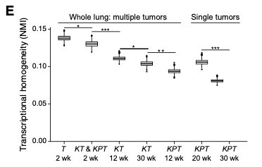
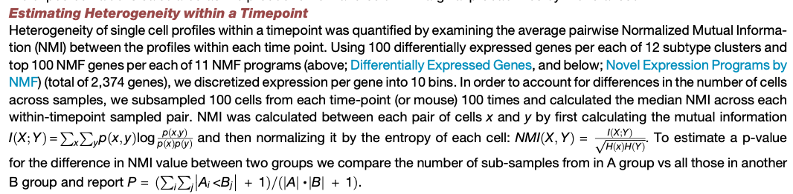

欢迎关注“小丫画图”公众号，回复“小白”，看小视频，实现点鼠标跑代码。

小丫微信: epigenomics  E-mail: figureya@126.com

作者：Jarning，他的更多作品看这里<https://k.koudai.com/BXEtOldY>

小丫编辑校验

```{r setup, include=FALSE}
knitr::opts_chunk$set(echo = TRUE)
```

# 需求描述

求用R实现图1E或者文章中别的Transcriptional homogeneity (NMI)图



出自<https://linkinghub.elsevier.com/retrieve/pii/S1535610820303160>

Figure1. Increased Transcriptional Heterogeneity in Mouse LUAD Evolution Is Reproducible across Individual Tumors and Mice, but Cannot Fully Be Explained by Gene Copy Number Variation

(E) Reduced transcriptional homogeneity within time point with progression. Transcriptional heterogeneity is inversely proportional to the normalized mutual information (NMI) (y axis) between cells within in each sample type (genotype/time point combination, x axis), for either whole lung samples or microdissected single tumors. Boxplots: upper, median, and lower quartile of 1,000 bootstrap samples, of 50 cells each, from the indicated time point; whiskers: 1.5 interquartile range. *p < 0.05, **p < 0.01, ***p < 0.001 (STAR Methods).



# 应用场景

利用单细胞数据评估同一(时间点)肿瘤样本的转录异质性

问题描述：同一个样本有若干个细胞，注意我们测的转录组是单细胞水平的，但是要评估是样本的转录组异质性。因此一个简单的想法是：

- a)如果一个样本中的所有细胞，其距离的方差越大，则样本转录组异质性越高。据此，任何和方差关联的指标，其实都可以用来评估样本的转录组异质性。当然还有其它的指标，比如，
- b)我们可以评估样本内的cluster的多样性，同一样本的cluster越多样，该样本转录异质性越高，这个多样性可以用信息熵来计算。

- 本文作者则采取了互信息(可以理解为两个细胞转录组的相似性)来评估。对每一个样本的细胞进行不放回抽样(100 cells)，然后利用normalized mutual information (NMI)来衡量每对细胞之间的相似性。作者对每个样本进行100次抽样，每次抽样的NMI的中值作为该样本在此次抽样下的transcriptional homogeneity(转录同质性)。最后，作者采用了经验P值来进行显著性分析。

例文的Figure 2D和G，利用cNMF提取expression programs，并通过整合其它已发表的数据，利用Gene set analysis来推断expression programs的生物学意义。做法可参考FigureYa226scRNA_cNMF<https://k.koudai.com/T9Zd8Fu9>

# 环境设置

使用国内镜像安装包

```{r}
options("repos"= c(CRAN="https://mirrors.tuna.tsinghua.edu.cn/CRAN/"))
options(BioC_mirror="http://mirrors.tuna.tsinghua.edu.cn/bioconductor/")

```

加载包

```{r}
library(Seurat)
library(rhdf5)
library(tidyverse)
Sys.setenv(LANGUAGE = "en") #显示英文报错信息
options(stringsAsFactors = FALSE) #禁止chr转成factor
```

# 0. 导入数据

输入数据的微云链接：<https://share.weiyun.com/GqYbpeGV>

## 0.1 cell meta信息

```{r}
genes <- read.csv("data/GSE154989_mmLungPlate_fQC_geneTable.csv")
cells <- read.csv("data/GSE154989_mmLungPlate_fQC_smpTable.csv")
head(genes)
head(cells)
duplicated(genes$ensgID) %>% table
```

```{r}
cells.annot <- read.csv("data/GSE154989_mmLungPlate_fQC_dZ_annot_smpTable.csv")
cells.annot <- cells.annot %>% 
  left_join(cells, by = "sampleID")
row.names(cells.annot) <- cells.annot$sampleID
head(cells.annot)
```

## 0.2 raw counts matrix

```{r}
filename <- "data/GSE154989_mmLungPlate_fQC_dSp_rawCount.h5"

h5ls(file = filename)

i <- h5read(filename, name = "i") %>% as.integer() %>% as.vector()
j <- h5read(filename, name = "j") %>% as.integer() %>% as.vector()
v <- h5read(filename, name = "v") %>% as.vector()

counts <- Matrix::sparseMatrix(i, j, x = v)
counts %>% dim
rownames(counts) <- genes$geneSymbol
colnames(counts) <- cells$sampleID
counts[1:5,1:5]
```

## 0.3 normalized matrix

```{r}
filename <- "data/GSE154989_mmLungPlate_fQC_dSp_normTPM.h5"

h5ls(file = filename)

i <- h5read(filename, name = "i") %>% as.integer() %>% as.vector()
j <- h5read(filename, name = "j") %>% as.integer() %>% as.vector()
v <- h5read(filename, name = "v") %>% as.vector()

TPM <- Matrix::sparseMatrix(i, j, x = v)
TPM %>% dim
TPM <- TPM %>% round(digits = 2)
rownames(TPM) <- genes$geneSymbol
colnames(TPM) <- cells$sampleID
TPM[1:5,1:5]
```

```{r}
seu <- CreateSeuratObject(counts = counts, meta.data = cells.annot)
seu[["RNA"]]@data <- TPM
seu[["tsne"]] <- CreateDimReducObject(embeddings = cells.annot[, c("tSNE_1", "tSNE_2")] %>% as.matrix(), assay = DefaultAssay(seu), key = "tSNE_")
seu[["phate"]] <- CreateDimReducObject(embeddings = cells.annot[, c("phate_1", "phate_2")] %>% as.matrix() * 50, assay = DefaultAssay(seu), key = "phate_")
Idents(seu) <- factor(seu$clusterK12)
DimPlot(seu, group.by = "clusterK12", reduction = "phate")
```


# 1. 选择基因集合(特征选择)

> 选择不同cluster中的特征基因 <br>
Using <br>
1) 100 differentially expressed genes per each of 12 subtype clusters and  <br>
2) top 100 NMF genes per each of 11 NMF programs <br>

## 1.1 cluster特异表达基因

> 这里直接采用作者的计算结果

```{r}
dat <- readxl::read_excel("data/supp/tableS1.xlsx", sheet = "Summary")
head(dat)
de.genes <- unlist(head(dat, n=100)) %>% unique()
length(de.genes)
```

## 1.2 NMF中的特征基因

> 这里也直接采用作者的计算结果

```{r}
dat <- readxl::read_excel("data/supp/tableS2.xlsx", sheet = "Top weighted NMF topic markers")
head(dat)
nmf.genes <- lapply(colnames(dat)[2:ncol(dat)], function(xx) {
  dat %>% arrange(desc(get(xx))) %>% `[[`("Gene Name") %>% head(100)
})

nmf.genes <- unlist(nmf.genes) %>% unique()
length(nmf.genes)
```

```{r}
comb.genes <- c(de.genes, nmf.genes) %>% unique()
length(comb.genes)
```


# 2. 单细胞转录组离散化

> We discretized expression per gene into 10 bins.

分箱算法: <br>
1) 等长分箱(equal width intervals) <br>
2) 等频分箱(equal frequency intervals) <br>
3) 聚类分箱 <br>
4) 卡方分箱 <br>
5) 决策树分箱 <br>

> 这里尚不清楚作者采用了何种分箱算法，我们默认其采用的是`等长分箱`

```{r, fig.width=5, fig.height=5}
row.idx <- rownames(seu[["RNA"]]@data) %in% comb.genes
dat <- seu[["RNA"]]@data[row.idx, ] %>% as.matrix()
dat[1:5, 1:5]

disc.expr <- apply(dat, 2, function(xx) {
  infotheo::discretize(xx, disc = "equalwidth", 10) %>% unlist()
})

rownames(disc.expr) <- rownames(dat)
dat[1:5,1:5]
disc.expr[1:5,1:5]

# 查看分箱结果
plot(dat[,1], col=disc.expr[,1])
```


# 3. 抽样 & 计算NMI

> In order to account for differences in the number of cells across samples, we subsampled 100 cells from each time-point (or mouse) 100 times and calculated the median NMI across each within-timepoint sampled pair.

```{r}
cell.meta <- FetchData(seu, c("sampleID", "mouseID", "timesimple"))
head(cell.meta)
table(cell.meta$timesimple)
```

## 3.1 计算NMI (demo)

互信息(MI)
$$ I(X;Y)=\sum_x\sum_yp(x,y)log(\frac{p(x,y)}{p(x)p(y)}) $$
信息熵
$$ H(X)=\sum_xp(x)log(p(x)) $$

正则化的互信息(NMI)
$$ NMI(X,Y)=\frac{I(X;Y)}{\sqrt{H(X)H(Y)}} $$

这里我们以一对细胞示例NMI的计算

```{r}
require(entropy)

x <- disc.expr[, 1] # discretized transcriptional profile of cell 1 
y <- disc.expr[, 2] # discretized transcriptional profile of cell 2

## 计算p(x), p(y)以及p(x,y)
px <- table(x) %>% freqs.empirical()
py <- table(y) %>% freqs.empirical()
# joint distribusion
pxy <- cbind(x, y) %>% as.data.frame() %>% table %>% freqs.empirical()
## check codes
# rowSums(pxy) - px # all zeros
# colSums(pxy) - py # all zeros

## 信息熵
Hx <- entropy.empirical(px, unit = "log2")
Hy <- entropy.empirical(py, unit = "log2")

## 互信息
mi <- mi.empirical(pxy)

nmi <- mi/sqrt(Hx*Hy)

nmi
```

## 3.2 抽样计算NMI

> In order to account for differences in the number of cells across samples, we subsampled 100 cells from each time-point (or mouse) 100 times and calculated the median NMI across each within-timepoint sampled pair. 

这里是一个例子，用来计算同一(时间点)肿瘤样本抽样的100个细胞所有cell pairs的NMI的中值

```{r}
cells <- rownames(subset(cell.meta, timesimple == "01_T_early_ND"))

## all cell pairs
cell.pairs <- combn(
  x = sample(x = cells, size = 100, replace = FALSE), 
  m = 2, 
  simplify = F
) ## return list: length=C(100,2)=4960

## calculate NMI for all cell pairs: it takes around 30s for 4960 cell pairs
nmi <- function(x,y){
  pxy <- cbind(x, y) %>% as.data.frame() %>% table %>% freqs.empirical()
  px <- rowSums(pxy)
  py <- colSums(pxy)
  Hx <- entropy.empirical(px, unit = "log2")
  Hy <- entropy.empirical(py, unit = "log2")
  mi <- mi.empirical(pxy)
  return(mi/sqrt(Hx*Hy))
}

pbapply::pbsapply(cell.pairs, function(xx) {
  x <- disc.expr[, xx[1]]
  y <- disc.expr[, xx[2]]
  nmi(x,y)
}) %>% median()
```

将上述计算过程写成函数

```{r}
#' @title Calculating median NMI for a given cells.
#' @param X matrix, discrete gene expression matrix. Rows, genes; columns, cells.
#' @param cells vector, selected cells. Match to colnames(X)
#' @param N.cells int, sample size of selected cells.
#' @param seed int, seed for sampling.
#' @param sample.on.cell.pairs bool, whether sample on cell pairs for NMI calculation.
#' @param N.cell.pairs int, sample size of cell pairs for NMI calculation.
#' @return numeric, median NMI
sample.nmi <- function(X, cells, N.cells=100, seed=1, sample.on.cell.pairs=FALSE, N.cell.pairs=100) {
  set.seed(seed)
  cell.pairs <- combn(
    x = sample(x = cells, size = N.cells, replace = FALSE), 
    m = 2, 
    simplify = F)
  if(sample.on.cell.pairs) {
    cell.pairs <- sample(cell.pairs, N.cell.pairs, replace = FALSE)
  }
  sapply(cell.pairs, function(xx) {
    x <- X[, xx[1]]
    y <- X[, xx[2]]
    nmi(x, y)
  }) %>% median()
}

sample.nmi(X = disc.expr, cells = cells, sample.on.cell.pairs = T)
```

100次抽样计算

1次抽样计算(100 cells)大约需要30s，100次抽样计算大约需要50min。这个计算时间成本太高 <br>
两种解决方案： <br>
1) 对cell pairs也进行抽样，降低计算时间 <br>
令sample.nmi()中的sample.on.cell.pairs=TRUE <br>
2) 并行计算 <br>

### 方案一：抽样

#### whole lung: multiple tumors
```{r}
n.cells = 100    # 每次抽样的样本(细胞)数
n.sampling = 100 # 抽样次数

cell.meta <- FetchData(seu, c("sampleID", "mouseID", "timesimple"))

stages <- c("01_T_early_ND", "02_KorKP_early_ND", "04_K_12w_ND", "05_K_30w_ND", "06_KP_12w_ND") # in timesimple field of cell.meta

dat.nmi <- lapply(stages, function(xx) {
  message(paste("Processing", xx, "..."))
  data.frame(
    stages = xx,
    round = 1:n.sampling,
    nmi = pbapply::pbsapply(1:n.sampling, function(yy) 
      sample.nmi(
        X = disc.expr, 
        cells = rownames(subset(cell.meta, timesimple == xx)), 
        N.cells = n.cells, 
        seed = yy, 
        sample.on.cell.pairs = TRUE))
  )
})
dat.nmi <- do.call(rbind, dat.nmi)

saveRDS(dat.nmi, "dat.nmi.rds")
```

#### single tumors
```{r}
table(cell.meta$mouseID)[table(cell.meta$mouseID) > 100]
# 选择细胞数大于100的样本
mouseIDs <- c("KP_20w_ND_m4", "KP_20w_ND_m5", "KP_20w_ND_m6", "KP_30w_ND_m1_T1", "KP_30w_ND_m1_T2", "KP_30w_ND_m1_T4", "KP_30w_ND_m2_T1", "KP_30w_ND_m2_T2", "KP_30w_ND_m3_T1", "KP_30w_ND_m3_T7", "KP_30w_ND_m3_T9")

dat.nmi.2 <- lapply(mouseIDs, function(xx) {
  message(paste("Processing", xx, "..."))
  data.frame(
    stages = xx,
    round = 1:n.sampling,
    nmi = pbapply::pbsapply(1:n.sampling, function(yy) 
      sample.nmi(
        X = disc.expr, 
        cells = rownames(subset(cell.meta, mouseID == xx)), 
        N.cells = n.cells, 
        seed = yy, 
        sample.on.cell.pairs = TRUE))
  )
})
dat.nmi.2 <- do.call(rbind, dat.nmi.2)
saveRDS(dat.nmi.2, "dat.nmi.2.rds")
```

#### plot
```{r}
theme_set(
  theme_classic(base_size = 15) + 
    theme(axis.line = element_line(color="black"),
          axis.text = element_text(color = "black"),
          plot.title = element_text(hjust = .5, face = "bold"),
          panel.grid = element_blank(),
          legend.background = element_rect(fill=alpha('white', 0))
    )
)
```

```{r, fig.width=9, fig.height=5.5}
dat.nmi <- readRDS("dat.nmi.rds")
dat.nmi.2 <- readRDS("dat.nmi.2.rds")
data.use <- rbind(dat.nmi, dat.nmi.2)

segment.y <- 0.18 # 横线的位置
text.y <- 0.183 # 文字的位置

data.use %>% 
  ggplot(aes(stages, nmi)) + 
  labs(x="", y="Transcriptional homogeneity (NMI)") + 
  geom_boxplot(fill = "grey", outlier.shape = NA, width=0.5) + 
  annotate("segment", x = 1, xend = 5, y = segment.y, yend = segment.y) + 
  annotate("segment", x = 6, xend = 16, y = segment.y, yend = segment.y) + 
  annotate("text", x = 3, y = text.y, label="Whole lung: multiple tumors") + 
  annotate("text", x = 11, y = text.y, label="Single tumors") + 
  theme(axis.text.x = element_text(angle=45, hjust = 1))
```

### 方案二：并行计算

并行计算需要`doParallel`包

```{r}
require(doParallel)

## ==== do parallel start ====
## apply for 20 workers
cl <- makeCluster(20) # 设定CPU数量
registerDoParallel(cl)
```


#### whole lung: multiple tumors

```{r}
n.cells = 100    # 每次抽样的样本(细胞)数
n.sampling = 100 # 抽样次数

cell.meta <- FetchData(seu, c("sampleID", "mouseID", "timesimple"))

stages <- c("01_T_early_ND", "02_KorKP_early_ND", "04_K_12w_ND", "05_K_30w_ND", "06_KP_12w_ND") # in timesimple field of cell.meta

dat.nmi <- lapply(stages, function(xx) {
  message(paste("Processing", xx, "..."))
  data.frame(
    stages = xx,
    round = 1:n.sampling,
    nmi = foreach(yy=1:n.sampling, 
                  .combine = "c", 
                  .packages = c("entropy"),
                  .export = c("cell.meta", "n.cells", "disc.expr", "sample.nmi", "%>%", "nmi"))
    %dopar% {
      sample.nmi(
        X = disc.expr, 
        cells = rownames(subset(cell.meta, timesimple == xx)), 
        N.cells = n.cells, 
        seed = yy)
    }
  )
})
dat.nmi <- do.call(rbind, dat.nmi)
saveRDS(dat.nmi, "dat.nmi.parallel.rds")
```

#### single tumors
```{r}
mouseIDs <- c("KP_20w_ND_m4", "KP_20w_ND_m5", "KP_20w_ND_m6", "KP_30w_ND_m1_T1", "KP_30w_ND_m1_T2", "KP_30w_ND_m1_T4", "KP_30w_ND_m2_T1", "KP_30w_ND_m2_T2", "KP_30w_ND_m3_T1", "KP_30w_ND_m3_T7", "KP_30w_ND_m3_T9")

dat.nmi.2 <- lapply(mouseIDs, function(xx) {
  message(paste("Processing", xx, "..."))
  data.frame(
    stages = xx,
    round = 1:n.sampling,
    nmi = foreach(yy=1:n.sampling, 
                  .combine = "c", 
                  .packages = c("entropy"),
                  .export = c("cell.meta", "n.cells", "disc.expr", "sample.nmi", "%>%", "nmi"))
    %dopar% {
      sample.nmi(
        X = disc.expr, 
        cells = rownames(subset(cell.meta, mouseID == xx)), 
        N.cells = n.cells, 
        seed = yy)
    }
  )
})
dat.nmi.2 <- do.call(rbind, dat.nmi.2)
saveRDS(dat.nmi.2, "dat.nmi.2.parallel.rds")
```

```{r}
## close workers (free memory taken up by workers)
stopCluster(cl)
## ==== do parallel end ====
```

#### plot
```{r, fig.width=9, fig.height=5}
dat.nmi <- readRDS("dat.nmi.parallel.rds")
dat.nmi.2 <- readRDS("dat.nmi.2.parallel.rds")
data.use <- rbind(dat.nmi, dat.nmi.2)

segment.y <- 0.17 # 横线的位置
text.y <- 0.172 # 文字的位置

data.use %>% 
  ggplot(aes(stages, nmi)) + 
  labs(x="", y="Transcriptional homogeneity (NMI)") + 
  geom_boxplot(fill = "grey", outlier.shape = NA, width=0.5) + 
  annotate("segment", x = 1, xend = 5, y = segment.y, yend = segment.y) + 
  annotate("segment", x = 6, xend = 16, y = segment.y, yend = segment.y) + 
  annotate("text", x = 3, y = text.y, label="Whole lung: multiple tumors") + 
  annotate("text", x = 11, y = text.y, label="Single tumors") + 
  theme(axis.text.x = element_text(angle=45, hjust = 1))
```


# 4. 计算统计显著性

> To estimate a p-value for the difference in NMI value between two groups we compare the number of sub-samples from in A group vs all those in another B group and report 

$$ P=(\sum_i\sum_j|A_i<B_j|+1)/(|A|\cdot|B|+1) $$

```{r, eval=TRUE}
dat.nmi <- readRDS("dat.nmi.parallel.rds")
dat.nmi.2 <- readRDS("dat.nmi.2.parallel.rds")
data.use <- rbind(dat.nmi, dat.nmi.2)

estimate.P <- function(A,B){
  P <- (sum(sapply(A, function(xx) xx<B))+1)/(length(A)*length(B)+1)
  return(list(p.value=P))
}

stages.use <- c(names(table(dat.nmi$stages)), "KP_20w_ND_m4", "KP_30w_ND_m1_T1")
compare <- data.frame(
  A = c(stages.use[1:4], stages.use[6]),
  B = c(stages.use[2:5], stages.use[7])
) %>% t() %>% as.data.frame() %>% as.list()

sapply(compare, function(xx) {
  x <- subset(data.use, stages==xx[1])$nmi
  y <- subset(data.use, stages==xx[2])$nmi
  estimate.P(x, y)
})
```

# 5. Final plot

```{r, eval=TRUE}
require(ggsignif)

segment.y <- 0.19 # 横线的位置
text.y <- 0.2 # 文字的位置
p.y <- sapply(compare, function(xx) quantile(subset(data.use, stages %in% xx)$nmi, 0.99)) + 0.005 # P值的位置

data.use %>% 
  filter(stages %in% stages.use) %>% 
  ggplot(aes(stages, nmi)) + 
  labs(x="", y="Transcriptional homogeneity (NMI)") + 
  geom_boxplot(fill = "grey", outlier.shape = NA, width=0.5) + 
  ylim(0, 0.2) + 
  annotate("segment", x = 1, xend = 5, y = segment.y, yend = segment.y) + 
  annotate("segment", x = 5.5, xend = 7.5, y = segment.y, yend = segment.y) +
  annotate("text", x = 3, y = text.y, label="Whole lung: multiple tumors", size=5) +
  annotate("text", x = 6.5, y = text.y, label="Single tumors", size=5) + 
  geom_signif(comparisons = compare, 
              y_position = p.y, tip_length = 0,
              test = estimate.P, map_signif_level = T, textsize = 5) + 
  scale_x_discrete(labels=c("T\n2 wk","KT & KPT\n2 wk","KT\n12 wk","KT\n30 wk","KPT\n12 wk","KPT\n20 wk","KPT\n30 wk"))
```

# Session Info

```{r}
sessionInfo()
```