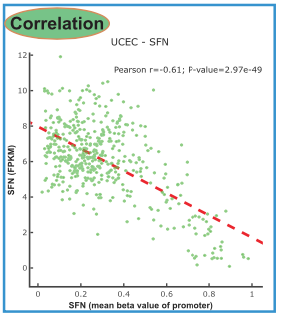
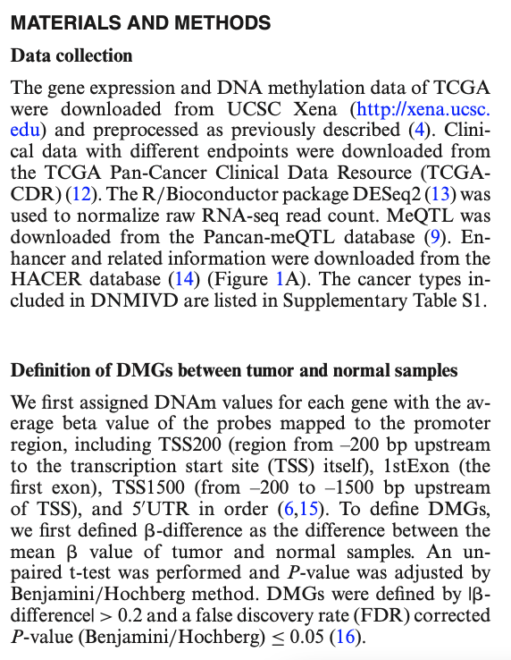

欢迎关注“小丫画图”公众号，回复“小白”，看小视频，实现点鼠标跑代码。

小丫微信: epigenomics  E-mail: figureya@126.com

作者：大鱼海棠，他的更多作品看这里<https://k.koudai.com/OFad8N0w>

单位：中国药科大学国家天然药物重点实验室，生物统计与计算药学研究中心

小丫编辑校验

```{r setup, include=FALSE}
knitr::opts_chunk$set(echo = TRUE)
```

# 需求描述

FPKM跟启动子区甲基化的相关性。输入数据是TCGA的FPKM和DNA甲基化数据。

希望能学习到怎么获取基因启动子区的甲基化探针，自己跑代码时就能灵活自定义将启动子区调整TSS1500，TSS200，甚至分析gene body区域甲基化与基因表达的关系。





出自<https://academic.oup.com/nar/article/48/D1/D856/5584613>

# 应用场景

计算特定基因启动子DNA甲基化与对应表达谱的相关性并绘图。

# 环境设置

使用国内镜像安装包

```{r}
options("repos"= c(CRAN="https://mirrors.tuna.tsinghua.edu.cn/CRAN/"))
options(BioC_mirror="http://mirrors.tuna.tsinghua.edu.cn/bioconductor/")

```

加载包

```{r}
library(TCGAbiolinks)
library(ChAMPdata)
library(data.table)
data(probe.features) # 加载450甲基化探针注释文件

Sys.setenv(LANGUAGE = "en") #显示英文报错信息
options(stringsAsFactors = FALSE) #禁止chr转成factor
```

# 输入文件

TCGA-UCEC.methylation450.tsv.gz，UCEC的DNA甲基化数据，下载自XENA<https://xenabrowser.net/datapages/?dataset=TCGA-UCEC.methylation450.tsv&host=https%3A%2F%2Fgdc.xenahubs.net&removeHub=https%3A%2F%2Fxena.treehouse.gi.ucsc.edu%3A443>。已上传至微云<https://share.weiyun.com/Qn0X57I0>

```{r}
# 加载基因表达注释文件
Ginfo <- read.table("overlapTable27.txt",sep = "\t",row.names = 1,check.names = F,stringsAsFactors = F,header = T)

# 下载UCSC的FPKM数据
tumor <- "UCEC"
expquery <- GDCquery(project = paste0("TCGA-", tumor),
                     data.category = "Transcriptome Profiling",
                     data.type = "Gene Expression Quantification",
                     workflow.type = "HTSeq - FPKM" # 下载FPKM数据
)
GDCdownload(expquery,directory = "GDCdata")
expquery2 <- GDCprepare(expquery,directory = "GDCdata",summarizedExperiment = T)
fpkm <- TCGAanalyze_Preprocessing(expquery2) # 获取表达谱（FPKM值）

# 取出FPKM中的gene
comgene <- intersect(rownames(fpkm),rownames(Ginfo)) # 取出共有基因
Ginfo <- Ginfo[comgene,]
fpkm <- as.data.frame(fpkm[comgene,]) # 取出mRNA的FPKM值
colnames(fpkm) <- substr(colnames(fpkm),1,16) # 取TCGA样本名的前16位
fpkm <- fpkm[,which(substr(colnames(fpkm), 14, 15) == "01")] # 保留肿瘤样本

# 将FPKM的ENSEMBL ID转为Gene Symbol并去重
fpkm$Gene <- as.character(Ginfo$genename)
fpkm <- fpkm[!duplicated(fpkm$Gene),] # 重复基因去重  
rownames(fpkm) <- fpkm$Gene; fpkm <- fpkm[,-ncol(fpkm)]
fpkm <- as.data.frame(round(fpkm,3)) # 取表达的小数点后3位数
fwrite(fpkm,"UCEC_FPKM.txt",sep = "\t",row.names = T,quote = F)

# 读取UCEC的DNA甲基化数据
# 这里为了加快速度，已经对甲基化数据做过处理，只读取符合要求的启动子探针数据，不过代码所做的筛选过程依然有效
meth <- fread("TCGA-UCEC.methylation450.tsv.gz",sep = "\t",check.names = F,stringsAsFactors = F,header = T,data.table = F)
meth <- as.data.frame(meth); rownames(meth) <- meth[,1]; meth <- as.data.frame(na.omit(meth[,-1])) # 去除空值
colnames(meth) <- substr(colnames(meth), start = 1,stop = 16) # 取样本名的前16位
meth <- meth[,which(substr(colnames(meth), 14, 15) == "01")] # 保留肿瘤样本
```

# 计算特点基因启动子表观遗传甲基化与对应表达谱的相关性

```{r}
# 根据需要确定启动子探针
table(probe.features$feature) # 查看背景集里有多少探针feature
table(probe.features$cgi) # 查看背景集里有多少探针region
table(probe.features$feat.cgi) # 查看背景集里有多少探针feature和region的组合

# 可自定义启动子区长度
pb <- rownames(probe.features[which(#probe.features$cgi == "island" & # CpG岛
                                            probe.features$feature %in% c("TSS1500", # from -200 to -1500 bp upstream of TSS
                                                                          "TSS200", # from -200 bp upstream of TSS
                                                                          "1stExone", # the first exon
                                                                          "5'UTR" 
                                                                          ) &
                                              !probe.features$CHR %in% c("X","Y") # 不在性染色体
                                            ),])
submeth <- round(meth[intersect(pb,rownames(meth)),],3)
fwrite(submeth,"UCEC_PromMeth_ProbeLevel.tsv",sep = "\t",row.names = T,quote = F)

# 对重复基因的探针取中位数（比较慢请耐心等待）
submeth$gene <- as.character(probe.features[rownames(submeth),"gene"])
Gmeth <- apply(submeth[,setdiff(colnames(submeth), "gene")], 2, function(x) tapply(x, INDEX=factor(submeth$gene), FUN=median, na.rm=TRUE)) # be patient because this will take a while
Gmeth <- as.data.frame(round(Gmeth,3)) # 取甲基化的小数点后3位数
fwrite(Gmeth,"UCEC_PromMeth_GeneLevel.tsv",sep = "\t",row.names = T,quote = F)

# 取出共有样本
comsam <- intersect(colnames(fpkm),colnames(Gmeth))

# 取出感兴趣基因的表达和启动子甲基化
gene <- "SFN"
corTab <- data.frame(expr = log2(as.numeric(fpkm[gene,comsam]) + 1),
                     meth = as.numeric(Gmeth[gene,comsam]),
                     stringsAsFactors = F)

ct <- cor.test(corTab$expr,corTab$meth)
reg <- lm(expr~meth, data=corTab) # 计算回归线
```

# 开始画图

```{r}
pdf(file = paste0("correlation between expression and methylation of ",gene,".pdf"), width = 4.5,height = 4.5)
par(bty="l", mgp = c(1.5,.33,0), mar=c(3,3,2,2), las=1, tcl=-.25, xpd = F)
plot(corTab$meth,
     corTab$expr,
     xlab = bquote(italic(.(gene))~" (median "~beta~" value of promoter)"), # 添加基因斜体以及希腊字母beta
     ylab = bquote(italic(.(gene))~" (FPKM)"), # 添加基因斜体
     main = bquote(.(tumor)~" - "~italic(.(gene))), # 添加基因斜体
     pch = 19,
     cex = 0.9,
     xaxt = "n", # 不绘制x坐标轴刻度
     xlim = c(0,1),
     col = ggplot2::alpha("#73C485", 0.8))
axis(side = 1, at = seq(0,1,0.2), labels = seq(0,1,0.2)) # 修改x坐标轴
abline(reg, lwd = 2, col = "red", lty = 2) # 添加回归线
legend("topright", # 图例放在右上角
       legend = bquote("Pearson "~rho~"="~.(round(ct$estimate,2))~"; "~italic(P)~"-value="~.(formatC(ct$p.value,3))), # 添加希腊字母rho，p值斜体以及科学计数法
       bty = "n") # 去掉图例边框线
invisible(dev.off())
```


# Session Info

```{r}
sessionInfo()
```