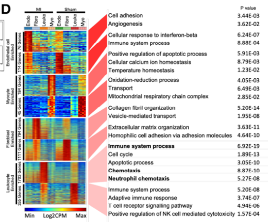

欢迎关注“小丫画图”公众号，回复“小白”，看小视频，实现点鼠标跑代码。

小丫微信: epigenomics  E-mail: figureya@126.com

作者：古潇，他的更多作品看这里<https://k.koudai.com/uH4zuEWC>

小丫编辑校验

```{r setup, include=FALSE}
knitr::opts_chunk$set(echo = TRUE)
```

# 需求描述

只要这张图中间的热图部分。scRNA分不同的cluster鉴定细胞类型；两组之间比较markers的表达高低，调整顺序绘制热图。



出自<https://www.ahajournals.org/doi/10.1161/CIRCULATIONAHA.119.043833>

Figure 1. Neutrophils dominate the heart after myocardial infarction (MI).

D, Gene ontologies of cell-specific differentially expressed genes. The heat maps depict genes ranked by the degree of cell-type specific enrichment. The P value of Gene Ontology enrichment in each gene set is reported. n=4 per sample.

# 应用场景

例文该图用的是bulk RNA-seq数据，小伙伴觉得特适合用来展示单细胞marker基因在多个cluster当中的表达模式。

# 环境设置

使用国内镜像安装包

```{r eval=FALSE}
options("repos"= c(CRAN="https://mirrors.tuna.tsinghua.edu.cn/CRAN/"))
options(BioC_mirror="http://mirrors.tuna.tsinghua.edu.cn/bioconductor/")
install.packages("Seurat")
devtools::install_github("satijalab/seurat-data")
install.packages("colorRamps")
```

加载包

```{r}
library(Seurat)
library(SeuratData)
library(patchwork)
library(RColorBrewer)
library(colorRamps)
library(pheatmap)
library(dplyr)
library(magrittr)
Sys.setenv(LANGUAGE = "en") #显示英文报错信息
options(stringsAsFactors = FALSE) #禁止chr转成factor
```

# 输入文件及前期处理

这里用Seurat的数据，便于小伙伴套用在自己的单细胞数据上。

```{r}
# install dataset
InstallData("ifnb")

# load dataset
LoadData("ifnb")

# ifnb数据集中包含两个样本数据，分别为CTRL和STIM
head(ifnb@meta.data)
table(ifnb@meta.data$stim)
```


```{r}
# 使用splitobject将ifnb数据集分割成两个seurat对象的列表(STIM和CTRL)
ifnb.list <- SplitObject(ifnb, split.by = "stim")

# 对两个数据集单独进行normalize并识别各自的高变异基因
ifnb.list <- lapply(X = ifnb.list, FUN = function(x) {
  x <- NormalizeData(x)
  x <- FindVariableFeatures(x, selection.method = "vst", nfeatures = 2000)
})


# 计算两个数据中排完rank后top2000的高变异基因
features <- SelectIntegrationFeatures(object.list = ifnb.list, nfeatures = 2000)

# 使用上述高变异基因在两个基因集中分别执行PCA
ifnb.list <- lapply(X = ifnb.list, FUN = function(x) {
  x <- ScaleData(x, features = features, verbose = T)
  x <- RunPCA(x, features = features, verbose = T)
})


# 对两个数据集进行整合
# 首先使用findinintegrationanchors函数标识锚点，然后使用IntegrateData函数将两数据集整合在一起
# 可以通过调整k.anchor参数调整两个样本整合的强度，默认为5，数字越大整合强度越强
immune.anchors <- FindIntegrationAnchors(object.list = ifnb.list, anchor.features = features, reduction = "rpca", k.anchor = 20)
immune.combined <- IntegrateData(anchorset = immune.anchors)


# 对整合后的数据进行后续分析
DefaultAssay(immune.combined) <- "integrated"
```

# 常规单细胞流程

```{r}
# 常规流程，scale数据，跑PCA，使用前30个PC进行降维跑UMAP，计算Neighbors，分cluster
immune.combined <- ScaleData(immune.combined, verbose = FALSE)
immune.combined <- RunPCA(immune.combined, npcs = 30, verbose = FALSE)
immune.combined <- RunUMAP(immune.combined, reduction = "pca", dims = 1:30)
immune.combined <- FindNeighbors(immune.combined, reduction = "pca", dims = 1:30)
immune.combined <- FindClusters(immune.combined, resolution = 0.5)
```

# 计算marker基因

```{r}
### 设置分组和细胞类型颜色
colourCount = length(unique(immune.combined@meta.data$stim))
getPalette = colorRampPalette(brewer.pal(3, "Dark2"))
group_color <- getPalette(colourCount)

colourCount = length(unique(immune.combined@meta.data$seurat_annotations))
getPalette = colorRampPalette(brewer.pal(7, "Set2"))
celltype_color <- getPalette(colourCount)

# 可视化
p1 <- DimPlot(immune.combined, reduction = "umap", group.by = "stim", cols=group_color)
p2 <- DimPlot(immune.combined, reduction = "umap", group.by = "seurat_annotations",cols=celltype_color, label = TRUE,repel = TRUE)

pdf("./immune.combined.UMAP.pdf", height = 5,width = 12)
p1 + p2
dev.off()


### 为了后续画图简洁，这里将部分细胞类型进行合并，按照自己数据决定
immune.combined@meta.data$CellType <- ""
immune.combined@meta.data$CellType[which(immune.combined@meta.data$seurat_annotations%in%c("B", "B Activated"))] <- "B_cell"
immune.combined@meta.data$CellType[which(immune.combined@meta.data$seurat_annotations%in%c("CD14 Mono", "CD16 Mono"))] <- "Monocyte"
immune.combined@meta.data$CellType[which(immune.combined@meta.data$seurat_annotations%in%c("CD4 Memory T", "CD4 Naive T", "CD8 T", "T activated"))] <- "T_cell"
immune.combined@meta.data$CellType[which(immune.combined@meta.data$seurat_annotations%in%c("Eryth"))] <- "Eryth"
immune.combined@meta.data$CellType[which(immune.combined@meta.data$seurat_annotations%in%c("Mk"))] <- "Mk"
immune.combined@meta.data$CellType[which(immune.combined@meta.data$seurat_annotations%in%c("NK"))] <- "NK"
immune.combined@meta.data$CellType[which(immune.combined@meta.data$seurat_annotations%in%c("pDC"))] <- "pDC"
immune.combined@meta.data$CellType[which(immune.combined@meta.data$seurat_annotations%in%c("DC"))] <- "DC"


immune.combined@meta.data$CellType_group <- paste(immune.combined@meta.data$CellType, immune.combined@meta.data$stim, sep = "_")

DefaultAssay(immune.combined) <- "RNA"
Idents(immune.combined) <- "CellType_group"

# 开启多核进行计算marker基因
library(future)
plan("multiprocess", workers = 10)

celltype.markers <- FindAllMarkers(immune.combined, only.pos = TRUE, min.pct = 0.25, logfc.threshold = 0.25)


# 筛选用于后续绘图的基因
marker <- subset(celltype.markers, p_val_adj < 0.05 & avg_log2FC>0.5&pct.1>0.5)


celltype <- c("B_cell", "DC", "Eryth", "Monocyte", "NK", "Mk", "pDC", "T_cell")
group <- c("CTRL", "STIM")
```

# 为热图排序

```{r}
# 确定热图按列排布顺序，先分细胞类型，再分group
celltype_group_all <- c()
for (i in group) {
  celltype_group <- paste(celltype, i, sep = "_")
  celltype_group_all <- c(celltype_group_all, celltype_group)
}

select_gene <- unique(as.vector(marker$gene))

Idents(immune.combined) <- "CellType_group"
AveExpression <- AverageExpression(immune.combined, assays = "RNA", 
                                   features = select_gene,verbose = TRUE) %>% .$RNA %>% .[,celltype_group_all]


# 确定热图按行排列顺序，同一细胞类型的group放在一起
group_celltype_all <- c()
for (i in celltype) {
  celltype_group <- paste(i, group, sep = "_")
  group_celltype_all <- c(group_celltype_all, celltype_group)
}

plot_df <- c()
for (i in group_celltype_all) {
  gene <- as.vector(subset(marker,cluster %in% i)$gene)
  avg_df <- AveExpression[gene,]
  plot_df <- rbind(plot_df,avg_df)
}

plot_df <- plot_df[,celltype_group_all]
```

# 开始画图

```{r}
bks <- seq(-2.1, 2.1, by = 0.01)
hmcols <- blue2green2red(length(bks) - 1)

#确定gap
marker$cluster %<>% factor(., levels = group_celltype_all)
marker_num <- table(marker$cluster) %>% as.data.frame
gaps_row_num <- cumsum(marker_num$Freq)

pheatmap(plot_df, cluster_cols = F, cluster_rows = F, 
         show_colnames = T, show_rownames = F,
         color = hmcols,
         border = T, border_color = "white", 
         gaps_row = gaps_row_num, gaps_col = length(celltype),
         breaks = bks,scale = "row", legend_breaks = seq(-2,2,1),
         filename = "CellType_marker_pheatmap.pdf")
```


# 后期处理

输出的pdf文件是矢量图，如果要用代码实现例文那样的连线，可参考FigureYa98的写法，个人认为没必要。如果要用代码添加右侧显著性表格，可参考FigureYa165heatmapPvalue的写法。

下图是用illustrator编辑后的效果：


# Session Info

```{r}
sessionInfo()
```