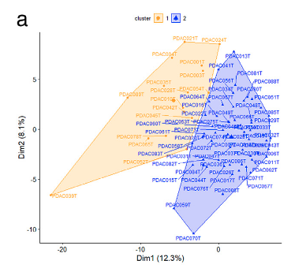

欢迎关注“小丫画图”公众号，回复“小白”，看小视频，实现点鼠标跑代码。

小丫微信: epigenomics  E-mail: figureya@126.com

作者：Jarning，他的更多作品看这里<https://k.koudai.com/BXEtOldY>

小丫编辑校验

```{r setup, include=FALSE}
knitr::opts_chunk$set(echo = TRUE)
```

# 需求描述

基因聚类，然后在图上标注出来。不用说要跟原文一个数据吧，只要输入数据得出类似的图就行。



出自<https://www.sciencedirect.com/science/article/pii/S2352396421003340?via%3Dihub>

Fig. 1. Prognostic stratification of PDAC through their GT gene expression profile (a, b) and clinical features of patients with their PDAC molecular profiles (c, d). 
(a) Biplot of the HCPC analysis result based on RNA-seq data of 74 PDAC and 169 GT genes.

# 应用场景

看这里<https://mp.weixin.qq.com/s/kNHM5teMRtL2dSZXzm4m8w>，带你看透文章里的PCA图的小心机。

# 环境设置

使用国内镜像安装包

```{r eval=FALSE}
options("repos"= c(CRAN="https://mirrors.tuna.tsinghua.edu.cn/CRAN/"))
options(BioC_mirror="http://mirrors.tuna.tsinghua.edu.cn/bioconductor/")
install.packages("factoextra")
devtools::install_github("cmartin/ggConvexHull")
install.packages("ggrepel")
```

加载包

```{r}
library(tidyverse)
library(factoextra)
library(ggConvexHull)
Sys.setenv(LANGUAGE = "en") #显示英文报错信息
options(stringsAsFactors = FALSE) #禁止chr转成factor
```

# 输入文件

easy_input.csv，表达矩阵，每行一个基因，每列一个sample。

```{r}
data2 <- read.csv("easy_input.csv", header = T, row.names = 1)
data2[1:2,]

## kmeans by row. 注意kmean函数是按照行进行聚类的，因此这里需要进行转置，input matrix行为样本，列为特征(基因)
k2 <- kmeans(
  x = t(data2), #如果你的数据是行为sample，列为基因，就不需要转置
  centers = 2 # 设置聚类数量
)

## PCA by row，prcomp函数的input matrix同kmeans
pca <- prcomp(t(data2))
```

# 开始画图

## 方法一: 调用factoextra包

```{r, fig.width=5, fig.height=5}
p <- fviz_pca_ind(
  X = pca, 
  repel = T, 
  geom = c("point", "text"), # 如果不想要文字标记,去掉text即可
  habillage = k2$cluster, # 添加分组信息
  legend.title = "cluster", # 图例标题
  mean.point = FALSE, # 是否添加聚类中心
  palette = c("red","blue"), # change color, map to col.ind
  pointsize = 2.5, # 点的大小
  addEllipses = TRUE, # 添加外边框
  ellipse.type = "convex", # 外边框类型, 凸多边形"convex"
  axes.linetype = "blank", # hide zerolines
  ggtheme = theme_classic(base_size = 15) # ggplot主题
)
# remove text legend
p <- p + guides(color = guide_legend(override.aes = aes(label = "")))
# theme
p + theme(
  legend.position = "top",
  plot.title = element_blank(),
  axis.text = element_text(color = "black")
)

ggsave("PCA_factoextra.pdf")
```

## 方法二: ggplot

准备数据

```{r}
data.use <- as.data.frame(pca$x[, c("PC1", "PC2")])
data.use$cluster <- factor(k2$cluster)
data.use$name <- rownames(data.use)

vars.percent <- pca$sdev^2 / sum(pca$sdev^2) # 计算不同主成分解释的数据方差
dims <- c(1,2) # 选择PC1和PC2进行可视化
xlab <- paste0("Dim1 (", round(vars.percent[dims[1]]*100, 1), "%)")
ylab <- paste0("Dim2 (", round(vars.percent[dims[2]]*100, 1), "%)")
colors.use <- c("red", "blue")
```

画图

```{r, fig.width=5, fig.height=5}
ggplot(data.use, aes(PC1, PC2, shape=cluster, color=cluster)) + 
  geom_point(size = 2.5) + 
  ggConvexHull::geom_convexhull(aes(fill=cluster), alpha = 0.15) + 
  ggrepel::geom_text_repel(
    aes(label=name), 
    size = 3, 
    max.iter = 2000, # 如果样本太多，text overlap无法解决，可以增大max.iter参数
    show.legend = F) + 
  scale_color_manual(values = colors.use) + 
  scale_fill_manual(values = colors.use) + 
  labs(x = xlab, y = ylab) + 
  theme_classic(base_size = 15) + 
  theme(
    legend.position = "top",
    plot.title = element_blank(),
    axis.text = element_text(color = "black")
  )

ggsave("PCA_ggplot2.pdf")
```

# Session Info

```{r}
sessionInfo()
```