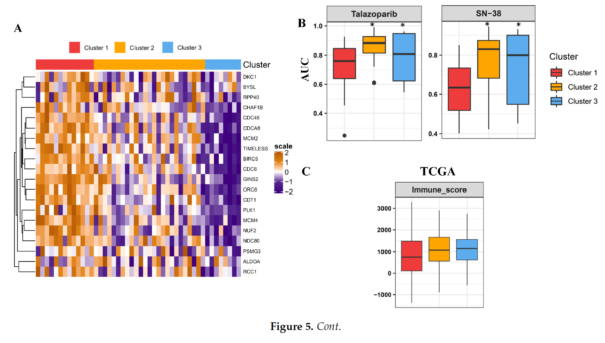

欢迎关注“小丫画图”公众号，回复“小白”，看小视频，实现点鼠标跑代码。

小丫微信: epigenomics  E-mail: figureya@126.com

作者：大鱼海棠，他的更多作品看这里<https://k.koudai.com/OFad8N0w>

单位：中国药科大学国家天然药物重点实验室，生物统计与计算药学研究中心

小丫编辑校验

```{r setup, include=FALSE}
knitr::opts_chunk$set(echo = TRUE)
```

# 需求描述

想众筹图5A B, 首先对TCGA数据集进行聚类分析，之后将GDSC细胞系按照TCGA聚类结果进行分组，分组后比较分组的药物敏感性，用AUC定量分析。



出自<https://www.mdpi.com/2072-6694/13/9/2128>

Figure 5. Drug discovery and immune characterization in essential gene-classified clusters of lung adenocarcinoma (LUAD).
(A) Heatmap showing essential gene-stratified-clusters exhibiting distinct expressions in GDSC lung cancer cells. 
(B) Drug response area under the receiver operator characteristics curve (AUC) of SN-38 and talazoparib within essential geneclassified clusters demonstrated as a boxplot.

To identify **drugs** that exhibited distinct **efficacy in essential gene-classified clusters**, the prediction model was applied to the GDSC database (Figure 5A). Areas under the receiver operator characteristics curve (AUC) of drug responses within clusters were compared. Totally, the GDSC database contains 367 compounds. Only 257 compounds which were tested on more than 75% of the LUAD cell lines were used for analyses (Tables S8 and S9). AUCs of **SN-38, a topoisomerase I inhibitor, and talazoparib, a poly(ADP ribose) polymerase (PARP) inhibitor, were significantly lower in cluster 1 LUAD cells** (Figure 5B). This suggested that cluster 1 tumors with highly proliferative signatures were vulnerable to drugs targeting DNA-replication mechanisms. 

# 应用场景

跟FigureYa240CRISPR是同一篇文章，FigureYa240CRISPR用CRISPR screening数据库找到肺癌细胞存活必需的31个基因，推演到TCGA数据库，发现这些基因在TCGA癌症vs正常时的确差异显著。

> 这又有什么意义呢？能指导临床吗？

这次从TCGA表达谱分出的亚型推演到GDSC数据库里的细胞系，由此推出各亚型的药物敏感性。

# 环境设置

使用国内镜像安装包

```{r}
options("repos"= c(CRAN="https://mirrors.tuna.tsinghua.edu.cn/CRAN/"))
options(BioC_mirror="http://mirrors.tuna.tsinghua.edu.cn/bioconductor/")
install.packages("lolR")
```

加载包

```{r}
library(pheatmap)
library(data.table)
library(ConsensusClusterPlus)
library(ComplexHeatmap)
library(lolR)
library(impute)
library(ggplot2)
library(ggpubr)
Sys.setenv(LANGUAGE = "en") #显示英文报错信息
options(stringsAsFactors = FALSE) #禁止chr转成factor
```

自定义函数

```{r}
standarize.fun <- function(indata=NULL, halfwidth=NULL, centerFlag=T, scaleFlag=T) {
  outdata=t(scale(t(indata), center=centerFlag, scale=scaleFlag))
  if (!is.null(halfwidth)) {
    outdata[outdata>halfwidth]=halfwidth
    outdata[outdata<(-halfwidth)]= -halfwidth
  }
  return(outdata)
}
```

# 输入文件

大文件已上传至微云<https://share.weiyun.com/AW2ZOfhr>，建议小伙伴亲自去官网下载。

TCGA-LUAD.htseq_fpkm.tsv.gz，TCGA-LUAD的表达谱数据以及基因注释，源于<https://xenabrowser.net/datapages/?dataset=TCGA-LUAD.htseq_fpkm.tsv&host=https%3A%2F%2Fgdc.xenahubs.net&removeHub=https%3A%2F%2Fxena.treehouse.gi.ucsc.edu%3A443>

细胞系数据下载自DepMap，<https://depmap.org/portal/download/>：

- CCLE_RNAseq_rsem_genes_tpm_20180929.txt.gz，细胞系表达谱数据，源于<https://depmap.org/portal/download/api/download?file_name=ccle%2Fccle_2019%2FCCLE_RNAseq_rsem_genes_tpm_20180929.txt.gz&bucket=depmap-external-downloads>

- Cell_lines_annotations_20181226.txt，细胞系信息数据，源自<https://depmap.org/portal/download/api/download?file_name=ccle%2Fccle_2019%2FCell_lines_annotations_20181226.txt&bucket=depmap-external-downloads>

- sanger-dose-response.csv，GDSC细胞系药物敏感性数据源自<https://depmap.org/portal/download/api/download?file_name=processed_portal_downloads%2Fgdsc-drug-set-export-658c.5%2Fsanger-dose-response.csv&bucket=depmap-external-downloads>

```{r}
# 加载TCGA-LUAD数据并处理
luad.expr <- fread("TCGA-LUAD.htseq_fpkm.tsv.gz",sep = "\t",check.names = F,stringsAsFactors = F,header = T,data.table = F)
rownames(luad.expr) <- luad.expr$Ensembl_ID; 
luad.expr <- luad.expr[,setdiff(colnames(luad.expr),"Ensembl_ID")]
Ginfo <- read.delim("gencode.v22.annotation.gene.probeMap",sep = "\t",row.names = 1,check.names = F,stringsAsFactors = F,header = T)

comgene <- intersect(rownames(luad.expr),rownames(Ginfo)) # 取出表达谱和基因注释的相同基因
luad.expr <- luad.expr[comgene,]
Ginfo <- Ginfo[comgene,]
luad.expr$gene <- Ginfo$gene
luad.expr <- luad.expr[!duplicated(luad.expr$gene),]; rownames(luad.expr) <- luad.expr$gene; luad.expr <- luad.expr[,setdiff(colnames(luad.expr),"gene")] # 去重

tumsam <- colnames(luad.expr)[substr(colnames(luad.expr),14,16) == "01A"] # 提取TCGA-LUAD的肿瘤样本
```

# TCGA数据分型 - 无监督共识聚类

使用原文定义的36个essential genes（筛选基因的方法可参考FigureYa240CRISPR），为TCGA的patient进行无监督共识聚类（consensus clustering），这里分成3个亚型，然后画个热图看效果。

```{r}
# 设置颜色
red <- "#E53837"
blue <- "#6AADF0"
yellow <- "#F7A400"
heatmap.BLYW <- c("#3F047D","white","#B05900")

genes <- c("NUF2","GINS1","TOP2A","CDC6","NDC80","RRM2",
           "CCNA2","KIF11","PRC1","BUB1B","CDCA8","TPX2",
           "PLK1","CDC45","CDC20","BIRC5","ECT2","PCNA",
           "CHAF1B","TIMELESS","GINS2","ORC6","CDT1","MCM2",
           "MCM4","RCC1","BOP1","ALDOA","PSMG3","DKC1",
           "HSPD1","BYSL","RPP40","SNRPE","HSPE1","CCT3")

indata <- luad.expr[genes,tumsam]
cc <- ConsensusClusterPlus(d = as.matrix(indata),
                           maxK = 3, # 最大3类
                           reps = 1000, # 1000次扰动
                           pItem = 0.95, # 每次对基因进行95%重抽样
                           clusterAlg = "pam", # 采用PAM算法
                           seed = 19991018,
                           title = ".",
                           plot = "pdf")

group <- paste0("Cluster",cc[[3]]$consensusClass); names(group) <- tumsam # 取出三个亚型的结果
group <- sort(group) # 按照类排序
```

画个热图看分型效果

```{r}
plotdata <- standarize.fun(indata[,names(group)],halfwidth = 2) # 绘图数据标准化（z-score并将绝对值超过2的数值截断）

annCol.tcga <- data.frame(Cluster = as.character(group), # 构建样本注释
                          row.names = names(group),
                          stringsAsFactors = F)
annColors <- list("Cluster" = c("Cluster1" = red,"Cluster2" = yellow,"Cluster3" = blue)) # 构建颜色注释

# 绘制热图
pheatmap(plotdata,
         color = NMF:::ccRamp(x = heatmap.BLYW,n=64), # 原文颜色模版
         annotation_col = annCol.tcga[colnames(plotdata),,drop = F],
         annotation_colors = annColors,
         cluster_cols = FALSE, # 样本不聚类，按照亚型顺序排列
         cluster_rows = TRUE, # 行聚类
         border_color = NA,
         treeheight_row = 20, # 修改行树高
         cellheight = 10, # 修改每个单元的高度
         cellwidth = 0.6, # 修改每个单元的宽度
         show_rownames = TRUE, # 显示行名
         show_colnames = FALSE, # 不显示列名
         filename = "heatmap of essential genes in tcga luad.pdf")
```


# 细胞系数据处理

筛选出同时具有药敏数据和表达数据的LUAD细胞系

```{r}
## 读取细胞系注释文件
ccle.anno <- read.delim("Cell_lines_annotations_20181226.txt",sep = "\t",row.names = 1,check.names = F,stringsAsFactors = F,header = T)
ccle.anno <- ccle.anno[which(ccle.anno$tcga_code == "LUAD" & ccle.anno$Hist_Subtype1 == "adenocarcinoma"),] # 选取LUAD并且病理亚型为腺癌的样本（和原文的数量有些出入，也许是我对病理亚型理解不到位）

## 读取细胞系药敏并匹配DepmapID
gdsc <- fread("sanger-dose-response.csv",check.names = F,stringsAsFactors = F,header = T,data.table = F)
gdsc <- gdsc[,c("ARXSPAN_ID","DRUG_NAME","AUC_PUBLISHED")] # 提取细胞系的DepmapID（细胞系编号），药物名以及对应AUC值
gdsc.auc <- reshape(gdsc, idvar = "ARXSPAN_ID", timevar = "DRUG_NAME", direction = "wide") # 将long型数据转换为wide型数据
rownames(gdsc.auc) <- gdsc.auc$ARXSPAN_ID; gdsc.auc <- gdsc.auc[,-1]
colnames(gdsc.auc) <- gsub("AUC_PUBLISHED.","",colnames(gdsc.auc),fixed = T) # 生成行为细胞系，列为药物，入值为AUC的矩阵

comdep <- intersect(rownames(gdsc.auc),ccle.anno$depMapID) # 取出有药敏并且为LUAD的细胞系
gdsc.auc <- gdsc.auc[comdep,]
rmdrug <- colnames(gdsc.auc)[apply(gdsc.auc,2, function(x) {sum(is.na(x)) > 0.10 * length(comdep)})] # 获得要去除的药物（去除药敏在大于10%的样本中药物（原文是25%））
gdsc.auc <- gdsc.auc[,setdiff(colnames(gdsc.auc),rmdrug)]  # 去掉这些药物
gdsc.auc <- as.data.frame(impute.knn(t(gdsc.auc))$data) # 对剩余空值进行KNN填补

index <- match(colnames(gdsc.auc),ccle.anno$depMapID) # 将DepmapID和细胞系名称匹配
colnames(gdsc.auc) <- rownames(ccle.anno)[index] # 替换DepmapID

## 读取细胞系表达谱
ccle.expr <- fread("CCLE_RNAseq_rsem_genes_tpm_20180929.txt.gz",sep = "\t",check.names = F,stringsAsFactors = F,header = T,data.table = F)
rownames(ccle.expr) <- ccle.expr$gene_id
ccle.expr <- ccle.expr[,-c(1:2)]; rownames(ccle.expr) <- sapply(strsplit(rownames(ccle.expr),".",fixed = T),"[",1) # ENSEMBL ID的匹配
Ginfo2 <- Ginfo; rownames(Ginfo2) <- sapply(strsplit(rownames(Ginfo2),".",fixed = T), "[",1)
comgene <- intersect(rownames(ccle.expr),rownames(Ginfo2))
ccle.expr <- ccle.expr[comgene,]
Ginfo2 <- Ginfo2[comgene,]
ccle.expr$gene <- Ginfo2$gene
ccle.expr <- ccle.expr[!duplicated(ccle.expr$gene),]; rownames(ccle.expr) <- ccle.expr$gene; ccle.expr <- ccle.expr[,setdiff(colnames(ccle.expr),"gene")] # 去重

## 筛选同时具有药敏和表达的LUAD细胞系
comccle <- intersect(intersect(rownames(ccle.anno),colnames(ccle.expr)),colnames(gdsc.auc)) # 筛选同时具有表达和药敏的LUAD细胞系
comgene <- intersect(genes,rownames(ccle.expr))
ccle.expr <- log2(ccle.expr[comgene,comccle] + 1) # 表达谱取对数
ccle.anno <- ccle.anno[comccle,]
```

# 构建nearest centroid classifier，给细胞系分型

构建nearest centroid classifier，然后用classifier预测GDSC细胞系数据，让细胞系按照TCGA分型结果分成对应的三组。

```{r}
# 中位数中心化
#indata <- sweep(luad.expr[comgene,names(group)], 1, apply(luad.expr[comgene,names(group)], 1, median))
```

原文采用中心化来构建预测模型，但是我这里的结果不是很好，所以换用z-score标准化的结果。

```{r}
indata <- t(scale(t(luad.expr[comgene,names(group)]))) #z-score标准化

# 构建nearest centroid classifier
classifier <- lol.classify.nearestCentroid(t(indata), as.numeric(factor(group))) 

#testdata <- sweep(ccle.expr[comgene,], 1, apply(ccle.expr[comgene,], 1, median))
testdata <- t(scale(t(ccle.expr)))

# 在细胞系应用classifier
ccle.group <- paste0("Cluster",predict(classifier, t(testdata))); names(ccle.group) <- colnames(testdata) 
ccle.group <- sort(ccle.group) # 将预测的亚型排序
```

画个热图看效果

```{r}
plotdata <- standarize.fun(ccle.expr[,names(ccle.group)],halfwidth = 2) # 绘图数据标准化

annCol.ccle <- data.frame(Cluster = as.character(ccle.group), # 构建细胞系的样本注释
                          row.names = names(ccle.group),
                          stringsAsFactors = F)
pheatmap(plotdata,
         color = NMF:::ccRamp(x = heatmap.BLYW,n=64),
         annotation_col = annCol.ccle[colnames(plotdata),,drop = F],
         annotation_colors = annColors,
         cluster_cols = FALSE,
         cluster_rows = TRUE,
         border_color = NA,
         treeheight_row = 20,
         cellheight = 10,
         cellwidth = 10,
         show_rownames = TRUE,
         show_colnames = FALSE,
         filename = "heatmap of essential genes in ccle luad.pdf")
```


# 药物敏感性的Kruskal检验

计算GDSC细胞系各亚型对每种药物的敏感性，输出统计结果并画图。

由GDSC细胞系各亚型的敏感性结果可以反推出TCGA各亚型对药物对敏感性。

```{r}
outTab <- NULL
for(drug in rownames(gdsc.auc)) {
  tmp <- data.frame(auc = as.numeric(gdsc.auc[drug,names(ccle.group)]),
                    group = as.character(ccle.group))
  avg <- with(tmp, tapply(auc, group, mean)) # 得到各亚型的AUC均值
  kt <- kruskal.test(auc~group, data = tmp) # kruskal检验
  outTab <- rbind.data.frame(outTab,
                             data.frame(drug = drug,
                                        avg1 = avg[1],
                                        avg2 = avg[2],
                                        avg3 = avg[3],
                                        pvalue = kt$p.value,
                                        stringsAsFactors = F),
                             stringsAsFactors = F)

  if(kt$p.value < 0.05) {
    message(drug," pass statistical significance...")

    # 将通过显著性检验的药物绘制箱型图
    p <- ggplot(tmp, aes(group, auc, fill=group)) +
      geom_boxplot(outlier.shape = NA) +
      geom_point(shape = 21, size=2,
                 position = position_jitterdodge(),
                 aes(color=group), alpha = 0.6) +
      scale_fill_manual(values = c(red,yellow,blue)) +
      scale_color_manual(values = c(red,yellow,blue)) +
      xlab(NULL) + ylab(paste0("AUC of ", drug)) +
      theme_bw() +
      theme(axis.text.x = element_blank(),
            axis.text.y = element_text(size = 10, color = "black"),
            axis.ticks.x = element_blank(),
            panel.background = element_blank(),
            panel.grid = element_blank(),
            legend.position = "right",
            legend.title = element_blank()) +
      stat_compare_means(method = "kruskal.test", 
                         label.y = 0.98) # 根据自己的数据调整文字所在的位置，或者用AI等矢量图软件打开PDF文件，调整文字位置
    ggsave(filename = paste0("boxplot of estimated auc in ",drug,".pdf"), 
           width = 4,height = 3.5)
  }
}
drugs <- outTab[outTab$pvalue < 0.05, "drug"]

write.table(outTab, file = "output_kruskal test of estimated auc among cell lines.txt",sep = "\t",row.names = F,col.names = T,quote = F)
```


# Session Info

```{r}
sessionInfo()
```