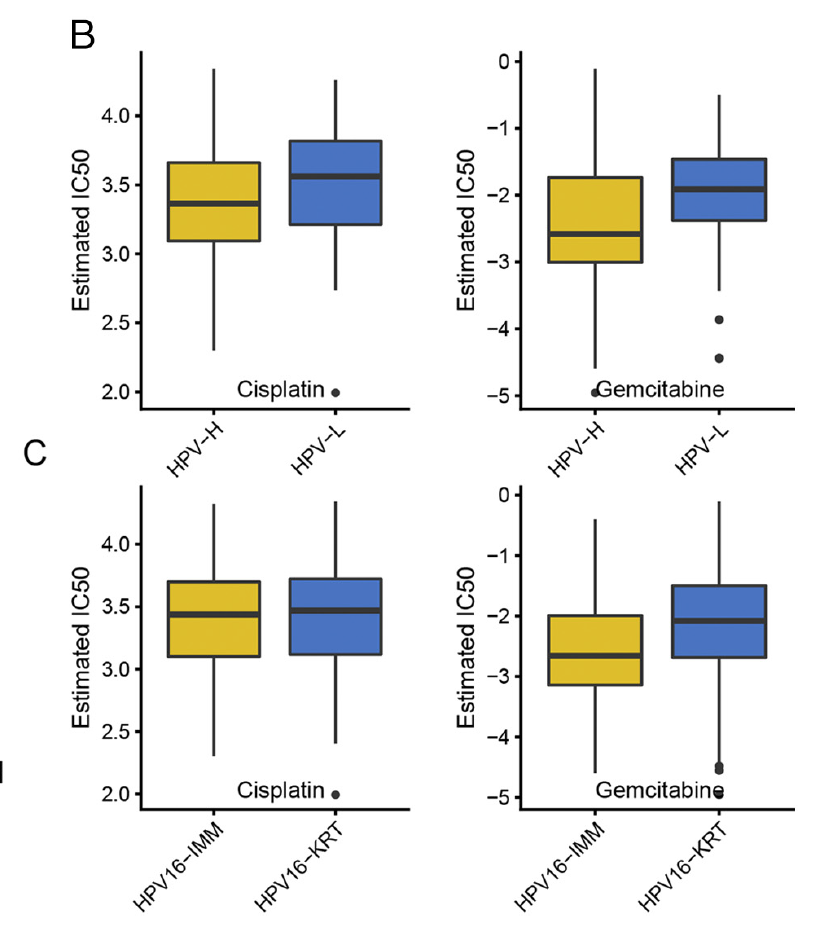

欢迎关注“小丫画图”公众号，回复“小白”，看小视频，实现点鼠标跑代码。

小丫微信: epigenomics  E-mail: figureya@126.com

作者：大鱼海棠，他的更多作品看这里<https://k.koudai.com/OFad8N0w>

单位：中国药科大学国家天然药物重点实验室，生物统计与计算药学研究中心

小丫编辑校验

```{r setup, include=FALSE}
knitr::opts_chunk$set(echo = TRUE)
```

# 需求描述

想众筹一下刚出的oncoPredict包的用法。pRRophetic包的升级版，表达谱药物敏感性评估的。用FigureYa105GDSC的输入文件，画出同一类型的图。



出自<https://www.sciencedirect.com/science/article/pii/S1476558619301307>

**注意：**由于包含原文数据，若涉及到注释文件亚型及其他相关数据的使用，请引用：
Lu X, Jiang L, Zhang L, et al. Immune Signature-Based Subtypes of Cervical Squamous Cell Carcinoma Tightly Associated with Human Papillomavirus Type 16 Expression, Molecular Features, and Clinical Outcome[J]. Neoplasia, 2019, 21(6): 591-601.

# 应用场景

发布oncoPredict包的文章<https://academic.oup.com/bib/advance-article/doi/10.1093/bib/bbab260/6321360>

oncoPredict包把三个方法包装成三个函数：GLDS, calcPhenotype and IDWAS，官方用法文档看这里：<https://cran.r-project.org/web//packages/oncoPredict/index.html>

This functionality (指的是calcPhenotype函数) is similar to our original **pRRophetic** package [13] but has been overhauled to enable faster implementation, provides **updated CTRP and GDSC screening data** and allows for increased user customization. 

这里采用oncoPredict包里的calcPhenotype函数来**通过细胞系表达谱预测肿瘤样本药物敏感性**。

> oncoPredict和pRRopetic的异同：

- 从算法角度看起来oncoPredict和pRRopetic没什么区别，只是更快了一些。
- oncoPredict可以通过细胞系表达谱预测肿瘤样本药物敏感性。
- 对于不使用自定义细胞系表达/药敏的小伙伴来说，pRRopetic包会更友好，内置GDSC数据。pRRophetic的用法可参考FigureYa105GDSC，根据GDSC细胞系表达谱和TCGA基因表达谱构建岭回归模型预测药物IC50。
- FigureYa212drugTarget也用了pRRophetic。根据PRISM和CTRP2.0药物敏感性AUC值数据、以及CCLE表达谱数据，预测TCGA亚组潜在性治疗药物。不同于FigureYa105GDSC，这个数据是药物敏感性AUC值，以及药物的范围更加广泛。

还可以不用这两个R包，从TCGA表达谱分出的亚型推演到GDSC数据库里的细胞系，由此推出各亚型的药物敏感性，可参考FigureYa246supervisedGDSC。

或者使用在线工具CMap，任何感兴趣的差异基因都可以用CMap分析得到靶向干性特征的潜在化合物/抑制剂，可参考FigureYa131CMap。

自己的数据，可以都跑跑看。

# 环境设置

使用国内镜像安装包

```{r}
options("repos"= c(CRAN="https://mirrors.tuna.tsinghua.edu.cn/CRAN/"))
options(BioC_mirror="http://mirrors.tuna.tsinghua.edu.cn/bioconductor/")
BiocManager::install("sva")
```

加载包

```{r}
# library(oncoPredict) # 这里我没有加载因为这个包依赖R版本>4.1.0，并且这个包提供的三个函数不是相互依赖的，所以我直接加载药敏预测的函数
source("CALCPHENOTYPE.R") # 如果安装了包就加载包，这个函数是需要自己提供细胞系表达谱以及对应药物的敏感性数据的，其实pRRophetic这个包也可以做，这篇BIB其实也表明函数是“similar”的，但是貌似在运算上做了优化，会更快一些。
library(sva)
library(preprocessCore)
library(ridge)
library(glmnet)
library(car)
library(tidyverse)
library(impute)
library(ggplot2)
library(cowplot)
Sys.setenv(LANGUAGE = "en") #显示英文报错信息
options(stringsAsFactors = FALSE) #禁止chr转成factor
```

# 输入文件

## 测试集数据

用的是FigureYa105GDSC的输入数据：

easy_input_expr.txt，基因表达矩阵。

easy_input_anno.txt，分组信息。示例数据里的C1和C2分别对应"HPV16-IMM"和"HPV16-KRT"。也可以是按某个基因的突变类型分组、或按某个基因表达量高低分组。

这两个文件的sample ID必须一致。

```{r}
#表达矩阵
dat <- read.table("easy_input_expr.txt",sep = "\t",row.names = 1,header = T,stringsAsFactors = F,check.names = F)
dat[1:3, 1:3]

#分组信息
ann <- read.table("easy_input_anno.txt",sep = "\t",row.names = 1,header = T,stringsAsFactors = F,check.names = F)
head(ann)
table(ann$ImmClust)

# 构建测试集数据
testingExprData <- as.matrix(dat[,rownames(ann)])
```

## 药敏数据

```{r}
# 注意原文给出的示例数据非常小，我估计并不是完整的细胞系表达和药敏数据
# 原文说可以做GDSC和CTRP，但包并不像pRRophetic那样内置了一些数据
# 所以请下载自己想用的细胞系表达和对应药敏，具体可参考FigureYa212drugTarget
# 这里我只使用示例数据来运行药敏程序，并解释数据结构，方便小伙伴使用自定义的数据

# 准备数据1：细胞系表达
trainingExprData <- readRDS(file='GDSC2_Expr_short.rds') # 数据类型为矩阵，细胞系表达是行为基因，列为细胞系，入值为表达谱的矩阵，表达谱需做log2标准化

# 准备数据2：细胞系对应药敏
trainingPtype <- readRDS(file = "GDSC2_Res.rds") # 数据类型为矩阵，细胞系药敏是行为细胞系，列为药物，入值为药物敏感性的矩阵，数据一般存在NA，需要过滤或进行填补
trainingPtype <- trainingPtype[,apply(trainingPtype, 2, function(x) {sum(is.na(x)) < 0.2 * nrow(trainingPtype)})] # 去除在超过20%样本中都缺失的药物
trainingPtype <- trainingPtype[apply(trainingPtype, 1, function(x) {sum(is.na(x)) < 0.2 * ncol(trainingPtype)}),] # 去除在超过20%药物中都缺失的样本
trainingPtype <- t(impute.knn(t(trainingPtype))$data) # KNN填补缺失值
trainingPtype <- exp(trainingPtype) # 这里根据数据特点做指数化，因为原始数据是经过取对数的，但CALCPHENOTYPE.R会做一步power transformation，因此避免重复，这里还原数据规模
```

# 构建模型并预测

用到calcPhenotype函数

This function implements the pipeline for the prediction of clinical chemotherapeutic response by using only baseline tumor gene expression data.

```{r}
# 下面介绍这个函数中的其他参数
# batchCorrect选项: "eb"对应ComBat, "qn"对应quantiles normalization, "standardize", 以及 "none"
# "eb" 在使用微阵列数据做训练集（细胞系），并且应用到微阵列测试集（临床样本）时比较有效
# "standardize" 在使用微阵列数据做训练集（细胞系），但应用在RNA-seq测试集（临床样本）时比较有效
batchCorrect <- "eb" # 但我的测试集是标准化的RNA-seq，和芯片信号强度类似，所以依然选择eb

# 是否进行power transform选项：默认进行
powerTransformPhenotype <- TRUE

# 低变异基因过滤阈值选项：默认为0.2
removeLowVaryingGenes <- 0.2

# 在过滤基因时候采用的数据类型选项：'homogenizeData' （批次效应消除后的数据）或 'rawData'（原始数据）
removeLowVaringGenesFrom <- "homogenizeData"

# 确定最小训练样本数目（一般不存在这个问题因为GDSC，CTRP，PRISM都有很多细胞系）
minNumSamples <- 10

# 确定如何处理重复基因选项： -1是询问用户, 1 取均值, 以及 2 移除重复
selection <- 1

# 确定是否打印结果选项：默认进行
printOutput <- FALSE # 这里我不进行，免得最终markdown文件很长，自己运行的时候可以改为TRUE看到进度

# 确定是否采用PCA对基因表达进行降维选项：默认不进行
# 注意，如果选项report_pca = TRUE则上述选项必须为TRUE
pcr <- FALSE
report_pc <- FALSE

# 确定是否需要列出相关性结果来确定潜在的药物biomarker（个人觉得没有必要，药物靶标的搜寻可以参考FigureYa212drugTarget，这里的做法过于“简单粗暴”）
cc <- FALSE

# 确定是否要输入模型的拟合优度值R^2（细胞系训练集的模型回代到训练集的预测结果之间的吻合程度）
rsq <- FALSE # 想虐一下自己看看模型准确度的可以改为TRUE

# 确定在pcr=TRUE时，主成份分析需要达到的解释度，默认80，即所得到的主成份的解释度相加要大于80%
percent <- 80

# 构建模型并预测，该函数会在当前目录下生成calcPhenotype_Output，并且将药敏预测结果输入该目录，名为：DrugPredictions.csv
calcPhenotype(trainingExprData = as.matrix(trainingExprData), # 函数会自己匹配细胞系表达和药敏的共有样本
              trainingPtype = trainingPtype, # 但如果要选用特殊的细胞系类型，比如“生殖系统”、“消化系统”等，需要提前对细胞系做预筛选，函数不提供该操作
              testExprData = as.matrix(testingExprData),
              batchCorrect = batchCorrect,
              powerTransformPhenotype = powerTransformPhenotype,
              removeLowVaryingGenes = removeLowVaryingGenes,
              minNumSamples = minNumSamples,
              selection = selection,
              printOutput = printOutput,
              pcr = pcr,
              removeLowVaringGenesFrom = removeLowVaringGenesFrom,
              report_pc = report_pc,
              cc = cc,
              percent = percent,
              rsq = rsq)
```

到这里这个包预测药敏的内容就结束了，下面的内容只是出个图看看，所有阈值、检验方法或者出图样式均可自行调整。

# 开始画图

这里我做两样本检验，看哪些药物的敏感性有显著差异。

```{r}
drugsen <- read.csv("./calcPhenotype_Output/DrugPredictions.csv",row.names = 1,check.names = F,stringsAsFactors = F,header = T)
outTab <- NULL
for (drug in colnames(drugsen)) {
  tmp <- data.frame(sen = drugsen[,drug],
                    group = ann[rownames(drugsen),"ImmClust"],
                    row.names = rownames(drugsen),
                    stringsAsFactors = F)
  
  avg <- as.numeric(by(tmp$sen, tmp$group, mean))
  wt <- wilcox.test(sen~group,data = tmp)
  
  outTab <- rbind.data.frame(outTab,
                             data.frame(drug = drug,
                                        avg1 = avg[1],
                                        avg2 = avg[2],
                                        p = wt$p.value,
                                        stringsAsFactors = F),
                             stringsAsFactors = F)
}
outTab$fc <- outTab$avg2/outTab$avg1
outTab$log2fc <- log2(outTab$fc)

# 把统计结果输出到文件
write.table(outTab,"output_wilcox test for potential drugs.txt",sep = "\t",row.names = F,col.names = T,quote = F)
```

接下来就可以对预测出的数据绘图了，可以使用热图或者箱型图等等，这里模仿FigureYa105GDSC输出箱型图。

```{r}
# 设置颜色
jco <- c("#EABF00", "#2874C5")

plotp <- list()
GCP.drug <- outTab[which(outTab$p < 0.05 & outTab$log2fc > 1),"drug"] # 这是我随便选取的阈值，控制药物数目

for (drug in GCP.drug) {
  
  predictedBoxdat <- data.frame("response" = drugsen[rownames(ann),drug],
                                "Group" = ann$ImmClust, 
                                 row.names = rownames(ann)) 
  # 绘图
  p <- ggplot(data = predictedBoxdat, aes(x=Group, y=response))
  p <- p + geom_boxplot(aes(fill = Group)) + 
    scale_fill_manual(values = jco[1:length(unique(predictedBoxdat$Group))]) + #自定义box的配色
    theme_classic() +
    theme(legend.position="none") + # 倾斜字体
    theme(axis.text.x = element_text(angle = 45, hjust = 1,size = 12), plot.title = element_text(size = 12, hjust = 0.5)) + 
    xlab("") + ylab("Drug sensitivity") + # 这里可能是AUC，可能是IC50，根据具体情况调整
    ggtitle(drug) # 补上title

  # 每种药物的结果画到一个单独的文件里
  ggsave(paste("boxplot of", drug, "sensitivity.pdf"), width = 4, height = 5)
  plotp[[drug]] <- p # 保存在列表里供合并图片用
}

# 合并图片
p <- plot_grid(plotlist = plotp,nrow = 2) # title可以AI下拉到合适位置，就如例文所示
p
ggsave("boxplot of predicted drug sensitivity.pdf", width = 6, height = 5)
```

# Session Info

```{r}
sessionInfo()
```