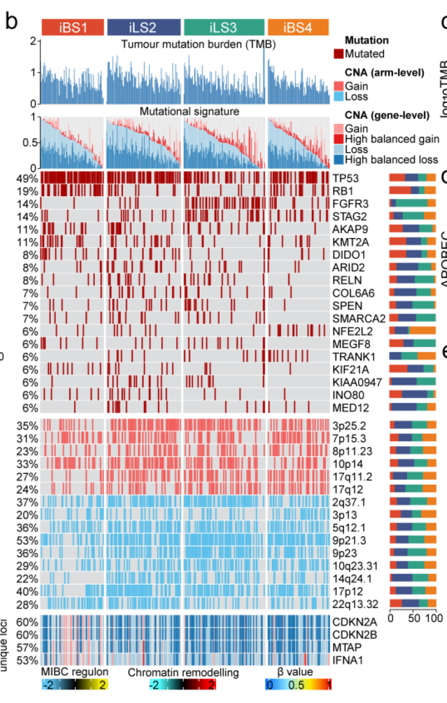

欢迎关注“小丫画图”公众号，回复“小白”，看小视频，实现点鼠标跑代码。

小丫微信: epigenomics  E-mail: figureya@126.com

作者：大鱼海棠，他的更多作品看这里<https://k.koudai.com/OFad8N0w>

单位：中国药科大学国家天然药物重点实验室，生物统计与计算药学研究中心

小丫编辑校验

```{r setup, include=FALSE}
knitr::opts_chunk$set(echo = TRUE)
```

# 需求描述

大鱼海棠写的MOVICS包很神奇，一个包几乎就画出了分子分型文章的大部分图。大鱼海棠写的这篇预印本最近已接收，刚好可以作为MOVICS包的应用案例。接下来会连续众筹这篇文章里的几个图。

Figure2b的突变综合性热图，看起来非常酷炫。里头涉及的分析在以前的众筹里也有，包括TMB计算，突变signature，突变频数，拷贝数变异情况等等。如果大鱼老师可以随便拟定数据画图也可以！



出自<https://www.biorxiv.org/content/10.1101/2021.05.30.446369v1.full>

Figure 2. Molecular landscape of four MIBC iCSs.
b) Genomic alteration landscape according to iCS. Samples are ordered by the combined contribution of APOBEC-related mutational signatures (SBS2 + SBS13) with each iCS. Tumour mutation burden (TMB), relative contribution of four mutational signatures, selected differentially mutated genes (>5%) and broad-level copy number alterations (>20%), and selected genes located within chromosome 9p21.3 are shown from the top to the bottom panels. The proportion of iCS in each alteration is presented in the right bar charts.

# 应用场景

这里用complexheatmap绘制mutation landscape，图中同时展示了各亚型的突变01矩阵、突变频数、突变signature、拷贝数。这种组合热图也可以用于其他类型数据的合并展示。

- 突变频数TMB可参考FigureYa51TMB的mutation-load.txt，TCGA的TMB，来源于2018年的这篇文献：The Immune Landscape of Cancer <https://pubmed.ncbi.nlm.nih.gov/29628290/>，我们直接拿来用就好。
- 突变签名可参考FigureYa110mutationSignature。
- 更多分析、展示突变、拷贝数的FigureYa看这里<https://k.koudai.com/gZBI0YzR>

文中很多图我们都众筹过，例如：

- Figure 1b的画法可参考FigureYa196PanPie
- Figure 3de可产考FigureYa25sankey和FigureYa125Fishertest
- Figure 4f可参考FigureYa106immunotherapy，4h可参考<https://k.koudai.com/Eig1YOB4>
- Figure 5b可参考FigureYa12box，f可参考FigureYa162boxViolin
- Figure 6可参考FigureYa35batch_bestSeparation，FigureYa144DiagHeatmap或<https://mp.weixin.qq.com/s/34WRZRBVPHUNRLlzNH2nzw>

接下来会继续众筹Figure2a和3a，欢迎添加小丫为好友（微信ID：epigenomics），查看朋友圈，关注后续众筹进展。

# 环境设置

使用国内镜像安装包

```{r}
options("repos"= c(CRAN="https://mirrors.tuna.tsinghua.edu.cn/CRAN/"))
options(BioC_mirror="http://mirrors.tuna.tsinghua.edu.cn/bioconductor/")

```

加载包

```{r}
library(ComplexHeatmap)
library(RColorBrewer)

Sys.setenv(LANGUAGE = "en") #显示英文报错信息
options(stringsAsFactors = FALSE) #禁止chr转成factor
```

# 输入文件

```{r}
## 突变二值矩阵
mut <- read.table("mutation.txt",sep = "\t",row.names = 1,check.names = F,stringsAsFactors = F,header = T)

## 突变频数
tmb <- read.table("TMB.txt",sep = "\t",row.names = 1,check.names = F,stringsAsFactors = F,header = T)

## 突变签名
mutsig <- read.csv("mutationsignature.cosmic2013.csv",row.names = 1,check.names = F,stringsAsFactors = F,header = T)
# 或者换成下面这行，读取FigureYa110mutationSignature的输出文件mutsig.weightMatrix.txt
# mutsig <- read.table("mutsig.weightMatrix.txt", row.names = 1, header = T) 

## 拷贝数GISTIC2.0结果（利用SNP segment文件在GenePattern上获得）
cna.region <- read.table("all_lesions.conf_90.txt",sep = "\t",row.names = 1,check.names = F,stringsAsFactors = F,header = T)
cna.gene <- read.table("all_thresholded.by_genes.txt",sep = "\t",row.names = 1,check.names = F,stringsAsFactors = F,header = T)

## 亚型数据
subt <- read.table("subtype.txt",sep = "\t",row.names = 1,check.names = F,stringsAsFactors = F,header = T)
```

# 开始画图

整个图形由热图、热图上方注释（包括柱形图和瀑布图）、热图右侧百分比堆积图组成。自上而下分别是：

- 突变负荷柱状图，Tumour mutation burden (TMB)
- 突变签名瀑布图，relative contribution of four mutational signatures
- 突变基因热图，selected differentially mutated genes (>5%)
- 拷贝数热图1，broad-level copy number alterations (>20%)
- 拷贝数热图2，selected genes located within chromosome 9p21.3

```{r}
# 设置亚型颜色
clust.col <- c("#DD492E","#40548A","#32A087","#EC7D21")
blue   <- "#5bc0eb"
red    <- "#f25f5c"

# 处理突变签名数据
mutsig <- mutsig[,c("Signature.1","Signature.2","Signature.5","Signature.13")] # 文章中用到3种类型的signature， SBS1 (age-related), SBS2 and SBS13 (APOBEC activity-related) and SBS5 (ERCC2 mutation-related)
mutsig$APOBEC <- mutsig$Signature.2 + mutsig$Signature.13 # APOBEC相关的签名由签名2和3叠加
mutsig$CMOIC <- subt[rownames(mutsig),"CMOIC"] # 添加亚型结果
mutsig <- mutsig[order(mutsig$CMOIC,-mutsig$APOBEC,decreasing = F),] # 确定整个热图的排序，按照亚型升序以及APOBEC降序排列
```

## 突变主区域热图 （分析结果来自突变二值矩阵以及突变签名分析） #

```{r}
# 挑选要展示的基因
mutgene <- c("FGFR3",
             "TP53",
             "RB1",
             "NFE2L2",
             "KIAA0947",
             "MEGF8",
             "STAG2",
             "SMARCA2",
             "RELN",
             "INO80",
             "TRANK1",
             "SPEN",
             "MED12",
             "KMT2A",
             "COL6A6",
             "AKAP9",
             "KIF21A",
             "ARID2",
             "DIDO1")

# 制作oncoprint的输入数据
onco.input <- mut[mutgene,rownames(mutsig),]
onco.input[onco.input == 1] <- "Mutated" # 二值矩阵中1记为突变
onco.input[onco.input != "Mutated"] <- "" # 非“突变”给予空值
alter_fun = list(
  background = function(x, y, w, h) {
    grid.rect(x, y, w-unit(0.5, "mm"), h-unit(0.5, "mm"), gp = gpar(fill = "#dcddde", col = "#dcddde"))
  },
  Mutated = function(x, y, w, h) {
    grid.rect(x, y, w-unit(0.5, "mm"), h-unit(0.5, "mm"), gp = gpar(fill = "#A60000", col = "#A60000")) 
  }
)
col = c("Mutated" ="#A60000") # 突变颜色，注意这里只给了主图像的图例

my_ann <- subt[rownames(mutsig),,drop = F]
my_annotation = HeatmapAnnotation(df = my_ann, 
                                  col = list(CMOIC = c("CS1" = clust.col[1],
                                                       "CS2" = clust.col[2],
                                                       "CS3" = clust.col[3],
                                                       "CS4" = clust.col[4])))

# 突变主区域的上部注释（突变负荷柱状图）
top_anno <- anno_barplot(as.numeric(tmb[rownames(mutsig),"log10TMB"]),
                         border = FALSE,
                         gp = gpar(fill = "#3379B4",border =NA,lty="blank"), 
                         height = unit(2.5, "cm"))

# 突变主区域的上部注释（突变签名柱状图）
tmp <- mutsig[,c("Signature.2","Signature.13","Signature.1","Signature.5")] # 只取和APOBEC有关的签名
tmp$Others <- 1 - rowSums(tmp) # 计算其他签名的比例
top_anno2 <- anno_barplot(as.matrix(tmp),
                          border = FALSE,
                          gp = gpar(fill = c(brewer.pal(6,"Paired")[c(2,1,6,5)],"grey90"), 
                                    border = NA, # 无边框
                                    lty = "blank"),
                          height = unit(2, "cm")) # 高度

tmp <- as.data.frame(t(mut[mutgene,rownames(mutsig),]))
mut.order <- names(sort(colSums(tmp),decreasing = T)) # 根据突变频数高低排序展示突变的顺序
tmp$CMOIC <- subt[rownames(tmp),"CMOIC"]
pct <- NULL # 计算各个基因突变的百分比
for (i in mut.order) {
  tmp1 <- tmp[,c(i,"CMOIC")]
  tmp1 <- as.data.frame.array(table(tmp1[,1],tmp1$CMOIC))[2,]/sum(tmp1[,1])
  pct <- rbind.data.frame(pct,tmp1)
}
rownames(pct) <- mut.order

# 添加右侧百分比堆积柱状图
right_anno <- anno_barplot(as.matrix(pct),
                           which = "row",
                           border = FALSE,
                           gp = gpar(fill = clust.col,border=NA,lty="blank"), 
                           bar_width = 0.6,
                           width = unit(1.8, "cm"),
                           height = unit(1, "cm"))

op1 <- oncoPrint(onco.input[mut.order,rownames(my_ann)], # 排序的突变矩阵
                 alter_fun = alter_fun,  # 主区域的函数，包括各单元格大小、背景颜色等等
                 col = col, # 突变颜色
                 bottom_annotation = NULL, # 无底部注释
                 top_annotation = c(HeatmapAnnotation(TMB = top_anno), # 顶部第一个注释：TMB
                                    my_annotation, # 顶部第二个注释：亚型
                                    HeatmapAnnotation(MutSig = top_anno2)), # 顶部第三个注释：突变签名
                 column_order = rownames(my_ann), # 样本的排序，根据突变签名的顺序
                 right_annotation = rowAnnotation(PCT = right_anno), # 右侧堆叠柱状图注释
                 show_pct = T, # 展示左侧的百分比
                 column_title = "", # 不显示主题
                 show_heatmap_legend = T, # 展示图例
                 column_split = my_ann$CMOIC, # 根据亚型切分热图
                 column_title_gp = gpar(fontsize = 8),
                 row_names_gp = gpar(fontsize = 8),
                 column_names_gp = gpar(fontsize = 8))
op1
```

## 拷贝数主区域热图1 （分析结果来自GISTIC2.0） #

```{r}
# 选择要展示的拷贝数区域
lesion.sig <- c("3p25.2-Amp",
                "7p15.3-Amp",
                "8p11.23-Amp",
                "10p14-Amp",
                "17q11.2-Amp",
                "17q12-Amp",
                "2q37.1-Del",
                "3p13-Del",
                "5q12.1-Del",
                "9p23-Del",
                "9p21.3-Del",
                "10q23.31-Del",
                "14q24.1-Del",
                "17p12-Del",
                "22q13.32-Del")

cna <- cna.region[1:(nrow(cna.region)/2),c(1,8,9:(ncol(cna.region)-1))] # 选取有效列
rownames(cna) <- paste0(gsub(" ","",cna$Descriptor),"-", substr(rownames(cna),1,3)) # 重命名行以确定扩增和缺失的位点
cna.modified <- cna[1:nrow(cna),3:ncol(cna)]
onco.input2 <- cna.modified[lesion.sig,rownames(mutsig)] # 选取要展示的拷贝数变异
tmp1 <- onco.input2[1:6,] # 前6个为扩增
tmp1[tmp1 == 1] <- "Gain" # 数值大于0即为Gain
tmp1[tmp1 == 2] <- "Gain"
tmp1[tmp1 == 0] <- ""

tmp2 <- onco.input2[7:15,] # 后9个为缺失
tmp2[tmp2 == 1] <- "Loss"
tmp2[tmp2 == 2] <- "Loss"
tmp2[tmp2 == 0] <- ""
onco.input2 <- rbind.data.frame(tmp1,tmp2)

alter_fun2 = list(
  background = function(x, y, w, h) {
    grid.rect(x, y, w-unit(0.5, "mm"), h-unit(0.5, "mm"), gp = gpar(fill = "#dcddde", col = "#dcddde"))
  },
  Gain = function(x, y, w, h) {
    grid.rect(x, y, w-unit(0.5, "mm"), h-unit(0.5, "mm"), gp = gpar(fill = red, col = red)) 
  },
  Loss = function(x, y, w, h) {
    grid.rect(x, y, w-unit(0.5, "mm"), h-unit(0.5, "mm"), gp = gpar(fill = blue, col = blue)) 
  }
)
col2 = c("Gain" = red,
         "Loss" = blue)
# 确定展示的顺序（看自己喜好，我这里是按照臂的顺序来的）
lesion.order <- c("3p25.2-Amp","7p15.3-Amp","8p11.23-Amp","10p14-Amp","17q11.2-Amp","17q12-Amp",
                  "2q37.1-Del","3p13-Del","5q12.1-Del","9p21.3-Del","9p23-Del","10q23.31-Del","14q24.1-Del","17p12-Del","22q13.32-Del")
tmp <- as.data.frame(t(cna.modified[lesion.order,rownames(mutsig),]))
tmp[tmp > 0] <- 1 # 所有大于1的均改为1以便计算变异频数
tmp$CMOIC <- as.character(subt[rownames(tmp),"CMOIC"])
pct <- NULL
for (i in lesion.order) {
  tmp1 <- tmp[,c(i,"CMOIC")]
  tmp1 <- as.data.frame.array(table(tmp1[,1],tmp1$CMOIC))[2,]/sum(tmp1[,1])
  pct <- rbind.data.frame(pct,tmp1)
}
rownames(pct) <- lesion.order

# 右侧堆叠百分比柱状图
right_anno2 <- anno_barplot(as.matrix(pct),
                            which = "row",
                            border = FALSE,
                            gp = gpar(fill = clust.col,
                                      border = NA,
                                      lty = "blank"), 
                            bar_width = 0.6,
                            width = unit(1.8, "cm"),
                            height = unit(1, "cm"))

# 同样的方式绘制热图
op2 <- oncoPrint(onco.input2[lesion.order,rownames(my_ann)], 
                 alter_fun = alter_fun2, 
                 col = col2, 
                 bottom_annotation = NULL, 
                 top_annotation = NULL,
                 column_order = rownames(my_ann),
                 right_annotation = rowAnnotation(PCT = right_anno2),
                 row_order = lesion.order, 
                 show_pct = T,
                 column_title = "", 
                 show_heatmap_legend = T, 
                 column_split = my_ann$CMOIC,
                 column_title_gp = gpar(fontsize = 8),
                 row_names_gp = gpar(fontsize = 8),
                 column_names_gp = gpar(fontsize = 8))
op2
```

## 拷贝数主区域热图2 （分析结果来自GISTIC2.0） #

```{r}
cna <- cna.gene
cna <- cna[c("IFNA1","MTAP","CDKN2A","CDKN2B"),rownames(mutsig)] # 文章筛选了4个基因
onco.input3 <- cna
# 由于上面的分析中缺失的部分不存在High balanced loss，所以直接让2也属于Gain而没有添加High balanced gain
# 这里小伙伴如果自己的数据满足要求，上面的拷贝数也可以分为4类
onco.input3[onco.input3 == 1] <- "Gain"
onco.input3[onco.input3 == 2] <- "High_balanced_gain"
onco.input3[onco.input3 == 0] <- ""
onco.input3[onco.input3 == -1] <- "Loss"
onco.input3[onco.input3 == -2] <- "High_balanced_loss"

alter_fun3 = list(
  background = function(x, y, w, h) {
    grid.rect(x, y, w-unit(0.5, "mm"), h-unit(0.5, "mm"), gp = gpar(fill = "#dcddde", col = "#dcddde"))
  },
  Gain = function(x, y, w, h) {
    grid.rect(x, y, w-unit(0.5, "mm"), h-unit(0.5, "mm"), gp = gpar(fill = brewer.pal(6,"Paired")[5], col = brewer.pal(6,"Paired")[5])) 
  },
  High_balanced_gain = function(x, y, w, h) {
    grid.rect(x, y, w-unit(0.5, "mm"), h-unit(0.5, "mm"), gp = gpar(fill = brewer.pal(6,"Paired")[6], col = brewer.pal(6,"Paired")[6]))
  },
  Loss = function(x, y, w, h) {
    grid.rect(x, y, w-unit(0.5, "mm"), h-unit(0.5, "mm"), gp = gpar(fill = brewer.pal(6,"Paired")[1], col = brewer.pal(6,"Paired")[1])) 
  },
  High_balanced_loss = function(x, y, w, h) {
    grid.rect(x, y, w-unit(0.5, "mm"), h-unit(0.5, "mm"), gp = gpar(fill = brewer.pal(6,"Paired")[2], col = brewer.pal(6,"Paired")[2]))
  }
)
col3 = c("Gain" = brewer.pal(6,"Paired")[5],
         "High_balanced_gain" =brewer.pal(6,"Paired")[6],
         "Loss" = brewer.pal(6,"Paired")[1],
         "High_balanced_loss" =brewer.pal(6,"Paired")[2])

op3 <- oncoPrint(onco.input3[,rownames(my_ann)], 
                 alter_fun = alter_fun3,  
                 col = col3, 
                 bottom_annotation = NULL, 
                 top_annotation = NULL,
                 column_order = rownames(my_ann), 
                 right_annotation = NULL,
                 show_pct = T, 
                 column_title = "", 
                 show_heatmap_legend=T, 
                 column_split = my_ann$CMOIC,
                 column_title_gp = gpar(fontsize = 8),
                 row_names_gp = gpar(fontsize = 8),
                 column_names_gp = gpar(fontsize = 8))
op3

# 构建额外图例
lgd.mutsig = Legend(labels = c("SBS2","SBS13","SBS1","SBS5","Others"), 
                    title = "MutSig", 
                    legend_gp = gpar(fill = c(brewer.pal(6,"Paired")[c(2,1,6,5)],"grey90")))

lgd.cna.region = Legend(labels = c("Gain","Loss"), 
                    title = "CNA (arm-level)", 
                    legend_gp = gpar(fill = c(red,blue)))
                    
lgd.cna.gene = Legend(labels = c("Gain","High_balanced_gain","Loss","High_balanced_loss"), 
                        title = "CNA (gene-level)", 
                        legend_gp = gpar(fill = brewer.pal(6,"Paired")[c(5,6,1,2)]))              

lgd_list <- list(lgd.mutsig, lgd.cna.region, lgd.cna.gene)

# 合并热图
pdf("mutational landscape in TCGA.pdf", width = 10,height = 10)
draw(op1 %v% op2 %v% op3, # 垂直叠加热图
     annotation_legend_list = lgd_list) # 添加自定义的图例
invisible(dev.off())
```


# 写在后面

我使用complexheatmap还没有那么熟练，也许还存在其他参数优化热图，但目前我没有做到，如果熟练的小伙伴可以在此技术上修缮代码。

1. 最明显的不足是右侧堆叠柱状图的长度不同，可能由于行名不等长引起的，但是由于最终排版，没有足够的位置让我把名字和百分比全部放到左边，因此依然保留了把名字放在右侧。最后我是通过AI把横向百分比柱状图拉到相同长度的；

2. 顶部亚型注释之所以在第二个位置，是因为如果在第一个位置，那个TMB和MutSig之间将会没有任何空隙，很难从AI中拉出一部分距离来填补文字，所以我这里把亚型注释放在第二位，最后通过AI拖动到顶部，并且在间隙处填补了文字；

3. 同样是右侧的堆叠柱状图，由于每个注释都有名字，所以上面的PCT会出现在下面柱状图的背景里，这里是用AI去掉的，不知道有没有参数可以隐藏名字。

# Session Info

```{r}
sessionInfo()
```