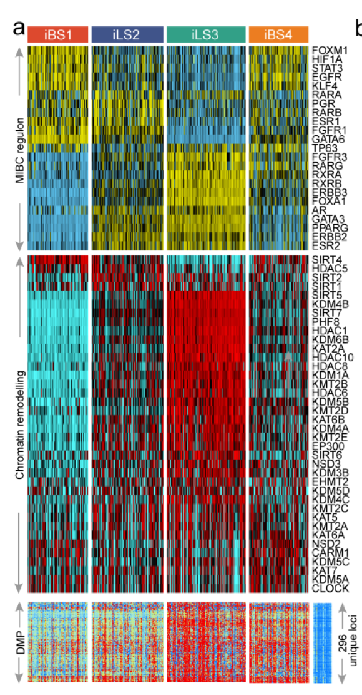

欢迎关注“小丫画图”公众号，回复“小白”，看小视频，实现点鼠标跑代码。

小丫微信: epigenomics  E-mail: figureya@126.com

作者：大鱼海棠，他的更多作品看这里<https://k.koudai.com/OFad8N0w>

单位：中国药科大学国家天然药物重点实验室，生物统计与计算药学研究中心

小丫编辑校验

```{r setup, include=FALSE}
knitr::opts_chunk$set(echo = TRUE)
```

# 需求描述

Figure2a中regulon的计算方法（看起来上半部分是癌种特异性的，下半部分是通用的，随便哪个都行）。



出自<https://www.biorxiv.org/content/10.1101/2021.05.30.446369v1.full>

Figure 2. Molecular landscape of four MIBC iCSs.
a) Heatmap showing **regulon activity profiles** for 
23 transcription factors (top panel，即下文复现的图), 
potential regulators associated with chromatin remodelling (middle panel), 
and 296 unique differentially methylated promoters derived from each iCS vs. adjacent normal samples (bottom panel).

# 应用场景

计算转录调控网络regulon的活性（注意：并非转录因子活性），画图展示各亚型中regulon的活性规律。

让你的表达谱分析逐层递进，可参考例文的做法：

Figure 2a热图分上中下三部分，把自己的表达数据跟转录因子、chromatin remodelling regulator、甲基化分析建立联系，探讨转录调控机制。看作者怎么描述结果的：

To further explore transcriptomic differences, we analysed regulons for **23 MIBC-specific TFs** and potential **regulators relevant to cancerous chromatin remodelling** [5, 30], leading to a strong confirmation of the biological pertinency of the four-classification because the regulon activity was tightly associated with iCSs (Figure 2a)... 
Regulon activity profiles that were associated with cancerous **chromatin remodelling** highlighted other possible differential regulatory patterns among four iCSs, indicating that epigenetically driven transcriptional networks might be important differentiators of these molecular subtypes (Figure 2a). 
The potential epigenetic differences among the subtypes might be further supported by **differential methylation analysis**, which demonstrated that iLS3 (265 vs. 45 in iLS2) and iBS4 (191 vs. 26 in iBS1) had more hypermethylated promoters (296 unique loci) than the 21 adjacent normal bladder samples had (Figure 2a).

文中很多图我们都众筹过，例如：

- Figure 1b的画法可参考FigureYa196PanPie
- Figure 2b的画法可参考FigureYa248MutLandscape
- Figure 3de可产考FigureYa25sankey和FigureYa125Fishertest
- Figure 4f可参考FigureYa106immunotherapy，4h可参考<https://k.koudai.com/Eig1YOB4>
- Figure 5b可参考FigureYa12box，f可参考FigureYa162boxViolin
- Figure 6可参考FigureYa35batch_bestSeparation，FigureYa144DiagHeatmap或<https://mp.weixin.qq.com/s/34WRZRBVPHUNRLlzNH2nzw>

接下来会继续众筹Figure3a，欢迎添加小丫为好友（微信ID：epigenomics），查看朋友圈，关注后续众筹进展。

# 环境设置

使用国内镜像安装包

```{r eval=FALSE}
options("repos"= c(CRAN="https://mirrors.tuna.tsinghua.edu.cn/CRAN/"))
options(BioC_mirror="http://mirrors.tuna.tsinghua.edu.cn/bioconductor/")
BiocManager::install("RTN")
```

加载包

```{r}
library(RTN)
library(snow)
library(ComplexHeatmap)
library(ClassDiscovery)
library(RColorBrewer)
library(gplots)
Sys.setenv(LANGUAGE = "en") #显示英文报错信息
options(stringsAsFactors = FALSE) #禁止chr转成factor
```

自定义函数

```{r}
standarize.fun <- function(indata=NULL, halfwidth=NULL, centerFlag=T, scaleFlag=T) {  
  outdata=t(scale(t(indata), center=centerFlag, scale=scaleFlag))
  if (!is.null(halfwidth)) {
    outdata[outdata>halfwidth]=halfwidth
    outdata[outdata<(-halfwidth)]= -halfwidth
  }
  return(outdata)
}
```

# 输入文件

easyinput_tcga_tpm.txt，表达矩阵，文件较大，已上传至微云<https://share.weiyun.com/fMyfAzSg>。

easyinput_tcga_phenotype.txt，每个样本对应的亚型信息，这里有四个亚型。

easyinput_regulon.txt，运行regulon分析只需要基因的名字。

- 热图上中下三部分各对应一类基因（转录因子、chromatin remodelling regulator、甲基化）。
- 这里以最上面的23个转录因子为例，基因名出自<https://www.sciencedirect.com/science/article/pii/S0092867417310565?via%3Dihub>。
- 对23个转录因子的描述原文：a total of 23 ‘regulator’ genes that were associated induced/repressed targets: the steroid hormone receptors ESR1/2, AR and PGR; the nuclear receptors PPARG, three RARs (A/B/G), and three RXRs (A/B/G); the receptor tyrosine kinases ERBB2/3 and FGFR1/3; and the transcription factors FOXA1, FOXM1, GATA3/6, HIF1A, KLF4 and STAT3 and TP63
- **对于自己的数据，可以自己挖掘或从文献中获取感兴趣的组织、疾病甚至发育时期特异的调控因子。**

```{r}
# 加载基因表达以及样本数值信息
tcgaBLCA <- read.table("easyinput_tcga_tpm.txt",sep = "\t",row.names = 1,check.names = F,stringsAsFactors = F,header = T)
pheno <- read.table("easyinput_tcga_phenotype.txt",sep = "\t",row.names = 1,check.names = F,stringsAsFactors = F,header = T)

# 加载MIBC特异性的调控子
tfs <- read.table("easyinput_regulon.txt",header = T)
```

# 计算regulon活性 - Regulon analysis

bootstrap计算reference regulatory network运行时间较长。

为方便反复运行调试代码，把中间数据保存到了文件。可跳过这步，进入“开始画图”。

```{r eval=FALSE}
# 取共有的基因名
regulatoryElements <- intersect(tfs$regulon, rownames(tcgaBLCA))

# 运行TNI构建程序
# we used the R package “RTN” to reconstruct transcriptional regulatory networks (regulons)
rtni_tcgaBLCA <- tni.constructor(expData = as.matrix(log2(tcgaBLCA + 1)), # 样图计算时候没有取对数, 
                                 regulatoryElements = regulatoryElements)

# 通过置换以及bootstrap计算reference regulatory network.
# mutual information analysis and Spearman rank-order correlation deduced the possible associations between a regulator and all potential target from the transcriptome expression profile, and permutation analysis was utilized to erase associations with an FDR > 0.00001. Bootstrapping strategy removed unstable associations through one thousand times of resampling with consensus bootstrap greater than 95%. 
# 这里量力而行设置多核，或者直接单核运算
options(cluster=snow::makeCluster(spec = 4, "SOCK")) # 打开4核并行计算（不确定是不是4核，不过我windows只用4，服务器我开12）
rtni_tcgaBLCA <- tni.permutation(rtni_tcgaBLCA, pValueCutoff = 1e-5, nPermutations = 1000)
rtni_tcgaBLCA <- tni.bootstrap(rtni_tcgaBLCA, nBootstraps = 1000)
stopCluster(getOption("cluster")) # 关闭并行计算

# 计算DPI-filtered regulatory network
# Data processing inequality filtering eliminated the weakest associations in triangles of two regulators and common targets
rtni_tcgaBLCA <- tni.dpi.filter(rtni_tcgaBLCA, eps = 0, sizeThreshold = TRUE, minRegulonSize = 15)

# 保存TNI对象以便后续分析
save(rtni_tcgaBLCA, file="rtni_tcgaBLCA.RData")

# load("rtni_tcgaBLCA.RData")
# 计算每个样本的regulon活性
# Individual regulon activity was estimated by two-sided GSEA
rtnigsea_tcgaBLCA <- tni.gsea2(rtni_tcgaBLCA, regulatoryElements = regulatoryElements)
MIBC_regact <- tni.get(rtnigsea_tcgaBLCA, what = "regulonActivity")

# 保存活性对象
save(MIBC_regact,file = "MIBC_regact.RData") 
```

# 开始画图

```{r}
# 加载活性对象
(load("MIBC_regact.RData"))

# 设置颜色
clust.col <- c("#DD492E","#40548A","#32A087","#EC7D21")
blue <- "#5bc0eb"
gold <- "#ECE700"

plotdata <- standarize.fun(t(MIBC_regact$differential),halfwidth = 1.5) # 标准化regulon的活性
annCol.tcga <- pheno[order(pheno$CMOIC),,drop = F] # 构建样本注释信息，并对亚型进行排序
annColors.tcga <- list()
annColors.tcga[["CMOIC"]] <- c("CS1" = clust.col[1],
                               "CS2" = clust.col[2],
                               "CS3" = clust.col[3],
                               "CS4" = clust.col[4])
hcg <- hclust(distanceMatrix(as.matrix(MIBC_regact$differential[rownames(annCol.tcga),]), "euclidean"), "ward.D")
hm <- pheatmap(plotdata[hcg$order,rownames(annCol.tcga)],
               border_color = NA, # 热图单元格无边框
               color = colorpanel(64,low=blue,mid = "black",high=gold),
               cluster_rows = F, # 行不聚类
               cluster_cols = F, # 列聚类
               show_rownames = T, # 显示行名
               show_colnames = F, # 不显示列名
               gaps_col = cumsum(table(annCol.tcga$CMOIC))[1:3], # 亚型分割
               cellwidth = 0.8, # 固定单元格宽度
               cellheight = 10, # 固定单元格高度
               name = "MIBC Regulon", # 图例名字
               annotation_col = annCol.tcga[,"CMOIC",drop = F], # 样本注释
               annotation_colors = annColors.tcga["CMOIC"]) # 样本注释的对应颜色

pdf("regulon heatmap.pdf", width = 8,height = 6)
draw(hm) # 输出热图
invisible(dev.off())
```

# Session Info

```{r}
sessionInfo()
```