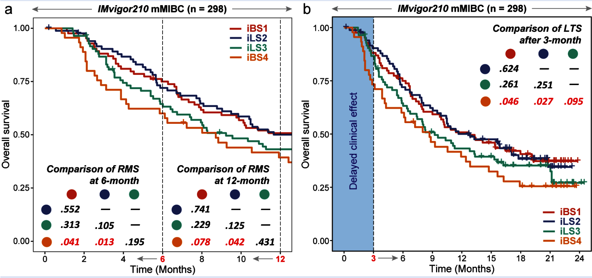

欢迎关注“小丫画图”公众号，回复“小白”，看小视频，实现点鼠标跑代码。

小丫微信: epigenomics  E-mail: figureya@126.com

作者：大鱼海棠，他的更多作品看这里<https://k.koudai.com/OFad8N0w>

单位：中国药科大学国家天然药物重点实验室，生物统计与计算药学研究中心

小丫编辑校验

```{r setup, include=FALSE}
knitr::opts_chunk$set(echo = TRUE)
```

# 需求描述

看起来大鱼老师用了两种非比例风险的预后模型来计算接受了免疫治疗的队列的生存差异，包括RMS限制性生存均值以及long-term survival分析。这个在临床中很有意义，因为免疫治疗患者确实存在老师说的“delayed effect”延迟效应。



出自<https://www.biorxiv.org/content/10.1101/2021.05.30.446369v1.full>的补充材料Supplementary Figure S4a

# 应用场景

采用非比例风险的生存模型（non-proportional-hazard survival model, NPHSurv）评价接受免疫治疗患者的预后情况

原文：**To evaluate the treatment effect of immune checkpoint inhibitors on different iCSs in the IMvigor210 cohort**, we compared the RMS time difference at six months and one year after treatment. We found that the iBS4 subtype showed a significantly poorer outcome than immune-hot iCSs (i.e., iBS1 and iLS2; both P < 0.05 at 6 months, both P < 0.1 at 12 months) and had a segregated survival curve compared to the immune-cold iLS3 subtype (Supplementary Figure S4a). Due to the ***delayed clinical effect of immunotherapy**, we also compared the long-term survival rates after three months of treatment. Consistently, the iBS4 subtype was associated with significantly poorer long-term survival than the immune-hot iBS1 (P = 0.046) and iLS2 (P = 0.027) subtypes and the immune-cold iLS3 subtype (P = 0.095), suggesting its high malignancy and potential resistance to immune checkpoint blockade (Supplementary Figure S4b). 

例文中很多图我们都众筹过，例如：

- Figure 1b的画法可参考FigureYa196PanPie
- Figure 2a的算法可参考FigureYa249Regulon，b的画法可参考FigureYa248MutLandscape
- Figure 3de可产考FigureYa25sankey和FigureYa125Fishertest
- Figure 4f可参考FigureYa106immunotherapy，4h可参考<https://k.koudai.com/Eig1YOB4>
- Figure 5b可参考FigureYa12box，f可参考FigureYa162boxViolin
- Figure 6可参考FigureYa35batch_bestSeparation，FigureYa144DiagHeatmap或<https://mp.weixin.qq.com/s/34WRZRBVPHUNRLlzNH2nzw>

# 环境设置

使用国内镜像安装包

```{r eval=FALSE}
options("repos"= c(CRAN="https://mirrors.tuna.tsinghua.edu.cn/CRAN/"))
options(BioC_mirror="http://mirrors.tuna.tsinghua.edu.cn/bioconductor/")
BiocManager::install("survRM2")
BiocManager::install("ComparisonSurv")
install.packages(c("ComparisonSurv", "ggpubr", "survminer", "survRM2"))
```

加载包

```{r}
library(survRM2)
library(ComparisonSurv)
library(ggplot2)
library(ggpubr)
library(survminer)

Sys.setenv(LANGUAGE = "en") #显示英文报错信息
options(stringsAsFactors = FALSE) #禁止chr转成factor
```

# 输入文件

easy_input_annCol.txt，亚型信息。

easy_input_surv.txt，预后信息。

```{r}
# 读取经过NTP预测的IMvigor210队列的CMOIC亚型
annCol.imvigor210 <- read.table("easy_input_annCol.txt",sep = "\t",row.names = 1,check.names = F,stringsAsFactors = F,header = T)

# 读取IMvigor210队列的预后信息
imvigor210.surv <- read.table("easy_input_surv.txt",sep = "\t",row.names = 1,check.names = F,stringsAsFactors = F,header = T)
```

# 采用非比例风险的生存模型（non-proportional-hazard survival model, NPHSurv）评价接受免疫治疗患者的预后情况

```{r}
# 构建完整的预后和亚型信息
surv <- cbind.data.frame(annCol.imvigor210,imvigor210.surv[rownames(annCol.imvigor210),])
surv$os <- surv$os * 30 # 生存时间由月换算成日

# 循环计算非比例风险生存模型的统计显著性
subt <- c("CS1","CS2","CS3","CS4") # 目前定义的亚型名
tau1 <- 180 # 第一次计算RMS的时间截点（半年）
tau2 <- 365 # 第二次计算RMS的时间截点（1年）
t0 <- 90 # 认为免疫治疗延迟效应的时间（3个月）
rms.mat1 <- as.data.frame(matrix(0, ncol = length(subt), nrow = (length(subt)),dimnames = list(subt,subt))) # 初始化半年的RMS模型的p值矩阵
rms.mat2 <- as.data.frame(matrix(0, ncol = length(subt), nrow = (length(subt)),dimnames = list(subt,subt))) # 初始化一年的RMS模型的p值矩阵
lts.mat <- as.data.frame(matrix(0, ncol = length(subt), nrow = (length(subt)),dimnames = list(subt,subt))) # 初始化延迟效应的长期生存模型的p值矩阵

for(i in subt) {
  for (j in subt) {
    if(i == j) {
      next
    } else {
        tmp <- surv[which(surv$CMOIC %in% c(i,j)),] # 若亚型相同时则跳过
        
        # 计算6个月时的RMS
        rmst1 <- rmst2(time = tmp$os,
                      status = tmp$censOS,
                      arm = ifelse(tmp$CMOIC == i,1,0), # 谁为参考不重要，p值不发生变化，但是RMS diff以及RMS ratio会改变，可根据需要自己查看rmst1中的结果
                      tau = tau1)
        rms.mat1[i,j] <- rmst1$unadjusted.result[1,4]
        
        # 计算12个月时的RMS
        rmst2 <- rmst2(time = tmp$os,
                       status = tmp$censOS,
                       arm = ifelse(tmp$CMOIC == i,1,0),
                       tau = tau2)
        rms.mat2[i,j] <- rmst2$unadjusted.result[1,4]
        
        # 计算3个月延迟以后的长期生存率
        lts <- Long.test(time = tmp$os,
                         status = tmp$censOS,
                         group = ifelse(tmp$CMOIC == i,1,0), # 谁为参考不重要，p值不发生变化，统计量符号会改变
                         t0 = t0) # t0为延迟起效的时间
        lts.mat[i,j] <- lts$pvalue[4] # 这里我取的是第四个统计量Chi-square(Qua)
      }
  }
}

# 输出p值矩阵
write.table(rms.mat1,file = paste0("output_restricted mean survival p value matrix at ", tau1," cutoff.txt"),sep = "\t",row.names = T,col.names = NA,quote = F)
write.table(rms.mat2,file = paste0("output_restricted mean survival p value matrix at ", tau2," cutoff.txt"),sep = "\t",row.names = T,col.names = NA,quote = F)
write.table(lts.mat,file = paste0("output_long term survival p value matrix after ", t0," delayed effect.txt"),sep = "\t",row.names = T,col.names = NA,quote = F)
```

# 开始画图

这里只绘制基本图形，细节均需要AI补充。

```{r}
# 设置颜色
clust.col <- c("#DD492E","#40548A","#32A087","#EC7D21")

tmp <- surv
tmp$os <- tmp$os/30 # 生存时间改为月
fit <- survfit(Surv(os, censOS) ~ CMOIC,
               data      = tmp,
               type      = "kaplan-meier",
               error     = "greenwood",
               conf.type = "plain",
               na.action = na.exclude)
names(fit$strata) <- gsub("CMOIC=", "", names(fit$strata)) # 去掉亚组名中的CMOIC字样
p <- suppressWarnings(ggsurvplot(fit               = fit,
                                 conf.int          = FALSE,
                                 risk.table        = FALSE,
                                 risk.table.col    = "strata",
                                 palette           = clust.col,
                                 data              = tmp,
                                 censor            = TRUE,
                                 size              = 1,
                                 xlim              = c(0,12), # 第一张KM曲线是用来做RMS，所以只显示到12个月时间，AI补充两个p值矩阵
                                 break.time.by     = 2,
                                 legend.title      = "",
                                 pval              = FALSE, # 不使用log-rank检验总体预后情况
                                 surv.median.line  = "none",
                                 xlab              = "Time (Months)",
                                 ylab              = "Overall survival",
                                 risk.table.y.text = FALSE)) 
p$plot <- p$plot + 
  theme_bw() +
  theme(axis.text.x = element_text(size = 10,colour = "black"),
        axis.text.y = element_text(colour = "black",size = 10),
        panel.background = element_blank(),
        panel.grid.major = element_blank(),
        panel.grid.minor = element_blank(),
        legend.position = "top") +
  geom_vline(xintercept = 6, color="black", linetype="longdash", size=0.3) + # 在第6个月处加虚线
  geom_vline(xintercept = 12, color="black", linetype="longdash", size=0.3) # 在第12个月处加虚线
ggsave("kaplan meier curve1.pdf",width = 5,height = 5)

p <- suppressWarnings(ggsurvplot(fit               = fit,
                                 conf.int          = FALSE,
                                 risk.table        = FALSE,
                                 risk.table.col    = "strata",
                                 palette           = clust.col,
                                 data              = tmp,
                                 censor            = TRUE,
                                 size              = 1,
                                 xlim              = c(0,24), # 第二张KM曲线是长期生存，显示到2年时间，前3个月的延迟效应需要AI修饰
                                 break.time.by     = 3,
                                 legend.title      = "",
                                 pval              = FALSE,
                                 surv.median.line  = "none",
                                 xlab              = "Time (Months)",
                                 ylab              = "Overall survival",
                                 risk.table.y.text = FALSE)) 
p$plot <- p$plot + 
  theme_bw() +
  theme(axis.text.x = element_text(size = 10,colour = "black"),
        axis.text.y = element_text(colour = "black",size = 10),
        panel.background = element_blank(),
        panel.grid.major = element_blank(),
        panel.grid.minor = element_blank(),
        legend.position = "top") +
  geom_vline(xintercept = 3, color="black", linetype="longdash", size=0.3) # 在第3个月处加虚线
ggsave("kaplan meier curve2.pdf",width = 5,height = 5)
```

# Session Info

```{r}
sessionInfo()
```