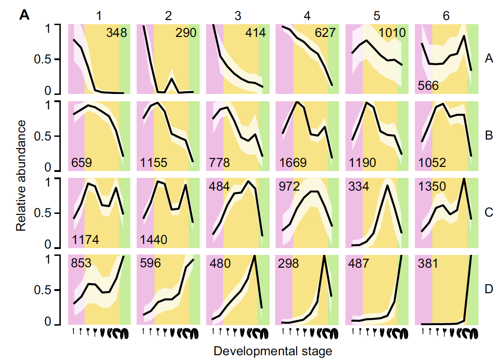
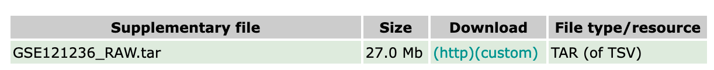

欢迎关注“小丫画图”公众号，回复“小白”，看小视频，实现点鼠标跑代码。

小丫微信: epigenomics  E-mail: figureya@126.com

作者：hazard，他的更多作品看这里<https://k.youshop10.com/zuloxG1Y>

小丫编辑校验

```{r setup, include=FALSE}
knitr::opts_chunk$set(echo = TRUE)
```

# 需求描述

求众筹这篇文章的Fig4A，好看的聚类图



出自<https://link.springer.com/article/10.1007%2Fs00497-018-00357-2>

Fig. 4 Covariance clustering of expressed genes across the embryo time series. a Average maximum-normalized expression values for all genes in each of the 24 clusters generated by Mclust. Numbers in each panel indicate the number of genes grouped in that cluster, and polygons represents ± 1 standard deviation.

# 应用场景

这种曲线的方式很适合展示多时间点数据，例如多个发育时期、生物/非胁迫处理后多个时间点等。可以一目了然看出每个cluster的基因随时间的表达量变化规律。

更多时间序列数据结果展示，可参考FigureYa16fitting、FigureYa94STEMbox和FigureYa98STEMheatmap。

# 环境设置

使用国内镜像安装包

```{r eval=FALSE}
options("repos"= c(CRAN="https://mirrors.tuna.tsinghua.edu.cn/CRAN/"))
options(BioC_mirror="http://mirrors.tuna.tsinghua.edu.cn/bioconductor/")
install.packages("ggnewscale")
```

加载包

```{r}
library(tidyverse)
library(magrittr)
library(mclust)
Sys.setenv(LANGUAGE = "en") #显示英文报错信息
options(stringsAsFactors = FALSE) #禁止chr转成factor
```

# 输入文件获得

如果你的数据已经整理成easy_input.csv格式，就可以跳过这步，直接进入“mclust”。

从NCBI的GEO数据库下载GSE121236_RAW.tar压缩包，<https://www.ncbi.nlm.nih.gov/geo/query/acc.cgi?acc=GSE121236>



```{r}
files <- untar(tarfile = "GSE121236_RAW.tar", list = T)
temp_dir <- tempdir()
untar(tarfile =  "GSE121236_RAW.tar", exdir = temp_dir)

samples <- paste0(rep(c("pg", "gl", "eh", "lh", "et", "lt", "bc", "mg"), each = 3), "_", 1:3)
files_used <- paste0("GSM34282", 48:71, "_", samples, ".kallisto.tsv.gz")
files_used <- gsub("_bc_([123]).kallisto", "_bc_\\1.5ng.kallisto", files_used)

# 批量读取GSE121236_RAW.tar压缩包内每个样本的测序数据
tpm <- lapply(files_used, function(i) {
  read.table(file = gzfile(description = file.path(temp_dir, i)), header = T) %$%
    tapply(tpm, INDEX = gsub("\\..*", "", target_id), sum) 
  #  Gene-level transcripts per million (TPM) were estimated by combining the TPM of all isoforms of protein-coding genes
}) %>% do.call(what = cbind)

colnames(tpm) <- samples

# 保存到文件，便于套用格式，每行一个基因，每列一个sample
#write.csv(tpm, "easy_input.csv", quote = F)
```

# mclust

原文：To examine temporal changes in gene expression, proteincoding genes detected at **≥ 1 TPM in at least one embryonic stage** of the Smart-seq2 time series were subjected to model-based clustering by Mclust [(Scrucca et al. 2016), see “Materials and methods”]. Mclust classifies points according to a set of **Gaussian mixture models** and chooses the optimal model parameters to maximize the Bayesian information criterion (BIC). The mean TPM of 18,600 genes were **converted to z-scores**, and based on analysis with Mclust, the **optimal cluster number was 24** (Online Fig. S5).

```{r}
#tpm <- read.csv("easy_input.csv", row.names = 1)
# 计算每个分组的均值，这里对应各个发育阶段
tpm_mean <- apply(tpm, 1, function(x) {
  tapply(x, substr(colnames(tpm), 1, 2), mean)
}) %>% t

# 筛选基因，≥ 1 TPM in at least one embryonic stage
genes_used <- which(rowSums(tpm_mean > 1) >= 1) %>% names()
# converted to z-scores
tpm_mean_scaled <- tpm_mean %>% t %>% scale() %>% t

# 找合适的聚类数
bic <- mclustBIC(
  data = na.omit(tpm_mean_scaled[genes_used[1:2000],]),
  modelNames = "VVI", # I can not achieve valid results using VVV, which might be due to different versions of Mclust package (different internal settings?).
  G = seq(2,50,by=2))
plot(bic) # 画图，用来选择合适cluster数量，即横坐标numbers of components ，用于设置下面Mclust函数里的参数G

# mclust
cluster <- Mclust(
  data = na.omit(tpm_mean_scaled[genes_used[1:2000],]), 
  G = 24, # 这里跟原文一致，分成24个cluster
  modelNames = "VVI",
  prior = priorControl()
)
```

# 开始画图

用ggplot2模仿文章里的图。

```{r}
# 整理成画图所需的格式
ggData <- cbind(tpm_mean_scaled[cluster$classification %>% names, ], cluster = cluster$classification) %>%
  as.data.frame() %>%
  rownames_to_column("gene") %>%
  gather(key = "stage", value = "zscore", -gene, -cluster,) %>%
  group_by(gene) %>%
  mutate(normalized = scales::rescale(zscore)) %>%
  ungroup() %>%
  mutate(stage = factor(stage, c("pg", "gl", "eh", "lh", "et", "lt", "bc", "mg"))) %>%
  group_by(stage, cluster) %>%
  summarise(
    mean = mean(normalized),
    sd = sd(normalized))

# 设置三个区域的颜色
fill_colors <- RColorBrewer::brewer.pal(6, "Set2")[c(4,6,5)]

ggplot(mapping = aes(x = stage, y = mean, group = cluster),
        data = ggData) + 
  # 填充背景色的三个区域
  ggnewscale::new_scale_fill() +
  annotate(geom = "rect", xmin = 0, xmax = 2.5, ymin = 0, ymax = 1, 
           fill = fill_colors[1], alpha = 0.6) +
  annotate(geom = "rect", xmin = 2.5, xmax = 7.5, ymin = 0, ymax = 1, 
           fill = fill_colors[2], alpha = 0.6) +
  annotate(geom = "rect", xmin = 7.5, xmax = 9.5, ymin = 0, ymax = 1,
           fill = fill_colors[3], alpha = 0.6) +
  
  # 白色标准差区域
  geom_polygon(
    mapping = aes(stage, polygon, group = cluster),
    data = rbind(ggData %>% mutate(polygon = mean + sd) %>% arrange(stage, cluster) %>% select(stage, cluster, polygon),
                 ggData %>% mutate(polygon = mean - sd) %>% arrange(desc(stage), cluster) %>% select(stage, cluster, polygon)),
    fill = "white", alpha = 0.8) +
  
  # 画线
  geom_line(size = 1.2) +  # 线的粗细
  facet_wrap(~cluster, nrow = 4) + # 画成4行
  theme_test()

ggsave("mclust.pdf", width = 10, height = 8)
```

# 后期处理

输出的PDF文件里是矢量图，可以用illustrator等矢量图编辑器编辑文字图形，添加各样本的形态照片等。

# Session Info

```{r}
sessionInfo()
```