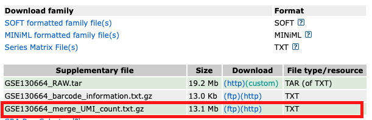

欢迎关注“小丫画图”公众号，回复“小白”，看小视频，实现点鼠标跑代码。

小丫微信: epigenomics  E-mail: figureya@126.com

作者：hazard，他的更多作品看这里<https://k.youshop10.com/zuloxG1Y>

小丫编辑校验

```{r setup, include=FALSE}
knitr::opts_chunk$set(echo = TRUE)
```

# 需求描述

这个小提琴图很高大上，适于差异比较展示。


出自<https://link.springer.com/article/10.1007%2Fs00497-018-00357-2>

Figure S4. Integrative Analysis of Aging-Associated Differentially Expressed Genes with Genes from GenAge or POF/POI Database, Related to Figure 4
(A) Violin plots showing **expression levels of marker genes for each cell type in young (Y) and old (O) monkey ovaries**.

# 应用场景

三种特征同时对比展示。就像例文用该图对比展示了三个特征之下的基因表达量分布：细胞类型、marker基因、年龄。

这里输入数据有两种形式任你选，跟单细胞数据无缝对接，对非单细胞数据非常友好。

我们众筹过例文的几个Figure：

- Figure 1H，热图和气泡图对应展示表达谱和基因功能富集分析结果，可参考FigureYa206scHeatmap；
- Figure 3AB，从PCA结果就能看出基因表达模式跟细胞类型的关系，可参考FigureYa222PCAgene；
- Figure 4B，用两种颜色展示上调和下调的基因，可参考FigureYa232scRankHeatmap；

另外，Figure S6H用颜色和形状展示两个层面的分组信息，画法可参考FigureYa101PCA。

# 环境设置

使用国内镜像安装包

```{r}
options("repos"= c(CRAN="https://mirrors.tuna.tsinghua.edu.cn/CRAN/"))
options(BioC_mirror="http://mirrors.tuna.tsinghua.edu.cn/bioconductor/")

```

加载包

```{r}
library(Seurat)
library(magrittr)
library(tidyverse)
library(ggplot2)
library(ggpubr)
library(rstatix)
Sys.setenv(LANGUAGE = "en") #显示英文报错信息
options(stringsAsFactors = FALSE) #禁止chr转成factor
```

# 输入文件

单细胞和非单细胞数据任选其一：

- 单细胞数据。sc.seurat.Rdata，单细胞RNA-seq预处理获得的文件。文件较大，已上传至微云<https://share.weiyun.com/vZiSM9pB>。怎样获得这个文件？拖到文末看“附：单细胞RNA-seq数据预处理”
- 非单细胞数据。easy_input.csv，只要你的数据也有三种特征，整理成的easy_input.csv的样子，就可以画这样的图。

## 单细胞数据

```{r}
load("sc.seurat.Rdata")
markers <- c("DDX4", "AMH", "COL1A2", "ACTG2", "CDH5", "KLRB1", "CD163")

df <- FetchData(sc, vars = c(markers, "aging", "cluster_short")) %>%
  reshape2::melt(id.vars = c("aging", "cluster_short"), 
                 variable.name = "gene",
                 value.name = "expression") %>%
  mutate(aging = factor(aging, levels = c("Y", "O")),
         cluster_short = factor(cluster_short, levels = c("OO","GC", "SC", "SMC",  "EC", "NKT", "M")))

# 保存到文件，便于套用格式
write.csv(df, "easy_input.csv", quote = F, row.names = F)
```

## 非单细胞数据

easy_input.csv，前三列是你想用来分组的三种特征，最后一列为具体数值，图中会展示该数值的分布。

```{r}
df <- read.csv("easy_input.csv", header = T)

# 按自己的要求排序，该顺序对应图中的顺序
df$aging <- factor(df$aging, levels = c("Y", "O"))
df$cluster_short <- factor(df$cluster_short, levels = c("OO","GC", "SC", "SMC",  "EC", "NKT", "M"))
df$gene <- factor(df$gene, levels = c("DDX4", "AMH", "COL1A2", "ACTG2", "CDH5", "KLRB1", "CD163"))

head(df)
```

# 开始画图

图中会横向展示cluster_short，纵向展示 gene，每个小格内以aging分组，绘制基因表达量分布。

## 复现原文

```{r, fig.width=9, fig.height=7}
ggplot(data = df, mapping = aes(aging, expression, fill = aging)) +
  geom_violin(show.legend = F) +
  scale_fill_manual(values = c("grey", "cornflowerblue")) + # 两组分别填充灰色和蓝色
  facet_grid(gene~cluster_short) +
  theme_bw() +
  xlab("") +
  ylab("Expression level (log TPM)") +
  theme(panel.grid = element_blank(),
        strip.background.x = element_rect(fill = "lavenderblush"), # 顶部填充粉色
        strip.text.y = element_text(angle = 0),
        strip.background.y = element_blank())

ggsave("scViolin.pdf", width = 9, height = 7)
```

## 美化版

小伙伴嫌原图配色丑，我们修改一下颜色。

```{r, fig.width=9, fig.height=7}
ggplot(df, mapping = aes(aging, expression, fill = aging, color = aging)) +
  #geom_violin(show.legend = F) + # 画violin
  scale_fill_manual(values = c("#2874C5", "#EABF00")) + # 两组分别填充蓝色和黄色
  scale_color_manual(values = c("#2874C5", "#EABF00")) + # 边框跟填充颜色一致
  
  # 如果你喜欢，可以叠加box plot
  geom_boxplot(outlier.size = -1, 
               show.legend = FALSE, # 不显示图例
               color="black", lwd=0.2, # 线的粗细
               alpha = 0.7) + # 透明化
  # 还可以叠加散点
  geom_point(shape = 21, size=.6, # 点的形状和大小
             show.legend = FALSE, # 不显示图例
             position = position_jitterdodge(), 
             alpha = 0.3)+ 
  # 甚至可以注释掉上面geom_violin那行，不画violin，只画box和散点
  
  facet_grid(gene ~ cluster_short) +
  theme_bw() +
  xlab("") +
  ylab("Expression level (log TPM)") +
  theme(panel.grid = element_blank(),
        strip.background.x = element_rect(fill = "grey95"), # 顶部填充浅灰色
        strip.text.y = element_text(angle = 0),
        strip.background.y = element_blank()) 

ggsave("scViolin_color.pdf", width = 9, height = 7)
```

## 加强版

借助ggpubr加上pvalue或显著性星标*，分面加pvalue的方法参考了这篇<https://www.datanovia.com/en/blog/how-to-add-p-values-to-ggplot-facets/>

```{r, fig.width=9, fig.height=9}
stat.test <- df %>% 
  group_by(cluster_short, gene) %>% 
  t_test(expression ~ aging) %>%
  adjust_pvalue(method = "bonferroni") %>% 
  add_significance()

stat.test
# cutpoints: 0, 1e-04, 0.001, 0.01, 0.05, 1
# symbols: "****", "***", "**", "*", "ns"

stat.test <- stat.test %>% add_xy_position(x = "aging")

v1 <- ggviolin(df, x = "aging", y = "expression", 
               fill = "aging", 
               color = "aging", # 如果想要黑色边框，就删掉这行
               facet = c("gene","cluster_short")) +
  scale_fill_manual(values = c("#2874C5", "#EABF00")) +
  scale_color_manual(values = c("#2874C5", "#EABF00")) + #边框跟填充色一致
  xlab("") +
  ylab("Expression level (log TPM)") +
  theme(panel.grid = element_blank(),
        strip.text.y = element_text(angle = 0),
        strip.background.x = element_rect(fill = "grey95"), # 顶部填充浅灰色
        strip.background.y = element_blank()) 
v1

# 显著标星*
v1 + stat_pvalue_manual(stat.test, hide.ns = TRUE) #显著性星标
ggsave("scViolin_plus.pdf", width = 9, height = 9)

# 还可以同时显示pvalue数值和标星*
v1 + 
  stat_pvalue_manual(stat.test, 
                     bracket.nudge.y = 1, 
                     hide.ns = TRUE, #不显示不显著的，这里有个特殊情况是图右上角M ~ DDX4出现了NaN，是因为该组所有样本表达量都为0
                     label = "{p.adj}{p.adj.signif}", # pvalue和星标
                     label.size = 3, # pvalue字的大小
                     vjust = -0.5) + # pvalue的上（负）下位置
  scale_y_continuous(expand = expansion(mult = c(0, 0.1))) #给pvalue文字留足空间
```

# 后期处理

输出的pdf文件是矢量图，可以用Illustrator等软件打开，编辑图形和文字。

# 附：单细胞RNA-seq数据预处理

以下代码出自`FigureYa206scHeatmap`，会生成`sc.seurat.Rdata`文件，可作为以上代码的输入文件。

## 下载单细胞RNA-seq数据

1) UMI count，从NCBI[GSE130664](https://www.ncbi.nlm.nih.gov/geo/query/acc.cgi?acc=GSE130664)下载：`GSE130664_merge_UMI_count.txt.gz`文件。



```{r download, eval=FALSE}
download.file("https://www.ncbi.nlm.nih.gov/geo/download/?acc=GSE130664&format=file&file=GSE130664%5Fmerge%5FUMI%5Fcount%2Etxt%2Egz", 
              destfile = "GSE130664_merge_UMI_count.txt.gz")
```

2) metadata，从[例文的](https://doi.org/10.1016/j.cell.2020.01.009)Supplementary Tables获得：`1-s2.0-S0092867420300568-mmc1.xlsx`

## Read data

```{r preprocessing, eval=FALSE}
umi <- read.table(file = gzfile("GSE130664_merge_UMI_count.txt.gz"), header = T, row.names = 1, sep = "\t")
qc <- readxl::read_excel("1-s2.0-S0092867420300568-mmc1.xlsx", sheet = 2)
meta <- readxl::read_excel("1-s2.0-S0092867420300568-mmc1.xlsx", 3) %>% 
  column_to_rownames("cell")
```

## 数据预处理

See Methods:  
QUANTIFICATION AND STATISTICAL ANALYSIS -> Single-Cell RNA-Seq Data Processing

```{r, eval=FALSE}
# QC of Cells
cells <- qc %>% 
  filter(`Mapping rate` >= 0.2 &
           `Gene number` >= 700 &
           UMI >= 3000) %>%
  pull(Rename)

# seurat object
sc <- CreateSeuratObject(counts = umi[,cells], meta.data = meta)

# expression transformation
sc@assays$RNA@data <- sc@assays$RNA@counts %>% 
  apply(2, function(x){
    log2(10^5*x/sum(x)+1)
    })

# remove other cells
sc <- sc[,sc$cluster != "other"]

# 给cluster改名
sc$cluster_short <- factor(
  plyr::mapvalues(sc$cluster, 
                  c("Oocyte", "Natural killer T cell", "Macrophage",
                    "Granulosa cell", "Endothelial cell", 
                    "Smooth muscle cell", "Stromal cell"),
                  c("OO", "NKT", "M", "GC", "EC", "SMC", "SC")),
  levels = c("OO", "NKT", "M", "GC", "EC", "SMC", "SC"))

# 给cluster自定义颜色
cluster_colors <- setNames(brewer.pal(7, "Set1"), levels(sc$cluster_short))

# 保存一下，便于停下来接着跑
#save(sc, cluster_colors, file = "sc.seurat.Rdata")

# 还可以把表达矩阵输出到文件
#write.csv(sc@assays$RNA@data, "easy_input_expr.csv", quote = F)
```

# Session Info

```{r}
sessionInfo()
```