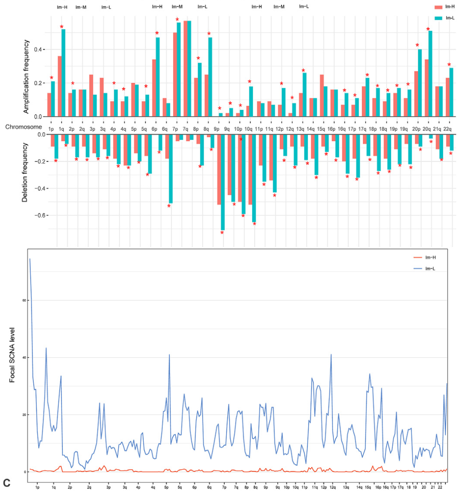

欢迎关注“小丫画图”公众号，回复“小白”，看小视频，实现点鼠标跑代码。

小丫微信: epigenomics  E-mail: figureya@126.com

作者：大鱼海棠，他的更多作品看这里<https://k.koudai.com/OFad8N0w>

单位：中国药科大学国家天然药物重点实验室，生物统计与计算药学研究中心

小丫编辑校验

```{r setup, include=FALSE}
knitr::opts_chunk$set(echo = TRUE)
```

# 需求描述

比较Im-H和Im-L两个组臂级扩增和缺失频率和焦点级扩增和缺失水平，画出图4B的最后两个图。示例数据随便就行。



出自<https://linkinghub.elsevier.com/retrieve/pii/S2001037021003366>

Fig. 4. Molecular features of the immune subtypes of melanoma. 
B. Comparisons of tumor mutation burden (TMB), homologous recombination deficiency (HRD) scores, and global methylation levels among the three immune subtypes in TCGA-melanoma; 
prediction of **high-immune-score (upper third) versus low-immune-score (bottom third)** melanomas using **TMB and somatic copy number alteration (SCNA) score** by the logistic regression model; 
comparisons of **arm-level amplification and deletion frequencies** and **focal-level amplification and deletion levels** between Im-H and Im-L melanomas.

# 应用场景

循环计算不同组别的扩增和缺失比例，对臂水平扩增和缺失做检验，并绘图。

更多基因组相关FigureYa看这里<https://k.youshop10.com/gZBI0YzR>

另外，Figure 5E、7D、9这种分布图的画法可参考FigureYa227boxdensity。

# 环境设置

使用国内镜像安装包

```{r}
options("repos"= c(CRAN="https://mirrors.tuna.tsinghua.edu.cn/CRAN/"))
options(BioC_mirror="http://mirrors.tuna.tsinghua.edu.cn/bioconductor/")

```

加载包

```{r}
library(ggplot2)
library(patchwork)
library(data.table)

Sys.setenv(LANGUAGE = "en") #显示英文报错信息
options(stringsAsFactors = FALSE) #禁止chr转成factor
```

# 输入文件

用GenePattern上的GISTIC分析可得到broad_data_by_genes.txt以及all_data_by_genes.txt文件，或可参照FigureYa79CNV。

easy_input_annotation.txt，样本分组信息。

```{r}
# 读取GISTIC结果
# arm-level
armCNV <- read.delim("broad_values_by_arm.txt",sep = "\t",row.names = 1,check.names = F,stringsAsFactors = F,header = T)
# focal-level
geneCNV <- read.delim("all_data_by_genes.txt",sep = "\t",row.names = 1,check.names = F,stringsAsFactors = F,header = T)

# 读取样本分组信息
subt <- read.delim("easy_input_annotation.txt",sep = "\t",row.names = 1,check.names = F,stringsAsFactors = F,header = T)
comsam <- intersect(rownames(subt),colnames(armCNV))
armCNV <- armCNV[,comsam]
subt <- subt[comsam,,drop = F]

sam1 <- rownames(subt[which(subt$PAM == "basal"),,drop = F])
sam2 <- rownames(subt[which(subt$PAM == "luminal"),,drop = F])
```

# arm-level amplification and deletion frequencies

```{r}
# 设置扩增和缺失的阈值
cna.cutoff <- 0 # 这里认为>0则为扩增，<0则为缺失

# 循环计算不同组别的扩增和缺失比例
outTab.arm <- NULL
for (i in rownames(armCNV)) {
  message(i)
  
  # 取出当前臂的结果
  tmp <- data.frame(cna = as.numeric(armCNV[i,]),
                    group = subt$PAM,
                    stringsAsFactors = F)
  
  # 初始化loss和amp
  loss <- amp <- tmp
  loss$cna <- ifelse(loss$cna < cna.cutoff,"LOSS","Others") # 当cna小于阈值则loss，正常或扩增认为是others
  amp$cna <- ifelse(amp$cna > -cna.cutoff,"AMP","Others") # 当cna大于阈值则amplification，正常或缺失认为是others
  
  # 构建数据框
  loss.dt <- as.data.frame.array(table(loss$cna,loss$group)) 
  amp.dt <- as.data.frame.array(table(amp$cna,amp$group))
  
  # 计算扩增或者缺失的比例，以及对应在两组间的p值
  if(!is.element("AMP",rownames(amp.dt))) { # 如果在该臂中不存在扩增，则比例记为0，p值记为空
    amp.pct <- c(0,0)
    amp.p <- NA
  } else {
    amp.pct <- as.numeric(amp.dt[1,]/colSums(amp.dt))
    amp.p <- fisher.test(amp.dt)$p.value
  }
  
  if(!is.element("LOSS",rownames(loss.dt))) { # 如果在该臂中不存在缺失，则比例记为0，p值记为空
    loss.pct <- c(0,0)
    loss.p <- NA
  } else {
    loss.pct <- as.numeric(loss.dt[1,]/colSums(loss.dt))
    loss.p <- fisher.test(loss.dt)$p.value
  }
  
  outTab.arm <- rbind.data.frame(outTab.arm,
                                 data.frame(arm = i,
                                            loss.C1 = loss.pct[1],
                                            loss.C2 = loss.pct[2],
                                            p.loss = loss.p,
                                            amp.C1 = amp.pct[1],
                                            amp.C2 = amp.pct[2],
                                            p.amp = amp.p,
                                            stringsAsFactors = F),
                                  stringsAsFactors = F)
}

# 输出到文件
write.table(outTab.arm, file = "output_percentage and fisher test of cnv in two groups.txt",sep = "\t",row.names = F,col.names = T,quote = F)
```

用ggplot2绘制柱状图

先绘制下面的缺失部分

```{r}
wide <- outTab.arm[,1:4]
df <- as.data.frame(melt(wide, measure.vars = c("loss.C1", "loss.C2")))
df$variable <- gsub("loss.","",df$variable,fixed = T)
df$arm <- factor(df$arm, levels = c("1p","1q","2p","2q","3p","3q","4p","4q","5p","5q","6p","6q","7p","7q","8p","8q","9p","9q","10p","10q","11p","11q","12p","12q","13p","13q","14p","14q","15p","15q","16p","16q","17p","17q","18p","18q","19p","19q","20p","20q","21p","21q","22p","22q"))

p_bot <- ggplot(df, aes(arm, value)) +   
  geom_bar(aes(fill = variable), position = "dodge", stat="identity") +
  xlab(NULL) + ylab("Deletion frequency") +
  
  #scale_fill_manual(values = c("#2874C5", "#EABF00")) + # 可以用这行修改配色
  annotate(geom="text", # 标星*
           x = 1:nrow(wide),
           y = ifelse(wide[,2] > wide[,3],
                      wide[,2] + 0.03, # 微调*的位置
                      wide[,3] + 0.03),
           size = 10, angle = 0, fontface = "bold",
           label = ifelse(wide[,4] < 0.05,"*",""),
           color = "red") + # 星的颜色
  
  theme_bw() + 
  theme(axis.ticks.y = element_line(size = 0.2),
        axis.text.y = element_text(size = 10, color = "black"),
        axis.title.x = element_text(vjust = -0.3,size = 12, color = "black"),
        axis.text.x = element_blank(),
        plot.margin = unit(c(0.3, -1.7, 0.3, 0.3), "lines"),
        legend.position = "none",
        #panel.border = element_blank(),
        legend.title = element_blank()) +
  scale_y_reverse()

p_bot
```

然后绘制上面的扩增部分

```{r}
wide <- outTab.arm[,c(1,5:7)]
df <- as.data.frame(melt(wide, measure.vars = c("amp.C1", "amp.C2")))
df$variable <- gsub("amp.","",df$variable,fixed = T)
df$arm <- factor(df$arm, levels = c("1p","1q","2p","2q","3p","3q","4p","4q","5p","5q","6p","6q","7p","7q","8p","8q","9p","9q","10p","10q","11p","11q","12p","12q","13p","13q","14p","14q","15p","15q","16p","16q","17p","17q","18p","18q","19p","19q","20p","20q","21p","21q","22p","22q"))

p_top <- ggplot(df, aes(arm, value)) +   
  geom_bar(aes(fill = variable), position = "dodge", stat="identity") +
  xlab(NULL) + ylab("Amplification frequency") +
  
  annotate(geom="text", # 标星*
           x = 1:nrow(wide),
           y = ifelse(wide[,2] > wide[,3],
                      wide[,2] + 0.01, # 微调*的位置
                      wide[,3] + 0.01),
           size = 10, angle = 0, fontface = "bold",
           label = ifelse(wide[,4] < 0.05,"*",""),
           color = "red") +
  
  theme_bw() + 
  theme(axis.ticks.y = element_line(size = 0.2),
        axis.text.y = element_text(size = 10, color = "black"),
        axis.title.x = element_text(vjust = -0.3,size = 12, color = "black"),
        axis.text.x = element_text(size = 10, color = "black"),
        plot.margin = unit(c(0.3, -1.7, 0.3, 0.3), "lines"),
        legend.position = "top",
        #panel.border = element_blank(),
        legend.title = element_blank())

p_top
```

拼在一起

```{r fig.width=12, fig.height=10}
pal <- p_top + p_bot +
  plot_layout(ncol = 1,widths = c(6,6), guides = 'collect') & theme(legend.position = 'right',legend.key.size = unit(0.4, 'cm'))
pal

# 输出pdf文件
ggsave("arm-level scnv frequency barplot.pdf", width = 12, height = 10)
```

# focal-level amplification and deletion levels

对同样cytoband的gene-level的SCNA取均值，得到不同染色体臂不同focal的SCNA

```{r}
focal.level <- factor(geneCNV$Cytoband, levels = unique(geneCNV$Cytoband))
focal.cna <- apply(geneCNV[,setdiff(colnames(geneCNV), c("Cytoband","Gene ID"))], 2, 
                    function(x) tapply(x, INDEX=factor(geneCNV$Cytoband), FUN=mean, na.rm=TRUE)) 
focal.cna <- focal.cna[levels(focal.level),] # 按照染色体臂顺序排列

# 保存到文件
write.table(focal.cna, file = "output_focal-level cnv.txt",sep = "\t",row.names = T,col.names = NA,quote = F)
```

提取两个分组的SCNA

```{r}
tmp1 <- as.data.frame(focal.cna[,sam1]) # 取出类1的SCNA
tmp1$scna <- as.numeric(rowSums(tmp1)) # 对SCNA取行和，表示该亚型的在染色体上的SCNA水平
tmp1$loci <- 1:nrow(tmp1)
lw1 <- loess(scna ~ loci,data=tmp1,span = 0.02) # 直接使用行和会让折线变得很尖锐，所以这里我采用loess平滑来表现SCNA的趋势（原文并没有采用）

tmp2 <- as.data.frame(focal.cna[,sam2]) # 取出类2的SCNA
tmp2$scna <- as.numeric(rowSums(tmp2)) # 对SCNA取行和，表示该亚型的在染色体上的SCNA水平
tmp2$loci <- 1:nrow(tmp2)
lw2 <- loess(scna ~ loci,data=tmp2,span = 0.02) # 直接使用行和会让折线变得很尖锐，所以这里我采用loess平滑来表现SCNA的趋势（原文并没有采用）
```

用base plot画图

```{r}
ylim <- pretty(c(min(c(range(lw1$fitted),range(lw2$fitted))),max(c(range(lw1$fitted),range(lw2$fitted))))) # 得到比较“温和”的y轴区间
xlab <- rownames(focal.cna) # 得到具体的染色体focal
xlab <- sapply(strsplit(xlab,".",fixed = T),"[",1) # 只取focal中“.”之前的字符串部分
xlab <- substr(xlab, 1, nchar(xlab) - 2); txt <- unique(xlab) # 去掉字符串末尾的2个字符，以获得带有q或者p的染色体臂字符串，此时取独特的字符作为x轴的标签
xlab <- factor(xlab, levels = c("1p","1q","2p","2q","3p","3q","4p","4q","5p","5q","6p","6q","7p","7q","8p","8q","9p","9q","10p","10q","11p","11q","12p","12q","13p","13q","14p","14q","15p","15q","16p","16q","17p","17q","18p","18q","19p","19q","20p","20q","21p","21q","22p","22q")) # 赋予因子

pdf("focal-scna line chart.pdf", width = 12, height = 8)
par(bty="o", mgp = c(2,0.3,0), mar = c(3.1,3.1,2.1,3.1),tcl=-.25, font.main = 3, las = 1)
plot(1:nrow(tmp1),     
     lw1$fitted,
     ylim = range(ylim),
     ylab = "Focal SCNA level",
     xlab = "",
     xaxt = "n",
     yaxs = "i", # 移除y轴和图像间的空隙
     xaxs = "i", # 移除x轴和图像间的空隙
     type = "l",
     cex = 1.5,
     col = "red")
lines(1:nrow(tmp2),
      lw2$fitted,
      col = "#2166AC", #蓝色
      cex = 1.5)
axis(side = 1, at = unique(cumsum(table(xlab))), labels = txt, cex.axis = 0.8, gap.axis = -1) # gap.axis为负数强制标记出所有的x轴标签
grid() # 添加网格
legend("topright", legend = c("Basal","Luminal"), lty = 1, col = c("red","blue"), cex = 1, bty = "n")

invisible(dev.off())
```


# 后期处理

focal-scna line chart.pdf的横坐标label有重叠，原文的处理方式是删掉重叠部分，间隔保留几个label。

输出的PDF文件是矢量图，可以用Illustrator等编辑器打开，修改图形和文字。

也可以在dev.off之前用axis手动写入要写的label，用?axis查看写法。

# Session Info

```{r}
sessionInfo()
```