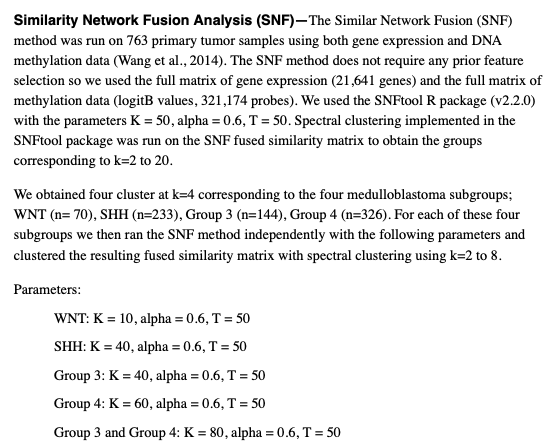

欢迎关注“小丫画图”公众号，回复“小白”，看小视频，实现点鼠标跑代码。

小丫微信: epigenomics  E-mail: figureya@126.com

作者：大鱼海棠，他的更多作品看这里<https://k.koudai.com/OFad8N0w>

单位：中国药科大学国家天然药物重点实验室，生物统计与计算药学研究中心

小丫编辑校验

```{r setup, include=FALSE}
knitr::opts_chunk$set(echo = TRUE)
```

# 需求描述

用多组学数据，比如DNA甲基化和基因表达数据，一起识别疾病亚组，像这篇文章用相似网络融合 (SNF)这种方法。



出自<https://www.sciencedirect.com/science/article/pii/S1535610817302015?via%3Dihub>

# 应用场景

使用相似性网络融合算法（Similarity network fusion, SNF）对多组学数据进行联合聚类。

FigureYa69cancerSubtype用到了SNFCC方法，是对同一个数据集的聚类，这次是对多组学数据聚类。

# 环境设置

使用国内镜像安装包

```{r eval=FALSE}
options("repos"= c(CRAN="https://mirrors.tuna.tsinghua.edu.cn/CRAN/"))
options(BioC_mirror="http://mirrors.tuna.tsinghua.edu.cn/bioconductor/")
install.packages("SNFtool")
BiocManager::install("wateRmelon")
```

加载包

```{r}
library(SNFtool)
library(data.table)
library(pheatmap)

# 自定义函数
normalize <- function(X) X/rowSums(X)

Sys.setenv(LANGUAGE = "en") #显示英文报错信息
options(stringsAsFactors = FALSE) #禁止chr转成factor
```

# 输入文件

文件较大，已上传微云<https://share.weiyun.com/9BYhu2QF>

easy_input_expr.txt，表达谱矩阵。

easy_input_beta.txt，甲基化数据，beta值。

```{r}
# 加载表达谱和甲基化（beta值）
# 注意：原文提到，SNF算法本身不要求数据进行任何预筛选，因此使用了全部表达谱和甲基化谱，这里只是为了示例，因此仅采用了mRNA和位于启动子的甲基化数据
# 原文：The SNF method does not require any prior feature selection so we used the full matrix of gene expression (21,641 genes) and the full matrix of methylation data (logitB values, 321,174 probes).
expr <- fread("easy_input_expr.txt",sep = "\t",check.names = F,stringsAsFactors = F,header = T,data.table = F)
rownames(expr) <- expr[,1]; expr <- expr[,-1]
expr <- expr[rowSums(expr) > 0,]
expr <- as.data.frame(t(scale(t(log2(expr + 1)))))

beta <- fread("easy_input_beta.txt",sep = "\t",check.names = F,stringsAsFactors = F,header = T,data.table = F)
rownames(beta) <- beta[,1]; beta <- beta[,-1]
beta <- as.data.frame(na.omit(beta))
```

# 进行SNF分析

```{r}
# 根据例文所述对甲基化beta值进行转化，得到M值
mvalue <- as.data.frame(wateRmelon::Beta2M(beta))

# 获取同样的样本以及处理过的多组学数据（可以添加更多的组学数据到列表中）
comsam <- intersect(colnames(expr),colnames(mvalue))
moic.list <- list(mrna = as.matrix(expr[,comsam]),
                  meth = as.matrix(mvalue[,comsam]))

# 进行SNF分析并使用原文参数
# 原文：We used the SNFtool R package (v2.2.0) with the parameters K = 50, alpha = 0.6, T = 50. Spectral clustering implemented in the SNFtool package was run on the SNF fused similarity matrix to obtain the groups corresponding to k=2 to 20.
para.K = 50
para.alpha = 0.6
para.T = 50

W.list <- list()
for (m in 1:length(moic.list)) { # 循环构建相似性矩阵列表
  message("--dealing with the omics data of ",m,"...")
  W.list[[m]] <- affinityMatrix(as.matrix(dist(t(moic.list[[m]]))), K = para.K, sigma = para.alpha)
}
W <- SNF(W.list, K = para.K, t = para.T) # 对相似性矩阵列表进行融合
```

```{r}
# 使用谱聚类对融合的相似性矩阵进行聚类
n.clust <- 2:5
for (n in n.clust) {
  message("--generating heatmap with cluster number of ",n,"...")
  clust <- spectralClustering(W, K = n)
  ind <- sort(as.vector(clust), index.return = TRUE)
  ind <- ind$ix
  diag(W) <- median(as.vector(W))
  indata <- normalize(W)
  indata <- indata + t(indata)
  hm <- pheatmap(indata[ind, ind],
                 color = NMF:::ccRamp(c("white","red"),64),
                 border_color = NA,
                 cluster_cols = F,
                 cluster_rows = F,
                 show_rownames = FALSE,
                 show_colnames = FALSE,
                 name = "SNF",
                 filename = paste0("snf heatmap with cluster number of ",n,".pdf"))
}
```

查看热图决定哪次聚类得到了最清晰的热图

原文最后选用k=4。


随后单独对每个subgroup进行SNF聚类，根据自己数据的具体情况套用以上代码即可。

原文：For each of these four subgroups we then ran the SNF method independently with the following parameters and clustered the resulting fused similarity matrix with spectral clustering using k=2 to 8.

Parameters:
WNT: K = 10, alpha = 0.6, T = 50
SHH: K = 40, alpha = 0.6, T = 50
Group 3: K = 40, alpha = 0.6, T = 50
Group 4: K = 60, alpha = 0.6, T = 50
Group 3 and Group 4: K = 80, alpha = 0.6, T = 50

# 后期结果展示

例文用热图展示subgroup、subtype的关系。

按指定的样本顺序画热图，可参考FigureYa91cluster_heatmap。

以下代码可顺利对接其中的“7. 从文件导入样本顺序”

```{r}
n <- 4 #按照原文选用k=4
clust <- spectralClustering(W, K = n)
ind <- sort(as.vector(clust), index.return = TRUE)
ind <- ind$ix
diag(W) <- median(as.vector(W))
indata <- normalize(W)
indata <- indata + t(indata)

# 把样本顺序保存到sam_order
sam_order <- row.names(indata[ind, ind])
```

# Session Info

```{r}
sessionInfo()
```