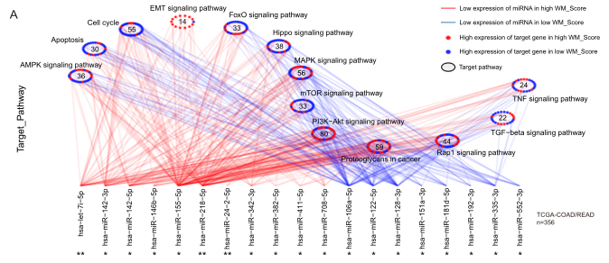
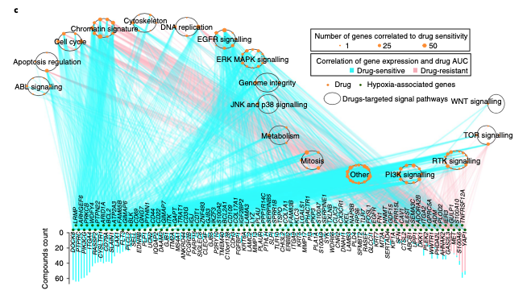

欢迎关注“小丫画图”公众号，回复“小白”，看小视频，实现点鼠标跑代码。

小丫微信: epigenomics  E-mail: figureya@126.com

作者：Hazard，他的更多作品看这里<https://k.koudai.com/zuloxG1Y>

小丫编辑校验

```{r setup, include=FALSE}
knitr::opts_chunk$set(echo = TRUE)
```

# 需求描述

画出这种连线图。



出自<https://molecular-cancer.biomedcentral.com/articles/10.1186/s12943-021-01322-w>，跟FigureYa260CNV出自同一篇文章

Fig. 5 Transcriptional and post-transcriptional characteristics associated with the WM_Score. 
a Differences in miRNA-targeted signaling pathways in the TCGA-COAD/READ cohort between the WM_Score-high and -low groups. The red line represents a low expression of miRNA in the high WM_Score group, and the blue line represents a high expression of miRNA in the low WM_Score group. Red dots correspond to miRNA-targeted genes highly expressed in the high WM_Score group, and blue dots correspond to miRNA-targeted genes highly expressed in the low WM_Score group. The circle represents a signaling pathway enriched with targeted genes. 

类似的图：



出自<https://doi.org/10.1038/s42255-019-0045-8>，跟FigureYa174squareCross、FigureYa199crosslink、FigureYa256panelLink出自同一篇文章。这篇文章以连线著称，总是被模仿，不知道会不会被超越。

Fig. 3 | overview of the propensity score algorithm and the hypoxia-associated molecular patterns across cancer types. 
c, Association between mRNA expression levels of hypoxia-associated genes and drug sensitivity across 1,074 cancer cell lines by Spearman’s rank correlation. The dark green dots along the x axis indicate hypoxia-related genes; the orange dots denote drugs that are clustered by different signalling pathways. The size of the orange dot indicates the number of genes correlated with drug sensitivity (|rs| > 0.3, FDR < 0.05); the bar plot shows the number of drugs correlated with the genes. The pink and cyan lines indicate positive and negative correlation, respectively. JNK, Jun N-terminal kinase.

# 应用场景

展示miRNA-靶基因（或基因-药物等）的关系，连线和节点的颜色代表节点类型（例如例文的high和low WM_Score）。
同一通路的基因画在同一圆圈里，并标注通路名。

为了画这个图，完善了crosslink包，该R包会继续添加更多有趣的连线功能，感兴趣可前往<https://github.com/zzwch/crosslink>查看最新版本及功能，在github上还能提交issue跟作者直接交流。

# 环境设置

使用国内镜像安装包

```{r}
options("repos"= c(CRAN="https://mirrors.tuna.tsinghua.edu.cn/CRAN/"))
options(BioC_mirror="http://mirrors.tuna.tsinghua.edu.cn/bioconductor/")

#install crosslink 确保按照最新版本
# remotes::install_github("zzwch/crosslink", build_vignettes = TRUE)
```

加载包

```{r}
library(magrittr)
library(tidyverse)
library(ggplot2)
library(crosslink) 

Sys.setenv(LANGUAGE = "en") #显示英文报错信息
options(stringsAsFactors = FALSE) #禁止chr转成factor
```

# 输入文件

easy_input_links.csv，连线表示source（miRNA）和target（靶基因）的关系。连线的颜色表示source的类型source_type（high WM_Score和low WM_Score）。

easy_input_nodes.csv，key（包括source和target）所在的path（通路）信息。

- 节点的颜色表示target的类型type（high WM_Score和low WM_Score）。
- source（miRNA）的path列写为source，source的type列是source的type，因此跟easy_input_links.csv的source_type列一致，signif列的内容会标在图中source的名字下面。
- 如果想要例文2那样的效果，用target节点的大小表示number of genes correlated to drug sensitivity，就加一列size，用于控制targe节点的大小，记得把文档中`# size = size`前面的`#`删掉。

```{r}
links <- read.csv("easy_input_links.csv")
nodes <- read.csv("easy_input_nodes.csv")

paths <- unique(nodes[nodes$path != "source", ]$path) # 获取所有path的名字
nodes$path <- factor(nodes$path, levels = c("source", paths)) # 把source排在前面

# 连线的颜色
src_up_col <- "red"
src_dn_col <- "blue"

# target节点的颜色
tar_up_col <- "red"
tar_dn_col <- "blue"
```

# 开始画图

## 1. Take a glance

> IMPORTANT! The colnames of 'node', 'cross', 'node.type', 'x', 'y', 'degree' MUST NOT BE included in nodes and edges!

```{r fig.width=16, fig.height=6}
toy <- crosslink(
  nodes = nodes, 
  edges = links,
  cross.by = "path", 
  xrange = c(0, 10),
  yrange = c(-5, 5),
  spaces = "partition")

cl_plot(toy)
```

## 2. Transform the targets into circle by pathways

```{r}
# 自定义函数
toCircle <- function(x, y, rx = 1, ry =1, intensity = 2){
  mapTo2pi <- function(x) {scales::rescale(c(0, x), to = c(0, 2*pi))[-1]}
  data.frame(x, y) %>%
    mutate(group = paste0("group", x)) %>%
    mutate(yy = scales::rescale(-x, to = range(y))) %>%
    mutate(xx = mean(x) + intensity * sin(yy %>% mapTo2pi),) %>%
    group_by(group) %>%
    mutate(tri = rank(y, ties.method = "first") %>% mapTo2pi)  %>%
    ungroup() %$%
    data.frame(
      x = xx + rx*sin(tri),
      y = yy + ry*cos(tri))
}

toy_circle <- toy %>% tf_fun(
  crosses = paths, 
  along = "xy",
  fun = toCircle,
  rx = 0.2, ry = 0.2)
  
toy_circle %>% cl_plot(label = NA)
```

## 3. Post-processing

```{r}
toy_final <- toy_circle %>% 
  tf_rotate(angle = -90) %>% 
  tf_flip(axis = "x", crosses = paths) %>%
  tf_shift(y = 8, crosses = paths, relative = F) %>%
  set_header()

toy_final %>% cl_plot(label = NA) %>% cl_void()
```

## 4. Fine tuning

```{r}
show_aes(toy_final)

ggplot() +
  # 每个模块相对独立，可根据需要，调整不同layer的层叠顺序
  
  # path的黑色圆圈，画在最底层，会有部分被target的点盖住
  ggforce::geom_circle(
    mapping = aes(x0 = x0, y0 = y0, r = r),
    data = get_cross(toy_final) %>% filter(cross != "source") %>% 
      group_by(path) %>%
      transmute(
        x0 = mean(x),
        y0 = mean(y),
        r = 0.2
      ) %>% unique(),
    show.legend = F
  ) +
  
  # 连线
  geom_segment(
    mapping = aes(x, y, xend = xend, yend = yend, color = source_type),
    data = get_link(toy_final),
    alpha = 0.3 # 连线的透明度
  ) + 
  
  # target节点
  geom_point(
    mapping = aes(x, y, 
                  # size = size, # 对应输入文件的size，控制target节点的大小
                  color = type),
    data = get_cross(toy_final) %>% filter(cross != "source")
  ) +
  
  # 写文字，target节点所在的path名
  ggrepel::geom_text_repel(
    mapping = aes(x, y, label = header), nudge_y = 0.3, 
    data = get_header(toy_final) %>% filter(cross != "source"),
    segment.color = NA
  ) +
  
  # 写文字，source节点的名字
  geom_text(
    mapping = aes(x, y, label = key), angle = 90, hjust = 1, nudge_y = -0.1,
    data = get_cross(toy_final) %>% filter(cross == "source")
  ) +
  
  # 写文字，每个path里面target节点的数量
  geom_text(
    mapping = aes(x, y, label = num),
    data = get_cross(toy_final) %>% filter(cross != "source") %>% 
      group_by(path) %>%
      transmute(
        x = mean(x),
        y = mean(y),
        num = n()
      ) %>% unique()
  ) +
 
  # 连线和节点的配色
  scale_color_manual(values = c(
      src_up = src_up_col, src_dn = src_dn_col, # 连线
      tar_up = tar_up_col, tar_dn = tar_dn_col)) + # 节点
  labs(x = NULL, y = "Target_Pathway") +
  scale_y_continuous(expand = expansion(mult = c(0.25,0.1))) -> p

p
```

> 如果想要像例文2那样给source也画上点，就运行下面这段

```{r eval=FALSE}
# 画source节点
p <- p + geom_point(
  mapping = aes(x, y),
  data = get_cross(toy_final) %>% filter(cross == "source")
  )
```

## 5. Add annotation plots

把source的signif标注在source名字的下方

```{r fig.width=10, fig.height=5}
cl_plot2(
  p %>% cl_void(th = theme(
    axis.title = element_text())),
  object = toy_final, 
  annotation = cl_annotation(
    bottom = ggplot() +
      geom_text(
        mapping = aes(key, 0, label = signif), 
        data = nodes %>% filter(path == "source")
      ) + theme_void()
    ,
    bottom.by = "source", bottom.height = 0.05
  )
)

ggsave("circLink.pdf", width = 10, height = 5)
```

# 附：示例数据生成过程

```{r eval=FALSE}
sources <- paste0("source", 1:20 %>% format)
targets <- paste0("target", 1:500 %>% format)
paths <- paste0("path", 1:15 %>% format)

nodes <- data.frame(
  key = c(sources, targets),
  type = c(rep("src_up", length(sources)/2),
           rep("src_dn", length(sources)/2),
           sample(c("tar_up", "tar_dn"), length(targets), replace = T)),
  path = c(rep("source", length(sources)), 
           rep(paths, times = c(
             40, 50, 30, 30, 50, 50, 20, 30, 30, 40, 20, 30, 30, 20, 30
           ))) %>% factor(
             levels = c("source", paths)
           ),
  signif = c(sample(c("*", "**", "***", "ns"), length(sources), replace = T),
             rep(NA, length(targets)))
)

link_n <- 500
set.seed(666)
links <- data.frame(
  src = sample(sources, link_n, replace = T),
  tar = sample(targets, link_n, replace = T)) %>% 
  unique() %>%
  mutate(source_type = nodes$type[match(src, nodes$key)])

write.csv(links, "easy_input_links.csv", row.names = F, quote = F)
write.csv(nodes, "easy_input_nodes.csv", row.names = F, quote = F)
```

# Session Info

```{r}
sessionInfo()
```