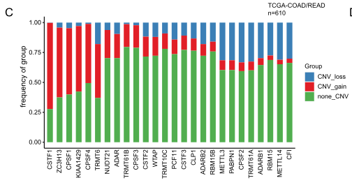

欢迎关注“小丫画图”公众号，回复“小白”，看小视频，实现点鼠标跑代码。

小丫微信: epigenomics  E-mail: figureya@126.com

作者：Caelum，他的更多作品看这里<https://k.youshop10.com/M4k338pp>

小丫编辑校验

```{r setup, include=FALSE}
knitr::opts_chunk$set(echo = TRUE)
```

# 需求描述

画出CNV的这个图。



出自<https://molecular-cancer.biomedcentral.com/articles/10.1186/s12943-021-01322-w>，跟FigureYa259circLink和FigureYa262GDC出自同一篇文章

Fig. 1 Genetic and transcriptional alterations of RNA modification “writers” in CRC. 
c Bar graphs showing the frequency of CNV gain (red), loss (blue) and non_CNV (green) of RNA modification “writers” in the TCGA-COAD/READ cohort. The height of each bar represents the alteration frequency.

# 应用场景

外显子测序数据可以画这样的图。

RNA-seq数据也可以借助这样的分析来深挖。例如RNA-seq筛出成百上千个差异基因，谁才是关键基因？它通过什么方式影响了下游基因的表达？或许是某些基因发生了高频copy number variation（gain/loss）。

# 环境设置

使用国内镜像安装包

```{r}
options("repos"= c(CRAN="https://mirrors.tuna.tsinghua.edu.cn/CRAN/"))
options(BioC_mirror="http://mirrors.tuna.tsinghua.edu.cn/bioconductor/")

```

加载包

```{r}
library(magrittr)
library(tidyverse)
library(org.Hs.eg.db)
library(TCGAbiolinks)
library(clusterProfiler)
Sys.setenv(LANGUAGE = "en") #显示英文报错信息
options(stringsAsFactors = FALSE) #禁止chr转成factor
```

# 输入数据

从GDC下载hg38的CNV数据，以COAD/READ为例。

easy_input_gene.txt，要看哪些基因的CNV，就写到这个文件里。甚至可以把所有差异基因或参与某个通路的基因都拿来计算，查看输出文件`output_cnv.csv`。然后筛选gain或loss频率高的前十几个基因，进行画图展示。

```{r}
cnv_COAD <- GDCquery(project = "TCGA-COAD",
                data.category = "Copy Number Variation",
                data.type = "Gene Level Copy Number Scores") %T>%
  GDCdownload %>% GDCprepare
dim(cnv_COAD)

cnv_READ <- GDCquery(project = "TCGA-READ",
                data.category = "Copy Number Variation",
                data.type = "Gene Level Copy Number Scores") %T>%
  GDCdownload %>% GDCprepare
dim(cnv_READ)

# 合并COAD和READ
cnv <- cbind(cnv_COAD, cnv_READ)
dim(cnv)
# 删除重复的sample
cnv <- cnv[,!duplicated(colnames(cnv))]
dim(cnv)

# 根据需要定义一个基因集
# 可以从文件读入
genes <- read.table("easy_input_gene.txt", header = T)$SYMBOL
# 也可以直接在这里写入
#genes <- c("METTL3", "METTL14", "FTO", "ALKBH5","IGF2BP3",
#           "YTHDF1", "YTHDF2", "YTHDF3", "IGF2BP1", "IGF2BP2", )
```

# 计算gain and loss frequency

```{r}
cnv2 <- cnv %>%
  # 理解ENSEMBL命名方法，提取前15位作为基因名
  mutate(ENSEMBL = str_sub(`Gene Symbol`, 1, 15)) %>%
  # 转换为基因名SYMBOL
  inner_join(bitr(.$ENSEMBL,
                  fromType = "ENSEMBL",
                  toType = "SYMBOL",
                  OrgDb = org.Hs.eg.db)) %>% 
  
  # 去除转换时可能产生的重复项
  distinct(SYMBOL, .keep_all = TRUE) %>% 
  # 仅保留目的基因
  filter(SYMBOL %in% genes) %>% 
  # 将SYMBOL作为行名，去除非数字列干扰
  column_to_rownames("SYMBOL") %>% 
  # 去除其他干扰信息
  dplyr::select(-`Gene ID`, -Cytoband, -ENSEMBL, -`Gene Symbol`) %>% 
  # 理解TCGA barcode，仅保留肿瘤样本数据
  select_if(str_sub(colnames(.), 14, 15) < 10) %>% 
  
  # +1代表gain，-1代表loss，统计每一行的loss和gain
  mutate(CNV_loss = apply(., 1, function(x) sum(x == -1)/length(x)),
         CNV_gain = apply(., 1, function(x) sum(x == 1)/length(x))) %>% 
  # 仅保留loss和gain数据
  dplyr::select(CNV_loss, CNV_gain) %>% 
  # 重新把行名当做基因名
  rownames_to_column("gene") %>% 
  
  # 统计没有CNV的样本的比例
  mutate(none_CNV = 1 - CNV_loss - CNV_gain) %>% 
  # 将宽数据转变为长数据，便于绘图
  pivot_longer(!gene, names_to = "Group", values_to = "pct") %>% 
  
  # 转换为百分比
  mutate(pct = pct * 100)

# 保存到文件
write.csv(cnv2, "output_cnv.csv", row.names = F, quote = F)
```

# 开始画图

```{r}
# 按照easy_input_gene.txt文件中的顺序画基因
#cnv2$gene <- factor(cnv2$gene, levels = genes)
# 或者按照CNV_gain由大到小的顺序画基因
cnv2_gain <- cnv2[cnv2$Group == "CNV_gain",]
cnv2_gain_sorted <- cnv2_gain[order(cnv2_gain$pct, decreasing = T),] 
cnv2$gene <- factor(cnv2$gene, levels = cnv2_gain_sorted$gene)

# 按照loss、gain、none的顺序画bar
cnv2$Group <- factor(cnv2$Group, levels = c("CNV_loss", "CNV_gain", "none_CNV"))

ggplot(cnv2, aes(x = gene, y = pct, fill = Group)) +
  # 绘制堆积条形图
  geom_col(position = "stack") +
  # 添加标题
  ggtitle(paste0("TCGA-COAD/READ\nn=", ncol(cnv) - 3)) +
  # 手动添加颜色
  scale_fill_manual(values = c("steelblue3", "firebrick2",  "forestgreen")) +
  xlab("m6A genes") +
  ylab("Frequency of group(%)") +
  theme_classic() +
  theme(axis.line = element_line(size = 1, lineend = "square"),
        axis.title = element_text(size = 15,face = "bold"),
        axis.text.y = element_text(size = 12,face = "bold"),
        axis.text.x = element_text(size = 12,face = "bold", angle = 90, hjust = 1),
        axis.ticks.length = unit(0.25,"cm"),
        axis.ticks = element_line(size = 1),
        legend.text = element_text(size = 12,face = "bold"),
        legend.title = element_text(size = 15,face = "bold")) 

ggsave("CNV.pdf", width = 6, height = 4)
```

我们算出的frequency跟原文差距较大，跟[cBioPortal](/www.cbioportal.org)结果相近。跟原文作者联系，还没有回复。


# Session Info

```{r}
sessionInfo()
```