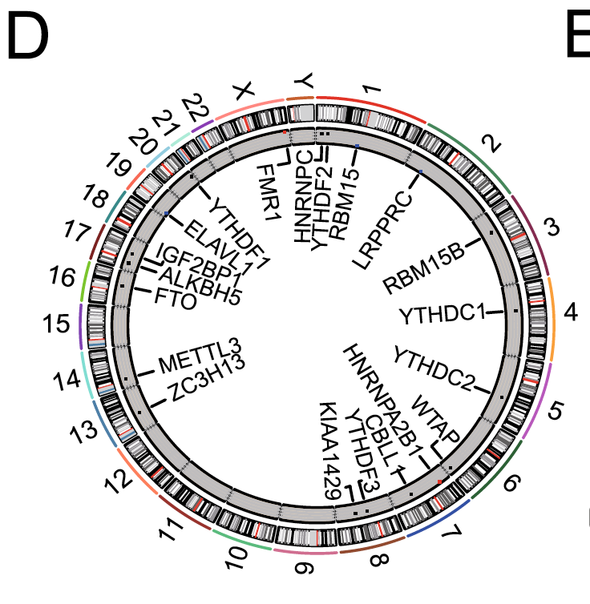

欢迎关注“小丫画图”公众号，回复“小白”，看小视频，实现点鼠标跑代码。

小丫微信: epigenomics  E-mail: figureya@126.com

作者：Caelum，他的更多作品看这里<https://k.youshop10.com/M4k338pp>

小丫编辑校验

```{r setup, include=FALSE}
knitr::opts_chunk$set(echo = TRUE)
```

# 需求描述

绘制基因位置的环形图。



出自<https://molecular-cancer.biomedcentral.com/articles/10.1186/s12943-020-01170-0>

Fig. 1 Landscape of genetic and expression variation of m6A regulators in gastric cancer.
d The location of CNV alteration of m6A regulators on 23 chromosomes using GSE62717 cohort.

# 应用场景

把几个感兴趣的基因标注在基因组上，可以像这篇例文画成圆的。

如果基因太多，可以画成直的，可参考FigureYa10chromosome，可以同时展示基因表达量/变化倍数、分类等信息。

如果还想展示基因之间的关系，可参考FigureYa74OmicCircos。

# 环境设置

使用国内镜像安装包

```{r}
options("repos"= c(CRAN="https://mirrors.tuna.tsinghua.edu.cn/CRAN/"))
options(BioC_mirror="http://mirrors.tuna.tsinghua.edu.cn/bioconductor/")
BiocManager::install("RCircos")
BiocManager::install("TCGAbiolinks")
```

加载包

```{r}
library(RCircos)
library(magrittr)
library(tidyverse)
library(rtracklayer)
Sys.setenv(LANGUAGE = "en") #显示英文报错信息
options(stringsAsFactors = FALSE) #禁止chr转成factor
```

# 目标基因位置的获取

如果你已经获得了very_easy_input.txt，就可以跳过这步，直接进入“开始画图”。

easy_input_gene.txt，根据需要定义一个基因集，后面将把基因名标在画成环状的染色体上。

hg38.gtf，基因组上所有基因所在位置，从中提取出目标基因的位置。可以从[gencode](https://www.gencodegenes.org)下载<https://ftp.ebi.ac.uk/pub/databases/gencode/Gencode_human/release_39/gencode.v39.annotation.gtf.gz>。文件较大，已上传到微云<https://share.weiyun.com/QXyYwYeP>

```{r eval=FALSE}
# 根据需要定义一个基因集
# 可以从文件读入
genes <- read.table("easy_input_gene.txt", header = T)$SYMBOL
# 也可以直接在这里写入
#genes <- c("METTL3", "METTL14", "FTO", "ALKBH5","IGF2BP3",
#           "YTHDF1", "YTHDF2", "YTHDF3", "IGF2BP1", "IGF2BP2", )

# 根据基因集提取出目的基因所在位置
gene_pos <- import("hg38.gtf") %>% # 载入gtf文件
  as.data.frame %>% 
  # 仅选择基因，去除转录本等等
  filter(source == "HAVANA", type == "gene") %>%  
  # 保留基因位置和名称
  dplyr::select(seqnames, start, end, gene_name) %>%   
  # 挑选目的基因
  filter(gene_name %in% genes)
head(gene_pos)

# 原文没说内圈散点图代表什么特征，我们这里随机生成一列数值
gene_pos$gene_dot <- rnorm(nrow(gene_pos), 0, 2)
# 保存到文件，便于套用格式
write.csv(gene_pos,"very_easy_input.csv", row.names = F, quote = F)
```

# 开始画图

very_easy_input.csv，基因、基因在染色体上的位置、基因的某一特征数值。

```{r}
# 加载基因所在的位置和数值
gene_pos <- read.csv("very_easy_input.csv", header = T)

# 加载染色体Ideogram
(data("UCSC.HG38.Human.CytoBandIdeogram"))
```


```{r, message=FALSE, fig.height = 8, fig.width=8}
pdf(file="circGene.pdf", height=5, width=5)

# 根据hg38构建染色体位置，只保留chr1-22,X,Y，在圈内部构建三圈轨道
RCircos.Set.Core.Components(UCSC.HG38.Human.CytoBandIdeogram,
                            chr.exclude = NULL,
                            tracks.inside = 3, 
                            tracks.outside = 0)
RCircos.Set.Plot.Area()

# 绘制染色体
RCircos.Chromosome.Ideogram.Plot()

# 在第一圈用散点在基因所在的位置标注数值
# 调整配色
params <- RCircos.Get.Plot.Parameters()
params$track.background <- "grey" # 第三圈默认配色为wheat，模仿原文修改为灰色
RCircos.Reset.Plot.Parameters(params)

RCircos.Scatter.Plot(gene_pos,
                     data.col = 5, # 用第5列的数值作为点的纵坐标
                     by.fold = 1, # 点的颜色cutoff，大于等于1的基因显示为红色点，小于等于-1的显示为蓝色点，-1到1之间为黑点
                     track.num = 1,
                     side = "in")

# 在第二圈绘制线段标注基因所在的位置
RCircos.Gene.Connector.Plot(genomic.data = gene_pos, 
                            track.num = 2, 
                            side = "in")

# 在第三圈标注基因名
RCircos.Gene.Name.Plot(gene_pos, 
                       name.col = 4,
                       track.num = 3, 
                       side = "in")

dev.off()
```


# 后期处理

输出到pdf文件为矢量图，可以用illustrator等软件打开，编辑图形和文字。例如为避免基因名文字重叠，手动微调文字位置，和修改连线形状。

# Session Info

```{r}
sessionInfo()
```