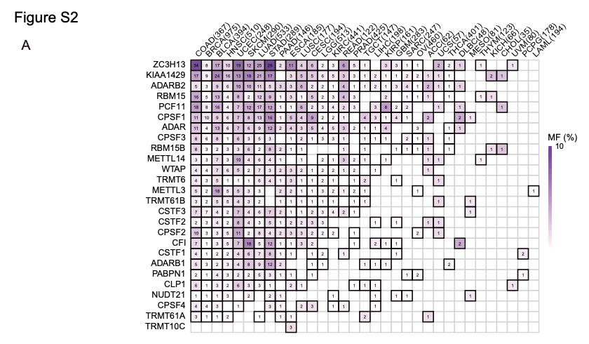
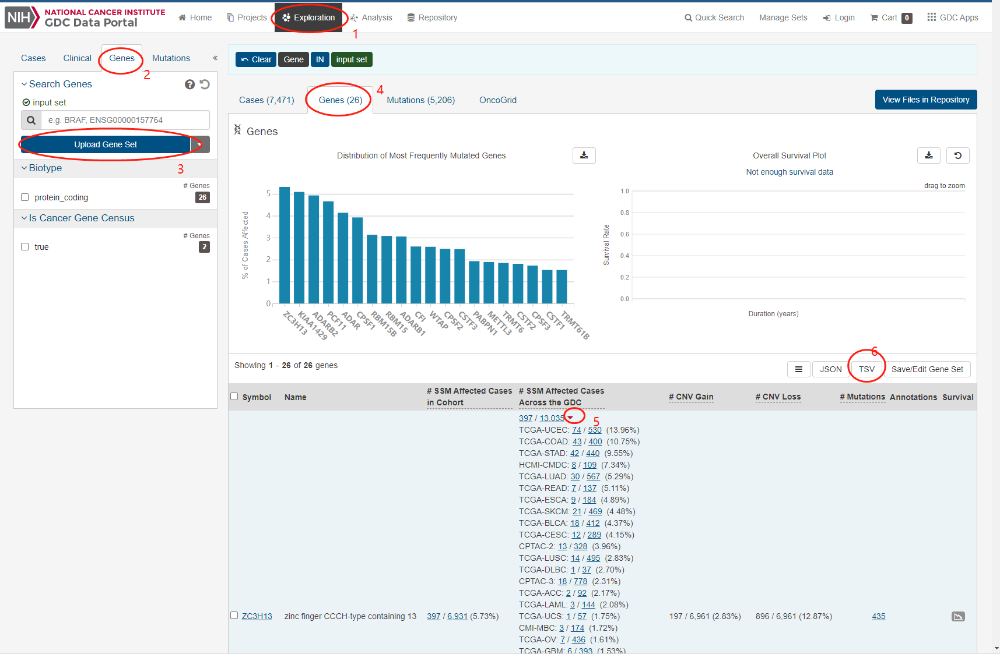

欢迎关注“小丫画图”公众号，回复“小白”，看小视频，实现点鼠标跑代码。

小丫微信: epigenomics  E-mail: figureya@126.com

作者：Hazard，他的更多作品看这里<https://k.koudai.com/zuloxG1Y>

小丫编辑校验

```{r setup, include=FALSE}
knitr::opts_chunk$set(echo = TRUE)
```

# 需求描述

希望众筹补充材料里的Figure S2A



出自<https://molecular-cancer.biomedcentral.com/articles/10.1186/s12943-021-01322-w>，跟FigureYa259circLink、FigureYa260CNV出自同一篇文章

Figure S2. Analysis of mutation frequency and CNV in TCGA- COAD/READ. 
(A) The mutation frequency of RNA modification “writers” among 33 cancer types in the TCGA cohort. The horizontal axis represents cancer types, and the number of samples is given in the parentheses. The vertical axis lists the names of the genes.

# 应用场景

TCGA pancancer突变数据的可视化，自己提供感兴趣的基因名即可。

# 环境设置

使用国内镜像安装包

```{r}
options("repos"= c(CRAN="https://mirrors.tuna.tsinghua.edu.cn/CRAN/"))
options(BioC_mirror="http://mirrors.tuna.tsinghua.edu.cn/bioconductor/")

```

加载包

```{r}
library(tidyverse)
library(magrittr)
Sys.setenv(LANGUAGE = "en") #显示英文报错信息
options(stringsAsFactors = FALSE) #禁止chr转成factor
```

# 输入文件的获得

STEP 1，选定目标基因。这里跟原文一致，选用26个m6A Writer基因。打开例文Additional file 2 12943_2021_1322_MOESM2_ESM.xlsx中的Supplementary Table 1，复制B列的26个Writter gene。

STEP 2，从GDC网站获取目的基因在33种肿瘤种的突变信息。如下图所示六个步骤，在GDC网站<https://portal.gdc.cancer.gov/>上传基因名（这里用的是STEP1获得的26个m6A Writer），保存为frequently-mutated-genes.2022-01-26.tsv文件。

> 注意：第5步，所有行（基因）的红色小三角形都要点一下。




# 解析突变信息TSV文件

```{r}
gdcdata <- read_tsv("frequently-mutated-genes.2022-01-26.tsv")
text <- gdcdata$`# SSM Affected Cases Across the GDC`[1]

gdcdata %>%
  mutate(Mut = `# SSM Affected Cases Across the GDC`) %>%
  select(Mut, Symbol) %>%
  pmap(
    function(Mut, Symbol){
      Mut %>% str_split(",") %>%
        first() %>%
        str_extract("^TCGA-.*") %>% 
        na.omit() %>%
        str_match("^TCGA-([A-Z]+): ([0-9]+) / ([0-9]+) \\(([0-9.]+)%\\)") %>%
        set_colnames(value = c("string", "cancer", "n_mutated", "n_cohort", "percent")) %>%
        as.data.frame() %>%
        mutate(n_mutated = as.numeric(n_mutated),
               n_cohort = as.numeric(n_cohort),
               percent = as.numeric(percent),
               gene = Symbol)
    }
  ) %>% do.call(what = rbind) -> mutData


mutData %>%
  mutate(cancer_num = str_glue("{cancer} ({n_cohort})")) %>%
  group_by(cancer) %>%
  mutate(total_cancer = sum(percent)) %>%
  ungroup() %>%
  group_by(gene) %>%
  mutate(total_gene = sum(percent)) %>%
  ungroup() %>%
  mutate(cancer_ordered = factor(cancer_num, levels = unique(cancer_num[order(-total_cancer)])),
         gene_ordered = factor(gene, levels = unique(gene[order(total_gene)]))) -> ggData
```

# 开始画图

```{r fig.width=8, fig.height=6}
ggplot() +
  # 填背景
  geom_blank(
    mapping = aes(cancer_ordered, gene_ordered, fill = percent),
    data = ggData,
  ) +
  
  # 画边框
  geom_tile(
    mapping = aes(cancer_ordered, gene_ordered),
    data = expand_grid(
      cancer_ordered = ggData$cancer_ordered %>% levels,
      gene_ordered = ggData$gene_ordered %>% levels
      ),
    color = "gray90",size=.5, fill = NA
  ) +
  geom_tile(
     mapping = aes(cancer_ordered, gene_ordered, fill = percent),
     data = ggData,
    color = "black",size=.5, inherit.aes = F
  ) +
  
  # 写数字
  geom_text(aes(cancer_ordered, gene_ordered, label=n_mutated),
            data = ggData,
            col ="black",
            size = 3) +
  
  scale_fill_gradientn(colors = RColorBrewer::brewer.pal(9, "Purples"), na.value = "red") +
  scale_color_manual(na.value = "grey") +
  scale_x_discrete(position = "top") +
  labs(x = NULL, y = NULL, fill = "MF (%)") +
  theme_grey() +
  theme(
    axis.text.x = element_text(angle = 45, hjust = 0),
    axis.ticks = element_blank(),
    panel.background = element_blank(),
    panel.grid = element_blank()
  )

ggsave("GDC.pdf", width = 8, height = 6)
```

> 用相同方法获得FigureYa276panSNV目标基因的突变信息，保存为frequently-mutated-genes.2022-06-03.tsv，跟FigureYa276panSNV（从xena下载数据开始）的第一个图对比，大致趋势是一致的。


# Session Info

```{r}
sessionInfo()
```