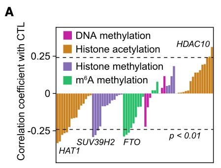

欢迎关注“小丫画图”公众号，回复“小白”，看小视频，实现点鼠标跑代码。

小丫微信: epigenomics  E-mail: figureya@126.com

作者：Caelum，他的更多作品看这里<https://k.youshop10.com/M4k338pp>

小丫编辑校验

```{r setup, include=FALSE}
knitr::opts_chunk$set(echo = TRUE)
```

# 需求描述

我想众筹这篇文章的Figure 1A。

- 1.此图的内容：在117例CD8 +T细胞高浸润的TCGA黑色素瘤样本中，表观遗传调节因子的表达与细胞毒性T淋巴细胞（CTL）评分之间的相关性。注：
  -（1）细胞毒性T淋巴细胞（CTL）评分：文献报道（PMID: 30127393）的CD8+T细胞标志与功能的基因的平均表达水平（CD8A、CD8B、GZMA、GZMB和PRF1）。
  -（2）CD8+ T细胞高浸润水平：高于TIMER上的四分位数。
  
- 2.此图的优点：
（1）扩展性强，换成其他基因及免疫细胞也可以用。
（2）实用性强：很密集的展示了很多信息。

- 3.绘图的难点：
（1）作者通过5个基因的平均表达量来定义CTL评分，代码如何实现呢？
（2）如何通过TIMER确定CD8 +T细胞高浸润的TCGA样本？
（3）CTL评分与TCGA基因表达水平之间的相关性，代码如何实现？
（4）如何绘制文章中的柱状图？



出自<https://linkinghub.elsevier.com/retrieve/pii/S1550413121001674>

Figure 1. The absence of FTO inhibits tumor growth by enhancing tumor-infiltrating T cells
(A) Spearman correlation of the expression of known epigenetic regulators with cytotoxic T lymphocyte (CTL) scores (average expression of CD8A, CD8B, GZMA, GZMB, and PRF1) in 117 TCGA melanoma samples with sufficient CD8+ T cell infiltration (defined as an estimated CD8+ T cell infiltration level higher than upper quartile by TIMER) (STAR methods). Spearman’s rho statistic is used to estimate a rank-based measure of association.

# 应用场景

从下载TCGA数据开始，进行TIMER打分，根据某一类免疫细胞分组，计算表观遗传调控因子的表达与细胞毒性T淋巴细胞CTL评分之间的相关性，并画出柱形图。

把TCGA表达数据跟免疫浸润、表观遗传都联系起来了，或许对挖掘调控机制有启发。

更多免疫浸润FigureYa看这里<https://k.youshop10.com/VfrgxyYb>

转录调控机制挖掘FigureYa看这里<https://k.youshop10.com/ohh48vwq>

# 环境设置

使用国内镜像安装包

```{r eval=FALSE}
options("repos"= c(CRAN="https://mirrors.tuna.tsinghua.edu.cn/CRAN/"))
options(BioC_mirror="http://mirrors.tuna.tsinghua.edu.cn/bioconductor/")
install.packages(c("ggcorrplot", "ggprism"))

# immunedeconv的安装方法看这里：https://github.com/icbi-lab/immunedeconv
remotes::install_github("icbi-lab/immunedeconv")
```

加载包

```{r}
library(ggprism)
library(magrittr)
library(tidyverse)
library(ggcorrplot)
library(immunedeconv)
library(TCGAbiolinks)
library(org.Hs.eg.db)
library(clusterProfiler)
library(SummarizedExperiment)

# 自定义函数，把FPKM转换成TPM
fpkmToTpm <- function(fpkm) {exp(log(fpkm) - log(sum(fpkm)) + log(1e6))}

Sys.setenv(LANGUAGE = "en") #显示英文报错信息
options(stringsAsFactors = FALSE) #禁止chr转成factor
```

# 下载TCGA数据并根据文章描述进行过滤

```{r eval=FALSE}
TCGA_SKCM_FPKM <- GDCquery(project = "TCGA-SKCM",
                           data.category = "Transcriptome Profiling",
                           data.type = "Gene Expression Quantification",
                           workflow.type = "HTSeq - FPKM") %T>% 
  GDCdownload %>% GDCprepare 

TCGA_SKCM_TPM <- TCGA_SKCM_FPKM %>% 
  # 提取出表达矩阵
  assay %>% 
  as.data.frame %>% 
  rownames_to_column("ENSEMBL") %>% 
  # 转换为SYMBOL
  inner_join(bitr(.$ENSEMBL,
                  fromType = "ENSEMBL",
                  toType = "SYMBOL",
                  OrgDb = org.Hs.eg.db)) %>% 
  # 一对多的mapping取最大值
  aggregate(list(.$SYMBOL), max) %>% 
  # 去除不必要的行
  select(-ENSEMBL, -SYMBOL) %>% 
  column_to_rownames("Group.1") %>% 
  # 转换为TPM
  apply(2,fpkmToTpm) %>% 
  as.data.frame %>% 
  # 保留平均TPM > 1的基因
  filter(rowMeans(.) > 1)

# 保存到文件，便于过后调试
save(TCGA_SKCM_TPM, "TCGA_SKCM_TPM.rdata")
```

# 进行TIMER打分，并根据CD8分为3组

这里用immunedeconv包进行TIMER打分

```{r, message=FALSE}
#加载前面处理好的数据
(load("TCGA_SKCM_TPM.rdata")) 

# 使用TIMER进行打分，指明每个样本所属的癌种
TCGA_SKCM_imme <- deconvolute_timer(TCGA_SKCM_TPM, indications = rep("skcm", ncol(TCGA_SKCM_TPM))) %>%
  t %>% as.data.frame

# 计算四分位数
(TIMER4 <- quantile(TCGA_SKCM_imme$T_cell.CD8))

# 根据四分位数分为3组
TCGA_SKCM_CD8_h <- TCGA_SKCM_imme %>% filter(T_cell.CD8 >= TIMER4[4])
TCGA_SKCM_CD8_m <- TCGA_SKCM_imme %>% filter(T_cell.CD8 >= TIMER4[2]
 & T_cell.CD8 < TIMER4[2])
TCGA_SKCM_CD8_l <- TCGA_SKCM_imme %>% filter(T_cell.CD8 < TIMER4[2])
```

# 自定义表观修饰基因集，并进行整合

文中没有找到定义的表观修饰相关的基因集，可以根据背景知识自定义，这里提供的基因集仅供参考。

```{r, message=FALSE}
# 这里定义三类表观修饰基因
m6A_genes <- c("METTL3", "METTL14", "FTO", "ALKBH5",
           "YTHDF1", "YTHDF2", "YTHDF3", "IGF2BP1", "IGF2BP2", "IGF2BP3") %>% 
  as.data.frame %>% mutate(type = "m6A_genes")
DNAm_genes <- c("CTCF", "DNMT1", "HELLS", "UHRF1", "UHRF2", "USP7", "ZNF445") %>% 
  as.data.frame %>% mutate(type = "DNAm_genes")
His_genes <- c("CARM1", "COPRS", "NR1H4", "PRDM14", "PRDM4",
               "PRMT1", "PRMT2", "PRMT5", "PRMT6", "PRMT7", "PRMT8") %>% 
  as.data.frame %>% mutate(type = "His_genes")

# 合并
genes_df <- rbind(m6A_genes, DNAm_genes, His_genes) %>% set_colnames(c("gene", "type"))
```

# 计算CTL

根据文中定义，CTL为CD8A、CD8B、GZMA、GZMB和PRF1表达的均值

```{r, message=FALSE}
TCGA_SKCM_CD8_h_score <- TCGA_SKCM_TPM %>% 
  select(rownames(TCGA_SKCM_CD8_h)) %>% 
  t %>% as.data.frame %>% 
  mutate(CTL = (CD8A + CD8B + GZMA + GZMB + PRF1)/5) %>% 
  select_if(colnames(.) %in% c("CTL", all_of(genes_df$gene)))

# 保存到文件
write.csv(TCGA_SKCM_CD8_h_score, "output_CTL.csv", quote = F)
```

# 计算相关系数以及显著性

```{r, message=FALSE, warning=FALSE}
# 使用spearman方法计算P值
corp_df <- cor_pmat(TCGA_SKCM_CD8_h_score, method = "spearman") %>%
  as.data.frame %>%
  select(CTL) %>% 
  set_colnames("p.val") %>% 
  filter(rownames(.) != "CTL") %>% 
  rownames_to_column("gene") 

# 使用spearman方法计算相关系数
cor_df <- cor(TCGA_SKCM_CD8_h_score, method = "spearman") %>%
  as.data.frame %>%
  select(CTL) %>% 
  filter(rownames(.) != "CTL") %>% 
  rownames_to_column("gene") %>% 
  inner_join(genes_df) %>% 
  inner_join(corp_df) %>% 
  
  # 这一步因为筛选之后基因太少，不好看，故而注释掉了，实际作图时根据需要调整
  # filter(p.val < 0.01) %>% 
  mutate(group = ifelse(CTL > 0, 1, -1))

# 保存到文件
write.csv(cor_df, "output_cor.csv")
```

# 开始画图

```{r, message=FALSE}
ggplot(cor_df, aes(x = gene, y = CTL, fill = type)) +
  geom_col() +
  # 画虚线
  geom_hline(yintercept = c(-0.25, 0.25), lwd = 1, lty = 2) +
  # y轴label
  scale_y_continuous(breaks = c(-0.25, 0, 0.25), 
                     labels = c("-0.25", "0", "0.25")) +
  # 根据group（即表观修饰类型）分组
  scale_x_discrete(limits = cor_df %>% arrange(group, type, CTL) %$% gene) +
  # 分组颜色
  scale_fill_manual(labels = c("DNA Methylation", "Histone Methylation", "m6A Methylation"),
                    values = c("darkgoldenrod3", "mediumorchid3", "seagreen3")) +
  
  xlab(NULL) +
  ylab("Correlation coefficient with CTL") +
  theme_prism() +
  theme(panel.border = element_rect(fill=NA, color="black", size=1.5, linetype="solid"),
        axis.line = element_line(size = 0),
        axis.ticks.x = element_blank(),
        axis.text.x = element_blank(), 
        legend.position = c(0.02, 0.95), legend.justification = c(0, 1),
        legend.text = element_text(size = 12)) -> p
p  

# 以下代码可用于在图中添加文字，也可以忽略代码，手动添加
# 写pvalue，根据自己的数据调整位置
p + annotate("text", x = 20, y = -0.3, 
           label = "p < 0.01", size = 5) + 
  # 写基因名
  geom_text(data = subset(cor_df, gene == "USP7"),
            aes(gene, CTL - 0.02,label = "USP7")) + 
  geom_text(data = subset(cor_df, gene == "COPRS"),
            aes(gene, CTL - 0.02,label = "COPRS")) +
  geom_text(data = subset(cor_df, gene == "YTHDF2"),
            aes(gene, CTL - 0.02,label = "YTHDF2")) +
  geom_text(data = subset(cor_df, gene == "IGF2BP1"),
            aes(gene, CTL + 0.02,label = "IGF2BP1"))

ggsave("epiImmune.pdf", width = 6, height = 4)
```

# 后期处理

输出的PDF文件是矢量图，可以用Illustrator等矢量图编辑器打开，把图中文字改为斜体，调整左右两侧基因名的位置。或者干脆手动添加想要显示的基因名。

# Session Info

```{r}
sessionInfo()
```