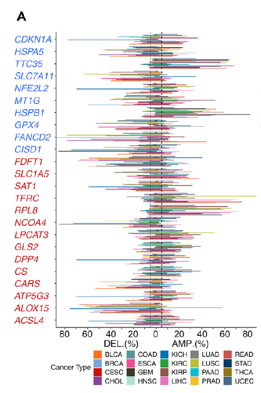

欢迎关注“小丫画图”公众号，回复“小白”，看小视频，实现点鼠标跑代码。

小丫微信: epigenomics  E-mail: figureya@126.com

作者：大鱼海棠，他的更多作品看这里<https://k.koudai.com/OFad8N0w>

单位：中国药科大学国家天然药物重点实验室，生物统计与计算药学研究中心

小丫编辑校验

```{r setup, include=FALSE}
knitr::opts_chunk$set(echo = TRUE)
```

# 需求描述

小丫姐好，我还有很多小伙伴想众筹这篇铁死亡泛癌的其他图片，主要是Figure 1。感觉这个套路只要换一个通路就可以测试，我看大鱼老师写了这篇文章的Figure 2A（铁死亡基因在泛癌肿瘤与正常的差异箱线图，FigureYa208FPI），Figure 3B（铁死亡与免疫通路的相关性，FigureYa253panGSEA），可否请大鱼老师详细写一下文章Figure 1的相关代码？

- 1A（铁死亡在泛癌中体细胞拷贝数变异情况，绘制条形图）
- 1B（铁死亡基因在肿瘤与正常的差异表达，绘制拼接的点图和柱状图，可参考FigureYa263panDiff）
- 1C（铁死亡基因体细胞拷贝数与基因表达的相关性点图）
- 1D（铁死亡基因肿瘤与正常组织甲基化状态点图）
- 1E（铁死亡转录组表达与启动子甲基化相关性的点图）

这些图都是泛癌的，不知道大鱼老师可不可以用例文数据分别众筹个教程 [皱眉] ？（感觉都可以出一期专栏——iSicence复现了哈哈）

这次众筹Figure 1A，铁死亡在泛癌中体细胞拷贝数变异情况。



出自<https://linkinghub.elsevier.com/retrieve/pii/S2589004220304892>

Figure 1. The Dysregulation of Ferroptosis Regulator Genes (FRGs)
For which the positive and negative regulators are marked in red and blue, respectively.
(A) Histogram shows the frequency of somatic copy number alterations for each FRG in each cancer type.

接下来会陆续众筹Figure1CDE，敬请关注。

# 应用场景

分析铁死亡在泛癌中体细胞拷贝数变异情况并绘制条形图

更多pancancer分析画图FigureYa看这里<https://k.youshop10.com/C8RkTgR3>

# 环境设置

使用国内镜像安装包

```{r}
options("repos"= c(CRAN="https://mirrors.tuna.tsinghua.edu.cn/CRAN/"))
options(BioC_mirror="http://mirrors.tuna.tsinghua.edu.cn/bioconductor/")
install.packages("randomcoloR")
```

加载包

```{r}
library(ggplot2)
library(data.table)
library(randomcoloR)

Sys.setenv(LANGUAGE = "en") #显示英文报错信息
options(stringsAsFactors = FALSE) #禁止chr转成factor
```

# 输入文件

前两个文件跟FigureYa253panGSEA、FigureYa263panDiff使用的是同一套数据，已经下载的小伙伴就不用重复下载了。

merged_sample_quality_annotations.tsv，下载自<https://gdc.cancer.gov/about-data/publications/pancanatlas>，下载地址<http://api.gdc.cancer.gov/data/1a7d7be8-675d-4e60-a105-19d4121bdebf>

EBPlusPlusAdjustPANCAN_IlluminaHiSeq_RNASeqV2.geneExp.tsv，表达矩阵，第一列是基因，之后是其在每个样本中的表达量。下载自<http://api.gdc.cancer.gov/data/3586c0da-64d0-4b74-a449-5ff4d9136611>

TCGA.PANCAN.sampleMap_Gistic2_CopyNumber_Gistic2_all_data_by_genes.gz，CNV数据，下载地址<https://xenabrowser.net/datapages/?dataset=TCGA.PANCAN.sampleMap%2FGistic2_CopyNumber_Gistic2_all_data_by_genes&host=https%3A%2F%2Ftcga.xenahubs.net&removeHub=https%3A%2F%2Fxena.treehouse.gi.ucsc.edu%3A443>

```{r}
# 设置颜色
blue <- "#4577FF"
red <- "#C2151A"

# 获得同时有肿瘤和正常样本的肿瘤名
tumors <- c("BLCA","BRCA","CESC","CHOL","COAD",
            "ESCA","GBM","HNSC","KICH","KIRC",
            "KIRP","LIHC","LUAD","LUSC","PAAD",
            "PRAD","READ","STAD","THCA","UCEC")

# 获得感兴趣的基因集(TTC35是EMC2的同名)
frg <- c("CDKN1A","HSPA5","TTC35","SLC7A11","NFE2L2","MT1G","HSPB1","GPX4","FANCD2","CISD1","FDFT1","SLC1A5","SAT1",
         "TFRC","RPL8","NCOA4","LPCAT3","GLS2","DPP4","CS","CARS","ATP5G3","ALOX15","ACSL4","EMC2")

# 修正TCGA名称
rawAnno <- read.delim("merged_sample_quality_annotations.tsv",sep = "\t",row.names = NULL,check.names = F,stringsAsFactors = F,header = T) # 数据来自PanCanAtlas
rawAnno$simple_barcode <- substr(rawAnno$aliquot_barcode,1,15)
samAnno <- rawAnno[!duplicated(rawAnno$simple_barcode),c("cancer type", "simple_barcode")]
samAnno <- samAnno[which(samAnno$`cancer type` != ""),]
write.table(samAnno,"simple_sample_annotation.txt",sep = "\t",row.names = F,col.names = T,quote = F)

# 加载CNV数据
cnv <- fread("TCGA.PANCAN.sampleMap_Gistic2_CopyNumber_Gistic2_all_data_by_genes.gz",sep = "\t",stringsAsFactors = F,header = T,check.names = F) # 数据来自XENA TCGA Pan-Cancer (PANCAN)
cnv <- as.data.frame(cnv); rownames(cnv) <- cnv[,1]; cnv <- cnv[,-1]
comgene <- intersect(rownames(cnv),frg)
cnv <- cnv[comgene,]
```

# Frequency of somatic copy number alterations for each FRG in each cancer type.

```{r}
cnvTab <- NULL
for (i in tumors) {
  message("--",i,"...")
  sam <- samAnno[which(samAnno$`cancer type` == i),"simple_barcode"] # 获取该肿瘤的全部样本
  comsam <- intersect(colnames(cnv), sam) # 取出与拷贝数泛癌数据交集的样本
  
  cnv_subset <- cnv[,comsam] # 取出该肿瘤的拷贝数子集
  write.table(cnv_subset, paste0("TCGA_",i,"_cnv_subset.txt"),sep = "\t",row.names = T,col.names = NA,quote = F)
  
  # 这里扩增和缺失的阈值设为0.05，即5%，可根据自己的数据调整
  cnv_subset[cnv_subset > 0.05] <- "Amp" # 找到扩增
  cnv_subset[cnv_subset < -0.05] <- "Del" # 找到缺失
  
  amp <- rowSums(cnv_subset == "Amp")/length(comsam) # 计算扩增率
  del <- -rowSums(cnv_subset == "Del")/length(comsam) # 计算缺失率
  
  cnv_rate <- data.frame(gene = rownames(cnv_subset),
                         Amp = amp,
                         Del = del,
                         tumor = i,
                         stringsAsFactors = F)
  write.table(cnv_rate, paste0("TCGA_",i,"_cnvrate_subset.txt"),sep = "\t",row.names = F,col.names = T,quote = F)
  
  cnvTab <- rbind.data.frame(cnvTab,cnv_rate)
  write.table(cnvTab, "TCGA_pancan_cnvrate_subset.txt",sep = "\t",row.names = F,col.names = T,quote = F)
}
gc()
```

# 开始画图

```{r fig.width=5, fig.height=10}
# 生成柱状图
n <- 20 # 随机产生20种颜色
palette <- distinctColorPalette(n)
df <- melt(cnvTab, id.vars = c("gene","tumor"), variable.name = "CNV")
df$gene <- factor(df$gene, # 如果想的话可以设置基因的顺序
                  levels = rev(c("CDKN1A","HSPA5","EMC2","SLC7A11","NFE2L2","MT1G","HSPB1","GPX4","FANCD2","CISD1",
                                 "FDFT1","SLC1A5","SAT1","TFRC","RPL8","NCOA4","LPCAT3","GLS2","DPP4","CS","CARS","ATP5G3","ALOX15","ACSL4")))
ggplot(df, aes(x=gene, y=value, fill=tumor)) + 
  geom_bar (stat="identity", position = position_dodge(width = 0.7)) +   
  scale_fill_manual(values = palette) + 
  scale_y_continuous(
    breaks = c(-0.8, -0.6, -0.4, -0.2, 0, 0.2, 0.4, 0.6, 0.8),
    labels = c(-80,-60,-40,-20,0,20,40,60,80)
  ) +
  geom_hline(yintercept = c(-0.05, 0.05), # 跟前面阈值设置一致
             lwd = .5, lty = 2) +

  coord_flip() +
  theme_classic() +
  theme(axis.line.y = element_line(size = 0.8),
        axis.ticks.y = element_line(size = 0.2),
        axis.text.x = element_text(size = 12, color = "black"),
        axis.text.y = element_text(size = 12, color = rep(c(red,blue),c(14,10))),
        axis.title.y = element_blank(),
        axis.title.x = element_blank(),
        legend.title = element_blank(),
        legend.position = "bottom")

ggsave("Figure 1A copy number variation rate of interested genes in pancancer.pdf", width = 6,height = 8)
rm(cnv); gc()
```

# Session Info

```{r}
sessionInfo()
```