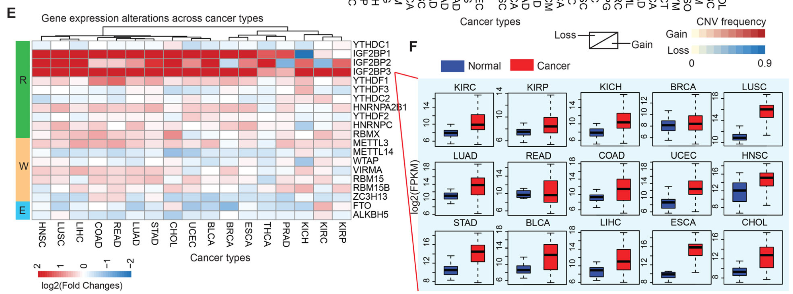

欢迎关注“小丫画图”公众号，回复“小白”，看小视频，实现点鼠标跑代码。

小丫微信: epigenomics  E-mail: figureya@126.com

作者：大鱼海棠，他的更多作品看这里<https://k.koudai.com/OFad8N0w>

单位：中国药科大学国家天然药物重点实验室，生物统计与计算药学研究中心

小丫编辑校验

```{r setup, include=FALSE}
knitr::opts_chunk$set(echo = TRUE)
```

# 需求描述

复现Figure1的EF，希望能用原始数据。



出自<https://molecular-cancer.biomedcentral.com/articles/10.1186/s12943-019-1066-3>

Fig. 1 Pan-cancer genetic and expression alterations of m6A regulators.
e The gene expression alterations of m6A regulators in 17 cancer types. The heat map shows the fold changes, with red representing up-regulated genes, and blue representing down-regulated genes. 
f Box plots showing the expression distribution of IGF2BP3 across tumor and
normal samples in 15 cancer types

# 应用场景

对泛癌中肿瘤与正常样本做多个基因（m6A为例）的差异表达分析，并根据log2FoldChange值绘制泛癌热图，同时对感兴趣基因绘制泛癌箱型图。

如果想换成泡泡图结合柱形图，可参考FigureYa263panDiff，<https://k.youshop10.com/v5okDUEr>

如果想用GSEA计算并展示多个**基因集**的差异表达，可参考FigureYa253panGSEA，<https://k.youshop10.com/QbM6nwGB>

如果只对单个基因感兴趣，可参考FigureYa55panCancer_violin，画成小提琴图或box plot，<https://www.yuque.com/figureya/figureyaplus/figureya55p>。

另外，我们还众筹过这篇文章的其他几个有意思的图：

- Fig.1D对角热图，可参考FigureYa144DiagHeatmap或<https://mp.weixin.qq.com/s/34WRZRBVPHUNRLlzNH2nzw>
- Fig.2A靶向关系连线图，可参考FigureYa199crosslink，<https://k.youshop10.com/Zbb7VoNM>，带你实现连线自由
- Fig.3A基因集的survival landscape，可参考FigureYa210survivalScape，<https://k.youshop10.com/dDv=wvoj>

更多泛癌FigureYa看这里，<https://k.youshop10.com/C8RkTgR3>

# 环境设置

使用国内镜像安装包

```{r}
options("repos"= c(CRAN="https://mirrors.tuna.tsinghua.edu.cn/CRAN/"))
options(BioC_mirror="http://mirrors.tuna.tsinghua.edu.cn/bioconductor/")

```

加载包

```{r}
library(data.table)
library(impute)
library(ClassDiscovery)
library(ComplexHeatmap)
source("twoclasslimma.R")
Sys.setenv(LANGUAGE = "en") #显示英文报错信息
options(stringsAsFactors = FALSE) #禁止chr转成factor
```

# 输入文件

跟FigureYa253panGSEA、FigureYa263panDiff、FigureYa265panCNV使用的是同一套输入数据，已经下载的小伙伴就不用重复下载了。

merged_sample_quality_annotations.tsv，下载自<https://gdc.cancer.gov/about-data/publications/pancanatlas>，下载地址<http://api.gdc.cancer.gov/data/1a7d7be8-675d-4e60-a105-19d4121bdebf>

EBPlusPlusAdjustPANCAN_IlluminaHiSeq_RNASeqV2.geneExp.tsv，表达矩阵，第一列是基因，之后是其在每个样本中的表达量。下载自<http://api.gdc.cancer.gov/data/3586c0da-64d0-4b74-a449-5ff4d9136611>

```{r}
# 定义感兴趣的M6A基因集(VIRMA和KIAA1429同名，https://www.genecards.org/cgi-bin/carddisp.pl?gene=VIRMA)
m6a <- c("YTHDC1","IGF2BP1","IGF2BP2","IGF2BP3",
         "YTHDF1","YTHDF3","YTHDC2","HNRNPA2B1",
         "YTHDF2","HNRNPC","RBMX","METTL3",
         "METTL14","WTAP","KIAA1429","RBM15",
         "RBM15B","ZC3H13","FTO","ALKBH5")

# 获得同时有肿瘤和正常样本的肿瘤名
tumors <- c("BLCA","BRCA","CESC","CHOL","COAD",
            "ESCA","GBM","HNSC","KICH","KIRC",
            "KIRP","LIHC","LUAD","LUSC","PAAD",
            "PRAD","READ","STAD","THCA","UCEC")

# 修正TCGA名称
# https://gdc.cancer.gov/about-data/publications/pancanatlas
rawAnno <- read.delim("merged_sample_quality_annotations.tsv",sep = "\t",row.names = NULL,check.names = F,stringsAsFactors = F,header = T) # 数据来自PanCanAtlas
rawAnno$simple_barcode <- substr(rawAnno$aliquot_barcode,1,15)
samAnno <- rawAnno[!duplicated(rawAnno$simple_barcode),c("cancer type", "simple_barcode")]
samAnno <- samAnno[which(samAnno$`cancer type` != ""),]
write.table(samAnno,"simple_sample_annotation.txt",sep = "\t",row.names = F,col.names = T,quote = F)

# 快速读取表达谱
# https://gdc.cancer.gov/about-data/publications/pancanatlas
expr <- fread("EBPlusPlusAdjustPANCAN_IlluminaHiSeq_RNASeqV2.geneExp.tsv",sep = "\t",stringsAsFactors = F,check.names = F,header = T)
expr <- as.data.frame(expr); rownames(expr) <- expr[,1]; expr <- expr[,-1]
gene <- sapply(strsplit(rownames(expr),"|",fixed = T), "[",1) # 调整行名
expr$gene <- gene
expr <- expr[!duplicated(expr$gene),] # 移除重复样本
rownames(expr) <- expr$gene; expr <- expr[,-ncol(expr)]

comgene <- intersect(rownames(expr),m6a) # 取部分表达谱，全部匹配
expr_sub <- expr[comgene,]
colnames(expr_sub) <- substr(colnames(expr_sub),1,15)
expr_sub <- expr_sub[,!duplicated(colnames(expr_sub))]

rm(expr); gc()
```

# 差异表达分析

```{r}
# 初始化差异表达矩阵以存储每个基因在每个癌种种类里的log2FoldChange值
degRes <- as.data.frame(matrix(NA,nrow = length(comgene),ncol = length(tumors),
                 dimnames = list(comgene,tumors)))
for (i in tumors) {
  message("--",i,"...")
  sam <- samAnno[which(samAnno$`cancer type` == i),"simple_barcode"]
  comsam <- intersect(colnames(expr_sub), sam)
  
  tumsam <- comsam[substr(comsam,14,14) == "0"] # 获得肿瘤样本
  norsam <- comsam[substr(comsam,14,14) == "1"] # 获得正常样本
  
  expr_subset <- expr_sub[,c(tumsam,norsam)]
  expr_subset[expr_subset < 0] <- 0 # 这份数据里存在负值，即便负值比较小，但也要矫正，如果使用其他泛癌表达谱根据情况而定
  expr_subset <- as.data.frame(impute.knn(as.matrix(expr_subset))$data) # 这份泛癌数据存在空值，所以做缺失值填补
  
  # 输出子表达谱
  write.table(expr_subset, paste0("TCGA_",i,"_expr_subset.txt"),sep = "\t",row.names = T,col.names = NA,quote = F)
  
  # 利用limma脚本做差异表达分析（脚本会识别数据的量级来确定是否进行对数化）
  subt <- data.frame(condition = rep(c("tumor","normal"),c(length(tumsam),length(norsam))),
                     row.names = colnames(expr_subset),
                     stringsAsFactors = F)
  twoclasslimma(subtype  = subt, # 亚型信息 (必须含有一列叫'condition')
                featmat  = expr_subset, # 表达谱 (会自动判断数据量级)
                treatVar = "tumor", # “治疗组”的名（就是要比较的组）
                ctrlVar  = "normal", # “对照组”的名（就是被比较的组）
                prefix   = paste0("TCGA_",i), # 差异表达的文件的前缀
                overwt   = T, # 是否覆盖已经存在的差异表达文件
                sort.p   = F, # 是否排序p值
                verbose  = TRUE, # 是否简化输出
                res.path = ".") # 输出结果
  
  # 加载差异表达文件
  res <- read.table(paste0("TCGA_",i,"_limma_test_result.tumor_vs_normal.txt"),sep = "\t",row.names = 1,check.names = F,stringsAsFactors = F,header = T)
  degRes[,i] <- res[rownames(degRes),"log2fc"]
}

write.table(degRes,file = "log2fc of m6a genes between tumor and normal samples in pancancer.txt",sep = "\t",row.names = T,col.names = NA,quote = F)
```

上面“差异表达分析”输出的TCGA_\*_limma_test_result.tumor_vs_normal.txt文件可无缝对接FigureYa59volcano，<https://k.youshop10.com/QFx3=Jj1>，绘制美丽火山图。

# 开始画图

## 绘制log2FoldChange的热图

```{r}
indata <- degRes
hcs <- hclust(distanceMatrix(as.matrix(indata), "euclidean"), "ward.D") # 对log2FC做聚类

## 创建行注释
annRow <- data.frame(row.names = m6a,
                     class = rep(c("Readers","Writers","Erasers"),c(11,7,2)))
annRow$class <- factor(annRow$class, levels = c("Readers","Writers","Erasers"))
annColors <- list(class = c("Readers" = "#51B743",
                            "Writers" = "#FAC67A",
                            "Erasers" = "#5AC9FA"))
colPattern <- c("#183869","#4195C1","white","#CB5746","#62011D") # 设置热图的颜色板

hm <- pheatmap(as.matrix(indata[rownames(annRow),]),
         border_color = "black", # 显示热图单元格的边框并设置为黑色
         cluster_rows = FALSE, # 行不聚类
         cluster_cols = hcs, # 列聚类
         show_rownames = TRUE, # 显示行名
         show_colnames = TRUE, # 显示列名
         annotation_row = annRow, # 行注释
         annotation_colors = annColors, # 注释颜色
         cellwidth = 18, # 单元格宽度
         cellheight = 12, # 单元格高度
         color = colorRampPalette(colPattern)(64), # 热图颜色
         name = "log2FoldChange") # 热图入值的命名

pdf(file = "pancancer heatmap of log2fc for m6A between tumor and normal samples.pdf", width = 8, height = 6)
draw(hm)
invisible(dev.off())
```


## 批量绘制箱型图(y轴的标签可以最后用AI补上)

以`IGF2BP3`基因为例

```{r}
geneInterest <- "IGF2BP3" # 设置感兴趣的基因
darkred <- "#F2042C"
darkblue <- "#21498D"

pdf(file = paste0("pancancer boxplot of ", geneInterest, " expression between tumor and normal samples.pdf"), width = 10,height = 10)
par(mfrow = c(4,5))
for (i in tumors) {
  message("--",i,"...")
  sam <- samAnno[which(samAnno$`cancer type` == i),"simple_barcode"]
  comsam <- intersect(colnames(expr_sub), sam)
  
  tumsam <- comsam[substr(comsam,14,14) == "0"] # 获得肿瘤样本
  norsam <- comsam[substr(comsam,14,14) == "1"] # 获得正常样本
  
  # 读入子表达谱
  expr_subset <- read.table(paste0("TCGA_",i,"_expr_subset.txt"),sep = "\t",row.names = 1,check.names = F,stringsAsFactors = F,header = T)
  
  exprTgene <- log2(as.numeric(expr_subset[geneInterest,tumsam]) + 1) # 取出肿瘤样本特定基因的表达并对数化
  exprNgene <- log2(as.numeric(expr_subset[geneInterest,norsam]) + 1) # 取出正常样本特定基因的表达并对数化
  
  par(bty="o", mgp = c(1.5,.33,0), 
      mar=c(0.1,1.5,2,0.1), # 为了使得图形尽可能紧凑，因为四边的距离分别设置为0.1（底部空出一小段距离），1.5（左边因为要放y轴刻度），2（顶部因为肿瘤名写在顶部），0.1（右部空出一小段距离）
      las=1, tcl=-.25,las = 1, xpd = F)
  boxplot(exprNgene,exprTgene,
          col = c(darkblue,darkred), # 箱子颜色
          outline = FALSE, # 移除离群值
          ylab = "", # 不显示y轴名
          xaxt='n') # 移除x轴上的标记
  mtext(side = 3, text = i,line = 0.5) # 在图形顶部输入肿瘤名
}
invisible(dev.off())
```


# Session Info

```{r}
sessionInfo()
```