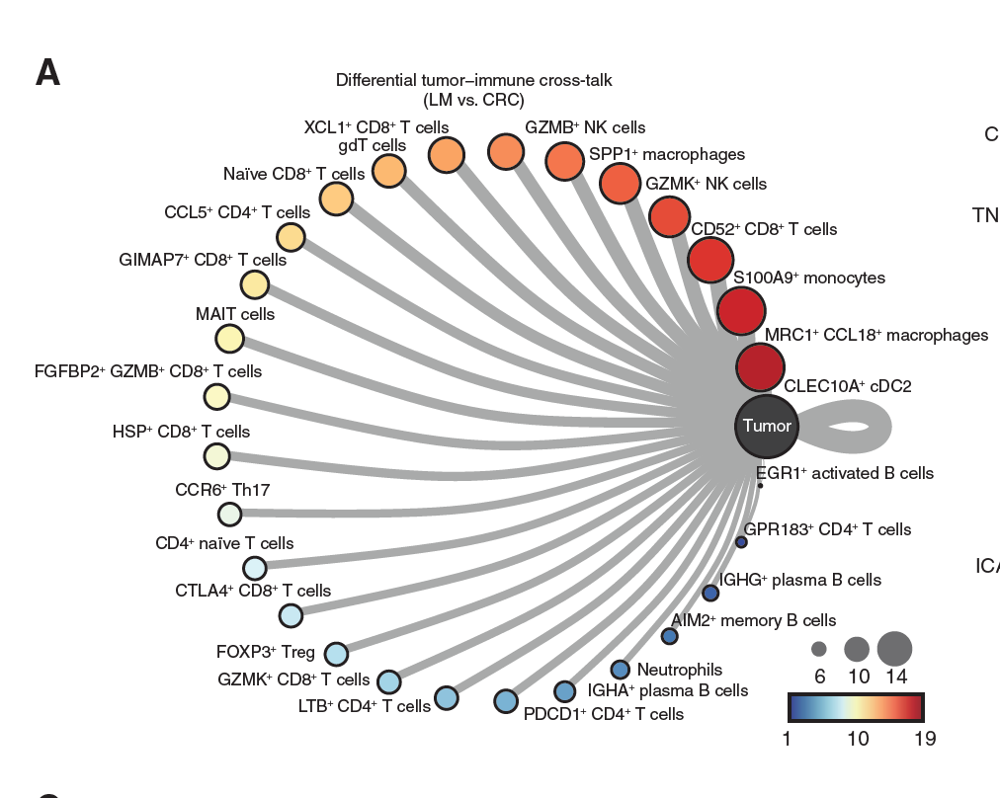
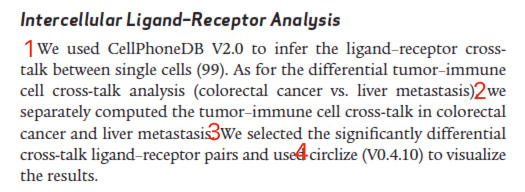
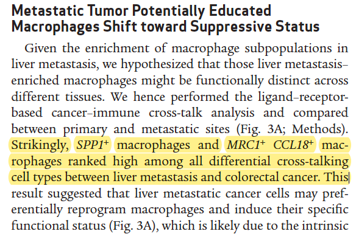

欢迎关注“小丫画图”公众号，回复“小白”，看小视频，实现点鼠标跑代码。

小丫微信: epigenomics  E-mail: figureya@126.com

作者：古潇，他的更多作品看这里<https://k.koudai.com/uH4zuEWC>

小丫编辑校验

```{r setup, include=FALSE}
knitr::opts_chunk$set(echo = TRUE)
```

# 需求描述

希望用cellchat来实现：



出自<https://aacrjournals.org/cancerdiscovery/article/12/1/134/675646/Spatiotemporal-Immune-Landscape-of-Colorectal>

Figure 3. MRC1+ CCL18+ macrophages in metastatic tumors exhibited terminally differentiated and suppressive states. 
A, The ranked differential tumor–immune cell cross-talk [liver metastasis (LM) vs. colorectal cancer (CRC)] shows MRC1+ CCL18+ M2-like macrophages ranked the second among all ligand–receptor pairs.



> 本文档作者古潇的comments:

例文提出假设“Given the enrichment of macrophage subpopulations in liver metastasis, we hypothesized that those liver metastasis–enriched macrophages might be functionally distinct across
different tissues.” 怎样验证这个假设呢？

作者用CellPhoneDB分析 + circlize可视化来解决。由于CellPhoneDB不能直接处理两组间的关系，所以作者用了一个变通的方法：

- 把直肠癌的所有细胞类型combined到一起，相当于一种细胞类型，命名为tumor，这样就可以克服cellphonedb无法一次性比较两组间的关系的困难。

这个方法其实我不太认可，这样抹掉了结肠癌的细胞类型的信息。我个人认为cellchat的算法是优于cellphonedb的，尤其是在有对照处理的分析中。

提需求的小伙伴要求用cellchat来实现，用cellchat的确可以很方便的实现。详见“开始画图”结尾的“结果解读”。

# 应用场景

单细胞RNA-seq数据，对比两组样本（例文的原发vs.转移、不同亚型、不同发育时期等）之间，基于“受体-配体”的差异，用cellchat来实现。

另外，CellPhoneDB的用法可参考FigureYa178receptorLigand<https://k.youshop10.com/YICoy-XB>

# 环境设置

使用国内镜像安装包

```{r eval=FALSE}
options("repos"= c(CRAN="https://mirrors.tuna.tsinghua.edu.cn/CRAN/"))
options(BioC_mirror="http://mirrors.tuna.tsinghua.edu.cn/bioconductor/")
install.packages("magrittr")
devtools::install_github('satijalab/seurat-data')
devtools::install_github("sqjin/CellChat") # 安装CellChat计算细胞间互作
```

加载包

```{r}
library(Seurat)
library(SeuratData)
library(RColorBrewer)
library(dplyr)
library(magrittr)
library(CellChat)
library(patchwork)

Sys.setenv(LANGUAGE = "en") #显示英文报错信息
options(stringsAsFactors = FALSE) #禁止chr转成factor
```

# 输入数据预处理

`ifnb` - A Seurat object with the PBMC control/IFNB-stimulated dataset。出自<https://pubmed.ncbi.nlm.nih.gov/29227470/>，已被打包到SeuratData里，我们直接安装、加载它。

示例数据ifnb有STIM和CTRL两组：

- 先拆分成两个seurat object，对两个数据集单独进行normalize并识别各自的高变异基因，使用高变异基因在两个基因集中分别执行PCA。
- 然后对两个数据集进行整合，进行常规数据预处理，存入immune.combined，以便进行后续分析。

```{r eval=FALSE}
## 加载示例数据
# install dataset
InstallData("ifnb")

# load dataset
(LoadData("ifnb"))
?ifnb

# ifnb数据集中包含两个样本数据，分别为CTRL和STIM
head(ifnb@meta.data)
table(ifnb@meta.data$stim)


## 数据拆分成两组(STIM和CTRL)
# 使用splitobject将ifnb数据集分割成两个seurat对象的列表(STIM和CTRL)
ifnb.list <- SplitObject(ifnb, split.by = "stim")

# 对两个数据集单独进行normalize并识别各自的高变异基因
ifnb.list <- lapply(X = ifnb.list, FUN = function(x) {
  x <- NormalizeData(x)
  x <- FindVariableFeatures(x, selection.method = "vst", nfeatures = 2000)
})

# 计算两个数据中排完rank后top2000的高变异基因
features <- SelectIntegrationFeatures(object.list = ifnb.list, nfeatures = 2000)

# 使用上述高变异基因在两个基因集中分别执行PCA
ifnb.list <- lapply(X = ifnb.list, FUN = function(x) {
  x <- ScaleData(x, features = features, verbose = T)
  x <- RunPCA(x, features = features, verbose = T)
})


## 对两个数据集进行整合
# 首先使用findinintegrationanchors函数标识锚点，然后使用IntegrateData函数将两数据集整合在一起
# 可以通过调整k.anchor参数调整两个样本整合的强度，默认为5，数字越大整合强度越强
immune.anchors <- FindIntegrationAnchors(object.list = ifnb.list, anchor.features = features, reduction = "rpca", k.anchor = 20)
immune.combined <- IntegrateData(anchorset = immune.anchors)

# 对整合后的数据进行后续分析
DefaultAssay(immune.combined) <- "integrated"

# 常规流程，scale数据，跑PCA，使用前30个PC进行降维跑UMAP，计算Neighbors，分cluster
immune.combined <- ScaleData(immune.combined, verbose = FALSE)
immune.combined <- RunPCA(immune.combined, npcs = 30, verbose = FALSE)
immune.combined <- RunUMAP(immune.combined, reduction = "pca", dims = 1:30)
immune.combined <- FindNeighbors(immune.combined, reduction = "pca", dims = 1:30)
immune.combined <- FindClusters(immune.combined, resolution = 0.5)

DefaultAssay(immune.combined) <- "RNA"
Idents(immune.combined) <- "CellType"

# 可视化
p1 <- DimPlot(immune.combined, reduction = "umap", group.by = "stim")
p2 <- DimPlot(immune.combined, reduction = "umap", group.by = "seurat_annotations",label = TRUE,repel = TRUE)

pdf("immune.combined.UMAP.pdf", height = 5,width = 12)
p1 + p2
dev.off()

saveRDS(immune.combined,"immune.combined.rds")
```


# 提取数据分别创建CellChat对象

STIM和CTRL两组，分别提取数据，创建CellChat对象。

运行时间约10min

```{r eval=FALSE}
## STIM组
stim.object <- subset(immune.combined,stim=="STIM")
stim.data.input <- GetAssayData(stim.object, assay = "RNA", slot = "data")
stim.meta <- stim.object@meta.data[,c("seurat_annotations", "stim")] 
stim.meta$CellType %<>% as.vector(.)
stim.cellchat <- createCellChat(object = stim.data.input)
stim.cellchat <- addMeta(stim.cellchat, meta = stim.meta)
stim.cellchat <- setIdent(stim.cellchat, ident.use = "seurat_annotations")

# CellChat提供的人的配受体数据库
stim.cellchat@DB <- CellChatDB.human 
stim.cellchat <- subsetData(stim.cellchat) 
future::plan("multisession", workers = 10) 
stim.cellchat <- identifyOverExpressedGenes(stim.cellchat)
stim.cellchat <- identifyOverExpressedInteractions(stim.cellchat)
stim.cellchat <- projectData(stim.cellchat, PPI.human)  

stim.cellchat <- computeCommunProb(stim.cellchat)
# Filter out the cell-cell communication if there are only few number of cells in certain cell groups
# stim.cellchat <- filterCommunication(stim.cellchat, min.cells = 10)

stim.cellchat <- computeCommunProbPathway(stim.cellchat)
stim.cellchat <- aggregateNet(stim.cellchat)
stim.cellchat <- netAnalysis_computeCentrality(stim.cellchat, slot.name = "netP") # the slot 'netP' means the inferred intercellular communication network of signaling pathways

saveRDS(stim.cellchat,"stim.cellchat.rds")

## CTRL组
ctrl.object <- subset(immune.combined,stim=="CTRL")
ctrl.data.input <- GetAssayData(ctrl.object, assay = "RNA", slot = "data")
ctrl.meta = ctrl.object@meta.data[,c("seurat_annotations", "stim")] 
ctrl.meta$CellType %<>% as.vector(.)
ctrl.cellchat <- createCellChat(object = ctrl.data.input)
ctrl.cellchat <- addMeta(ctrl.cellchat, meta = ctrl.meta)
ctrl.cellchat <- setIdent(ctrl.cellchat, ident.use = "seurat_annotations")
ctrl.cellchat@DB <- CellChatDB.human 
ctrl.cellchat <- subsetData(ctrl.cellchat) 
future::plan("multisession", workers = 10) 
ctrl.cellchat <- identifyOverExpressedGenes(ctrl.cellchat)
ctrl.cellchat <- identifyOverExpressedInteractions(ctrl.cellchat)
ctrl.cellchat <- projectData(ctrl.cellchat, PPI.human)  

ctrl.cellchat <- computeCommunProb(ctrl.cellchat)
# Filter out the cell-cell communication if there are only few number of cells in certain cell groups
# ctrl.cellchat <- filterCommunication(ctrl.cellchat, min.cells = 10)

ctrl.cellchat <- computeCommunProbPathway(ctrl.cellchat)
ctrl.cellchat <- aggregateNet(ctrl.cellchat)
ctrl.cellchat <- netAnalysis_computeCentrality(ctrl.cellchat, slot.name = "netP") # the slot 'netP' means the inferred intercellular communication network of signaling pathways

saveRDS(ctrl.cellchat,"ctrl.cellchat.rds")
```

# 开始画图

```{r}
## 加载上面保存的运行结果文件，可以从微云下载<https://share.weiyun.com/xcfPWC0L>
stim.cellchat <- readRDS("stim.cellchat.rds")
ctrl.cellchat <- readRDS("ctrl.cellchat.rds")

object.list <- list(CTRL = ctrl.cellchat, STIM = stim.cellchat)
cellchat <- mergeCellChat(object.list, add.names = names(object.list))
```

## 细胞间互作次数bar图

Comparing the number of inferred communication links between different datasets

```{r}
gg1 <- compareInteractions(cellchat, show.legend = F, group = c(1,2))
gg2 <- compareInteractions(cellchat, show.legend = F, group = c(1,2), measure = "weight")

pdf("compareInteractions.pdf",height = 5,width = 8)
gg1 + gg2
dev.off()
```


## 细胞间互作次数网络图

Circle plot showing differential cell-cell communication network **between two datasets**

红色为STIM组相比CTRL组互作次数和互作强度增加，线越粗表示差异越大；蓝色则表示减少。

两个数据集之间的细胞-细胞通信网络中的交互或交互强度的差异数量可以使用圆形图来可视化，其中红色(或蓝色)边表示第二个数据集相比于第一个数据集增加(或减少)的信号。

```{r}
pdf("netVisual_diffInteraction.pdf",height = 8,width = 8)
par(mfrow = c(1,1), xpd=TRUE)
netVisual_diffInteraction(cellchat, weight.scale = T)
netVisual_diffInteraction(cellchat, weight.scale = T, measure = "weight")
dev.off()
```


## 结果解读：



红色表示处理 vs 对照后受体-配体对增加，蓝色表示降低。
可以看到CD14 Mono的线很粗，线越粗数量越多。这样就可以回答文中提出的假设了。

把圆形网络拉开看更明显：

```{r}
diff.count <- cellchat@net$STIM$count - cellchat@net$CTRL$count
write.csv(cellchat@net$STIM$count, "output_STIMcount.csv", quote = F)
write.csv(cellchat@net$CTRL$count, "output_CTRLcount.csv", quote = F)

library(pheatmap)
pheatmap(diff.count,
         treeheight_row = "0",treeheight_col = "0",#不画树
         cluster_rows=T, 
         cluster_cols=T)
```

热图虽然朴素，更直观。或者自己用cytoscape画，更自如一点。

另外，cellchat里有丰富的“受体-配体”分析结果，可以运行下面这行查看。结合自己的假设，设计合适的图形展示数据。

```{r eval=FALSE}
View(cellchat)
```

# Session Info

```{r}
sessionInfo()
```