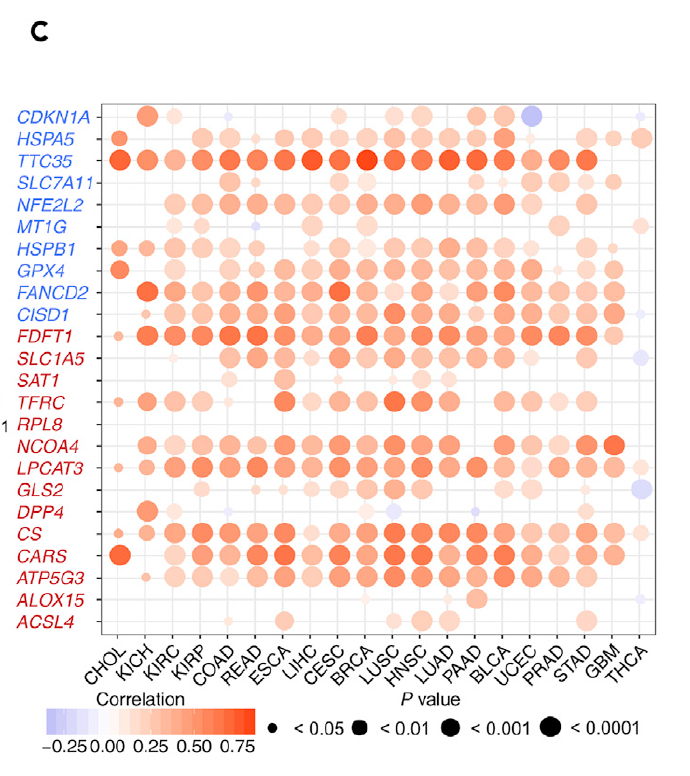

欢迎关注“小丫画图”公众号，回复“小白”，看小视频，实现点鼠标跑代码。

小丫微信: epigenomics  E-mail: figureya@126.com

作者：大鱼海棠，他的更多作品看这里<https://k.koudai.com/OFad8N0w>

单位：中国药科大学国家天然药物重点实验室，生物统计与计算药学研究中心

小丫编辑校验

```{r setup, include=FALSE}
knitr::opts_chunk$set(echo = TRUE)
```

# 需求描述

小丫姐好，我还有很多小伙伴想众筹这篇铁死亡泛癌的其他图片，主要是Figure 1。感觉这个套路只要换一个通路就可以测试，我看大鱼老师写了这篇文章的Figure 2A（铁死亡基因在泛癌肿瘤与正常的差异箱线图，FigureYa208FPI），Figure 3B（铁死亡与免疫通路的相关性，FigureYa253panGSEA），可否请大鱼老师详细写一下文章Figure 1的相关代码？

- 1A（铁死亡在泛癌中体细胞拷贝数变异情况，绘制条形图，可参考FigureYa265panCNV）
- 1B（铁死亡基因在肿瘤与正常的差异表达，绘制拼接的点图和柱状图，可参考FigureYa263panDiff）
- 1C（铁死亡基因体细胞拷贝数与基因表达的相关性点图）
- 1D（铁死亡基因肿瘤与正常组织甲基化状态点图）
- 1E（铁死亡转录组表达与启动子甲基化相关性的点图）

这些图都是泛癌的，不知道大鱼老师可不可以用例文数据分别众筹个教程 [皱眉] ？（感觉都可以出一期专栏——iSicence复现了哈哈）

这次众筹Figure 1C，铁死亡基因体细胞拷贝数与基因表达的相关性点图。



出自<https://linkinghub.elsevier.com/retrieve/pii/S2589004220304892>

Figure 1. The Dysregulation of Ferroptosis Regulator Genes (FRGs)
For which the positive and negative regulators are marked in red and blue, respectively.
(C) The Spearman’s correlation between somatic copy number alterations and the expression of FRGs.

接下来会陆续众筹Figure1DE，敬请关注。

# 应用场景

分析基因（以铁死亡为例）体细胞拷贝数与基因表达的相关性，并绘制点图。

# 环境设置

使用国内镜像安装包

```{r}
options("repos"= c(CRAN="https://mirrors.tuna.tsinghua.edu.cn/CRAN/"))
options(BioC_mirror="http://mirrors.tuna.tsinghua.edu.cn/bioconductor/")

```

加载包

```{r}
library(ggplot2)
library(data.table)
library(randomcoloR)
library(ggpubr)
library(GSVA)
library(clusterProfiler)
library(impute)
library(ComplexHeatmap)
source("twoclasslimma.R")
Sys.setenv(LANGUAGE = "en") #显示英文报错信息
options(stringsAsFactors = FALSE) #禁止chr转成factor
```

# 输入文件

跟FigureYa263panDiff、FigureYa265panCNV使用的是同一套数据，已经下载的小伙伴就不用重复下载了。

merged_sample_quality_annotations.tsv，下载自<https://gdc.cancer.gov/about-data/publications/pancanatlas>，下载地址<http://api.gdc.cancer.gov/data/1a7d7be8-675d-4e60-a105-19d4121bdebf>

EBPlusPlusAdjustPANCAN_IlluminaHiSeq_RNASeqV2.geneExp.tsv，表达矩阵，第一列是基因，之后是其在每个样本中的表达量。下载自<http://api.gdc.cancer.gov/data/3586c0da-64d0-4b74-a449-5ff4d9136611>

TCGA.PANCAN.sampleMap_Gistic2_CopyNumber_Gistic2_all_data_by_genes.gz，CNV数据，下载地址<https://xenabrowser.net/datapages/?dataset=TCGA.PANCAN.sampleMap%2FGistic2_CopyNumber_Gistic2_all_data_by_genes&host=https%3A%2F%2Ftcga.xenahubs.net&removeHub=https%3A%2F%2Fxena.treehouse.gi.ucsc.edu%3A443>

```{r}
# 获得同时有肿瘤和正常样本的肿瘤名
tumors <- c("BLCA","BRCA","CESC","CHOL","COAD",
            "ESCA","GBM","HNSC","KICH","KIRC",
            "KIRP","LIHC","LUAD","LUSC","PAAD",
            "PRAD","READ","STAD","THCA","UCEC")

# 获得感兴趣的基因集(TTC35是EMC2的同名)
frg <- c("CDKN1A","HSPA5","TTC35","SLC7A11","NFE2L2","MT1G","HSPB1","GPX4","FANCD2","CISD1","FDFT1","SLC1A5","SAT1",
         "TFRC","RPL8","NCOA4","LPCAT3","GLS2","DPP4","CS","CARS","ATP5G3","ALOX15","ACSL4","EMC2")

# 修正TCGA名称
rawAnno <- read.delim("merged_sample_quality_annotations.tsv",sep = "\t",row.names = NULL,check.names = F,stringsAsFactors = F,header = T) # 数据来自PanCanAtlas
rawAnno$simple_barcode <- substr(rawAnno$aliquot_barcode,1,15)
samAnno <- rawAnno[!duplicated(rawAnno$simple_barcode),c("cancer type", "simple_barcode")]
samAnno <- samAnno[which(samAnno$`cancer type` != ""),]
write.table(samAnno,"simple_sample_annotation.txt",sep = "\t",row.names = F,col.names = T,quote = F)

# 快速读取表达谱，然后按癌症名拆分成单个文件
expr <- fread("EBPlusPlusAdjustPANCAN_IlluminaHiSeq_RNASeqV2.geneExp.tsv",sep = "\t",stringsAsFactors = F,check.names = F,header = T)
expr <- as.data.frame(expr); rownames(expr) <- expr[,1]; expr <- expr[,-1]
gene <- sapply(strsplit(rownames(expr),"|",fixed = T), "[",1) # 调整行名
expr$gene <- gene
expr <- expr[!duplicated(expr$gene),] # 移除重复样本
rownames(expr) <- expr$gene; expr <- expr[,-ncol(expr)]

comgene <- intersect(rownames(expr),frg) # 取部分表达谱（感兴趣的基因集）
expr_sub <- expr[comgene,]
colnames(expr_sub) <- substr(colnames(expr_sub),1,15)
expr_sub <- expr_sub[,!duplicated(colnames(expr_sub))]

for (i in tumors) {
  message("--",i,"...")
  sam <- samAnno[which(samAnno$`cancer type` == i),"simple_barcode"] # 获取该肿瘤的全部样本
  comsam <- intersect(colnames(expr_sub), sam) # 取出与基因表达泛癌数据交集的样本
  
  tumsam <- comsam[substr(comsam,14,14) == "0"] # 获得肿瘤样本
  norsam <- comsam[substr(comsam,14,14) == "1"] # 获得正常样本
  
  expr_subset <- expr_sub[,c(tumsam,norsam)]
  expr_subset[expr_subset < 0] <- 0 # 这份数据里存在负值，即便负值比较小，但也要矫正，如果使用其他泛癌表达谱根据情况而定
  expr_subset <- as.data.frame(impute.knn(as.matrix(expr_subset))$data)
  write.table(expr_subset, paste0("TCGA_",i,"_expr_subset.txt"),sep = "\t",row.names = T,col.names = NA,quote = F)
}
rm(expr); gc()

# 快速读取CNA数据
cna <- fread("TCGA.PANCAN.sampleMap_Gistic2_CopyNumber_Gistic2_all_data_by_genes.gz",sep = "\t",stringsAsFactors = F,header = T,check.names = F)
cna <- as.data.frame(cna)
comgene <- intersect(cna$Sample,frg)
cna <- cna[cna$Sample %in% comgene,] # 只包含感兴趣基因的CNA子集
rownames(cna) <- cna[,1]; cna <- cna[,-1]
```

# 相关性分析

```{r}
corCnaExpr <- NULL
for (i in tumors) {
  message("--",i,"...")
  # 读取上面拆分好的表达数据
  expr_subset <- read.table(paste0("TCGA_",i,"_expr_subset.txt"),sep = "\t",row.names = 1,check.names = F,stringsAsFactors = F,header = T)
  # 取出同时具有表达且具有拷贝数的样本
  comsam <- intersect(colnames(expr_subset),colnames(cna))
  cna_subset <- cna[,comsam] # 生成拷贝数子集
  rownames(cna_subset) <- gsub("EMC2","TTC35",rownames(cna_subset)) # EMC2是原文使用的TTC35基因的同名，使用子集数据时无须修正
  expr_subset <- expr_subset[,comsam] # 生成基因表达子集
  
  # 把cnv按癌症名保存到单个文件
  #write.table(cna_subset, paste0("TCGA_",i,"_broadcnv_subset_matched_expr.txt"),sep = "\t",row.names = F,col.names = T,quote = F)
  
  # 计算相关系数
  corTab <- NULL
  for (j in rownames(cna_subset)) {
    tmp1 <- as.numeric(cna_subset[j,]) # 相应的CNA数据
    tmp2 <- as.numeric(expr_subset[j,]) # 相应的表达数据
    cor.res <- cor.test(tmp1,tmp2, method = "spearman") # spearman相关性
    
    corTab <- rbind.data.frame(corTab,
                               data.frame(gene = j,
                                          tumor = i,
                                          Correlation = ifelse(is.na(cor.res$estimate), 0, cor.res$estimate),
                                          Pvalue = ifelse(is.na(cor.res$p.value), 1, cor.res$p.value),
                                          stringsAsFactors = F),
                               stringsAsFactors = F)
  }
  corCnaExpr <- rbind.data.frame(corCnaExpr,
                                 corTab,
                                 stringsAsFactors = F)
}

# 保存相关系数到文件
write.table(corCnaExpr, "TCGA_pancan_correlation_cnv_expr_subset.txt",sep = "\t",row.names = F,col.names = T,quote = F)
```

# 开始画图

画泡泡图

```{r fig.width=8, fig.height=8}
# 设置颜色
blue <- "#4577FF"
red <- "#C2151A"
orange <- "#E45737"

corCnaExpr$gene <- factor(corCnaExpr$gene,
                          levels = rev(c("CDKN1A","HSPA5","TTC35","SLC7A11","NFE2L2","MT1G","HSPB1","GPX4","FANCD2","CISD1",
                                         "FDFT1","SLC1A5","SAT1","TFRC","RPL8","NCOA4","LPCAT3","GLS2","DPP4","CS","CARS","ATP5G3","ALOX15","ACSL4")))

my_palette <- colorRampPalette(c(blue,"white",orange), alpha=TRUE)(n=128)
ggplot(corCnaExpr, aes(x=tumor,y=gene)) +
  geom_point(aes(size=-log10(Pvalue), color=Correlation)) +
  scale_color_gradientn('Correlation', 
                        colors=my_palette) + 
  scale_size_continuous(range = c(1,12)) + #圆点的大小范围

  theme_bw() +
  theme(#panel.grid.minor = element_blank(), 
        #panel.grid.major = element_blank(),
        axis.text.x = element_text(angle = 45, size = 12, hjust = 0.3, vjust = 0.5, color = "black"),
        axis.text.y = element_text(size = 12, color = rep(c(red,blue),c(14,10))),
        axis.title = element_blank(),
        panel.border = element_rect(size = 0.7, linetype = "solid", colour = "black"),
        legend.position = "bottom",
        plot.margin = unit(c(1,1,1,1), "lines"))

ggsave("Figure 1C correlation between cna and expression of interested genes in pancancer.pdf", width = 8,height = 8)
rm(cna); gc()
```

例文图中大多数为正相关，与我们这里获得的结果有出入，欢迎小伙伴来“小丫画图群-\*”讨论。

# Session Info

```{r}
sessionInfo()
```