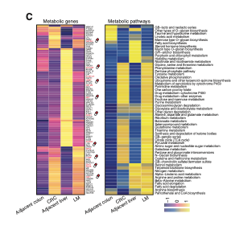

欢迎关注“小丫画图”公众号，回复“小白”，看小视频，实现点鼠标跑代码。

小丫微信: epigenomics  E-mail: figureya@126.com

作者：古潇，他的更多作品看这里<https://k.koudai.com/uH4zuEWC>

小丫编辑校验

```{r setup, include=FALSE}
knitr::opts_chunk$set(echo = TRUE)
```

# 需求描述

用scMetabolism实现单细胞RNA-seq数据的代谢分析，并画图。



出自<https://aacrjournals.org/cancerdiscovery/article/12/1/134/675646/Spatiotemporal-Immune-Landscape-of-Colorectal>

Figure 4.  MRC1+ CCL18+ macrophages in metastatic tumors showed high metabolic activity. 
C, The heat map of average metabolic gene expression and median metabolic pathway score of MRC1+ CCL18+ macrophages. The genes highlighted with red represent the potential druggable genes (Methods). 

# 应用场景

Mining metabolic activity at single-cell resolution，为了方便使用，例文作者把整个pipeline写成了R包scMetabolism。还开发了在线版<http://www. cancerdiversity.asia/scMetabolism/>。

本文档带你跑通R版本的scMetabolism，适用于scRNA-seq数据，友好对接seurat。

另外，原文作者也在“小丫画图群-\*”里，如果您对该文章的其他图/分析过程感兴趣，欢迎找小丫提需求，下次请原文作者分享。

# 环境设置

使用国内镜像安装包

```{r eval=FALSE}
options("repos"= c(CRAN="https://mirrors.tuna.tsinghua.edu.cn/CRAN/"))
options(BioC_mirror="http://mirrors.tuna.tsinghua.edu.cn/bioconductor/")
install.packages("magrittr")
install.packages("devtools")
devtools::install_github('satijalab/seurat-data',force = TRUE)

### 安装scMetabolism计算代谢通路
# 如果安装不成功，先去升级R
# 先安装依赖包
install.packages("BiocManager")
BiocManager::install(c("AUCell", "GSEABase", "GSVA"))
install.packages("phangorn")
devtools::install_github("YosefLab/VISION")
devtools::install_github("wu-yc/scMetabolism")

BiocManager::install("clusterProfiler")
```

加载包

```{r}
library(Seurat)
library(SeuratData)
library(patchwork)
library(RColorBrewer)
library(pheatmap)
library(dplyr)
library(magrittr)
library(scMetabolism)
library(ggplot2)
library(rsvd)

Sys.setenv(LANGUAGE = "en") #显示英文报错信息
options(stringsAsFactors = FALSE) #禁止chr转成factor
```

# 输入文件预处理

跟FigureYa267scCellChat一样的处理，可以直接跳到“Metabolic genes”。

`ifnb` - A Seurat object with the PBMC control/IFNB-stimulated dataset。出自<https://pubmed.ncbi.nlm.nih.gov/29227470/>，已被打包到SeuratData里，我们直接安装、加载它。

示例数据ifnb有STIM和CTRL两组：

- 先拆分成两个seurat object，对两个数据集单独进行normalize并识别各自的高变异基因，使用高变异基因在两个基因集中分别执行PCA。
- 然后对两个数据集进行整合，进行常规数据预处理，存入immune.combined，以便进行后续分析。

```{r eval = FALSE}
## 加载示例数据
# install dataset
InstallData("ifnb")

# load dataset
(LoadData("ifnb"))
?ifnb

# ifnb数据集中包含两个样本数据，分别为CTRL和STIM
head(ifnb@meta.data)
table(ifnb@meta.data$stim)


## 数据拆分成两组(STIM和CTRL)
# 使用splitobject将ifnb数据集分割成两个seurat对象的列表(STIM和CTRL)
ifnb.list <- SplitObject(ifnb, split.by = "stim")

# 对两个数据集单独进行normalize并识别各自的高变异基因
ifnb.list <- lapply(X = ifnb.list, FUN = function(x) {
  x <- NormalizeData(x)
  x <- FindVariableFeatures(x, selection.method = "vst", nfeatures = 2000)
})

# 计算两个数据中排完rank后top2000的高变异基因
features <- SelectIntegrationFeatures(object.list = ifnb.list, nfeatures = 2000)

# 使用上述高变异基因在两个基因集中分别执行PCA
ifnb.list <- lapply(X = ifnb.list, FUN = function(x) {
  x <- ScaleData(x, features = features, verbose = T)
  x <- RunPCA(x, features = features, verbose = T)
})


## 对两个数据集进行整合
# 首先使用findinintegrationanchors函数标识锚点，然后使用IntegrateData函数将两数据集整合在一起
# 可以通过调整k.anchor参数调整两个样本整合的强度，默认为5，数字越大整合强度越强
immune.anchors <- FindIntegrationAnchors(object.list = ifnb.list, anchor.features = features, reduction = "rpca", k.anchor = 20)
immune.combined <- IntegrateData(anchorset = immune.anchors)

# 对整合后的数据进行后续分析
DefaultAssay(immune.combined) <- "integrated"

# 常规流程，scale数据，跑PCA，使用前30个PC进行降维跑UMAP，计算Neighbors，分cluster
immune.combined <- ScaleData(immune.combined, verbose = FALSE)
immune.combined <- RunPCA(immune.combined, npcs = 30, verbose = FALSE)
immune.combined <- RunUMAP(immune.combined, reduction = "pca", dims = 1:30)
immune.combined <- FindNeighbors(immune.combined, reduction = "pca", dims = 1:30)
immune.combined <- FindClusters(immune.combined, resolution = 0.5)

DefaultAssay(immune.combined) <- "RNA"
Idents(immune.combined) <- "CellType"

# 可视化
p1 <- DimPlot(immune.combined, reduction = "umap", group.by = "stim")
p2 <- DimPlot(immune.combined, reduction = "umap", group.by = "seurat_annotations",label = TRUE,repel = TRUE)

pdf("immune.combined.UMAP.pdf", height = 5,width = 12)
p1 + p2
dev.off()

# 保存到文件，便于休息后继续
saveRDS(immune.combined,"immune.combined.rds")
```

# 左图 - Metabolic genes

提取特定通路里的差异表达基因，用热图展示其表达变化。

这里用Y叔的clusterProfiler读取scMetabolism包里整理的gmt文件，按照自己安装路径寻找，一般位于`安装目录/lib/R/library/scMetabolism/data/KEGG_metabolism_nc.gmt`。或者直接从msigdb下载gmt文件，<https://www.gsea-msigdb.org/gsea/msigdb/>

```{r}
# 加载上面保存的immune.combined.rds文件
immune.combined <- readRDS("immune.combined.rds")

# 加载gmt文件
kegg_geneset <- clusterProfiler::read.gmt("KEGG_metabolism_nc.gmt")

# 提取目标通路基因，这里以Glycolysis / Gluconeogenesis为例
pathway_gene <- subset(kegg_geneset, term=="Glycolysis / Gluconeogenesis") %>% .$gene %>% as.vector(.)

# 提取目标基因的表达量
Idents(immune.combined) <- "stim"
ave_exp <- AverageExpression(immune.combined, 
                             features = pathway_gene, 
                             assays = "RNA") %>% .$RNA
```

这里把参与该通路的基因都画到图中。也可以结合自己数据的情况，筛选差异表达基因来画图。具体操作可参考右图的“计算差异显著的metabolism pathway”里的方法，或参考FigureYa177RNAvelocity里的s5_DEG.Rmd用DESeq2分析。

```{r}
pdf("select_pathway_gene_pheatmap.pdf",height = 12,width = 8)
pheatmap(ave_exp,
         cluster_row = T,
         treeheight_row = "0",#不画树
         cluster_col = F,
         show_rownames=T,
         cellwidth = 40,
         border_color = NA,
         color = colorRampPalette(colors = c("#31315d","#ee5fa1","#edec77"))(100),
         legend = T,
         scale="row") #按自己需求是否做scale
dev.off()
```


# 右图 - Metabolism pathways

## 运行scMetabolism

我的电脑跑了7分钟

```{r}
# 设置参数，对 method 和 metabolism.type 做选择
countexp.Seurat <- sc.metabolism.Seurat(obj = immune.combined, 
                                        method = "VISION", # supports VISION, AUCell, ssgsea, and gsva, which VISION is the default method.
                                        imputation = F, ncores = 10, 
                                        metabolism.type = "KEGG") # supports KEGG and REACTOME, where KEGG contains 85 metabolism pathways and REACTOME contains 82 metabolism pathways.

saveRDS(countexp.Seurat,"countexp.Seurat.rds")
```

## 计算差异显著的metabolism pathway

```{r}
signature_exp <- countexp.Seurat@assays$METABOLISM$score
signature_meta <- countexp.Seurat@meta.data[,c("stim", "seurat_annotations")]

signature_df <- data.frame(signature_meta, t(signature_exp))
colnames(signature_df)[3:nrow(signature_exp)] <- rownames(signature_exp)

# 提取两组
signature_df_ctrl <- subset(signature_df, stim%in%"CTRL")[3:nrow(signature_exp)]
signature_df_stim <- subset(signature_df, stim%in%"STIM")[3:nrow(signature_exp)]

# 差异检验
df_pvalue <- c()
for (i in 1:ncol(signature_df_stim)) {
  pvalue <- wilcox.test(signature_df_ctrl[,i], signature_df_stim[,i]) %>% .$p.value
  df <- data.frame(Pathway = colnames(signature_df_stim)[i], p_val = pvalue)
  df_pvalue <- rbind(df_pvalue,df)
}

# 对p值进行矫正
p.adj <- p.adjust(df_pvalue$p_val,method = "BH") 
df_pvalue$p.adj <- p.adj

ctrl_df <- apply(signature_df_ctrl, 2, median) %>% as.data.frame() 
colnames(ctrl_df) <- "CTRL"
ctrl_df$Pathway <- as.vector(rownames(ctrl_df))

stim_df <- apply(signature_df_stim, 2, median) %>% as.data.frame()
colnames(stim_df) <- "STIM"
stim_df$Pathway <- as.vector(rownames(stim_df))

combine_df <- full_join(ctrl_df, stim_df, by="Pathway")
pathway_df <- full_join(df_pvalue, combine_df, by="Pathway")
rownames(pathway_df) <- as.vector(pathway_df$Pathway)
pathway_df$Pathway <- NULL

# 差异显著的metabolism pathway
significance_pathway <- subset(pathway_df, p.adj<0.05)
# 输出到文件
write.table(significance_pathway, "output_metabolic pathway score.txt", sep = "\t", quote = F)
```

## 开始画图

用pheatmap画图

```{r}
pathway_plot_df <- significance_pathway
pathway_plot_df$p_val <- NULL
pathway_plot_df$p.adj <- NULL

pdf("significance_metabolism pathway_pheatmap.pdf",height = 12,width = 8)
pheatmap(pathway_plot_df,
         cluster_row = T,
         treeheight_row = "0",#不画树
         cluster_col = F,
         show_rownames=T,
         cellwidth = 40,
         border_color = NA,
         color = colorRampPalette(colors = c("#333189","#306faf","#efe92b"))(100),
         legend = T,
         scale="row") #按自己需求是否做scale
dev.off()
```


# Session Info

```{r}
sessionInfo()
```