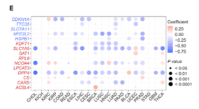

欢迎关注“小丫画图”公众号，回复“小白”，看小视频，实现点鼠标跑代码。

小丫微信: epigenomics  E-mail: figureya@126.com

作者：大鱼海棠，他的更多作品看这里<https://k.koudai.com/OFad8N0w>

单位：中国药科大学国家天然药物重点实验室，生物统计与计算药学研究中心

小丫编辑校验

```{r setup, include=FALSE}
knitr::opts_chunk$set(echo = TRUE)
```

# 需求描述

小丫姐好，我还有很多小伙伴想众筹这篇铁死亡泛癌的其他图片，主要是Figure 1。感觉这个套路只要换一个通路就可以测试，我看大鱼老师写了这篇文章的Figure 2A（铁死亡基因在泛癌肿瘤与正常的差异箱线图，FigureYa208FPI），Figure 3B（铁死亡与免疫通路的相关性，FigureYa253panGSEA），可否请大鱼老师详细写一下文章Figure 1的相关代码？

- 1A（铁死亡在泛癌中体细胞拷贝数变异情况，绘制条形图，可参考FigureYa265panCNV）
- 1B（铁死亡基因在肿瘤与正常的差异表达，绘制拼接的点图和柱状图，可参考FigureYa263panDiff）
- 1C（铁死亡基因体细胞拷贝数与基因表达的相关性点图，可参考FigureYa268panCNVexpr）
- 1D（铁死亡基因肿瘤与正常组织甲基化状态点图，可参考FigureYa270panMeth）
- 1E（铁死亡转录组表达与启动子甲基化相关性的点图）

这些图都是泛癌的，不知道大鱼老师可不可以用例文数据分别众筹个教程 [皱眉] ？（感觉都可以出一期专栏——iSicence复现了哈哈）

这次众筹Figure 1E，铁死亡转录组表达与启动子甲基化相关性的点图。



出自<https://linkinghub.elsevier.com/retrieve/pii/S2589004220304892>

Figure 1. The Dysregulation of Ferroptosis Regulator Genes (FRGs)
(E) Pearson’s correlation of FRGs between transcriptional expression and promoter methylation. Red and blue represent positive and negative correlations, respectively.

# 应用场景

分析基因（以铁死亡为例）转录组表达与启动子甲基化相关并绘制点图。

# 环境设置

使用国内镜像安装包

```{r}
options("repos"= c(CRAN="https://mirrors.tuna.tsinghua.edu.cn/CRAN/"))
options(BioC_mirror="http://mirrors.tuna.tsinghua.edu.cn/bioconductor/")

```

加载包

```{r}
library(ggplot2)
library(ChAMP)
library(data.table)
library(randomcoloR)
library(ggpubr)
library(GSVA)
library(clusterProfiler)
library(impute)
library(ComplexHeatmap)
data("probe.features") # 读取甲基化450k数据的探针注释

Sys.setenv(LANGUAGE = "en") #显示英文报错信息
options(stringsAsFactors = FALSE) #禁止chr转成factor
```

# 输入文件

EBPlusPlusAdjustPANCAN_IlluminaHiSeq_RNASeqV2.geneExp.tsv，表达矩阵，第一列是基因，之后是其在每个样本中的表达量。下载自<http://api.gdc.cancer.gov/data/3586c0da-64d0-4b74-a449-5ff4d9136611>，跟FigureYa263panDiff、FigureYa268panCNVexpr相同，已经下载的小伙伴就不用重复下载了。

merged_sample_quality_annotations.tsv，下载自<https://gdc.cancer.gov/about-data/publications/pancanatlas>，下载地址<http://api.gdc.cancer.gov/data/1a7d7be8-675d-4e60-a105-19d4121bdebf>。

tcga_methy450文件夹里面是甲基化数据，过滤掉了有空值的探针，均已保存为RData文件，微云链接：<https://share.weiyun.com/jRry4rlU>。下载后把tcga_methy450文件夹放到当前文件夹。跟FigureYa270panMeth使用的是同一文件。

```{r}
# 获得同时有肿瘤和正常样本的肿瘤名
tumors <- c("BLCA","BRCA","CESC","CHOL","COAD",
            "ESCA","GBM","HNSC","KICH","KIRC",
            "KIRP","LIHC","LUAD","LUSC","PAAD",
            "PRAD","READ","STAD","THCA","UCEC")

# 获得感兴趣的基因集(TTC35是EMC2的同名)
frg <- c("CDKN1A","HSPA5","TTC35","SLC7A11","NFE2L2","MT1G","HSPB1","GPX4","FANCD2","CISD1","FDFT1","SLC1A5","SAT1",
         "TFRC","RPL8","NCOA4","LPCAT3","GLS2","DPP4","CS","CARS","ATP5G3","ALOX15","ACSL4","EMC2")

# 修正TCGA名称
# https://gdc.cancer.gov/about-data/publications/pancanatlas
rawAnno <- read.delim("merged_sample_quality_annotations.tsv",sep = "\t",row.names = NULL,check.names = F,stringsAsFactors = F,header = T) # 数据来自PanCanAtlas
rawAnno$simple_barcode <- substr(rawAnno$aliquot_barcode,1,15)
samAnno <- rawAnno[!duplicated(rawAnno$simple_barcode),c("cancer type", "simple_barcode")]
samAnno <- samAnno[which(samAnno$`cancer type` != ""),]
write.table(samAnno,"simple_sample_annotation.txt",sep = "\t",row.names = F,col.names = T,quote = F)

# 提取匹配到FRG基因的启动子探针
promoter <- probe.features[which(probe.features$feature %in% c("TSS1500","TSS200")),]# 根据注释文件筛选启动子探针，也可以分析其他探针比如增强子Enhancer等等
promoter <- promoter[which(promoter$gene %in% frg),] # 取出感兴趣基因在感兴趣位点的探针
write.table(promoter, "promoter_annotation_for_interested_genes.txt",sep = "\t",row.names = T,col.names = NA,quote = F)

# 快速读取表达谱
# https://gdc.cancer.gov/about-data/publications/pancanatlas
expr <- fread("EBPlusPlusAdjustPANCAN_IlluminaHiSeq_RNASeqV2.geneExp.tsv",sep = "\t",stringsAsFactors = F,check.names = F,header = T)
expr <- as.data.frame(expr); rownames(expr) <- expr[,1]; expr <- expr[,-1]
gene <- sapply(strsplit(rownames(expr),"|",fixed = T), "[",1) # 调整行名
expr$gene <- gene
expr <- expr[!duplicated(expr$gene),] # 移除重复样本
rownames(expr) <- expr$gene; expr <- expr[,-ncol(expr)]

comgene <- intersect(rownames(expr),frg) # 取部分表达谱（感兴趣的基因集）
expr_sub <- expr[comgene,]
colnames(expr_sub) <- substr(colnames(expr_sub),1,15)
expr_sub <- expr_sub[,!duplicated(colnames(expr_sub))]

for (i in tumors) {
  message("--",i,"...")
  sam <- samAnno[which(samAnno$`cancer type` == i),"simple_barcode"]
  comsam <- intersect(colnames(expr_sub), sam)
  
  tumsam <- comsam[substr(comsam,14,14) == "0"] # 获得肿瘤样本
  norsam <- comsam[substr(comsam,14,14) == "1"] # 获得正常样本
  
  expr_subset <- expr_sub[,c(tumsam,norsam)]
  expr_subset[expr_subset < 0] <- 0 # 这份数据里存在负值，即便负值比较小，但也要矫正，如果使用其他泛癌表达谱根据情况而定
  expr_subset <- as.data.frame(impute.knn(as.matrix(expr_subset))$data)
  write.table(expr_subset, paste0("TCGA_",i,"_expr_subset.txt"),sep = "\t",row.names = T,col.names = NA,quote = F)
}
rm(expr); gc()

# 获取只有感兴趣探针/基因的甲基化子集
for (i in tumors) { # 比较慢请耐心
  message("--",i,"...")
  load(file.path("tcga_methy450", paste0("TCGA-",i,"_methy450.RData"))) # 加载甲基化RData文件
  methy450 <- as.data.frame(methy450) # 转数据框
  rownames(methy450) <- methy450[,1] # 行名改为第一列
  methy450 <- methy450[,-1] # 去掉第一列探针名
  dimname <- dimnames(methy450) # 获取行名和列明
  methy450 <- sapply(methy450, as.numeric) # 将数据全部转为数值以防报错
  dimnames(methy450) <- dimname # 重新赋值行名和列名
  methy450 <- as.data.frame(methy450) # 转数据框
  
  compb <- intersect(rownames(methy450),rownames(promoter)) # 获取甲基化数据和感兴趣探针的交集
  methy450 <- methy450[compb,] # 取出子集
  methy450$gene <- promoter[compb,"gene"] # 将探针名和基因名进行映射
  
  # 如果基因匹配多个探针，则取中位数beta值
  methy450 <- apply(methy450[,setdiff(colnames(methy450), "gene")], 2, function(x) tapply(x, INDEX=factor(methy450$gene), FUN=median, na.rm=TRUE))
  methy450 <- as.data.frame(methy450)
  write.table(methy450, paste0("TCGA_",i,"_methy450_subset.txt"),sep = "\t",row.names = T,col.names = NA,quote = F)
  rm(methy450); gc() # 释放内存
}
gc()
```

# 相关性分析

```{r}
corExprMeth <- NULL
for (i in tumors) {
  message("--",i,"...")
  
  # 读取只包含感兴趣基因的表达谱和甲基化数据
  expr_subset <- read.table(paste0("TCGA_",i,"_expr_subset.txt"),sep = "\t",row.names = 1,check.names = F,stringsAsFactors = F,header = T)
  meth_subset <- read.table(paste0("TCGA_",i,"_methy450_subset.txt"),sep = "\t",row.names = 1,check.names = F,stringsAsFactors = F,header = T)
  colnames(meth_subset) <- substr(colnames(meth_subset),1,15)
  
  comsam <- intersect(colnames(expr_subset),colnames(meth_subset)) # 获取相同的样本
  tumsam <- comsam[substr(comsam,14,14) == "0"] # 仅获取肿瘤样本
  
  expr_subset <- expr_subset[,tumsam] # 取出表达谱子集
  meth_subset <- meth_subset[,tumsam] # 取出甲基化子集
  
  corTab <- NULL
  for (j in rownames(meth_subset)) {
    tmp1 <- as.numeric(meth_subset[j,]) # 甲基化beta值
    tmp2 <- as.numeric(expr_subset[j,]) # 表达谱
    cor.res <- cor.test(tmp1,tmp2, method = "spearman") # 启动子甲基化和表达谱的spearman相关性
    
    corTab <- rbind.data.frame(corTab,
                               data.frame(gene = j,
                                          tumor = i,
                                          Correlation = ifelse(is.na(cor.res$estimate), 0, cor.res$estimate),
                                          Pvalue = ifelse(is.na(cor.res$p.value), 1, cor.res$p.value),
                                          stringsAsFactors = F),
                               stringsAsFactors = F)
  }
  corExprMeth <- rbind.data.frame(corExprMeth,
                                  corTab,
                                  stringsAsFactors = F)
}
write.table(corExprMeth, "TCGA_pancan_correlation_expr_meth_subset.txt",sep = "\t",row.names = F,col.names = T,quote = F)
```

例文展示相关性画的是点图，也可以画成热图、圆圈图等形式。

`TCGA_pancan_correlation_expr_meth_subset.txt`文件里存放了n*n的correlation和pvalue，可以套用到我们以前众筹过的FigureYa当中。更多相关性展示方式看这里：[相关性展示的8种情况，还想要哪样？](https://mp.weixin.qq.com/s/D9wheY5QdnOh4JrjIc8-Cg)

# 开始画图

```{r}
# 设置颜色
blue <- "#4577FF"
red <- "#C2151A"
orange <- "#E45737"
green <- "#6F8B35"
darkblue <- "#303B7F"
darkred <- "#D51113"
yellow <- "#EECA1F"

# 生成泡泡图
corExprMeth$gene <- factor(corExprMeth$gene,
                           levels = rev(c("CDKN1A","HSPA5","TTC35","SLC7A11","NFE2L2","MT1G","HSPB1","GPX4","FANCD2","CISD1",
                                          "FDFT1","SLC1A5","SAT1","TFRC","RPL8","NCOA4","LPCAT3","GLS2","DPP4","CS","CARS","ATP5G3","ALOX15","ACSL4")))

my_palette <- colorRampPalette(c(blue,"white",orange), alpha=TRUE)(n=128)
ggplot(corExprMeth, aes(x=tumor,y=gene)) +
  geom_point(aes(size=-log10(Pvalue),color=Correlation)) +
  scale_color_gradientn('Correlation', 
                        colors=my_palette) +
  theme_bw() +
  theme(#panel.grid.minor = element_blank(), 
        #panel.grid.major = element_blank(),
        axis.text.x = element_text(angle = 45, size = 12, hjust = 0.3, vjust = 0.5, color = "black"),
        axis.text.y = element_text(size = 12, color = rep(c(red,blue),c(14,10))),
        axis.title = element_blank(),
        panel.border = element_rect(size = 0.7, linetype = "solid", colour = "black"),
        legend.position = "right",
        plot.margin = unit(c(1,1,1,1), "lines"))
ggsave("Figure 1E correlation between promoter methylation and expression of interested genes in pancancer.pdf", width = 8,height = 6)
```

# Session Info

```{r}
sessionInfo()
```