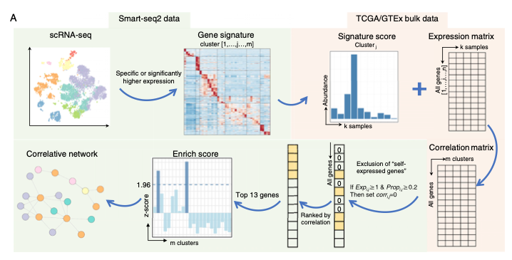
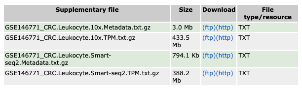
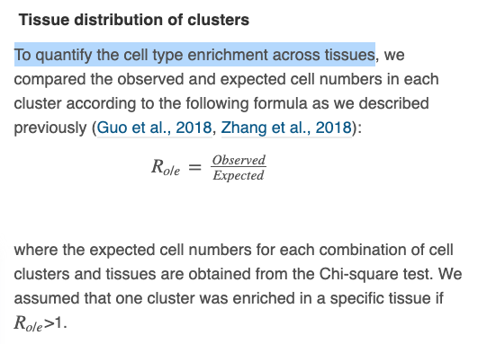

欢迎关注“小丫画图”公众号，回复“小白”，看小视频，实现点鼠标跑代码。

小丫微信: epigenomics  E-mail: figureya@126.com

作者：Jeremy，他的更多作品看这里<https://k.youshop10.com/QePA4HN7>

小丫编辑校验

```{r setup, include=FALSE}
knitr::opts_chunk$set(echo = TRUE)
```

# 需求描述

基于细胞类型signature识别细胞-细胞互作。



出自<https://linkinghub.elsevier.com/retrieve/pii/S009286742030341X>

Figure S8. Analysis Framework for Correlative Cell-Cell Interaction Networks and Summary of Myeloid Cell Subsets in Human and Mouse Tumors, Related to Figure 3 and STAR Methods
(A) Workflow illustrating correlative network analysis. 
Cell **subtype specific genes** were identified from the Smart-seq2 scRNA-seq dataset and were used to **estimate the relative abundance in TCGA/GTEx bulk RNA-seq datasets.** 
After filtering the self-expressed genes, **high correlative genes** were calculated. 
Finally, an **enrichment analysis** based on Smart-seq2 profile was performed to **identify all correlated cell subtypes and build the correlative network** (STAR Methods).

# 应用场景

借助scRNA-seq找到的signature genes，推断bulk RNA-seq样本的细胞类群互作网络，最后用igraph（静态）和networkD3（动态）两种网络可视化工具来展示结果。

本文档作者写了个R包scBulkCCCI，以便小伙伴运行例文的workflow。

scBulkCCCI：correlative cell-cell interaction networks based on combining scRNA-seq and TCGA datasets

R包下载地址：<https://www.yuque.com/figureya/figureyaplus/package>

下载后解压缩，可以查看R包内容：

- 包的自带描述文档，见ScBulkCCCI/README.md
- 示例部分数据，储存在ScBulkCCCI/data，scRNA-seq数据太大，未内置在包中，根据说明去下载；
- 数据经过预处理：数据预处理的code查看ScBulkCCCI包下ScBulkCCCI_DataPreprocess.R， 位于ScBulkCCCI/example；
- 示例运行代码ScBulkCCCI.R，于ScBulkCCCI/example；

# 环境设置

使用国内镜像安装包

```{r eval=FALSE}
options("repos"= c(CRAN="https://mirrors.tuna.tsinghua.edu.cn/CRAN/"))
options(BioC_mirror="http://mirrors.tuna.tsinghua.edu.cn/bioconductor/")
install.packages("ggthemes")
# 下载后本地安装
# 下载地址：https://www.yuque.com/figureya/figureyaplus/package
install.packages("ScBulkCCCI_0.1.3.tar.gz", repos = NULL, type = "source")
```

加载包

```{r}
library("ScBulkCCCI")
library("pheatmap")
library("RColorBrewer")
library("ggplot2")
library("ggthemes")
library("plyr")
library("dplyr")
library("stringr")
library("tibble")
library("tidyr")
Sys.setenv(LANGUAGE = "en") #显示英文报错信息
options(stringsAsFactors = FALSE) #禁止chr转成factor
```

# 输入文件

输入文件包含两部分：scRNA-seq、bulk RNA-seq（以TCGA数据为例，也可以用其他RNA-seq数据）。

## scRNA-seq 数据

下载地址：[GSE146771](https://www.ncbi.nlm.nih.gov/geo/query/acc.cgi?acc=GSE146771)



CRC.Leukocyte.Smart-seq2.Metadata.txt: 细胞类群信息

- CellName: 细胞ID
- Tissue: 细胞所属组织类型
- Global_Cluster: 一级分类
- Sub_Cluster: 二级分类

CRC.Leukocyte.Smart-seq2.TPM.txt: 细胞基因定量矩阵，列是细胞，行是基因

```{r}
## Import ScRNAseq Smart-seq2
CRC_Leukocyte_SM_MD <- read.table("CRC.Leukocyte.Smart-seq2.Metadata.txt",header = T, sep="\t", check.names = F);dim(CRC_Leukocyte_SM_MD)
CRC_Leukocyte_SM_RNA <- read.table("CRC.Leukocyte.Smart-seq2.TPM.txt",header = T) 
```

## bulk RNAseq数据

从[UCSC Xena](xenabrowser.net)下载后进行预处理（COAD and READ），预处理代码见ScBulkCCCI安装包中的example/ScBulkCCCI_DataPreprocess.R。已打包到R包里，直接加载即可。

dataMerge_normal_allgene.rds: 列是样本，行是基因ID
dataMerge_tumor_allgene.rds: 列是样本，行是基因ID

```{r}
## Get the install path of ScBulkCCCI
libPath <- find.package("ScBulkCCCI")

## Import bulk expression profiles
dataMerge_normal_allgene <- readRDS(paste(libPath, "/data/dataMerge_normal_allgene.rds",sep="")); dim(dataMerge_normal_allgene)
dataMerge_tumor_allgene <- readRDS(paste(libPath, "/data/dataMerge_tumor_allgene.rds",sep="")); dim(dataMerge_tumor_allgene)
```

# Signature Genes

Signature Genes were Used for Correlative Interaction Analysis

怎样筛选自己的Signature Genes？

可参考例文的“Identification of signature genes”，里面描述了接seurat的筛选标准。单细胞数据前期处理及seurat常规流程可参考FigureYa177RNAvelocity。

对于异质性较大的样品，可参考FigureYa223scNMF，不用seurat，而是借助NMF和聚类分析找marker gene。

这里直接整理例文的[Table S4 of paper](#https://ars.els-cdn.com/content/image/1-s2.0-S009286742030341X-mmc4.xlsx)，已打包到R包里，直接加载即可。

CCgene_normal.rds: 正常组织富集的免疫细胞类群的signature genes；第一列基因，第二列细胞类群名

CCgene_tumor.rds: 肿瘤组织富集的免疫细胞类群的signature genes；第一列基因，第二列细胞类群名

```{r}
## Import gene signatures for each subtype from Smart-seq2
CCgene_normal <- readRDS(paste(libPath, "/data/CCgene_normal.rds",sep=""))
CCgene_tumor <- readRDS(paste(libPath, "/data/CCgene_tumor.rds",sep=""))
head(CCgene_normal)
head(CCgene_tumor)
```

# Correlation matrix

Evaluate the abundance of each cluster based on **bulk RNAseq** data and **marker genes**

```{r}
cor_matrix_normal = corMatrix(CCgene_normal, # marker genes
                              cluste = "cluster",
                              dataMerge_normal_allgene) # bulk expression profiles
dim(cor_matrix_normal)

cor_matrix_tumor = corMatrix(CCgene_tumor, 
                             cluste = "cluster",
                             dataMerge_tumor_allgene)
dim(cor_matrix_tumor)
```

# Enrichment analysis

## Highly correlated genes - For a specific cell subtype and another cell subtype

Achievement: the ranked correlated non-self-expressed genes from the adjusted correlation matrix for a specific cell subtype

step 1. Identify self-expressed genes

step 2. Adjust correlation matrix by self-expressed genes

```{r}
subcluter_name= unique(CCgene_normal$cluster)[1] #unique(CCgene_normal$cluster)[1] #unique(CCgene_normal$cluster)[1]

highCorNonSelfGenes <- highCorGene(subcluter_name= subcluter_name,
                                  Sub_Cluster="Sub_Cluster", CellName="CellName",
                                  cellMetaData= CRC_Leukocyte_SM_MD, ScExMatrix=CRC_Leukocyte_SM_RNA,
                                  cor_matrix=cor_matrix_normal,TopMethod="Positive")
highCorNonSelfGenes$correlatioRankPlot
```

## Enrich score - For a specific cell subtype and multiple cell subtype

```{r}
allClusters <- unique(c(as.character(CCgene_normal$cluster), as.character(CCgene_tumor$cluster))) 
#allClusters<- unique(CRC_Leukocyte_SM_MD$Sub_Cluster)

ES <- oneToMultiple(allClusters= allClusters,
                   topCorGene=names(highCorNonSelfGenes$CorGeneRank[1:13]),
                   cellMetaData= CRC_Leukocyte_SM_MD, ScExMatrix=CRC_Leukocyte_SM_RNA,
                   Sub_Cluster="Sub_Cluster", CellName="CellName")
scale(na.omit(ES))
ESData = data.frame(name = rownames(scale(na.omit(ES))),ES=scale(na.omit(ES)))
ESData$colorInfo = as.factor(ifelse(ESData$ES>0, "pos", "neg"))

ggplot() + geom_bar(data = ESData,aes(x=name, y=ES, fill=colorInfo),stat = "identity") + 
  geom_hline(yintercept=1, color="blue", linetype="dashed") +
  scale_fill_manual(values=c("#87CEFA", "#6495ED")) +
  labs(x = "Correlative cell cluster", y = "Enrichment score", title = paste("Enrichment analysis for",subcluter_name,sep = " ")) +
  theme_base() +
  theme(axis.text.x = element_text(size = 15, vjust = 0.5, hjust = 0.5, angle = 90)) + 
  theme(legend.position="none") +
  theme(plot.title = element_text(hjust = 0.5))

ggsave("EnrichScore.pdf", width = 12, height = 8)
```

## Correlative network - For multiple cell subtypes and multiple cell subtypes

```{r}
allClusters = unique(c(as.character(CCgene_normal$cluster), as.character(CCgene_tumor$cluster))) #unique(CRC_Leukocyte_SM_MD$Sub_Cluster)

# 例文选了top 13 highly correlated non-self-expressed genes were selected from the adjusted correlation matrix.
topGeneNum <- 13 # 根据自己的数据调整

{
  normal_subtype_ES = cellCellInteraction(specificSubtypes = unique(CCgene_normal$cluster),
                                          allClusters = allClusters, # unique(c(CCgene_normal$cluster, CCgene_tumor$cluster)), #unique(CRC_Leukocyte_SM_MD$Sub_Cluster)
                                          cor_matrix = cor_matrix_normal,
                                          cellMetaData= CRC_Leukocyte_SM_MD,
                                          ScExMatrix=CRC_Leukocyte_SM_RNA,
                                          Sub_Cluster="Sub_Cluster",
                                          CellName="CellName",
                                          topGeneNum = topGeneNum,
                                          TopMethod="Positive")
  
  tumor_subtype_ES = cellCellInteraction(specificSubtypes = unique(CCgene_tumor$cluster),
                                         allClusters = allClusters, # unique(c(CCgene_normal$cluster, CCgene_tumor$cluster)),
                                         cor_matrix = cor_matrix_tumor,
                                         cellMetaData= CRC_Leukocyte_SM_MD,
                                         ScExMatrix=CRC_Leukocyte_SM_RNA,
                                         Sub_Cluster="Sub_Cluster",
                                         CellName="CellName",
                                         topGeneNum = topGeneNum,
                                         TopMethod="Positive")
}

normal_subtype_ES$tissue = "normal"
tumor_subtype_ES$tissue = "tumor"

subtype_ES <- rbind(normal_subtype_ES,tumor_subtype_ES)

# 保存到文件
write.table(tumor_subtype_ES, file = "output_tumor_subtype.Correlative.cell_cell.interactions.txt", quote = F, row.names = F, sep = "\t") #

write.table(subtype_ES, file = "output_correlative.cell_cell.interactions.txt", quote = F, row.names = F, sep = "\t") 
```

## Compare the result of correlative cell cell interactions between ScBulkCCCI and paper.

```{r}
dplyr::filter(subtype_ES, grepl("^hM03", specificSubtype), EnrichScore>1)
dplyr::filter(subtype_ES, grepl("^hM04", specificSubtype), EnrichScore>1)
dplyr::filter(subtype_ES, grepl("^hM12", specificSubtype), EnrichScore>1)
dplyr::filter(subtype_ES, grepl("^hM13", specificSubtype), EnrichScore>1)
```

> The enrichment analysis result of `hM13_TAM-SPP1` from ScBulkCCCI is the same result as paper  show.

- - What's more, the enrichment analysis results of hM03, hM04 or hM12 are not identical, but they are similar.

# 开始画图

```{r}
# 加载上面获得的interaction信息
tumor_subtype_ES <- read.table("output_tumor_subtype.Correlative.cell_cell.interactions.txt", header = T, sep = "\t")
networkData <- dplyr::filter(tumor_subtype_ES, EnrichScore>1.96, specificSubtype != otherSubtype)

CRC_Leukocyte_SM_MD <- read.table(paste(libPath, "/data/CRC.Leukocyte.Smart-seq2.Metadata.txt",sep=""),header = T, sep="\t", check.names = F);dim(CRC_Leukocyte_SM_MD)
overlap <- intersect(unique(c(networkData$specificSubtype,networkData$otherSubtype)), CRC_Leukocyte_SM_MD$Sub_Cluster)

nodes <- dplyr::filter(CRC_Leukocyte_SM_MD,Sub_Cluster %in% overlap) %>%
  select(Sub_Cluster, Global_Cluster) %>%
  dplyr::distinct(Sub_Cluster,Global_Cluster) 

nodes <- merge(data.frame(node = unique(c(networkData$specificSubtype,networkData$otherSubtype))), nodes, by.x="node", by.y="Sub_Cluster", all = T)
nodes[is.na(nodes)] ="Not annotation"
```

下面分别用igraph（静态）和networkD3（动态）两种网络可视化工具来展示Enrichment analysis结果。

## Plot network by igraph

```{r}
library("igraph")
g <- graph_from_data_frame(networkData, directed=F, vertices=nodes)
V(g)$label.cex=0.75
V(g)$label.color <- "black"
V(g)$color <- brewer.pal(n = 12, name ="Paired")[as.numeric(as.factor(V(g)$Global_Cluster))]
V(g)$frame.color <- "white"

pdf("network_igraph.pdf")
plot(g)

legend(x=-1.5, y= 1, unique(as.factor(V(g)$Global_Cluster)), pch=21,
       col="#777777", pt.bg=unique(brewer.pal(n = 12, name ="Paired")[as.numeric(as.factor(V(g)$Global_Cluster))]), 
       pt.cex=2, cex=.8, bty="n", ncol=1)
dev.off()
```


## Plot dynamic network

```{r}
#install.packages("networkD3")
library(magrittr)
library(networkD3)
nodeData <- data.frame(name=nodes$node,
                       group= as.factor(nodes$Global_Cluster))
linkData <- data.frame(source = (match(networkData$specificSubtype, nodeData$name)-1),
                       target = (match(networkData$otherSubtype, nodeData$name)-1))
forceNetwork(
  Links = linkData,
  Nodes = nodeData,
  Source = "source",
  Target = "target",
  NodeID = "name",Group = "group", legend = T, opacityNoHover = 1,zoom=T) 
```

```{r}
# 输出到网页文件
forceNetwork(
  Links = linkData,
  Nodes = nodeData,
  Source = "source",
  Target = "target",
  NodeID = "name",Group = "group", legend = T, opacityNoHover = 1,zoom=T) %>%
  saveNetwork(file = 'network.html')
```

打开`network.html`文件，即可查看动态网络。

# 附：Cell type enrichment across tissues



```{r}
CRC_Leukocyte_10x_MD <- read.table(paste(libPath, "/data/CRC.Leukocyte.10x.Metadata.txt",sep=""),header = T, sep="\t", check.names = F);dim(CRC_Leukocyte_10x_MD)
CRC_Leukocyte_10x_MD_FIilter = dplyr::filter(CRC_Leukocyte_10x_MD, grepl("^hM",Sub_Cluster))

Roe <- calTissueDist(CRC_Leukocyte_10x_MD_FIilter,colname.cluster="Sub_Cluster", colname.tissue="Tissue")
pheatmap::pheatmap(Roe, cluster_rows = F, cluster_cols = F, 
                   color = colorRampPalette(brewer.pal(n = 7, name ="YlOrRd"))(50),
                   display_numbers = TRUE,number_color = "black")
```

# Reference
Zhang L, Li Z, Skrzypczynska KM, Fang Q, Zhang W, O'Brien SA, He Y, Wang L, Zhang Q, Kim A, Gao R, Orf J, Wang T, Sawant D, Kang J, Bhatt D, Lu D, Li CM, Rapaport AS, Perez K, Ye Y, Wang S, Hu X, Ren X, Ouyang W, Shen Z, Egen JG, Zhang Z, Yu X. Single-Cell Analyses Inform Mechanisms of Myeloid-Targeted Therapies in Colon Cancer. Cell. 2020 Apr 16;181(2):442-459.e29. doi: 10.1016/j.cell.2020.03.048. PMID: 32302573.

Zhang L, Yu X, Zheng L, Zhang Y, Li Y, Fang Q, Gao R, Kang B, Zhang Q, Huang JY, Konno H, Guo X, Ye Y, Gao S, Wang S, Hu X, Ren X, Shen Z, Ouyang W, Zhang Z. Lineage tracking reveals dynamic relationships of T cells in colorectal cancer. Nature. 2018 Dec;564(7735):268-272. doi: 10.1038/s41586-018-0694-x. Epub 2018 Oct 29. PMID: 30479382.

# Session Info

```{r}
sessionInfo()
```