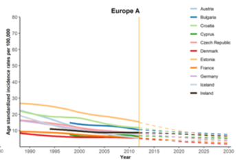

欢迎关注“小丫画图”公众号，回复“小白”，看小视频，实现点鼠标跑代码。

小丫微信: epigenomics  E-mail: figureya@126.com

作者：大鱼海棠，他的更多作品看这里<https://k.koudai.com/OFad8N0w>

单位：中国药科大学国家天然药物重点实验室，生物统计与计算药学研究中心

小丫编辑校验

```{r setup, include=FALSE}
knitr::opts_chunk$set(echo = TRUE)
```

# 需求描述

需要做贝叶斯-年龄队列预测分析，画出文章中的Figure 3。



出自<https://www.sciencedirect.com/science/article/abs/pii/S001650852100531X#abssec0020>

Figure 3 Trends in **observed (solid lines) and predicted (dashed lines)** age-standardized incidence rates of gastric cancer in 43 countries by continent.

# 应用场景

贝叶斯年龄-时期-队列预测模型(Bayesian-age-period-cohort [BAPC] model)

# 环境设置

使用国内镜像安装包

```{r eval=FALSE}
options("repos"= c(CRAN="https://mirrors.tuna.tsinghua.edu.cn/CRAN/"))
options(BioC_mirror="http://mirrors.tuna.tsinghua.edu.cn/bioconductor/")
install.packages("bamp")
```

加载包

```{r}
library(bamp) # 加载用于估计BAPC模型及进行预测的R包

Sys.setenv(LANGUAGE = "en") #显示英文报错信息
options(stringsAsFactors = FALSE) #禁止chr转成factor
```

# 输入文件

原始数据结构说明：

- 1、Oceania.csv 为Oceania总体信息，包括每个国家具体区域或城市的id（即，REGISTRY），统计数据起止年份（YEAR1和YEAR2）
- 2、原始数据 Oceania_Pos.csv，为每个国家每个城市每年每个年龄组的具体人口数据
- 3、原始数据 Oceania_Cases.csv，为每个国家每个城市每年每个年龄组的具体病例数据

注意：

- 1、本代码中的人口数据及病例数据，即，CI5plus数据集，来自于《Global Patterns and Trends in Gastric Cancer Incidence Rates (1988-2012) and Predictions to 2030》中参考文献所提供的网站<http://ci5.iarc.fr>
- 2、由于无法找到文中用于标准化的世界卫生组织WHO世界人口数据，采用了来自<https://seer.cancer.gov/stdpopulations/world.who.html>的数据，与文中有所差异，所以无法完全复现文中图。
- 3、现以Oceania为例，其余州分析过程类似。
- 4、本代码全部跑完大约需要10分钟

```{r}
# 初始化计算时间
timestart <- Sys.time()

### Oceania ####
### 人口数据
oce_pop <- read.csv("Oceania_Pops.csv", header = T)

# 从原始数据中拆分出Australia的人口数据
# 注意： seq(3600200, 3600800, 100)为Australia的城市或区域id
Australia <- oce_pop[(oce_pop$REGISTRY %in% seq(3600200, 3600800, 100)) & (oce_pop$YEAR >= 1988), ] # 合并Australia所有区域或城市的人口数据，并提取1988年以后数据
y_id <- sort(unique(Australia$YEAR))# 将年份从小到大排序
age_spe <- t(sapply(y_id, function(k) apply(Australia[Australia$YEAR == k, 5:dim(Australia)[2]], 2, sum))) # 按年份合并男性和女性数据，得到每年各年龄组总的人口数据据
Australia_new <- data.frame(country = rep("Australia", dim(age_spe)[1]), 
                            years = y_id,
                            age_spe,
                            stringsAsFactors = F)

# 从原始数据中拆分出New zealand的人口数据
# 注意：55400000为New zealand的id
NZ <- oce_pop[(oce_pop$REGISTRY == 55400000) & (oce_pop$YEAR >= 1988), ] # 合并New Zealand所有区域或城市的人口数据，并提取1988年以后数据
y_id <- sort(unique(NZ$YEAR))# 将年份从小到大排序
age_spe <- t(sapply(y_id, function(k) apply(NZ[NZ$YEAR == k, 5:dim(NZ)[2]], 2, sum))) # 按年份合并男性和女性数据，得到每年各年龄组总的人口数据据
NZ_new <- data.frame(country = rep("New_Zealand", dim(age_spe)[1]), 
                     years = y_id,
                     age_spe,
                     stringsAsFactors = F)

# 构建整个Oceania的人口数据
# 数据结构为每个国家（即，country）每年（即，years）各年龄组（即，P0_4，P5_9，...，P85.）的总人口数据. 
pops <- rbind(Australia_new, NZ_new)

### 病例数据
oce_case <- read.csv("Oceania_Cases.csv", header = T)

# 从原始数据中拆分出Australia的病例数据
# 注意： seq(3600200, 3600800, 100)为Australia的城市或区域id
Australia <- oce_case[(oce_case$REGISTRY %in% seq(3600200, 3600800, 100)) & (oce_case$YEAR >= 1988), ]# 合并Australia所有区域或城市的病例数据，并提取1988年以后数据
y_id <- sort(unique(Australia$YEAR))# 将年份从小到大排序
age_spe <- t(sapply(y_id, function(k) apply(Australia[Australia$YEAR == k, 6:(dim(Australia)[2]-1)], 2, sum)))# 按年份合并男性和女性数据，得到每年各年龄组总的病例数据据
Australia_new <- data.frame(country = rep("Australia", dim(age_spe)[1]), # 整合Australia分析数据
                            years = y_id, 
                            age_spe,
                            stringsAsFactors = F)

# 从原始数据中拆分出New zealand的病例数据
# 注意：seq(3600200, 3600800, 100)为New zealand的城市或区域id
NZ <- oce_case[(oce_case$REGISTRY == 55400000) & (oce_case$YEAR >= 1988), ] # 合并New zealand所有区域或城市的病例数据，并提取1988年以后数据
y_id <- sort(unique(NZ$YEAR)) # 将年份从小到大排序
age_spe <- t(sapply(y_id, function(k) apply(NZ[NZ$YEAR==k, 6:(dim(NZ)[2]-1)], 2, sum)))# 按年份合并男性和女性数据，得到每年各年龄组总的病例数据
NZ_new <- data.frame(country = rep("New_Zealand", dim(age_spe)[1]), # 整合New zealand分析数据
                     years = y_id, 
                     age_spe,
                     stringsAsFactors = F)

# 构建整个Oceania的病例数据
# 数据结构为每个国家（即，country）每年（即，years）各年龄组（即，N0_4，N5_9，...，N85.）的总病例数据. 
cases <- rbind(Australia_new, NZ_new)
```

# BAPC分析预测

```{r}
### 估计每个国家的年龄标准化疾病发生率
# who_pop: 世界卫生组织标准人口分布，基于2000-2025年间各年龄组的世界平均人口
who_pop <- c(8.86, 8.69, 8.60, 8.47, 8.22, 7.93, 
             7.61, 7.15, 6.59, 6.04, 5.37, 4.55, 
             3.72, 2.96, 2.21, 1.52, 0.91, 0.635)/100
p.est <- cases[,3:20] / pops[,3:20] # 估计每个国家每年各年龄组的疾病率
asr.est <- (as.matrix(p.est) %*% who_pop) * 100000 # 使用“who_pop”数据，估计每个国家年龄标准化疾病率
dat.est <- data.frame(country = cases[,1],
                      years = cases[,2],
                      asr = asr.est,
                      stringsAsFactors = F)

### 对每个国家进行BAPC分析预测
asr.pred <- NULL
for (id in c("Australia", "New_Zealand")) {
  set.seed(10)
  cases_c <- cases[cases[,1] == id, ] # 提取当前国家病例数据
  pops_c <- pops[pops[,1] == id, ] # 提取当前国家人口数据
  cases_bamp <- matrix(unlist(cases_c[, 3:dim(cases)[2]]), 
                       dim(cases_c)[1], dim(cases_c)[2]-2) # 准备用于BAPC分析的病例数据，数据类型为矩阵
  pops_bamp <- matrix(unlist(pops_c[, 3:dim(cases)[2]]), 
                      dim(pops_c)[1], dim(pops_c)[2]-2) # 准备用于BAPC分析的人口数据，数据类型为矩阵
  # 使用函数bamp()估计BAPC模型
  invisible(capture.output(model <- bamp(cases_bamp, 
                                         pops_bamp, 
                                         age      = "rw2", 
                                         period   = "rw2", 
                                         cohort   = "rw2", # 为年龄组，时期及队列，使用"rw2"先验
                                         periods_per_agegroup = 5, 
                                         overdisp = TRUE, # 每个年龄组时期长度为period="5 years"
                                         hyperpar = list(age      = c(1, 0.5), 
                                                         period   = c(1, 5e-04), 
                                                         cohort   = c(1, 5e-04), 
                                                         overdisp = c(1, 0.001)),
                                         mcmc.options = list(number_of_iterations = 50000, 
                                                             burn_in = 10000, 
                                                             step    = 50, 
                                                             tuning  = 500))))
  per <- 2030-cases_c[dim(cases_c)[1], 2] # 预测的时期数
  pred <- predict_apc(object = model,
                      periods = per,
                      population = pops_bamp,
                      update = TRUE) # 预测当前国家各年龄组的疾病率
  asr.pred <- rbind(asr.pred, data.frame(country = rep(id, per), # 存储当前国家年龄标准化疾病率预测值
                                         asr = pred$predicted$pr[2, (dim(cases_c)[1]+1):(dim(cases_c)[1] + per), ] %*% who_pop * 100000))
}
```

# 开始画图

```{r}
# 画出每个国家估计的和预测的年龄标准化疾病率趋势图
pdf("BAPC.pdf", width = 6,height = 5.5)
par(bty = "o", mgp = c(2.1,.33,0), mar = c(3.1,3.1,2.1,2.1), las = 1, tcl = -.25,xpd = F)
plot(1, type = "n",  xaxt = "n", 
     xlim = c(1989, 2031), ylim = c(400,1400), 
     main = "Oceania", 
     ylab = "Age standardized incidence rates per 100000",  
     xlab = "Year",
     bty = "l")
axis(1, seq(1990, 2030, 5), seq(1990, 2030, 5))
abline(v = 2012, lwd = 1.5, col = "chocolate1")
c_id <- unique(asr.pred$country)
col <- c("red", "dodgerblue4")
for(i in 1:2){
  t <- ts(dat.est$asr[dat.est$country == c_id[i]], 
          start = dat.est$years[dat.est$country == c_id[i]][1], frequency = 1)
  lines(t, col=col[i], lwd=4) # 估计的年龄标准化疾病率
  t <- ts(c(dat.est$asr[dat.est$country == c_id[i] & dat.est$years == 2012], asr.pred$asr[asr.pred$country == c_id[i]]), start = 2012, frequency = 1)
  lines(t, "l", col=col[i], lty=2, lwd=2) # 预测的年龄标准化疾病率
}
legend("topright", legend = c("Australia", "New Zealand"), col = col, lwd = 4, bty = "n")
invisible(dev.off())

# 输出耗时
timeend <- Sys.time()
print(timeend-timestart) 
```


# Session Info

```{r}
sessionInfo()
```