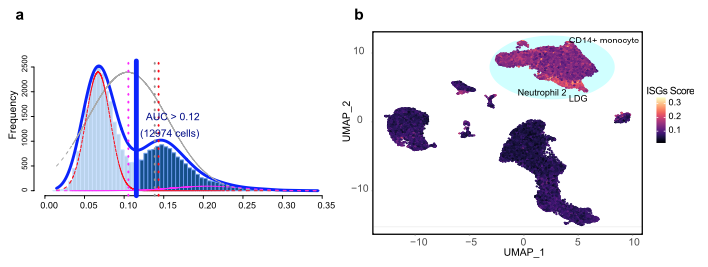

欢迎关注“小丫画图”公众号，回复“小白”，看小视频，实现点鼠标跑代码。

小丫微信: epigenomics  E-mail: figureya@126.com

作者：古潇，他的更多作品看这里<https://k.koudai.com/uH4zuEWC>

小丫编辑校验

```{r setup, include=FALSE}
knitr::opts_chunk$set(echo = TRUE)
```

# 需求描述

单细胞分析AUCell对细胞ISG活性评分。



出自<https://www.thelancet.com/journals/ebiom/article/PIIS2352-3964(21)00270-X/fulltext>

Fig. 2. ISG score of SLE PBMC cell clusters. 
(a) Score of 178 screened ISG sets. The threshold was chosen as 0.12 and the ISG score of 12 974 cells exceeded the threshold value. 
(b) UMAP plots based on the ISG score of each cell. High ISG score cell clusters are highlighted. 

# 应用场景

本教程展示如何在单细胞数据中使用AUCell包计算自定义基因集的评分，并画图展示。

我们众筹过的用到AUCell包的FigureYa：

- FigureYa194pySCENIC<https://k.youshop10.com/5gCxXaGm>，用AUCell对每个细胞计算regulon activity score (RAS)
- FigureYa223scNMF<https://k.youshop10.com/qjIM3DFg>，用AUCell对上皮细胞进行打分，然后做NMF聚类
- FigureYa269scMetabolism<https://k.youshop10.com/lCYoADnk>，计算scMetabolism时有多种方法供选择，AUCell是其中之一

# 环境设置

使用国内镜像安装包

```{r eval=FALSE}
options("repos"= c(CRAN="https://mirrors.tuna.tsinghua.edu.cn/CRAN/"))
options(BioC_mirror="http://mirrors.tuna.tsinghua.edu.cn/bioconductor/")
#安装AUCell
BiocManager::install("AUCell")
```

加载包

```{r}
library(Seurat)
library(SeuratData)
library(patchwork)
library(RColorBrewer)
library(pheatmap)
library(dplyr)
library(magrittr)
library(AUCell)
library(patchwork)
library(ggplot2)
Sys.setenv(LANGUAGE = "en") #显示英文报错信息
options(stringsAsFactors = FALSE) #禁止chr转成factor
```

# 输入文件

## 基因集

ISG_genelist.csv，基因集，将用到GeneName列。下载自<https://ars.els-cdn.com/content/image/1-s2.0-S235239642100270X-mmc5.xlsx>

```{r}
ISG_genelist <- read.csv("ISG_genelist.csv")
ISG_genelist <- unique(as.vector(ISG_genelist$GeneName))
geneSets <- list(ISGs=ISG_genelist)
```

## 单细胞数据及预处理

跟FigureYa267scCellChat和FigureYa269scMetabolism一样的处理，获得中间文件immune.combined.rds，可直接跳到“使用AUCell包计算自定义基因集的评分”。

`ifnb` - A Seurat object with the PBMC control/IFNB-stimulated dataset。出自<https://pubmed.ncbi.nlm.nih.gov/29227470/>，已被打包到SeuratData里，我们直接安装、加载它。

示例数据ifnb有STIM和CTRL两组：

- 先拆分成两个seurat object，对两个数据集单独进行normalize并识别各自的高变异基因，使用高变异基因在两个基因集中分别执行PCA。
- 然后对两个数据集进行整合，进行常规数据预处理，存入immune.combined，以便进行后续分析。

```{r eval=FALSE}
# InstallData("ifnb") # 找网络好点的地方安装，教育网好些

# load dataset
LoadData("ifnb")

# ifnb数据集中包含两个样本数据，分别为CTRL和STIM
head(ifnb@meta.data)
table(ifnb@meta.data$stim)

# 使用splitobject将ifnb数据集分割成两个seurat对象的列表(STIM和CTRL)
ifnb.list <- SplitObject(ifnb, split.by = "stim")

# 对两个数据集单独进行normalize并识别各自的高变异基因
ifnb.list <- lapply(X = ifnb.list, FUN = function(x) {
  x <- NormalizeData(x)
  x <- FindVariableFeatures(x, selection.method = "vst", nfeatures = 2000)
})


# 计算两个数据中排完rank后top2000的高变异基因
features <- SelectIntegrationFeatures(object.list = ifnb.list, nfeatures = 2000)

# 使用上述高变异基因在两个基因集中分别执行PCA
ifnb.list <- lapply(X = ifnb.list, FUN = function(x) {
  x <- ScaleData(x, features = features, verbose = T)
  x <- RunPCA(x, features = features, verbose = T)
})


# 对两个数据集进行整合
# 首先使用findinintegrationanchors函数标识锚点，然后使用IntegrateData函数将两数据集整合在一起
# 可以通过调整k.anchor参数调整两个样本整合的强度，默认为5，数字越大整合强度越强
immune.anchors <- FindIntegrationAnchors(object.list = ifnb.list, anchor.features = features, reduction = "rpca", k.anchor = 20)
immune.combined <- IntegrateData(anchorset = immune.anchors)


# 对整合后的数据进行后续分析
DefaultAssay(immune.combined) <- "integrated"

# 常规流程，scale数据，跑PCA，使用前30个PC进行降维跑UMAP，计算Neighbors，分cluster
immune.combined <- ScaleData(immune.combined, verbose = FALSE)
immune.combined <- RunPCA(immune.combined, npcs = 30, verbose = FALSE)
immune.combined <- RunUMAP(immune.combined, reduction = "pca", dims = 1:30)
immune.combined <- FindNeighbors(immune.combined, reduction = "pca", dims = 1:30)
immune.combined <- FindClusters(immune.combined, resolution = 0.5)

DefaultAssay(immune.combined) <- "RNA"
Idents(immune.combined) <- "CellType"


# 可视化
p1 <- DimPlot(immune.combined, reduction = "umap", group.by = "stim")
p2 <- DimPlot(immune.combined, reduction = "umap", group.by = "seurat_annotations",label = TRUE,repel = TRUE)

pdf("./immune.combined.UMAP.pdf", height = 5,width = 12)
p1 + p2
dev.off()

saveRDS(immune.combined,"./immune.combined.rds")
```

# 使用AUCell包计算自定义基因集的评分

```{r}
# 加载上面保存的中间文件
immune.combined <- readRDS("immune.combined.rds")

# Build gene expression rankings for each cell 
cells_rankings <- AUCell_buildRankings(immune.combined@assays$RNA@data, nCores=10)  #基因排序，使用10个核，加速计算
# Quantiles for the number of genes detected by cell:
# (Non-detected genes are shuffled at the end of the ranking. Keep it in mind when choosing the threshold for calculating the AUC).
```

排名在2741之后的基因被pass

```{r}
# Calculates the 'AUC' for each gene-set in each cell
cells_AUC <- AUCell_calcAUC(geneSets, cells_rankings,nCores = 10, 
                            aucMaxRank = nrow(cells_rankings)*0.05) 
# 参数'aucMaxRank'允许修改用于执行此计算的基因数量(最大排名)。默认设置为排名中基因总数的5%。一般取值范围为1 ~ 20%。
```

# 开始画图

## Figure 2a - Score of 178 screened ISG sets.

```{r}
pdf("cells_assignment.pdf")
cells_assignment <- AUCell_exploreThresholds(cells_AUC, plotHist=TRUE, assign=TRUE, nCores=10)
dev.off()
```


也是两个明显的双峰，当AUC值阈值设为0.22时，有2854个细胞的AUC值相对较高

## Figure 2b - UMAP plots based on the ISG score of each cell.

```{r}
# 提取UMAP坐标和AUC值，在UMAP图上展示AUC值
geneSet.name <- "ISGs"
AUC_Exp <- as.numeric(getAUC(cells_AUC)[geneSet.name, ])
immune.combined$AUC <- AUC_Exp
plot.df<- data.frame(immune.combined@meta.data, immune.combined@reductions$umap@cell.embeddings)

p <- ggplot() + 
  geom_point(data=plot.df, aes(x=UMAP_1,y=UMAP_2,colour=AUC), size =0.5) +
  viridis::scale_color_viridis(option="A") +
  theme_bw()+
  theme(panel.grid.minor = element_blank(),
        panel.grid.major = element_blank(),
        axis.text= element_text(colour= 'black',size=14),
        axis.title= element_text(size = 14),
        axis.line= element_line(colour= 'black'),
        panel.border = element_rect(size = 0.5, linetype = "solid", colour = "black"), 
        aspect.ratio = 1)
p

ggsave(filename = "UMAP_AUC_value.pdf", plot = p, height = 6, width = 6)
```

从图中可以看到当AUC值阈值设为0.22时，高AUC值的细胞类型是Eryth、CD14 Mono、CD16 Mono和DC

High ISG score cell clusters are highlighted. 

以下部分计算并添加标签所位置，添加椭圆框，也可后续自己手动添加

```{r}
high.ISGs.celltype <- c("Eryth", "CD14 Mono", "CD16 Mono", "DC")
high.AUC.df <- subset(plot.df, seurat_annotations %in% high.ISGs.celltype)
high.AUC.df$Type <- "HighAUC"
centers <- high.AUC.df[,c('UMAP_1','UMAP_2','seurat_annotations')] %>%
  dplyr::group_by(seurat_annotations) %>%
  summarize(x = median(x = UMAP_1), y = median(x = UMAP_2))

p.final <- p +stat_ellipse(data = high.AUC.df, aes(x=UMAP_1,y=UMAP_2,fill=Type),
                          geom = "polygon", alpha = 0.3,fill="#4ef4eb",level = 0.99)+ 
  geom_text(data = centers, aes(x=x,y=y,label=seurat_annotations),colour="black",size=4)
p.final

ggsave(filename = "UMAP_AUC_value_label.pdf", plot = p.final, height = 6, width = 6)
```

# 计算high ISGs celltype 和low ISGs celltype 之间的DEGs

```{r}
immune.combined@meta.data$ISGs.Type <- ifelse(immune.combined@meta.data$seurat_annotations%in%high.ISGs.celltype, "High.ISGs", "Low.ISGs") 

pdf("immune.combined.ISGs.type.UMAP.pdf", height = 5,width = 6)
DimPlot(immune.combined, reduction = "umap", group.by = "ISGs.Type",label = TRUE,repel = TRUE)
dev.off()

Idents(immune.combined) <- "ISGs.Type"
ISGs.DEGs <- FindAllMarkers(immune.combined, min.pct = 0.25, logfc.threshold = 0.25)
ISGs.DEGs.filter <- subset(ISGs.DEGs, p_val_adj<0.05) # 筛选adj 的p value小于0.05的

head(ISGs.DEGs.filter)

write.csv(ISGs.DEGs.filter, "output_ISGs.type.DEGs.filter.list.csv")
```

最后选取High.ISGs组的基因去做GO和pathway，可以用Y叔的clusterProfiler包或者各种在线包，更多富集分析展示方式看这里<https://k.youshop10.com/sm2p0xYn>

最核心还是找到适合自己研究思路的基因集！！！

# Session Info

```{r}
sessionInfo()
```