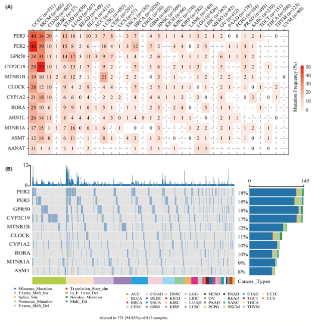

欢迎关注“小丫画图”公众号，回复“小白”，看小视频，实现点鼠标跑代码。

小丫微信: epigenomics  E-mail: figureya@126.com

作者：大鱼海棠，他的更多作品看这里<https://k.koudai.com/OFad8N0w>

单位：中国药科大学国家天然药物重点实验室，生物统计与计算药学研究中心

小丫编辑校验

```{r setup, include=FALSE}
knitr::opts_chunk$set(echo = TRUE)
```

# 需求描述

希望复现pancancer SNV



出自<https://onlinelibrary.wiley.com/doi/10.1111/jpi.12758>

FIGURE 2 Single nucleotide variation(SNV) frequency and variant types of melatonergic regulators.
(A)Mutation frequency of melatonergic regulators. Numbers represent the number of samples that have the corresponding mutated gene for a given cancer. “0” indicates that there was no mutation in the gene coding region, and no number indicates there was no mutation in any region of the gene.
(B) SNV oncoplot. An oncoplot showing the mutation distribution of melatonergic regulators and a classification of SNV types

# 应用场景

分析泛癌中特定通路基因的突变情况。

更多pancancer分析和可视化看这里<https://k.youshop10.com/C8RkTgR3>

# 环境设置

使用国内镜像安装包

```{r eval=FALSE}
options("repos"= c(CRAN="https://mirrors.tuna.tsinghua.edu.cn/CRAN/"))
options(BioC_mirror="http://mirrors.tuna.tsinghua.edu.cn/bioconductor/")
BiocManager::install("maftools")
```

加载包

```{r}
library(tidyverse)
library(magrittr)
library(readxl)
library(stringr)
library(ggplot2)
library(maftools)
library(dplyr)
library(reshape2)
library(RColorBrewer)
Sys.setenv(LANGUAGE = "en") #显示英文报错信息
options(stringsAsFactors = FALSE) #禁止chr转成factor
```

# 输入文件

mc3.v0.2.8.PUBLIC.maf.gz，TCGA pancancer突变数据，下载自<https://gdc.cancer.gov/about-data/publications/pancanatlas> Mutations，下载地址<http://api.gdc.cancer.gov/data/1c8cfe5f-e52d-41ba-94da-f15ea1337efc>

merged_sample_quality_annotations.tsv，下载自<https://gdc.cancer.gov/about-data/publications/pancanatlas>，下载地址<http://api.gdc.cancer.gov/data/1a7d7be8-675d-4e60-a105-19d4121bdebf>。跟FigureYa263panDiff、FigureYa265panCNV、FigureYa268panCNVexpr使用的是同一套数据，已经下载的小伙伴就不用重复下载了。

```{r}
# 修正TCGA名称
rawAnno <- read.delim("merged_sample_quality_annotations.tsv",sep = "\t",row.names = NULL,check.names = F,stringsAsFactors = F,header = T) # 数据来自PanCanAtlas
rawAnno$simple_barcode <- substr(rawAnno$aliquot_barcode,1,15)
samAnno <- rawAnno[!duplicated(rawAnno$simple_barcode),c("cancer type", "simple_barcode")]
samAnno <- samAnno[which(samAnno$`cancer type` != ""),]
write.table(samAnno,"simple_sample_annotation.txt",sep = "\t",row.names = F,col.names = T,quote = F)

# 加载泛癌突变MAF文件
panmaf <- read_tsv("mc3.v0.2.8.PUBLIC.maf.gz", comment = "#")
unique(panmaf$Variant_Classification)

# 感兴趣基因列表
genelist <- c("PER3","PER2","GPR50","CYP2C19","MTNR1B","CLOCK","CYP1A2","RORA","ARNTL","MTNR1A","ASMT","AANAT")
```

# 计算累积突变样本量

```{r}
# 设置coding区域的突变以及非coding区域的突变
## coding区域（个人认为是非沉默突变）
vc_nonSyn <- c("Frame_Shift_Del",
               "Frame_Shift_Ins",
               "Splice_Site",
               "Translation_Start_Site",
               "Nonsense_Mutation",
               "Nonstop_Mutation",
               "In_Frame_Del",
               "In_Frame_Ins",
               "Missense_Mutation")
## 非coding区域（个人认为是沉默突变）
vc_Syn <- c("3'UTR",
            "5'UTR",
            "3'Flank",
            "5'Flank",
            "IGR",
            "Intron",
            "Silent")

# 获取不同癌种的样本数
mafsam <- data.frame(samID = panmaf$Tumor_Sample_Barcode,
                     simple_barcode = substr(panmaf$Tumor_Sample_Barcode,1,15),
                     stringsAsFactors = F)
mafsam <- mafsam[!duplicated(mafsam$simple_barcode),]
mafsam <- merge(mafsam,samAnno, by = "simple_barcode", all.x = TRUE)
mafsam <- as.data.frame(na.omit(mafsam))

txt <- data.frame(label = paste0(names(table(mafsam$`cancer type`))," (n=", as.numeric(table(mafsam$`cancer type`)),")"),
                  "cancer type" = names(table(mafsam$`cancer type`)),
                  check.names = F) # 将肿瘤和样本数标签合并
mafsam <- merge(mafsam, txt, by = "cancer type", all.x = TRUE)
rownames(mafsam) <- mafsam$simple_barcode

# 取感兴趣的突变子集
# is.element(genelist, panmaf$Hugo_Symbol)
panmaf <- panmaf[which(panmaf$Hugo_Symbol %in% genelist),]
panmaf$Tumor_Sample_Barcode <- substr(panmaf$Tumor_Sample_Barcode,1,15)
write.table(panmaf, file = "maf of genes of interest.txt",sep = "\t",row.names = F,col.names = T,quote = F)

# 创建突变矩阵
panmaf <- read_tsv("maf of genes of interest.txt", comment = "#")
nonSyncount <- matrix(0, nrow = length(genelist), ncol = length(mafsam$simple_barcode),
                   dimnames = list(genelist, mafsam$simple_barcode))
Syncount <- matrix(0, nrow = length(genelist), ncol = length(mafsam$simple_barcode),
                   dimnames = list(genelist, mafsam$simple_barcode))
nonSyncount <- as.data.frame(t(nonSyncount))
Syncount <- as.data.frame(t(Syncount))
for (i in genelist) {
  message(i," starts...")
  submaf <- panmaf[which(panmaf$Hugo_Symbol == i),] # 取出当前基因的突变
  for (j in 1:nrow(submaf)) { # 循环每一行
    tmp <- submaf[j,]
    mutGene <- i # 获取当前突变的基因
    mutSam <- tmp$Tumor_Sample_Barcode # 获取当前突变的样本
    if(is.element(tmp$Variant_Classification, vc_nonSyn)) { # 如果突变类型为coding类
      nonSyncount[mutSam, mutGene] <- 1 # 则coding计数矩阵设为1
    }
    if(is.element(tmp$Variant_Classification, vc_Syn)) { # 如果突变类型为非coding类
      Syncount[mutSam, mutGene] <- 1 # 则非coding计数矩阵设为1
    }
  }
}

# 根据癌种计算累积突变样本量
nonSyncount$tumor <- mafsam[rownames(nonSyncount),"label"]
Syncount$tumor <- mafsam[rownames(Syncount),"label"]
nonSyncount.tumor <- as.data.frame(apply(nonSyncount[,setdiff(colnames(nonSyncount), "tumor")], 2, function(x) tapply(x, INDEX=factor(nonSyncount$tumor), FUN=sum, na.rm=TRUE))) # 对同一种癌种的非沉默突变求和
Syncount.tumor <- as.data.frame(apply(Syncount[,setdiff(colnames(Syncount), "tumor")], 2, function(x) tapply(x, INDEX=factor(Syncount$tumor), FUN=sum, na.rm=TRUE))) # 对同一种癌种的沉默突变求和

mutCount <- matrix(NA, nrow = length(genelist), ncol = length(unique(mafsam$label)),
                   dimnames = list(genelist, unique(mafsam$label)))
mutCount <- as.data.frame(mutCount)
mutFreq <- mutCount
for (i in genelist) {
  for(j in unique(mafsam$label)) {
    tumor <- sapply(strsplit(j," (", fixed = T),"[",1)
    if(nonSyncount.tumor[j,i] > 0) { # 若非沉默突变存在
      mutCount[i,j] <- nonSyncount.tumor[j,i] # 记录该癌种的非沉默突变数
      mutFreq[i,j] <- nonSyncount.tumor[j,i]/as.numeric(table(mafsam$`cancer type`)[tumor]) * 100 # 根据该癌种的样本数计算突变频率（个人认为原文并没有如此计算，原文的颜色映射似乎是按照突变数目来的，而不是突变频率）
    }
    if(nonSyncount.tumor[j,i] == 0 & Syncount.tumor[j,i] > 0) { # 若非沉默突变不存在，而沉默突变存在
      mutCount[i,j] <- 0 # 则记录该癌种的突变数目为0
      mutFreq[i,j] <- 0 # 突变频率为0
    }
    if(nonSyncount.tumor[j,i] == 0 & Syncount.tumor[j,i] == 0) { # 若非沉默突变不存在，沉默突变也不存在
      mutCount[i,j] <- NA # 则此单元为空值
      mutFreq[i,j] <- 0 # 突变频率为0
    }
  }
}
```

# 开始画图

## Figure 2A - Mutation frequency of melatonergic regulators

```{r}
ggCount <- melt(as.matrix(mutCount), varnames = c("Cancer", "Gene"), as.is = T) 
ggFreq <- melt(as.matrix(mutFreq), varnames = c("Cancer", "Gene"), as.is = T) 
ggData <- cbind.data.frame(ggCount, Freq = ggFreq$value)
colnames(ggData) <- c("Cancer","Gene","Count","Freq")

p <- 
  ggplot(data = ggData) +
  geom_tile(mapping = aes(Gene, Cancer, fill = Freq), col = "grey80") +
  geom_text(mapping = aes(Gene, Cancer, label = Count), size =3) +
  scale_fill_gradient(low = "white","high" = "red") + 
  scale_x_discrete(position = "top") +
  labs(fill = "Mutation Frequency (%)") + 
  theme_bw() + #theme(axis.text.x = element_text(angle = 45))
  theme(axis.title = element_blank(),
        axis.text.x = element_text(hjust = 0, size = 10, color = "black", angle = 45),
        axis.text.y = element_text(hjust = 1, size = 10, color = "black"),
        axis.ticks = element_line(size=0.2, color="black"),
        axis.ticks.length = unit(0.2, "cm"),
        panel.background = element_blank(),
        panel.grid = element_blank()) 

ggsave(p, filename = "frequency heatmap.pdf", width = 10,height = 4)
```


## Figure 2B - SNV oncoplot

```{r}
# 读取感兴趣的基因子集突变文件
panmaf <- read.maf(maf = "maf of genes of interest.txt",
                   removeDuplicatedVariants = TRUE,
                   isTCGA = FALSE,
                   vc_nonSyn = c("Frame_Shift_Del",
                                 "Frame_Shift_Ins",
                                 "Splice_Site",
                                 "Translation_Start_Site",
                                 "Nonsense_Mutation",
                                 "Nonstop_Mutation",
                                 "In_Frame_Del",
                                 "In_Frame_Ins",
                                 "Missense_Mutation"))
mafAnno <- mafsam[which(mafsam$simple_barcode %in% panmaf@data$Tumor_Sample_Barcode),]
colnames(mafAnno)[1:2] <- c("Cancer","Tumor_Sample_Barcode")

# 设置突变颜色
mutcol <- brewer.pal(n = 10, name = 'Paired')
names(mutcol) <- c('Frame_Shift_Del','Missense_Mutation', 'Nonsense_Mutation', 'Frame_Shift_Ins','In_Frame_Ins', 'Splice_Site', 'In_Frame_Del','Nonstop_Mutation','Translation_Start_Site','Multi_Hit')

cancercolors <- NMF:::ccRamp(brewer.pal(n = 12,name = 'Paired'), length(unique(mafAnno$Cancer)))
names(cancercolors) <- unique(mafAnno$Cancer)

annocolors = list(Cancer = cancercolors)
pdf(file = "oncoprint.pdf", width = 10, height = 5)
oncoplot(maf = panmaf, # MAF文件
         colors = mutcol, # 突变类型的颜色
         minMut = 0.05 * nrow(mafAnno), # 所显示的突变至少有5%的突变频率
         bgCol = "grey95", # 瀑布图背景色
         borderCol = NA, # 突变的边框（由于样本太多所以不设置边框）
         annotationDat = mafAnno, # 样本注释文件
         annotationColor = annocolors,
         clinicalFeatures = "Cancer", # 从注释文件中显示的信息
         sortByAnnotation = T) # 按照mafAnno的第一列排序，即按照Cancer排序
invisible(dev.off())
```


# Session Info

```{r}
sessionInfo()
```