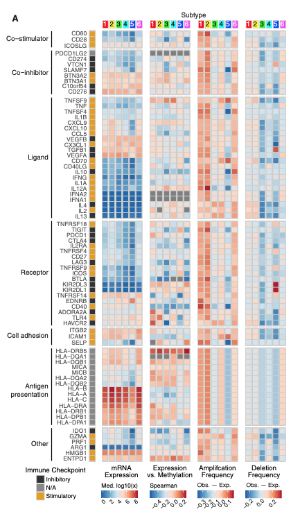

欢迎关注“小丫画图”公众号，回复“小白”，看小视频，实现点鼠标跑代码。

小丫微信: epigenomics  E-mail: figureya@126.com

作者：大鱼海棠，他的更多作品看这里<https://k.koudai.com/OFad8N0w>

单位：中国药科大学生物统计和计算药学研究中心，国家天然药物重点实验室

小丫编辑校验

```{r setup, include=FALSE}
knitr::opts_chunk$set(echo = TRUE)
```

# 需求描述

在单个癌种中复现Figure 6A

亚型的个数可以随意更改更好啦，3类，4类或者6类这样



出自<https://linkinghub.elsevier.com/retrieve/pii/S1074761318301213>

Figure 6. Regulation of Immunomodulators
(A) From left to right: 
**mRNA expression** (median normalized expression levels); 
**expression versus methylation** (gene expression correlation with DNA-methylation beta-value); 
**amplification frequency** (the difference between the fraction of samples in which an IM is amplified in a particular subtype and the amplification fraction in all samples); 
and the **deletion frequency** (as amplifications) for 75 IM genes by immune subtype.

# 应用场景

在肿瘤亚型中研究表达、甲基化、拷贝数变异的关系与分布情况。

这里以乳腺癌为例，PAM50分型有5个。

# 环境设置

使用国内镜像安装包

```{r eval=FALSE}
options("repos"= c(CRAN="https://mirrors.tuna.tsinghua.edu.cn/CRAN/"))
options(BioC_mirror="http://mirrors.tuna.tsinghua.edu.cn/bioconductor/")
BiocManager::install("genefu")
```

加载包

```{r}
library(ComplexHeatmap) # 用于绘制热图
library(circlize) # 用于热图颜色设置
library(ChAMPdata) # 用于提供甲基化注释文件
library(data.table) # 用于读取大文件
library(genefu) # 用于获取乳腺癌PAM50分型
data("pam50.robust")
data("probe.features")
Sys.setenv(LANGUAGE = "en") #显示英文报错信息
options(stringsAsFactors = FALSE) #禁止chr转成factor
```

# 输入文件的准备

以乳腺癌PAM50分型为例，示例数据均下载来自XENA，包括：

- 表达谱：<https://xenabrowser.net/datapages/?dataset=TCGA.BRCA.sampleMap%2FHiSeqV2&host=https%3A%2F%2Ftcga.xenahubs.net&removeHub=https%3A%2F%2Fxena.treehouse.gi.ucsc.edu%3A443>
表达谱为行为基因，列为样本的矩阵，可使用FPKM，TPM，或者normalized count
- 拷贝数：<https://xenabrowser.net/datapages/?dataset=TCGA.BRCA.sampleMap%2FGistic2_CopyNumber_Gistic2_all_thresholded.by_genes&host=https%3A%2F%2Ftcga.xenahubs.net&removeHub=https%3A%2F%2Fxena.treehouse.gi.ucsc.edu%3A443>
用于绘制热图的拷贝数数据需是行为基因，列为样本，入值为基因拷贝数情况的矩阵。矩阵中1为扩增，-1为缺失，0为野生型，此类矩阵一般通过GISTIC分析获取（可参考FigureYa79CNV）
- 甲基化：<https://xenabrowser.net/datapages/?dataset=TCGA.BRCA.sampleMap%2FHumanMethylation450&host=https%3A%2F%2Ftcga.xenahubs.net&removeHub=https%3A%2F%2Fxena.treehouse.gi.ucsc.edu%3A443>
甲基化数据为行为探针，列为样本的beta矩阵，并且需有对应注释文件，以将探针映射到基因水平

```{r}
# 设置热图颜色
heatmap.BlWtRd <- c("#1F66AC", "#75AFD3", "grey90", "#FAB99B", "#B2192B")

# 设置感兴趣基因集
immunomodulator <- read.table("immunomodulator.txt",sep = "\t",row.names = 1,check.names = F,stringsAsFactors = F,header = T)

# 数据处理 #
# 该部分是为产生最终用于绘图的文件
## 表达谱
expr <- read.table("TCGA.BRCA.sampleMap-HiSeqV2.gz",sep = "\t",row.names = 1,check.names = F,stringsAsFactors = F,header = T)
is.element(rownames(immunomodulator),rownames(expr)) # 所有基因都在表达谱内
pam50pred <- molecular.subtyping(sbt.model = "pam50",
                                 data = t(expr),
                                 annot = data.frame(Gene.Symbol = rownames(expr)),
                                 do.mapping = FALSE)
subtype <- as.character(pam50pred$subtype)
sinfo <- data.frame(row.names = colnames(expr),
                    pam50 = subtype,
                    subtype = sapply(subtype, switch,
                                     "Basal"  = "C1",
                                     "Her2"   = "C2",
                                     "LumB"   = "C3",
                                     "LumA"   = "C4",
                                     "Normal" = "C5"))
expr <- expr[rownames(immunomodulator),]

## 甲基化谱
meth <- fread("TCGA.BRCA.sampleMap-HumanMethylation450.gz", sep = "\t",check.names = F,stringsAsFactors = F,header = T,data.table = F)
rownames(meth) <- meth$sample; meth <- meth[,-1]
meth <- as.data.frame(na.omit(meth))

probeOfInterest <- probe.features[which(probe.features$gene %in% rownames(immunomodulator)),]
probeOfInterest <- probeOfInterest[intersect(rownames(probeOfInterest), rownames(meth)),]
is.element(rownames(immunomodulator), probeOfInterest$gene) # 有些基因没有对应的甲基化探针
meth <- meth[rownames(probeOfInterest),]
meth$gene <- probeOfInterest$gene
meth <- as.data.frame(apply(meth[,setdiff(colnames(meth), "gene")], 2, function(x) tapply(x, INDEX=factor(meth$gene), FUN=median, na.rm=TRUE)))

## 拷贝数变异 (-2,-1,0,1,2: 2 copy del, 1 copy del, no change, amplification, high-amplification)
cna <- read.table("Gistic2_CopyNumber_Gistic2_all_thresholded.by_genes",sep = "\t",row.names = 1,check.names = F,stringsAsFactors = F,header = T)
cna$gene <- sapply(strsplit(rownames(cna),"|",fixed = T),"[",1)
cna <- cna[!duplicated(cna$gene),]; cna <- cna[,setdiff(colnames(cna),"gene")]
is.element(rownames(immunomodulator),rownames(cna)) # 有些基因没有对应的拷贝数结果
cna <- cna[intersect(rownames(cna),rownames(immunomodulator)),]
cna[cna > 1] <- 1 # 统一扩增
cna[cna < -1] <- -1 # 统一缺失

## 提取共同样本
comsam <- intersect(colnames(expr), colnames(meth))
comsam <- intersect(comsam, colnames(cna))
sinfo <- sinfo[comsam,,drop = F]
expr <- expr[,comsam]
meth <- meth[,comsam]
cna <- cna[,comsam]
write.table(sinfo[,"subtype",drop = F], file = "easy_input_subtype.txt",sep = "\t",row.names = T,col.names = NA,quote = F)
write.table(expr, file = "easy_input_expr.txt",sep = "\t",row.names = T,col.names = NA,quote = F)
write.table(meth, file = "easy_input_meth.txt",sep = "\t",row.names = T,col.names = NA,quote = F)
write.table(cna, file = "easy_input_cna.txt",sep = "\t",row.names = T,col.names = NA,quote = F)
```

# 绘图矩阵的准备

准备图中四个部分的数据：

- mRNA expression (median normalized expression levels); 
- expression versus methylation (gene expression correlation with DNA-methylation beta-value); 
- amplification frequency (the difference between the fraction of samples in which an IM is amplified in a particular subtype and the amplification fraction in all samples); 
- the deletion frequency (as amplifications) for 75 IM genes by immune subtype.

```{r}
# 读取数据 #
sinfo <- read.table(file = "easy_input_subtype.txt",sep = "\t",row.names = 1,check.names = F,stringsAsFactors = F,header = T)
expr <- read.table(file = "easy_input_expr.txt",sep = "\t",row.names = 1,check.names = F,stringsAsFactors = F,header = T)
meth <- read.table(file = "easy_input_meth.txt",sep = "\t",row.names = 1,check.names = F,stringsAsFactors = F,header = T)
cna <- read.table(file = "easy_input_cna.txt",sep = "\t",row.names = 1,check.names = F,stringsAsFactors = F,header = T)

# 亚型数目（注意，亚型必须以C1，C2，C3...等命名）
(n.subt <- length(unique(sinfo$subtype))) # 获取亚型数目
subt <- unique(sinfo$subtype) # 获取亚型名

# 初始化绘图矩阵
expMat <- as.data.frame(t(expr[rownames(immunomodulator),]))
expMat$subtype <- sinfo[rownames(expMat), "subtype"]
expMat <- as.data.frame(t(apply(expMat[,setdiff(colnames(expMat), "subtype")], 2, 
                                function(x) 
                                  tapply(x, 
                                         INDEX = factor(expMat$subtype), 
                                         FUN = median, 
                                         na.rm = TRUE)))) # 对同一亚型内的样本取中位数
corExpMeth <- ampFreq <- delFreq <- 
  as.data.frame(matrix(NA,
                       nrow = nrow(immunomodulator),
                       ncol = n.subt, 
                       dimnames = list(rownames(immunomodulator), 
                                       unique(sinfo$subtype))))

## 表达谱与甲基化的相关性
for (i in rownames(immunomodulator)) {
  if(!is.element(i, rownames(expr)) | !is.element(i, rownames(meth))) { # 如果存在任意一方有缺失的基因
    corExpMeth[i,] <- NA # 则保持矩阵为NA
  } else { # 否则取出亚型样本，做表达和甲基化的相关性
    for (j in subt) {
      sam <- rownames(sinfo[which(sinfo$subtype == j),,drop = F])
      expr.subset <- as.numeric(expr[i, sam])
      meth.subset <- as.numeric(meth[i, sam])
      ct <- cor.test(expr.subset, meth.subset, method = "spearman") # 这里采用speaman相关性
      corExpMeth[i, j] <- ct$estimate
    }
  }
}

## 扩增/缺失频率
for (i in rownames(immunomodulator)) {
  if(!is.element(i, rownames(cna))) { # 同理，如果存在拷贝数中缺失某基因，则保持NA
    ampFreq[i,] <- NA 
    delFreq[i,] <- NA
  } else { # 否则
    # 计算i在总样本中的频率
    ampFreqInAll <- sum(as.numeric(cna[i,]) == 1)/ncol(cna) # 总样本中扩增的数目除以总样本数
    delFreqInAll <- sum(as.numeric(cna[i,]) == -1)/ncol(cna) # 总样本中缺失的数目除以总样本数
    for (j in subt) {
      # 计算i在亚型j中的频率
      sam <- rownames(sinfo[which(sinfo$subtype == j),,drop = F])
      cna.subset <- cna[, sam]
      ampFreqInSubt <- sum(as.numeric(cna.subset[i,]) == 1)/length(sam) # 该亚型中扩增的数目除以该亚型样本数
      delFreqInSubt <- sum(as.numeric(cna.subset[i,]) == -1)/length(sam) # 该亚型中缺失的数目除以该亚型样本数
      
      ampFreqInDiff <- ampFreqInSubt - ampFreqInAll # 根据原本，用亚型特异性扩增比例减去总扩增比例
      delFreqInDiff <- delFreqInSubt - delFreqInAll # 同理
      
      ampFreq[i, j] <- ampFreqInDiff
      delFreq[i, j] <- delFreqInDiff
    }
  }
}
write.table(expMat,"expMat.txt",sep = "\t",row.names = T,col.names = NA,quote = F)
write.table(corExpMeth,"corExpMeth.txt",sep = "\t",row.names = T,col.names = NA,quote = F)
write.table(ampFreq,"ampFreq.txt",sep = "\t",row.names = T,col.names = NA,quote = F)
write.table(delFreq,"delFreq.txt",sep = "\t",row.names = T,col.names = NA,quote = F)
```

# 开始画图

绘制综合热图

```{r}
# 创建列注释
annCol <- data.frame(subtype = subt,
                     row.names = subt)
annCol <- annCol[order(annCol$subtype),,drop = F] # 按照亚型排序
annColors <- list()
annColors[["subtype"]] <- c("C1" = "red",
                            "C2" = "yellow",
                            "C3" = "green",
                            "C4" = "cyan",
                            "C5" = "blue")
top_anno <- HeatmapAnnotation(df                   = annCol,
                              col                  = annColors,
                              gp                   = gpar(col = "grey80"), # 每个单元格边框为灰色
                              simple_anno_size     = unit(3.5, "mm"), # 注释高3.5毫米
                              show_legend          = F, # 不显示亚型的图例，因为一目了然
                              show_annotation_name = F, # 不显示该注释的名称
                              border               = FALSE) # 不显示注释的外边框

# 创建行注释
annRow <- immunomodulator
annRow[which(annRow$Category == "Co-stimulator"),"Category"] <- "Co-stm" # 这里字符少一些，不会挤在一起，可以后期AI
annRow[which(annRow$Category == "Co-inhibitor"),"Category"] <- "Co-ihb"
annRow[which(annRow$Category == "Cell adhesion"),"Category"] <- "Cell\nadhesion" # 这里换行，不会挤在一起，可以后期AI
annRow[which(annRow$Category == "Antigen presentation"),"Category"] <- "Antigen\npresentation"
annRow$Category <- factor(annRow$Category, levels = c("Co-stm","Co-ihb","Ligand","Receptor","Cell\nadhesion","Antigen\npresentation","Other")) # 由于行需要按照类分割，所以需要定义因子顺序，否则按照字母表
annRow$ICI <- factor(annRow$ICI, levels = c("Inhibitory","N/A","Stimulatory"))
annRowColors <- list("ICI" = c("Inhibitory" = "black","N/A" = "#888888","Stimulatory" = "#E59E02"))
left_anno <- HeatmapAnnotation(df                   = annRow[,"ICI",drop = F],
                               which                = "row", # 这里是行注释（默认为列）
                               gp                   = gpar(col = "grey80"), # 每个单元格边框为灰色
                               col                  = annRowColors,
                               simple_anno_size     = unit(3.5, "mm"), # 注释宽3.5毫米
                               show_annotation_name = F,
                               border               = F)

## 绘制表达谱热图（参数下同）
col_expr <- colorRamp2(seq(min(na.omit(expMat)), max(na.omit(expMat)), length = 5), heatmap.BlWtRd) # 创建热图颜色（将热图输入矩阵的最大最小值取5个点，分配颜色红蓝色板；注意矩阵中可能存在的NA值）
hm.expr <- Heatmap(matrix             = as.matrix(expMat),
                   col                = col_expr,
                   border             = NA, # 无热图外边框
                   rect_gp = gpar(col = "grey80"), # 热图单元格边框为灰色
                   cluster_rows       = F, # 行不聚类
                   cluster_columns    = F, # 列不聚类
                   show_row_names     = T, # 显示行名
                   row_names_side     = "left", # 行名显示在左侧
                   row_names_gp       = gpar(fontsize = 10), # 行名字号为10
                   show_column_names  = F, # 不显示列名（可后期在颜色内AI使得亚型一目了然）
                   column_names_side  = "top", # 列名显示在顶部
                   row_split          = annRow$Category, # 行按照Category进行分割（因子顺序）
                   top_annotation     = top_anno, # 热图顶部注释
                   left_annotation    = left_anno, # 热图左侧注释
                   name               = "mRNA\nExpression", # 热图颜色图例的名称
                   width              = ncol(expMat) * unit(4, "mm"), # 热图单元格宽度（稍大于高度，因为所有注释都放在底部，平衡图形纵横比）
                   height             = nrow(expMat) * unit(3.5, "mm")) # 热图单元格高度

col_corExprMeth <- colorRamp2(seq(min(na.omit(corExpMeth)), max(na.omit(corExpMeth)), length = 5), heatmap.BlWtRd)
hm.corExprMeth <- Heatmap(matrix             = as.matrix(corExpMeth),
                          col                = col_corExprMeth,
                          border             = NA,
                          rect_gp = gpar(col = "grey80"),
                          cluster_rows       = F,
                          cluster_columns    = F,
                          show_row_names     = F,
                          row_names_side     = "left",
                          row_names_gp       = gpar(fontsize = 10),
                          show_column_names  = F,
                          column_names_side  = "top",
                          row_split          = annRow$Category,
                          row_title          = NULL,
                          top_annotation     = top_anno,
                          name               = "Expression\nvs. Methylation",
                          width              = ncol(expMat) * unit(4, "mm"),
                          height             = nrow(expMat) * unit(3.5, "mm"))

col_ampFreq <- colorRamp2(seq(min(na.omit(ampFreq)), max(na.omit(ampFreq)), length = 5), heatmap.BlWtRd)
hm.ampFreq <- Heatmap(matrix             = as.matrix(ampFreq),
                      col                = col_ampFreq,
                      border             = NA,
                      rect_gp = gpar(col = "grey80"),
                      cluster_rows       = F,
                      cluster_columns    = F,
                      show_row_names     = F,
                      row_names_side     = "left",
                      row_names_gp       = gpar(fontsize = 10),
                      show_column_names  = F,
                      column_names_side  = "top",
                      row_split          = annRow$Category,
                      row_title          = NULL,
                      top_annotation     = top_anno,
                      name               = "Amplification\nFrequency",
                      width              = ncol(expMat) * unit(4, "mm"),
                      height             = nrow(expMat) * unit(3.5, "mm"))

col_delFreq <- colorRamp2(seq(min(na.omit(delFreq)), max(na.omit(delFreq)), length = 5), heatmap.BlWtRd)
hm.delFreq <- Heatmap(matrix             = as.matrix(delFreq),
                      col                = col_delFreq,
                      border             = NA,
                      rect_gp = gpar(col = "grey70"),
                      cluster_rows       = F,
                      cluster_columns    = F,
                      show_row_names     = F,
                      row_names_side     = "left",
                      row_names_gp       = gpar(fontsize = 10),
                      show_column_names  = F,
                      column_names_side  = "top",
                      row_split          = annRow$Category,
                      row_title          = NULL,
                      top_annotation     = top_anno,
                      name               = "Deletion\nFrequency",
                      width              = ncol(expMat) * unit(4, "mm"),
                      height             = nrow(expMat) * unit(3.5, "mm"))

pdf(file = "complexheatmap of immunomodulator.pdf", width = 8,height = 12)
draw(hm.expr + hm.corExprMeth + hm.ampFreq + hm.delFreq, # 水平衔接各个子热图
     heatmap_legend_side = "bottom") # 热图颜色图例显示在下方
invisible(dev.off())
```

# Session Info

```{r}
sessionInfo()
```