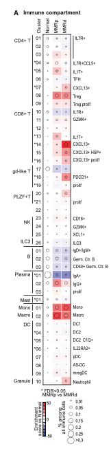
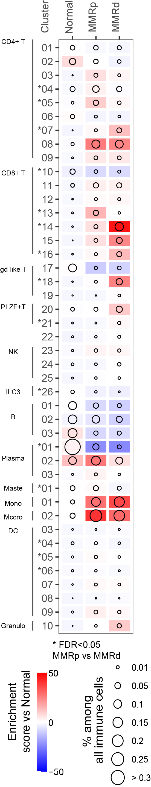
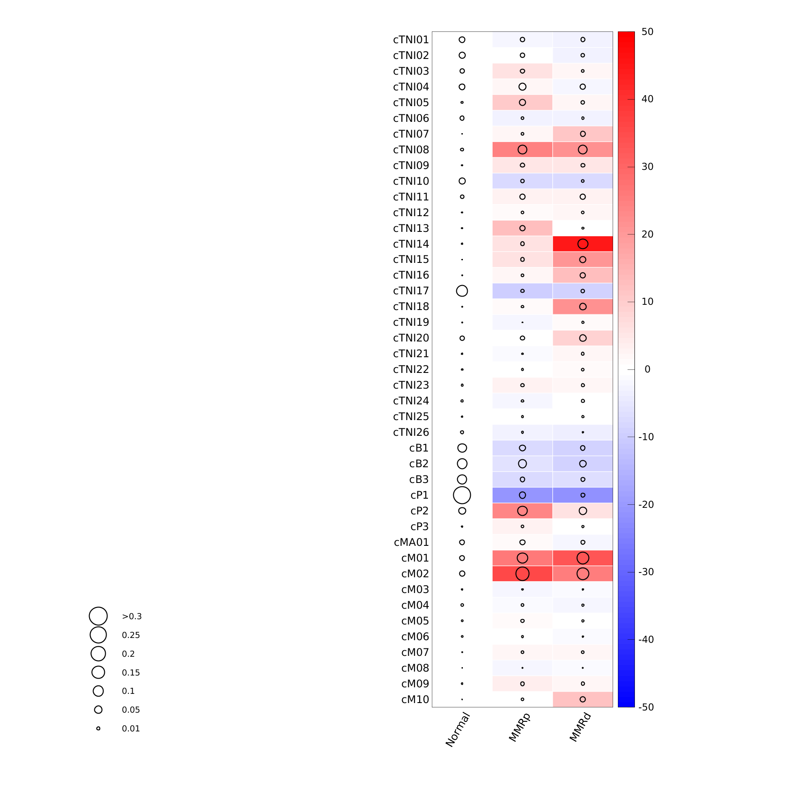

欢迎关注“小丫画图”公众号，回复“小白”，看小视频，实现点鼠标跑代码。

小丫微信: epigenomics  E-mail: figureya@126.com

作者：qliu，他的更多作品看这里<https://k.youshop10.com/=TSn5GjE>

小丫编辑校验

```{r setup, include=FALSE}
knitr::opts_chunk$set(echo = TRUE)
```

# 需求描述

heatmap和bubble plot叠加的图。

Bubble plot和heatmap用的是两套数据



出自<https://linkinghub.elsevier.com/retrieve/pii/S0092867421009454>

Figure 2. The immune compartment in MMRd and MMRp CRC
(A) Compositional changes in immune cell clusters in MMRp and MMRd tumors relative to adjacent normal tissue. 
Kruskal-Wallis false discovery rate (FDR) < 0.05 for MMRp versus MMRd are marked with asterisks.

# 应用场景

Y叔评价：上下三角的更好替代品。上下三角指的是这个图<https://mp.weixin.qq.com/s/34WRZRBVPHUNRLlzNH2nzw>

同时展示同一对象的两种特征，例如同时展示多个基因在多个样本中的表达量和DNA甲基化水平等等。

# 环境设置

使用国内镜像安装包

```{r}
options("repos"= c(CRAN="https://mirrors.tuna.tsinghua.edu.cn/CRAN/"))
options(BioC_mirror="http://mirrors.tuna.tsinghua.edu.cn/bioconductor/")

```

加载包

```{r}
library(tidyverse)
library(ggplot2)
Sys.setenv(LANGUAGE = "en") #显示英文报错信息
options(stringsAsFactors = FALSE) #禁止chr转成factor
```

# 输入文件

这里为复现原文准备数据。先筛选patient，可忽略，直接跳到“求平均值和pvalue”。

首先查看原文excel表中的一些关于图表数据的说明：

> Cell count by patient
- Table showing the immune cell type (rows) counts for each patient (Pid, columns). Only specimens with over 1000 total cells are included in the analysis. Related to Figure 2A.

> Cell enrichment by patient	
- Table showing the immune cell type (rows) enrichment (Pearson-Residual; see Methods) as compared to normals for each patient (Pid, columns). Only specimens with over 1000 total cells are included in the analysis. Related to Figure 2A.

> Compositional differences
- Table showing compositional differences within the immune compartment beteen samples (MMRd, MMRp, Normal). Kruskal-Wallis test was used to determine significant changes. Related to Figure 2A.

我们可以看到是对病人进行了一定的筛选：细胞数目总共超过 1000 的病人才用于分析，那么我们在分析数据前就必须对数据进行一定的过滤

首先我们将两个相关的表格数据copy出来准备为两个文件：
1. A_Cell_count_by_patient.txt
2. B_Cell_enrichment_by_patient.txt

```{r}
# 加载数据
A_Cell_count_by_patient <- read_table("A_Cell_count_by_patient.txt") %>%
  column_to_rownames("Row")
B_Cell_enrichment_by_patient <- read_table("B_Cell_enrichment_by_patient.txt") %>%
  column_to_rownames("Row")

# 根据 A_Cell_count_by_patient 文件筛选出符合标准（细胞数目>1000）的病人
filter_patient_small_1000cell <- colSums(A_Cell_count_by_patient) >= 1000

# 根据筛选好的病人，提取表1和表2中对应的病人信息
filtered_dt_A <- A_Cell_count_by_patient[, filter_patient_small_1000cell]
filtered_dt_B <- B_Cell_enrichment_by_patient[, filter_patient_small_1000cell]

# 保存到文件，便于套用格式
write.csv(filtered_dt_A, "easy_input_A.csv", quote = F)
write.csv(filtered_dt_B, "easy_input_B.csv", quote = F)
```

# 求平均值和pvalue

图中圆圈大小和热图颜色都是同一分组内样本的平均值。

两个文件的行名、列名保持一致。行名为细胞ID；列名为patient ID，以分组名开头，patient有三个分组，分别是MMRp、MMRd和Normal。

easy_input_A.csv，用于画气泡图。气泡图表示的是 %among all all immune cells。先求出每个patient中每种细胞所占的比例，然后再求三个分组patient各种细胞所占比例的平均值。你的数据可能不需要计算比例，例如基因表达量，直接求基因在各样本中的表达量的平均值就好。

easy_input_B.csv，用于画热图。计算三种人群中每种细胞的 `Enrichment score vs Normal` 的平均值。

```{r}
# 加载数据，Cell count by patient，用于画气泡图
filtered_dt_A <- read.csv("easy_input_A.csv", row.names = 1)

plot_data_A <- as.data.frame(apply(filtered_dt_A, 2, function(x) x/sum(x))) %>% # 猜你可能不需要计算每种细胞所占的比例，就改用下面这行
  #filtered_dt_A %>%#
  rownames_to_column(var = "Cell") %>%
  rowwise() %>%
  transmute(
    Cell = factor(Cell, levels = rev(rownames(filtered_dt_A))),
    # 求各分组的平均值
    Normal = mean(c_across(starts_with("Normal"))),
    MMRp = mean(c_across(starts_with("MMRp"))),
    MMRd = mean(c_across(starts_with("MMRd")))
  ) %>%
  ungroup() %>%
  pivot_longer(
    cols = -Cell,
    names_to = "Patient_group",
    values_to = "mean_cell_number"
  ) %>%
  group_by(Patient_group) %>%
  mutate(
    Patient_group = factor(Patient_group, levels = c("Normal", "MMRp", "MMRd")) # 图中的顺序
  ) 

# 加载数据，Cell enrichment by patient，用于画热图
filtered_dt_B <- read.csv("easy_input_B.csv", row.names = 1)

plot_data_B <- filtered_dt_B %>%
  rownames_to_column(var = "Cell") %>%
  rowwise() %>%
  transmute(
    Cell = factor(Cell, levels = rev(rownames(filtered_dt_A))),
    Normal = mean(c_across(starts_with("Normal"))),
    MMRp = mean(c_across(starts_with("MMRp"))),
    MMRd = mean(c_across(starts_with("MMRd")))
  ) %>%
  ungroup() %>%
  pivot_longer(
    cols = -Cell,
    names_to = "Patient_group",
    values_to = "mean_cell_number"
  ) %>%
  group_by(Patient_group) %>%
  mutate(
    Patient_group = factor(Patient_group, levels = c("Normal", "MMRp", "MMRd"))
  ) 
```

例文图中Y轴标出了 `MMRp vs MMRd` Kruskal-Wallis false discovery rate `FDR <- 0.5` 的细胞，因此需要计算pvalue。

根据自己的需要，也可以不做。

```{r}
# 首先构建一个计算 `Pvalue` 的函数
ks <- function(Cell = Cell){
  MMRd <- as.numeric(MMRd_cell_data[Cell, ])
  MMRp <- as.numeric(MMRp_cell_data[Cell, ])
  data <- c(MMRd, MMRp) 
  group = rep(
    c("MMRd", "MMRp"), times = c(length(MMRd), length(MMRp))
  )
  kruskal.test(data, group)$p.value
}

# 计算 pvalue
MMRd_cell_data <- filtered_dt_A %>%
  select(starts_with("MMRd"))
MMRp_cell_data <- filtered_dt_A %>%
  select(starts_with("MMRp"))

Pvalue <- data.frame(
  Cell = row.names(filtered_dt_B),
  Pvalue = sapply(row.names(filtered_dt_B), ks, simplify = T)
  ) %>%
  mutate(
    FDR = p.adjust(Pvalue, method = "fdr"),
    label = ifelse(FDR < 0.05, paste0("*", str_extract(Cell, "[0-9]+")), str_extract(Cell, "[0-9]+"))
      )

write.csv(Pvalue, "output_Pvalue.csv", row.names = F)
```

# 开始画图

图中是热图 + 圈图，如果圈图放在底层，会被热图覆盖。因此我们利用 ggplot2图层叠加的道理，先画热图再画圈图。

另外，这里存在两组不同的数据，我们很多人喜欢将数据集放在 `ggplot()` 函数中，那么就会产生一个全局数据集的概念，所以我们需要将数据集放在各自的绘图函数 `geom_tile` 和 `geom_point()` 中来作为局部数据集。

```{r, fig.height= 10, fig.width=3}
p <- ggplot() +
  geom_tile(
    data = plot_data_B,
    aes(Patient_group, Cell, fill = mean_cell_number), 
    colour = "white", size = 1
  ) +
  scale_fill_gradientn(
    colours  = gplots::bluered(128),
    limit = c(-50, 50),
    breaks = c(-50, 0, 50),
    # breaks = seq(-50, 50, by = 10),
    labels = c("-50", "0", "50"),
    name = "Enrichment \nscore vs Normal"
    ) +
  geom_point(
    data = plot_data_A,
    aes(Patient_group, Cell, size = mean_cell_number),
    shape = 1
  ) +
  scale_size_area(
    breaks = c(0.01, 0.05, 0.1, 0.15, 0.2, 0.25, 0.3),
    labels = c(0.01, 0.05, 0.1, 0.15, 0.2, 0.25, "> 0.3"),
    name = "% among\nall immune cells"
  ) + 
  labs(
    x = "",
    y = ""
  ) +
  scale_x_discrete(position = "top") +
  theme_bw() +
  theme(
    panel.grid.major = element_blank(),
    axis.text.x = element_text(angle = 90),
    legend.position = "bottom", 
    legend.direction="vertical",
    legend.title = element_text(angle = 90),
    legend.title.align = 0.5,
    legend.box.just = "left"
    ) +
   guides(
     fill = guide_colorbar(title.position = "left", order = 1),
     size = guide_legend(title.position = "left", order = 2)
     )

p
```

Y轴标星，采用 `Pvalue` 中的 `label` 替换原本的 yaixs 文本信息

```{r, fig.height= 10, fig.width=3}
p1 <- p +  scale_y_discrete(labels = rev(Pvalue$label), position = "left") 
p1
```

保存结果为 PDF 到本地，再通过 AI 等 PDF 编辑器进行后期的编辑。

```{r}
ggsave("heatmap_bubble_plot_width3.pdf", p1, height = 10, width = 3, device = "pdf")

# 调整输出比例，就变成了方格
ggsave("heatmap_bubble_plot_width1.5.pdf", p1, height = 10, width = 1.5, device = "pdf")
```

AI 简单的编辑后的结果：

{height=800px}

最后给大家看看这篇文章作者用 `PYTHON` 版本的绘制的草图：

- 链接： [Figure_2.ipynb](https://github.com/matanhofree/crc-immune-hubs/blob/main/notebooks/Figure_2.ipynb)


不能说完全一样，只能授之以渔。

# Session Info

```{r}
sessionInfo()
```