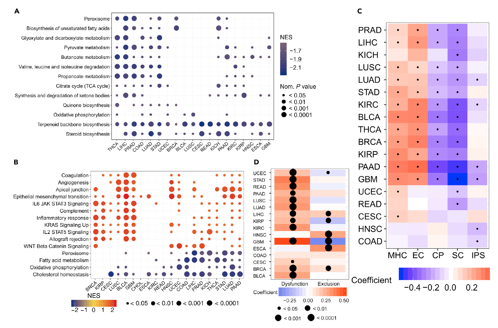

欢迎关注“小丫画图”公众号，回复“小白”，看小视频，实现点鼠标跑代码。

小丫微信: epigenomics  E-mail: figureya@126.com

作者：大鱼海棠，他的更多作品看这里<https://k.koudai.com/OFad8N0w>

单位：中国药科大学国家天然药物重点实验室，生物统计与计算药学研究中心

小丫编辑校验

```{r setup, include=FALSE}
knitr::opts_chunk$set(echo = TRUE)
```

# 需求描述

想把FigureYa253panGSEA<https://k.youshop10.com/QbM6nwGB>中的单基因多通路的泛癌富集分析改成"多基因，单通路的泛癌富集分析"，即把下图中的Y轴变成了基因，X轴还是癌种。



出自<https://www.cell.com/iscience/fulltext/S2589-0042(20)30489-2?_returnURL=https%3A%2F%2Flinkinghub.elsevier.com%2Fretrieve%2Fpii%2FS2589004220304892%3Fshowall%3Dtrue>

Figure 3. Relationships between Ferroptosis and Signaling Pathways and Immunophenotypes
(A and B) Enrichment analysis for metabolism pathway (A) and cancer signaling (B) between high- and low-FPI tumor tissues. NES is the normalized enrichment score in the GSEA algorithm.

# 应用场景

基于特定基因两组数据，对每个肿瘤进行单基因集富集分析(GSEA)，展示某特定通路的富集情况。

更多pancancer分析画图FigureYa看这里<https://k.youshop10.com/C8RkTgR3>

# 环境设置

使用国内镜像安装包

```{r}
options("repos"= c(CRAN="https://mirrors.tuna.tsinghua.edu.cn/CRAN/"))
options(BioC_mirror="http://mirrors.tuna.tsinghua.edu.cn/bioconductor/")

```

加载包

```{r}
library(clusterProfiler)
library(limma)
library(ggplot2)
library(data.table)
library(ggpubr)
library(SimDesign)
source("twoclasslimma.R")
Sys.setenv(LANGUAGE = "en") #显示英文报错信息
options(stringsAsFactors = FALSE) #禁止chr转成factor
```

# 输入文件

merged_sample_quality_annotations.tsv，样本分组信息。下载自<http://api.gdc.cancer.gov/data/1a7d7be8-675d-4e60-a105-19d4121bdebf>。

EBPlusPlusAdjustPANCAN_IlluminaHiSeq_RNASeqV2.geneExp.tsv，表达矩阵，第一列是基因，之后是其在每个样本中的表达量。下载自<http://api.gdc.cancer.gov/data/3586c0da-64d0-4b74-a449-5ff4d9136611>。

```{r}
# 生成文件夹来保存中间结果
res.path <- file.path("Results")
if (!file.exists(res.path)) { dir.create(res.path) }

# 设置颜色
darkblue <- "#303B7F"
darkred <- "#D51113"
yellow <- "#EECA1F"

# 获取感兴趣的肿瘤类型（有正常和肿瘤样本）
tumors <- c("BLCA","BRCA","CESC","CHOL","COAD",
            "ESCA","GBM","HNSC","KICH","KIRC",
            "KIRP","LIHC","LUAD","LUSC","PAAD",
            "PRAD","READ","STAD","THCA","UCEC")

# 从原文中获取感兴趣的基因集 (TTC35/EMC2) 
genelist <- c("CDKN1A","HSPA5","TTC35","SLC7A11","NFE2L2","MT1G","HSPB1","GPX4","FANCD2","CISD1","FDFT1","SLC1A5","SAT1",
         "TFRC","RPL8","NCOA4","LPCAT3","GLS2","DPP4","CS","CARS","ATP5G3","ALOX15","ACSL4")

# 读取肿瘤注释文件
rawAnno <- read.delim("merged_sample_quality_annotations.tsv",sep = "\t",row.names = NULL,check.names = F,stringsAsFactors = F,header = T) # 数据来自http://api.gdc.cancer.gov/data/1a7d7be8-675d-4e60-a105-19d4121bdebf
rawAnno$simple_barcode <- substr(rawAnno$aliquot_barcode,1,15)
samAnno <- rawAnno[!duplicated(rawAnno$simple_barcode),c("cancer type", "simple_barcode")]
samAnno <- samAnno[which(samAnno$`cancer type` != ""),]
write.table(samAnno,"simple_sample_annotation.txt",sep = "\t",row.names = F,col.names = T,quote = F)

# 快速读取表达谱数据并做数据预处理
expr <- fread("EBPlusPlusAdjustPANCAN_IlluminaHiSeq_RNASeqV2.geneExp.tsv",sep = "\t",stringsAsFactors = F,check.names = F,header = T) # 数据来自http://api.gdc.cancer.gov/data/3586c0da-64d0-4b74-a449-5ff4d9136611
expr <- as.data.frame(expr); rownames(expr) <- expr[,1]; expr <- expr[,-1]
gene <- sapply(strsplit(rownames(expr),"|",fixed = T), "[",1)
expr$gene <- gene
expr <- expr[!duplicated(expr$gene),]
rownames(expr) <- expr$gene; expr <- expr[,-ncol(expr)]
expr[expr < 0] <- 0 # 对于这份泛癌数据，将略小于0的数值拉到0，否则不能取log（其他途径下载的泛癌数据可能不需要此操作）
colnames(expr) <- substr(colnames(expr),1,15)
gc()
```

# 运行GSEA

```{r}
msigdb.hallmark <- read.gmt("h.all.v7.2.symbols.gmt") # 这里使用的是HALLMARK背景集，可以改为自己感兴趣的基因集合
pct <- 0.3 # 30%阈值来定义高低组
gseaTab <- NULL
for (i in tumors) {
  message("--",i,"...")
  sam <- samAnno[which(samAnno$`cancer type` == i),"simple_barcode"]
  comsam <- intersect(colnames(expr), sam) # 得到特定肿瘤类型的表达谱
  tumsam <- comsam[substr(comsam,14,14) == "0"] # 仅提取肿瘤样本
  es <- expr[genelist,tumsam] # 取出感兴趣基因和当前肿瘤样本的表达谱子集
  
  for (j in genelist) {
    message("gene of ", j, " starts...")
    es_subset <- as.data.frame(t(es[j,tumsam]))
    es_subset <- es_subset[order(es_subset[,1],decreasing = T),,drop = F] # 对表达值排序
    
    high.es <- rownames(es_subset[1:(nrow(es_subset) * pct),,drop = F]) # 取前30%为高组
    low.es <- rownames(es_subset[nrow(es_subset):(nrow(es_subset) - nrow(es_subset) * pct + 1),,drop = F]) # 取后30%为低组
    
    # 采用两样本limma差异表达分析
    subt <- data.frame(condition = rep(c("high","low"),c(length(high.es),length(low.es))),
                       row.names = c(high.es, low.es),
                       stringsAsFactors = F)
    gset <- log2(na.omit(expr[,rownames(subt)]) + 1)
    twoclasslimma(subtype  = subt, # 亚型信息（必须包含一列为condition）
                  featmat  = gset, # 表达谱（会自动检测数据标准化与否）
                  treatVar = "high", # “治疗组”的名字
                  ctrlVar  = "low", # “对照组”的名字
                  prefix   = paste0("TCGA_",i,"_",j), # 差异表达文件的前缀
                  overwt   = T, # 决定是否覆盖已经存在的差异表达结果
                  sort.p   = F, # 决定是否对结果按照FDR排序
                  verbose  = TRUE, # 决定是否显示一些提示
                  res.path = res.path) # 确定结果路径
    
    # 加载差异表达结果
    res <- read.table(file.path(res.path, paste0("TCGA_",i,"_",j,"_limma_test_result.high_vs_low.txt")),sep = "\t",row.names = 1,check.names = F,stringsAsFactors = F,header = T)
    
    # 产生pre-ranked基因列表
    res <- res[order(res$log2fc, decreasing = T),]
    glist <- res$log2fc; names(glist) <- rownames(res)
    
    # 运行GSEA
    set.seed(20220407)
    gsea <- quiet(GSEA(geneList = glist,
                 pvalueCutoff = 1, # 得到所有结果
                 seed = TRUE,
                 TERM2GENE = msigdb.hallmark,
                 verbose = TRUE))
    gc()
    gsea.df <- as.data.frame(gsea) # 数据转换为数据框
    write.table(gsea.df,file = file.path(res.path,paste0("gsea between high and low group of gene ",j," in ",i,".txt")),sep = "\t",row.names = T,col.names = NA,quote = F)
    
    gseaTab <- rbind.data.frame(gseaTab,
                                data.frame(tumor = i,
                                           gene = j,
                                           term = gsea.df$ID,
                                           NES = gsea.df$NES,
                                           pval = gsea.df$pvalue,
                                           FDR = gsea.df$p.adjust,
                                           stringsAsFactors = F),
                                stringsAsFactors = F)
  }
}
write.table(gseaTab, "TCGA_pancan_gsea_regarding_genes_of_interest.txt",sep = "\t",row.names = F,col.names = T,quote = F)
```

# 开始画图

生成泡泡图

```{r}
pathOfInterest <- "HALLMARK_EPITHELIAL_MESENCHYMAL_TRANSITION" # 设置感兴趣的通路
tmp <- gseaTab[which(gseaTab$term == pathOfInterest),] # 提取和该通路有关的NES
my_palette <- colorRampPalette(c(darkblue,yellow,darkred), alpha=TRUE)(n=128)
ggplot(tmp, aes(x=tumor,y=gene)) +
  geom_point(aes(size=-log10(FDR),color=NES)) +
  scale_color_gradientn('NES', 
                        colors=my_palette) + 
  scale_size_continuous(range = c(1,4)) + #圆点的大小范围
  theme_bw() +
  theme(panel.grid.minor = element_blank(), 
        panel.grid.major = element_blank(),
        axis.text.x = element_text(angle = 45, size = 12, hjust = 0.3, vjust = 0.5, color = "black"),
        axis.text.y = element_text(size = 10, color = "black"),
        axis.title = element_blank(),
        panel.border = element_rect(size = 0.7, linetype = "solid", colour = "black"),
        legend.position = "bottom",
        plot.margin = unit(c(1,1,1,1), "lines"))
ggsave(paste0("GSEA regarding ",pathOfInterest," in pancancer.pdf"), width = 8,height = 6)
```

# Session Info

```{r}
sessionInfo()
```