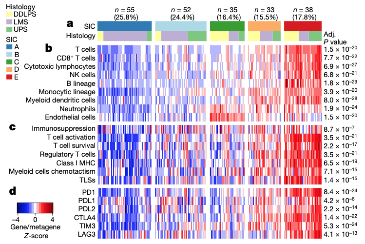

欢迎关注“小丫画图”公众号，回复“小白”，看小视频，实现点鼠标跑代码。

小丫微信: epigenomics  E-mail: figureya@126.com

作者：大鱼海棠，他的更多作品看这里<https://k.koudai.com/OFad8N0w>

单位：中国药科大学生物统计和计算药学研究中心，国家天然药物重点实验室

小丫编辑校验

```{r setup, include=FALSE}
knitr::opts_chunk$set(echo = TRUE)
```

# 需求描述

Soft-tissue sarcomas (STSs) 



出自<https://www.nature.com/articles/s41586-019-1906-8>

Fig. 1 | The SICs exhibit strongly different TMEs. This figure refers to the TCGA SARC cohort (n = 213). a, Composition of the TCGA SARC cohort by SIC, and histology. b, Composition of the TME by SIC as defined by the MCP-counter Z- scores. NK cells, natural killer cells. c, Expression of gene signatures related to the functional orientation of the immune TME by SIC. d, Expression of genes related to immune checkpoints by SIC. Adjusted P values are obtained from Benjamini–Hochberg correction of two-sided Kruskal–Wallis tests P values.

# 应用场景

用MCPcounter计算免疫富集得分，根据MCPcounter结果进行分型。

我们曾众筹过FigureYa56immune_inflitration，也是用TCGA的表达数据计算免疫浸润，并画热图。我们这次画的图信息更丰富。

# 环境设置

使用国内镜像安装包

```{r eval=FALSE}
options("repos"= c(CRAN="https://mirrors.tuna.tsinghua.edu.cn/CRAN/"))
options(BioC_mirror="http://mirrors.tuna.tsinghua.edu.cn/bioconductor/")
install.packages("devtools")
library(devtools)
install_github("ebecht/MCPcounter",ref="master", subdir="Source")
```

加载包

```{r}
library(MCPcounter)
library(GSVA)
library(ComplexHeatmap)
library(ClassDiscovery)
library(gplots)
library(RColorBrewer)

# 自定义函数
standarize.fun <- function(indata=NULL, halfwidth=NULL, centerFlag=T, scaleFlag=T) {  
  outdata=t(scale(t(indata), center=centerFlag, scale=scaleFlag))
  if (!is.null(halfwidth)) {
    outdata[outdata>halfwidth]=halfwidth
    outdata[outdata<(-halfwidth)]= -halfwidth
  }
  return(outdata)
}

Sys.setenv(LANGUAGE = "en") #显示英文报错信息
options(stringsAsFactors = FALSE) #禁止chr转成factor
```

# 输入文件

从XENA下载数据：

TCGA-SARC.htseq_fpkm.tsv.gz，表达谱数据FPKM，已经过`log2(fpkm+1)`转换，下载地址：<https://xenabrowser.net/datapages/?dataset=TCGA-SARC.htseq_fpkm.tsv&host=https%3A%2F%2Fgdc.xenahubs.net&removeHub=https%3A%2F%2Fxena.treehouse.gi.ucsc.edu%3A443>

gencode.v22.annotation.gene.probeMap，ID/Gene Mapping，下载地址同上。

TCGA-SARC.GDC_phenotype.tsv.gz，临床信息，下载地址：<https://xenabrowser.net/datapages/?dataset=TCGA-SARC.GDC_phenotype.tsv&host=https%3A%2F%2Fgdc.xenahubs.net&removeHub=https%3A%2F%2Fxena.treehouse.gi.ucsc.edu%3A443>

```{r}
# 读取XENA下载的FPKM表达谱数据
fpkm <- read.table("TCGA-SARC.htseq_fpkm.tsv.gz", row.names = 1,check.names = F,stringsAsFactors = F,header = T)
Ginfo <- read.table("gencode.v22.annotation.gene.probeMap", row.names = 1,check.names = F,stringsAsFactors = F,header = T)
comgene <- intersect(rownames(fpkm), rownames(Ginfo))
fpkm <- fpkm[comgene,]
Ginfo <- Ginfo[comgene,]

fpkm$gene <- Ginfo[rownames(fpkm),"gene"]
fpkm <- as.data.frame(apply(fpkm[,setdiff(colnames(fpkm), "gene")], 2, function(x) tapply(x, INDEX=factor(fpkm$gene), FUN=median, na.rm=TRUE)))

# 根据原文设置感兴趣签名
immunosuppression.signature <- c("CXCL12","TGFB1","TGFB3","LGALS1")
t.cell.activation.signature <- c("CXCL9","CXCL10","CXCL16","IFNG","IL15")
t.cell.survival.signature <- c("CD70","CD27")
regulatory.t.cell.signature <- c("FOXP3","TNFRSF18")
mhc.signature <- c("HLA-A","HLA-B","HLA-E","HLA-F","HLA-G","B2M")
myeloid.signature <- "CCL2"
tls.signature <- "CXCL13"

# 免疫检查点靶点基因。分别为PD1, PDL1, PDL2, CTLA4, TIM3和LAG3；以下是对应的基因名
ici.gene <- c("PDCD1","CD274","PDCD1LG2","CTLA4","HAVCR2","LAG3")

# 检查这些签名基因是否可以被匹配
is.element(immunosuppression.signature, rownames(fpkm))
is.element(t.cell.activation.signature, rownames(fpkm))
is.element(t.cell.survival.signature, rownames(fpkm))
is.element(regulatory.t.cell.signature, rownames(fpkm))
is.element(mhc.signature, rownames(fpkm))
is.element(myeloid.signature, rownames(fpkm))
is.element(tls.signature, rownames(fpkm))
is.element(ici.gene, rownames(fpkm))

# 加载临床信息并获取共有的样本
sinfo <- read.delim(file = "TCGA-SARC.GDC_phenotype.tsv.gz", sep = "\t",row.names = 1,check.names = F,stringsAsFactors = F,header = T)
comsam <- intersect(rownames(sinfo), colnames(fpkm))
sinfo <- sinfo[comsam,]
fpkm <- fpkm[,comsam]
```

# 计算免疫富集得分，聚类分析

```{r}
# 计算免疫富集得分
# 这里读取的genes.txt和probesets.txt出自MCPcounter包，这样操作速度更快
mcp <- MCPcounter.estimate(fpkm,
                           featuresType = "HUGO_symbols",
                           genes = read.table("genes.txt",sep = "\t",stringsAsFactors = F,header = T,colClasses = "character",check.names = F),
                           probesets = read.table("probesets.txt",sep = "\t",stringsAsFactors = F,header = F,colClasses = "character",check.names = F))
mcp <- mcp[-10, ] # 根据原文移除纤维化，剩下9种细胞

# 对MCPcounter得分进行聚类分析
indata <- t(scale(t(mcp)))
hcs <- hclust(distanceMatrix(as.matrix(indata), "euclidean"), "ward.D") # 原文提到使用欧式距离以及ward's聚类方式
group <- cutree(hcs, k = 5) # 原文分为5类
group <- paste0("C", group); names(group) <- colnames(mcp)

# 先简单绘图看一下趋势
indata <- mcp
plotdata <- standarize.fun(indata, halfwidth = 2)

# 设置颜色
sic.col <- c("#2B7AB5", "#ABD9E8", "#339E2B", "#FDAE61", "#D71719")
hit.col <- c("#FFFF99", "#BDAED4", "#7DC77D", "grey95")

hm <- pheatmap(plotdata,
         border_color = NA,
         color = bluered(64),
         show_rownames = T,
         show_colnames = F,
         cutree_cols = 5,
         cluster_rows = F,
         cluster_cols = hcs,
         name = "MCPcounter",
         cellheight = 12,
         cellwidth = 300/ncol(plotdata),
         annotation_col = data.frame(row.names = colnames(plotdata),
                                     SIC = group[colnames(plotdata)]),
         annotation_colors = list(SIC = c("C1" = sic.col[1], 
                                          "C2" = sic.col[2],
                                          "C3" = sic.col[3],
                                          "C4" = sic.col[4],
                                          "C5" = sic.col[5])))
pdf(file = "heatmap for refer.pdf", width = 8,height = 4)
draw(hm)
invisible(dev.off())

# 根据此热图对样本进行修正和排序，并将组别映射到新的字母顺序
sic <- sapply(group,function(x) {
  switch(x, 
         "C1" = "B", # 注意原C1类应该对应B
         "C2" = "A", # 注意原C2类应该对应A
         "C3" = "C",
         "C4" = "D",
         "C5" = "E")})

# 计算其他签名
geoMean <- function(x) {exp(mean(log(x)))} # 根据原文采用几何平均数法计算签名的得分
immunosuppression.geoMean <- apply(fpkm[immunosuppression.signature,], 2, geoMean)
t.cell.activation.geoMean <- apply(fpkm[t.cell.activation.signature,], 2, geoMean)
t.cell.survival.geoMean <- apply(fpkm[t.cell.survival.signature,], 2, geoMean)
regulatory.t.cell.geoMean <- apply(fpkm[regulatory.t.cell.signature,], 2, geoMean)
mhc.geoMean <- apply(fpkm[mhc.signature,], 2, geoMean)
myeloid.geoMean <- apply(fpkm[myeloid.signature,], 2, geoMean)
tls.geoMean <- apply(fpkm[tls.signature,], 2, geoMean)

# 将签名得分合并
tme.dat <- data.frame("Immunosuppression" = immunosuppression.geoMean,
                      "T cell activation" = t.cell.activation.geoMean,
                      "T cell survival" = t.cell.survival.geoMean,
                      "Regulatory T cell" = regulatory.t.cell.geoMean,
                      "Class I MHC" = mhc.geoMean,
                      "Myeloid cells chemotactism" = myeloid.geoMean,
                      "TLSs" = tls.geoMean)

# 组间比较并计算p值
outTab <- NULL
indata <- as.data.frame(t(rbind.data.frame(mcp, t(tme.dat), fpkm[ici.gene,])))
indata$SIC <- sic[rownames(indata)]
for (i in setdiff(colnames(indata), "SIC")) {
  kt <- kruskal.test(as.numeric(indata[,i]) ~ indata$SIC)
  outTab <- rbind.data.frame(outTab,
                             data.frame(feature = i,
                                        p = kt$p.value,
                                        stringsAsFactors = F),
                             stringsAsFactors = F)
}
outTab$fdr <- p.adjust(outTab$p, method = "fdr") # 矫正p值
outTab$txt <- formatC(outTab$fdr, digits = 2, format = "e") # 将FDR改为科学计数法
outTab$txt <- gsub("e"," × 10", outTab$txt) # 修改文本
rownames(outTab) <- outTab$feature
write.table(outTab, file = "kruskal waills test among different sic groups.txt",sep = "\t",row.names = F,col.names = T,quote = F)
```

# 开始画图

```{r}
# 创建列注释和对应颜色
annCol <- data.frame(row.names = comsam,
                     Histology = sinfo$leiomyosarcoma_histologic_subtype, # XENA下载的histology有很多缺失
                     SIC = sic,
                     stringsAsFactors = F) 
annCol[which(annCol$Histology == ""), "Histology"] <- "Missing"
annCol$Histology <- sapply(annCol$Histology,function(x) {
  switch(x, 
         "Conventional leiomyosarcoma" = "LMS",
         "Poorly differentiated or pleomorphic or epithelioid leiomyosarcoma" = "UPS",
         "Well-differentiated leiomyosarcoma (resembling leiomyoma)" = "DDLPS",
         "Missing" = "Missing")})
annCol$Histology <- factor(annCol$Histology, levels = c("DDLPS", "UPS", "LMS", "Missing"))
annCol <- annCol[order(annCol$SIC, annCol$Histology),,drop = F]

annColors <- list()
annColors[["SIC"]] <- c("A" = sic.col[1], 
                        "B" = sic.col[2],
                        "C" = sic.col[3],
                        "D" = sic.col[4],
                        "E" = sic.col[5])
annColors[["Histology"]] <- c("DDLPS" = hit.col[1],
                              "LMS" = hit.col[2],
                              "UPS" = hit.col[3],
                              "Missing" = hit.col[4])

# 重新绘图
## MCPcounter部分
indata <- mcp
plotdata <- standarize.fun(indata, halfwidth = 2)
rownames(plotdata) <- paste(rownames(plotdata), outTab[rownames(plotdata), "txt"], sep = " ") # 将签名和矫正p值的文本合并
hm1 <- pheatmap(plotdata[,rownames(annCol)],
               border_color = NA, # 无边框
               color = bluered(64), # 采用红蓝颜色
               show_rownames = T, # 显示行名
               show_colnames = F, # 不显示列名
               cluster_rows = F, # 行不聚类
               cluster_cols = F, # 列不聚类
               name = "Gene/metagene\nZ-score", # 颜色图例的名字（所有热图统一，这样只会显示一个）
               cellheight = 12, # 热图元素高度
               cellwidth = 300/ncol(plotdata), # 热图总宽度固定为300
               gaps_col = cumsum(table(annCol$SIC)), # 切割类
               annotation_col = annCol, # 样本注释
               annotation_colors = annColors) # 注释颜色

## 其他免疫签名部分
plotdata <- standarize.fun(t(tme.dat), halfwidth = 2)
rownames(plotdata) <- paste(rownames(plotdata), outTab[rownames(plotdata), "txt"], sep = " ")
hm2 <- pheatmap(plotdata[,rownames(annCol)],
                border_color = NA,
                color = bluered(64),
                show_rownames = T,
                show_colnames = F,
                cluster_rows = F,
                cluster_cols = F,
                name = "Gene/metagene\nZ-score",
                cellheight = 12,
                cellwidth = 300/ncol(plotdata),
                gaps_col = cumsum(table(annCol$SIC)))

## 免疫检查点表达部分
plotdata <- standarize.fun(fpkm[ici.gene,], halfwidth = 2)
rownames(plotdata) <- paste(rownames(plotdata), outTab[rownames(plotdata), "txt"], sep = " ")
hm3 <- pheatmap(plotdata[,rownames(annCol)],
                border_color = NA,
                color = bluered(64),
                show_rownames = T,
                show_colnames = F,
                cluster_rows = F,
                cluster_cols = F,
                name = "Gene/metagene\nZ-score",
                cellheight = 12,
                cellwidth = 300/ncol(plotdata),
                gaps_col = cumsum(table(annCol$SIC)))

pdf(file = "TMEheatmap.pdf", width = 10,height = 6)
draw(hm1 %v% hm2 %v% hm3, # 纵向合并三个热图
     heatmap_legend_side = "left", # 热图图例显示在左侧
     annotation_legend_side = "left") # 样本注释显示在左侧
invisible(dev.off())
```

# Session Info

```{r}
sessionInfo()
```