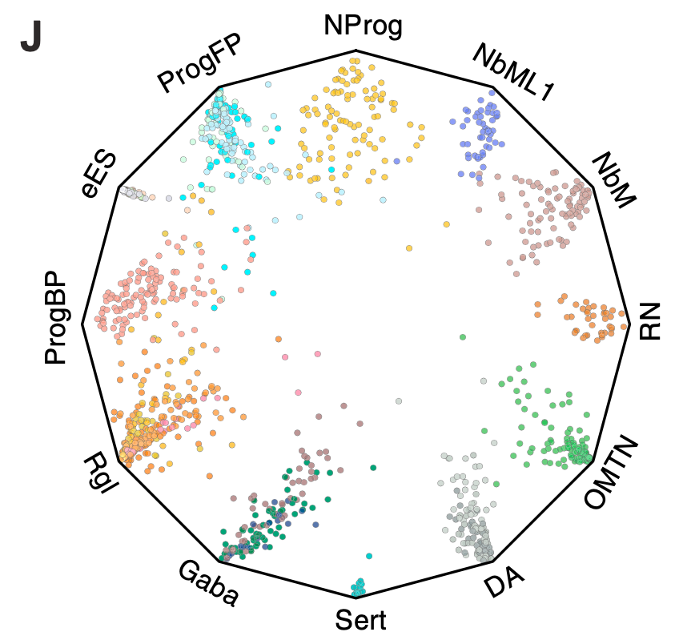
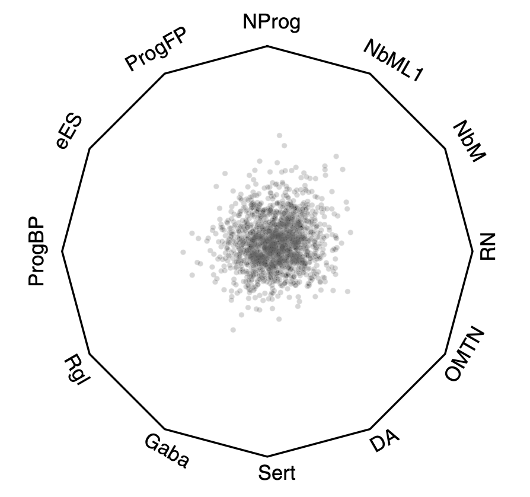
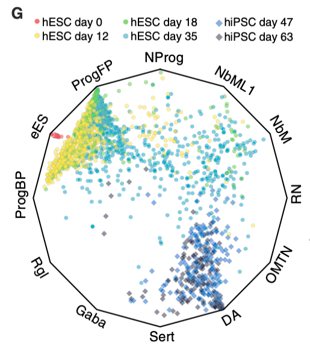

欢迎关注“小丫画图”公众号，回复“小白”，看小视频，实现点鼠标跑代码。

小丫微信: epigenomics  E-mail: figureya@126.com

大鱼海棠，他的更多作品看这里<https://k.koudai.com/OFad8N0w>

单位：中国药科大学生物统计和计算药学研究中心，国家天然药物重点实验室

小丫编辑校验

```{r setup, include=FALSE}
knitr::opts_chunk$set(echo = TRUE)
```

# 需求描述

用R画出多角图wheel plot。比如有九个角，然后我有个dataframe是各数据点到九个角的数值，想画一个图表示。这里是用python画的<https://github.com/linnarsson-lab/ipynb-lamanno2016/blob/master/ipynb-lamanno2016-cellscoring.ipynb>，想用R画。



出自<https://linkinghub.elsevier.com/retrieve/pii/S0092867416313095>

Figure S7Stem Cells Differentiation Protocol and Machine Learning Performance and Diagnostics, Related to Figure 7
(J) Training dataset plotted on wheel plot as in Figure 7G.

文章中多次用到了类似的图：


Figure S7Stem Cells Differentiation Protocol and Machine Learning Performance and Diagnostics, Related to Figure 7
(L) Negative control cells are obtained by scrambling gene values of cells of the training dataset and are plotted on wheel plot as in Figure 7G.



Figure 7. Single-Cell Analysis of Differentiated In Vitro Human ESC and iPSC Cultures and Prototype-Based Scoring
(G) Wheel plot showing the prototype scores for hESCs and hiPSCs. 
Dots represent individual cells and the **distance to each prototype is proportional to the relative score of that prototype. **
Colors indicate time point of differentiation (red, day 0; dark blue, day 63).

# 应用场景

特别适合两种独立分组方式的数据：外围的角代表第一种分组，点的颜色形状代表第二种分组，点跟角的距离代表数值高低。

另外，还可以参考FigureYa235scDEG<https://k.youshop10.com/m=E-yK5Z>的画法，第一种分组从左往右一字排开，第二种分组画到上下两侧（如果超过两组就要再引入颜色、形状等特征来加以区分），点跟横轴的距离代表数值高低。

# 环境设置

使用国内镜像安装包

```{r}
options("repos"= c(CRAN="https://mirrors.tuna.tsinghua.edu.cn/CRAN/"))
options(BioC_mirror="http://mirrors.tuna.tsinghua.edu.cn/bioconductor/")

```

加载包

```{r}
library(ggplot2)

Sys.setenv(LANGUAGE = "en") #显示英文报错信息
options(stringsAsFactors = FALSE) #禁止chr转成factor
```

# 输入文件

easy_input.txt，最后一列跟点的颜色相对应，前面各列的列名跟图中的角相对应，数值对应点到角的距离。

```{r}
# 读取文件
## 文件格式如下
### 行为某种观测（点），列为某种水平（角），末列标注各个点的归属情况
### 数据大小在0-1之间，样本间可比
raw.data <- read.table("easy_input.txt", header = T, stringsAsFactors = T)
```

# 为画图准备数据

```{r}
# 记录末列的名称
txt <- colnames(raw.data)[ncol(raw.data)]

## 计算坐标轴角度
sides <- ncol(raw.data) - 1 # 边的个数（列数减1，因为有末列）
start_angle <- 90 # 开始角度
basis <- t(sapply((1:sides)-1, function(i){
  c(cos(2 * i * pi / sides + start_angle * pi / 180),
    sin(2 * i * pi / sides + start_angle * pi / 180))
}))

## 将12维的数据坐标投射到二维
data <- as.matrix(raw.data[, -match(txt, colnames(raw.data))]) %*% basis

# 准备绘图数据
### 点的数据
plot.data <- data.frame(
  "x" = data[, 1],
  "y" = data[, 2],
  "Group" = raw.data$celltype
)
### 多边形的数据
basis <- data.frame(
  "x" = basis[, 1],
  "y" = basis[, 2]
)
### 类图例的数据
label <- data.frame(
  "x" = 1.1 * basis[, 1],
  "y" = 1.1 * basis[, 2],
  "label" = colnames(raw.data)[-ncol(raw.data)]
)

### 设定颜色（由原Python代码改写来，使用的是RGB颜色）
color.palette <- list(
  'hEndo'=   c(190,  10,  10),'hPeric'= c(225, 160,  30),'hMgl'=    c(217, 245,   7),
  'hDA1'=    c(170, 180, 170),'hDA2'=   c(130, 140, 140),'hNbM'=    c(180, 140, 130),
  'hNbML1'=  c(100, 100, 240),'hProgM'= c( 80, 235, 255),'hProgFPM'=c(190, 235, 255),
  'hProgFPL'=c(210, 255, 215),'hProgBP'=c(230, 140, 120),'hNProg'=  c(255, 195,  28),
  'hNbML5'=  c(139, 101, 100),'hRgl1'=  c(252, 183,  26),'hRgl3'=   c(214, 194,  39),
  'hRgl2c'=  c(255, 120, 155),'hRgl2b'= c(250, 145,  45),'hRgl2a'=  c(250, 125,  25),
  'hDA0'=    c(190, 200, 190),'hOPC'=   c(255,  35, 155),'hRN'=     c(199, 121,  41),
  'hNbGaba'= c( 40,  55, 130),'hGaba'=  c(  7,  121, 61),'hOMTN'=   c( 95, 186,  70),
  'hSert'=   c( 50, 180, 180),'eSCa'=   c(245, 205, 170),'eSCb'=    c(205, 245, 170),
  'eSCc'=    c(205, 205, 220)
)
color.palette <- lapply(color.palette, function(x){
  rgb(red = x[1]/255, green = x[2]/255, blue = x[3]/255)
})
color.palette <- unlist(color.palette) # 最终的颜色格式为一个带名称的16进制字符串
```

# 开始画图

```{r}
ggplot(plot.data, aes(x = x, y = y)) +
  geom_point(aes(col = Group, size = .5)) +
  geom_polygon(mapping = aes(x = x, y = y), data = basis,
               fill = "transparent", color = "black", size = 1) +
  geom_text(mapping = aes(x = x, y = y, label = label), data = label) +
  scale_color_manual(values = color.palette) +
  theme_classic() +
  theme(axis.line = element_blank(),
        axis.title = element_blank(),
        axis.ticks = element_blank(),
        axis.text = element_blank())

ggsave("wheelplot.pdf", width = 10, height = 8) # 保存图形
```

还可以用形状区分另一层分组，就像例文Figure 7G用不同形状进一步区分hESCs and hiPSCs

```{r}
# 这里用形状区分eSC及其他
plot.data$group3 <- "others"
plot.data[plot.data$Group %in% c("eSCa", "eSCb", "eSCc"),]$group3 <- "eSC"

ggplot(plot.data, aes(x = x, y = y)) +
  geom_point(aes(col = Group, shape = group3, size = .5)) + # 用group3控制点的形状
  scale_shape_manual(values = c(18, 20)) + # 20是圆，18是菱形，用?points查看更多形状
  geom_polygon(mapping = aes(x = x, y = y), data = basis,
               fill = "transparent", color = "black", size = 1) +
  geom_text(mapping = aes(x = x, y = y, label = label), data = label) +
  scale_color_manual(values = color.palette) +
  theme_classic() +
  theme(axis.line = element_blank(),
        axis.title = element_blank(),
        axis.ticks = element_blank(),
        axis.text = element_blank())

ggsave("wheelplot_plus.pdf", width = 8, height = 6) # 保存图形
```

# Session Info

```{r}
sessionInfo()
```