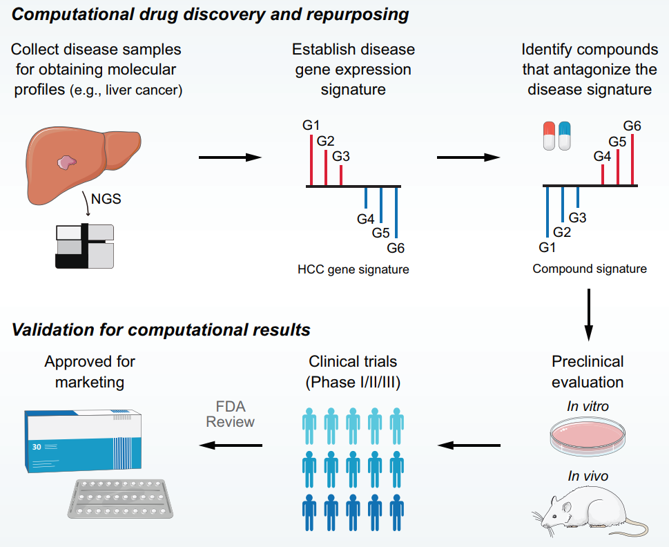

欢迎关注“小丫画图”公众号，回复“小白”，看小视频，实现点鼠标跑代码。

小丫微信: epigenomics  E-mail: figureya@126.com

作者：samyang，他的更多作品看这里<https://k.youshop10.com/igBX73z8>

小丫编辑校验

```{r setup, include=FALSE}
knitr::opts_chunk$set(echo = TRUE)
```

# 需求描述

小丫老师您好，我发现FigureYa131cMAP最近好像用不了了，有篇最近的文章好像也能用类似cmap的方法来进行药物预测，但这篇没有没有提供代码，请问能众筹一下吗，也可以替代一下FigureYa131cMAP



出自<https://elifesciences.org/articles/71880>

Figure 1. Overview of LINCS data-driven therapeutic discovery. The working principle of ‘signature reversion’-based computational approach. A disease signature representing discordant expression pattern needs first to be identified (G1, G2, and G3 stand for upregulated genes while G4, G5, and G6 stand for down-regulated genes in disease state). With this signature, pharmacologic perturbation data sets can be queried to find compounds with the ability to reverse disease expression pattern (suppress expression of G1, G2, and G3 and induce expression of G4, G5, and G6). After determining the candidate compounds, experimental and clinical validation are required to translate computational findings to clinical applications. LINCS, Library of Integrated Network-based Cellular Signatures.

# 应用场景

CMap分析主要涉及三个部分：

- 一是疾病的分子特征（disease signature）：以肿瘤为例，这个signature可以通过常规的癌与癌旁的差异分析得到。
- 二是药物的分子特征（druf signature）：这部分数据可以来自大家熟悉CMap数据库（包括了1309种药物在5个细胞系中的药物处理后的表达特征）。  
- 三是特征匹配算法（signature matching methods）：大家常用的网页版的CMap通常使用基于Kolmogorov-Smirnov (KS)的方法来计算CMap score，但这种方法经证明并不是最优的计算cmap分析方法 (Yang et al. Elife 2022)。
  
例文这项研究 (Yang et al. Elife 2022, https://elifesciences.org/articles/71880) 证明了使用 eXtreme Sum (XSum) 的方法来进行CMap分析最有可能得到有意义的结果（XSum的性能经该研究评估要比大家常用的网页工具中的KS要好很多）。此外，该研究也确定了进行 CMap 分析时最优的参数（以下演示中会提到）。虽然该研究并不是使用 CMap 数据库而主要使用了LINCS数据库（关于CMap和LINCS的区别大家可以自己看看原文），但方法在两个数据库之间是通用的。因此，以下演示仍将使用大家熟悉的CMap数据；且所有分析全部可用R完成，不需要再基于任何网页工具。  

如果大家使用了以下演示中的方法，记得引用例文文献（PMID: 35191375）。  

# 环境设置

使用国内镜像安装包

```{r eval=FALSE}
options("repos"= c(CRAN="https://mirrors.tuna.tsinghua.edu.cn/CRAN/"))
options(BioC_mirror="http://mirrors.tuna.tsinghua.edu.cn/bioconductor/")
BiocManager::install("PharmacoGx")
BiocManager::install("CoreGx", force = TRUE)
install.packages("shinyjs")
install.packages("shinydashboard")
install.packages("magicaxis")
install.packages("lsa")
install.packages("relations")
```

加载包

```{r}
library(PharmacoGx)
library(parallel)
library(dplyr)
library(stringr)
library(tidyverse)
library(tibble)
library(clusterProfiler)
library(ggplot2)
library(ggrepel)
library(ggthemes)
library(gridExtra)
Sys.setenv(LANGUAGE = "en") #显示英文报错信息
options(stringsAsFactors = FALSE) #禁止chr转成factor
```

# CMap数据下载及预处理  
  
CMAP_gene_signatures.RData，处理好的CMap数据，下载地址<https://www.pmgenomics.ca/bhklab/sites/default/files/downloads/CMAP_gene_signatures.RData> 

camp_sig.rds，这里作演示的文件只包含了部分药物。实际应用时要用完整的cmap数据，请自行下载CMAP_gene_signatures.RData，并运行以下代码，即可得到**完整的 camp_sig.rds 文件**。

```{r, eval=FALSE}
# 提取药物处理矩阵
load("CMAP_gene_signatures.RData")
camp_sig <- CMAP.genePerturbations[,,c("tstat")] %>% data.frame()

# 基因名转换
camp_sig$ENTREZID <- do.call(rbind, strsplit(rownames(camp_sig),'\\.'))[,2]

SYMBOL <- bitr(camp_sig$ENTREZID, fromType = "ENTREZID",
               toType = "SYMBOL", OrgDb = "org.Hs.eg.db")

camp_sig <- merge(SYMBOL, camp_sig, by = "ENTREZID")
camp_sig <- column_to_rownames(camp_sig, var = "SYMBOL"); camp_sig <- camp_sig[,-1]

# 保存数据
saveRDS(camp_sig, "camp_sig.rds")
```

# 疾病分子特征预处理  

以下演示将以肝癌数据为例，通过癌与癌旁的差异分析得到疾病分子特征。 

当然通过差异分析得到疾病分子特征是camp分析最简单的一种应用方式，大家也可以开发更多的使用方式（如通过比较转移与非转移的肿瘤样本得到与转移相关的分子特征，基于这个分子特征进行cmap分析就有可能找到潜在对抗转移的药物）。

```{r}
# 以下生成signature基因的代码只适用于TCGA来源的数据
data <- read.table("LIHC_TPM.txt", sep="\t", check.names=F, header=T, row.names=1)

# 得到癌与癌旁比较的logfc
tumor <- data[, str_detect(colnames(data), "-01")]
normal <- data[, str_detect(colnames(data), "-11")]

dis_sig <- data.frame(id=rownames(data),
                      fc=log2(rowMeans(tumor)/rowMeans(normal)))
dis_sig <- dis_sig[dis_sig$fc != "Inf" & dis_sig$fc != "-Inf",]
dis_sig <- na.omit(dis_sig)

# 提取变化倍数最大的基因
# 例文（Yang et al）提到疾病分子特征数量选择100时可以获得较好的预测性能。但这篇研究是基于LINCS数据，cmap数据的维度与LINCS差别明显。这里我们建议疾病分子特征数量可以稍微多一点，以下演示使用top300基因进行XSum分析
dis_sig <- rbind(top_n(dis_sig, 150, fc), top_n(dis_sig, -150, fc))

# 将logfc转成二分类变量（logfc>0的基因用1表示，logfc小于0的基因用-1表示）
# 使用XSum时不需要考虑差异基因的差异倍数，这步分析是为了让大家更好的理解，并不是并要的

dis_sig$fc[dis_sig$fc>0] <- 1; dis_sig$fc[dis_sig$fc<0] <- -1
rownames(dis_sig) <- NULL

# 保存结果
write.table(dis_sig, "dis_sig.csv", sep=",", quote=F, row.names=F, col.names=T)

# dis_sig只要整理成以下格式都可以在后面的分析中使用
head(dis_sig)
```

# 计算CMap score  

```{r}
# 读入drug signature
camp_sig <- readRDS("camp_sig.rds")

# 读入disease signature
dis_sig <- read.csv('dis_sig.csv', sep=',', header=TRUE)

# 读入XSum函数
source("Core_function.R")

# 选择XSum的topN（Yang et al的研究提到topN选择200效果可能比较好，但这个结论可能不适用与cmap的数据，这里我们选择topN = 500）
XLogFC <- eXtremeLogFC(camp_sig, N = 500)

up_gene <- dis_sig$id[dis_sig$fc == 1]
dn_gene <- dis_sig$id[dis_sig$fc == -1]

xsum <- data.frame(score=XSum(XLogFC, up_gene, dn_gene))
xsum <- rownames_to_column(xsum, var = "id")

# 把结果标准化至-1到1（这步也可不做）
xsum_pos <- xsum[xsum$score>0,]
xsum_pos$score <- xsum_pos$score/max(xsum_pos$score)

xsum_neg <- xsum[xsum$score<0,]
xsum_neg$score <- xsum_neg$score/min(xsum_neg$score) * -1

xsum <- rbind(xsum_pos, xsum_neg)

# 将结果从低到高排序
xsum <- xsum[order(xsum$score),]
head(xsum)
```
  
> 结果解读：

基于CMap的理论（已经被大量研究验证），这里我们得到的分数越低，这个药物越有可能逆转疾病的分子特征，理论上更有可能具有治疗该疾病的能力。该演示数据结果提示 X4.5.dianilinophthalimide 是最有可能治疗肝癌的药物  

# 结果可视化  
  
```{r, ig.align='center'}
xsum$number <- 1:nrow(xsum)

# 突出显示top5的药物，标出药物名
select <- xsum[1:5,]

# 开始画图
ggplot(xsum, aes(number,score))+
  geom_point(size=3, color="grey50") + 
  geom_point(data = select, alpha = 1, 
             size = 5, color = "#5ec7dd") + 
  geom_label_repel(data = select, aes(label=id), 
                   color = "white",
                   alpha = 1, point.padding = 1, 
                   size = 5, fill = "#009bc7",
                   segment.size = 1, nudge_x=-0.5, 
                   segment.color = "grey50",
                   direction = "x",
                   hjust = 1) + 
  theme_classic()

ggsave("CMAP_XSum.pdf", width = 5, height = 7)
```

# Session Info

```{r}
sessionInfo()
```