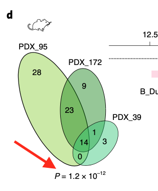

欢迎关注“小丫画图”公众号，回复“小白”，看小视频，实现点鼠标跑代码。

小丫微信: epigenomics  E-mail: figureya@126.com

作者：大鱼海棠，他的更多作品看这里<https://k.koudai.com/OFad8N0w>

单位：中国药科大学生物统计和计算药学研究中心，国家天然药物重点实验室

小丫编辑校验

```{r setup, include=FALSE}
knitr::opts_chunk$set(echo = TRUE)
```

# 需求描述

主要是不知道这个韦恩图的p值是怎么实现的（exact test of multiset intersections）



出自<https://www.nature.com/articles/s41588-022-01047-6>

Fig. 1 | identification of a pool of basal persister cells in TNBC in vivo and in vitro.
d, Venn diagram displaying the intersection of pathways activated
in persister cells from the three PDX models, among MSigDB c2_curated Breast/Mammary and c7_Hallmark pathways (left). The P value below the
Venn diagram is associated with the intersection (exact test of multiset intersections). Barplot displaying the top five pathways (for each category) activated in persister cells (right). The x axis corresponds to –log10 q-values for the model PDX_95. 

# 应用场景

韦恩图及p值计算（基于多个数据集交集精确检验，Exact test of multiset intersect）

# 环境设置

使用国内镜像安装包

```{r}
options("repos"= c(CRAN="https://mirrors.tuna.tsinghua.edu.cn/CRAN/"))
options(BioC_mirror="http://mirrors.tuna.tsinghua.edu.cn/bioconductor/")

```

加载包

```{r}
library(VennDiagram)# 加载韦恩图画图软件包“VennDiagram”
library(SuperExactTest) # 加载可求多个交集精确检验P值的软件包

Sys.setenv(LANGUAGE = "en") #显示英文报错信息
options(stringsAsFactors = FALSE) #禁止chr转成factor
```

# 输入文件

easy_input.txt，每个数据集为一列。这里以3个为例，可以有更多个数据集。

```{r}
# 读入测试数据 (这里为了简单演示，由26个英文字母生成三个数据集)
dat <- read.table("easy_input.txt",sep = "\t", header = T, stringsAsFactors = F,check.names = F) # 多个数据集数据，如多个癌症基因集 

# 转化为列表数据类型
dat <- as.list(dat) 
n.bk <- length(unique(unlist(dat)))
```
# 计算p value

输出多个数据集重叠显著P值，基于软件包“SuperExactTest”中MSET函数: Calculate FE and significance of intersection among multiple sets.

参考文献 Wang, M., Zhao, Y., & Zhang, B. (2015). Efficient test and visualization of multi-set intersections. Scientific reports, 5(1), 1-12.

```{r}
mset.res <- MSET(x = dat, # 定义的列表数据
                 n = 26, # n为背景群体数量，如基因总数，或这里的总的英文字母数26
                 lower.tail = FALSE) #lower.tail=FALSE表示计算上侧拖尾P值(统计量大于一个观察到的值概率)，即这里要计算的多个数据集重叠显著P值
p.value <- mset.res$p.value

# 打印pvalue
p.value
```

# 画venn图

个人比较推荐采用在线工具绘制scale后的韦恩图，方便快捷可编辑，可尝试以下链接：
<http://bioinformatics.psb.ugent.be/webtools/Venn/>
<http://bioinfogp.cnb.csic.es/tools/venny/index.html>

这里用R画，用的是VennDiagram包。
还可以用ggVennDiagram包，标注各区域百分比，并且按百分比填充颜色，可参考<https://www.yuque.com/figureya/figureyaplus/figureya112p>。
如果有>=5个数据集，可尝试eulerr<https://cran.r-project.org/web/packages/eulerr/vignettes/venn-diagrams.html>或nVennR包<https://cran.r-project.org/web/packages/nVennR/vignettes/nVennR.html>

```{r}
venn <- venn.diagram(x = dat, # 定义的列表数据
                     filename = NULL, # 不输出图名
                     fill = c('red','steelblue','yellow')) # 表示三个集填充色
grid.newpage()
grid.draw(venn)
dev.copy2pdf(file = "venny.pdf", width = 5, height = 5)
```

# Session Info

```{r}
sessionInfo()
```