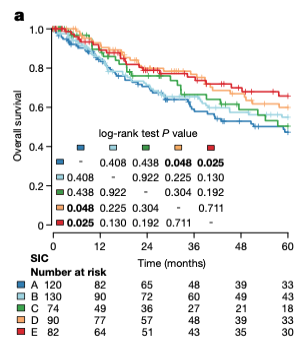

欢迎关注“小丫画图”公众号，回复“小白”，看小视频，实现点鼠标跑代码。

小丫微信: epigenomics  E-mail: figureya@126.com

作者：大鱼海棠，他的更多作品看这里<https://k.koudai.com/OFad8N0w>

单位：中国药科大学生物统计和计算药学研究中心，国家天然药物重点实验室

小丫编辑校验

```{r setup, include=FALSE}
knitr::opts_chunk$set(echo = TRUE)
```

# 需求描述

希望画出文章里面Figure2的a



出自<https://www.nature.com/articles/s41586-019-1906-8>

Fig. 2 | SICs and B cells are predictive of the survival of patients with STS. 
b, Multivariate Cox proportional regression outcome, with all included variables represented. For each variable, the reference level is the first one. A grey bar indicates P > 0.05; and variables indicated by green and red bars are positively and negatively, respectively, significantly associated with prognosis in this multivariate model. Error bars represent the 95% confidence interval. FNCLCC, Fédération Nationale des Centres de Lutte Contrele Cancer.

# 应用场景

对3组及以上的亚组进行生存分析，并打印配对比较的统计表格。

参考：MOVICS包中compSurv()函数：<https://github.com/xlucpu/MOVICS/blob/master/R/compSurv.R>

# 环境设置

使用国内镜像安装包

```{r}
options("repos"= c(CRAN="https://mirrors.tuna.tsinghua.edu.cn/CRAN/"))
options(BioC_mirror="http://mirrors.tuna.tsinghua.edu.cn/bioconductor/")

```

加载包

```{r}
library(survival)
library(survminer)
library(RColorBrewer)
library(tibble)
library(ggpp)
Sys.setenv(LANGUAGE = "en") #显示英文报错信息
options(stringsAsFactors = FALSE) #禁止chr转成factor
```

# 输入文件

easy_input.csv，生存和分组信息，这里是乳腺癌数据。

```{r}
# 加载示例数据
dat <- read.table("easy_input.txt",sep = "\t",row.names = 1,check.names = F,stringsAsFactors = F,header = T)
```

# 生存分析

```{r}
# 仿照原文将PAM50分型按照ABCDE标记
dat$group <- sapply(dat$PAM50,function(x) {
  switch(x, 
         "Basal"  = "A", # 将Basal标记为A
         "Her2"   = "B", # 将Her2标记为B
         "LumA"   = "C", # 将LumA标记为C
         "LumB"   = "D", # 将LumB标记为D
         "Normal" = "E")}) # 将Normal标记为E

# 将生存时间转换为月份
dat$OS.time <- dat$OS.time * 12 

# 生存分析
fitd <- survdiff(Surv(OS.time, OS) ~ group,
                 data      = dat,
                 na.action = na.exclude)
p.val <- 1 - pchisq(fitd$chisq, length(fitd$n) - 1)
fit <- survfit(Surv(OS.time, OS)~ group,
               data      = dat,
               type      = "kaplan-meier",
               error     = "greenwood",
               conf.type = "plain",
               na.action = na.exclude)

# 配对生存分析
ps <- pairwise_survdiff(Surv(OS.time, OS)~ group,
                        data            = dat,
                        p.adjust.method = "none") # 这里不使用矫正，若需要矫正可以将none替换为BH
```

# 开始画图

```{r fig.width=6, fig.height=8}
# 设置颜色
mycol <- brewer.pal(n = 10, "Paired")[c(2,4,6,8,10)]

# 绘制基础图形
## 隐藏类标记
names(fit$strata) <- gsub("group=", "", names(fit$strata))

## 生存曲线图
p <- ggsurvplot(fit               = fit,
                conf.int          = FALSE, # 不绘制置信区间
                risk.table        = TRUE, # 生存风险表
                risk.table.col    = "strata",
                palette           = mycol, # KM曲线颜色
                data              = dat,
                xlim              = c(0,120), # 时间轴，一般考虑5年（原文）或者10年长度
                size              = 1,
                break.time.by     = 12, # 时间轴的刻度（每年）
                legend.title      = "",
                xlab              = "Time (months)",
                ylab              = "Overall survival",
                risk.table.y.text = FALSE,
                tables.height     = 0.3) # 风险表的高度
p

## 添加overall p value
p.lab <- paste0("log-rank test P",
                ifelse(p.val < 0.001, " < 0.001", # 若P值<0.001则标记为“<0.001”
                       paste0(" = ",round(p.val, 3))))

p$plot <- p$plot + annotate("text",
                            x = 0, y = 0.55, # 在y=0.55处打印overall p值
                            hjust = 0,
                            fontface = 4,
                            label = p.lab)
p

## 添加配对表格
addTab <- as.data.frame(as.matrix(ifelse(round(ps$p.value, 3) < 0.001, "<0.001",
                                         round(ps$p.value, 3))))
addTab[is.na(addTab)] <- "-"
df <- tibble(x = 0, y = 0, tb = list(addTab))
p$plot <- p$plot + 
  geom_table(data = df, 
             aes(x = x, y = y, label = tb), 
             table.rownames = TRUE)
p

# 输出图像
pdf.options(reset = TRUE, onefile = FALSE)
pdf("km curve with pairwise logrank test.pdf", width = 4.5, height = 6)
print(p)
dev.off()
```

# Session Info

```{r}
sessionInfo()
```