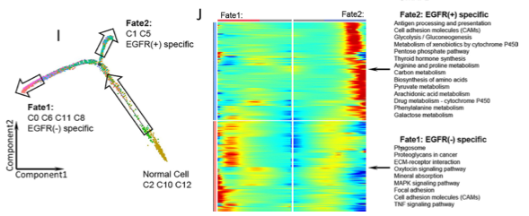

欢迎关注“小丫画图”公众号，回复“小白”，看小视频，实现点鼠标跑代码。

小丫微信: epigenomics  E-mail: figureya@126.com

作者：古潇，他的更多作品看这里<https://k.koudai.com/uH4zuEWC>

小丫编辑校验

```{r setup, include=FALSE}
knitr::opts_chunk$set(echo = TRUE)
```

# 需求描述

画出右图J，拟时间轨迹。



出自<https://jitc.bmj.com/content/10/2/e003534>

# 应用场景

展示如何在单细胞数据中使用monocle2包预测细胞发育轨迹。

# 环境设置

使用国内镜像安装包

```{r eval=FALSE}
options("repos"= c(CRAN="https://mirrors.tuna.tsinghua.edu.cn/CRAN/"))
options(BioC_mirror="http://mirrors.tuna.tsinghua.edu.cn/bioconductor/")
BiocManager::install("monocle")
```

加载包

```{r}
library(Seurat)
library(SeuratData)
library(ggplot2)
library(RColorBrewer)
library(dplyr)
library(magrittr)
library(monocle)

Sys.setenv(LANGUAGE = "en") #显示英文报错信息
options(stringsAsFactors = FALSE) #禁止chr转成factor
```

# 输入文件及预处理

## 输入文件

使用最常用的SeuratData中的pbmc3k进行演示，如果自己的数据不是在seurat中分析的，只要有表达矩阵和细胞注释信息也可分析，可跳过下面seurat常规分析，直接运行“构建monocle对象”。

由于pbmc数据并不适合分析发育轨迹，本示例只展示如何计算，不探究具体科学问题。

建议对自己数据中**存在发育关系的细胞群**进行发育轨迹预测。

```{r}
#devtools::install_github("satijalab/seurat-data")
# install dataset
#InstallData("pbmc3k") # 或手动下载后安装，http://seurat.nygenome.org/src/contrib/pbmc3k.SeuratData_3.1.4.tar.gz
#install.packages("pbmc3k.SeuratData_3.1.4.tar.gz", repos = NULL, type = "source")

# load dataset
LoadData("pbmc3k")
pbmc <- pbmc3k
```

## 预处理

```{r}
# 进行QC
# 计算mitochondria基因比例
pbmc[["percent.mt"]] <- PercentageFeatureSet(pbmc, pattern = "^MT-")
pbmc <- subset(pbmc, subset = nFeature_RNA > 200 & nFeature_RNA < 2500 & percent.mt < 5)
pbmc <- NormalizeData(pbmc, normalization.method = "LogNormalize", scale.factor = 10000)
pbmc <- FindVariableFeatures(pbmc, selection.method = "vst", nfeatures = 2000)
all.genes <- rownames(pbmc)
pbmc <- ScaleData(pbmc, features = all.genes)
pbmc <- RunPCA(pbmc, features = VariableFeatures(object = pbmc))
pbmc <- FindNeighbors(pbmc, dims = 1:10)
pbmc <- FindClusters(pbmc, resolution = 0.5)
pbmc <- RunUMAP(pbmc, dims = 1:10)

# 该数据中已注释了细胞类型，在metadata中的seurat_annotations列
umap.plot <- DimPlot(pbmc, reduction = "umap", label=T, group.by = "seurat_annotations") + NoLegend()
ggsave("UMAP_cluster.pdf", plot = umap.plot, width = 6, height = 6)

saveRDS(pbmc, file = "pbmc3k.seurat.object.rds") 
```

# 构建monocle对象

```{r}
# 构建monocle对象需要三个文件：表达矩阵、基因信息和meta信息
# monocle输入的是count矩阵（不建议使用data矩阵）
exp.matrix <- pbmc@assays$RNA@counts %>% as.matrix(.) 

gene.df <- data.frame(gene_short_name=rownames(exp.matrix))
rownames(gene.df) <- gene.df$gene_short_name

meta.df <- pbmc@meta.data

#构建cds对象
cds.object <- newCellDataSet(exp.matrix,
                             phenoData = new("AnnotatedDataFrame", data = meta.df),
                             featureData = new("AnnotatedDataFrame", data = gene.df),
                             lowerDetectionLimit = 0.5,
                             expressionFamily = negbinomial.size())

DelayedArray:::set_verbose_block_processing(TRUE)

# normalisation and variance estimation
cds.object <- estimateSizeFactors(cds.object)
cds.object <- estimateDispersions(cds.object)

# 过滤数据，选择最低表达量为0.1和至少千分之5的细胞中表达的基因
cds.object <- detectGenes(cds.object, min_expr = 0.1)
select_gene <- subset(fData(cds.object),num_cells_expressed>=ceiling(nrow(pData(cds.object))*0.005))$gene_short_name %>% as.vector()
cds.object <- cds.object[select_gene,]
```

# 确定用于轨迹排序的基因

用于轨迹排序的基因的本质细胞类型特异的特征性基因，可用两种方法来获得：

- 一种是用monocle里面的differentialGeneTest函数计算
- 另外一种是用Seurat包里面的FindAllMarkers函数计算
- 当然也可自定义，即下面的 deg.order

```{r warning=FALSE}
# monocel中的differentialGeneTest函数计算
# ~后面是为做差异分析的变量，选择pData(cds.object)中注释细胞类型的列名
deg.celltype <- differentialGeneTest(cds.object, fullModelFormulaStr="~seurat_annotations",cores=20) 
head(deg.celltype)
deg.celltype <- subset(deg.celltype, qval < 0.01) 
deg.order.monocle <- deg.celltype$gene_short_name[order(deg.celltype$qval)][1:1500]
head(deg.order.monocle)

# seurat中的FindAllMarkers函数计算
Idents(pbmc) <- "seurat_annotations"
deg.celltype <- FindAllMarkers(pbmc, group.by = "seurat_annotations", )
deg.celltype %<>% subset(.,p_val_adj<0.05 & avg_log2FC > 0.5)
deg.order.seurat <- deg.celltype$gene

# 后续分析选用differentialGeneTest计算结果，具体根据自己数据决定，也可同时运行比较

# 降维聚类和对细胞进行排序
cds.object <- setOrderingFilter(cds.object, ordering_genes = deg.order.monocle)
cds.object <- reduceDimension(cds.object, method = "DDRTree")
cds.object <- orderCells(cds.object)

# 可视化
p <- plot_cell_trajectory(cds.object, color_by = "Pseudotime")+
  theme(legend.position = "right")
p
# plot_cell_trajectory为ggplot语法，下面代码可改颜色，
# p <- p +  scale_color_gradientn(colours = rev(c("grey80", "yellow", "red")))
ggsave("trajectory_pseudotime.pdf", plot = p, width = 7, height = 5)


p <- plot_cell_trajectory(cds.object, color_by = "State")+
  theme(legend.position = "right")
ggsave("trajectory_state.pdf", plot = p, width = 7, height = 5)

# root_state可自定义拟时间轴的根，按照state分布设置根起点，如默认情况下伪时间值为0时在state 1, 也可更改为state 2

# 下面这个函数用于计算自定义的根细胞类型所处的state值， 由root_celltype变量指定，对应具体细胞类型名
# root_celltype = "XXX"
# state <- function(cds.object){
#   if (length(unique(pData(cds.object)$State)) > 1){
#     T0_counts <- table(pData(cds.object)$State, pData(cds.object)$seurat_annotations)[,root_celltype]
#     return(as.numeric(names(T0_counts)[which(T0_counts == max(T0_counts))]))
#   } else {
#     return (1)
#   }
# }

# cds.object <- orderCells(cds.object, root_state = 2) #把State5设成拟时间轴的起始点


# 按细胞类型着色
celltype.col <- colorRampPalette(colors = brewer.pal(9, "Set1"))(9)
p <- plot_cell_trajectory(cds.object, color_by = "seurat_annotations", ) + 
  scale_color_manual(values = celltype.col)+
  theme(legend.position = "right")
p
ggsave("trajectory_celltype.pdf", plot = p, width = 7, height = 5)

saveRDS(cds.object, "monocle.cds.object.rds")
```

# 开始画图

```{r}
# 鉴定分支点依赖的基因，BEAM函数
# branch_point为要研究的分支点，改示例中只有一个分支点1，后续分析选择branch1，
# 具体分支点和自己数据结合确定

branch_point = 1 #要研究的分支点编号
cores = 5 #调用5个核计算，按计算资源定义
BEAM_res <- BEAM(cds.object, branch_point = branch_point, cores = cores) %>% .[order(.$qval),]
write.csv(BEAM_res, "BEAM_res_data.csv")

BEAM_res <- BEAM_res[,c("gene_short_name", "pval", "qval")]

# check out the results
#         gene_short_name         pval         qval
# CD79A             CD79A 2.189293e-84 2.282994e-80
# HLA-DRA         HLA-DRA 2.792706e-66 1.456117e-62
# IGLL5             IGLL5 3.122173e-64 1.085267e-60
# NKG7               NKG7 9.633405e-60 2.511429e-56
# MS4A1             MS4A1 1.083889e-51 2.260558e-48
# GNLY               GNLY 2.597119e-50 4.513793e-47

table(BEAM_res$qval < 1e-4)
# FALSE  TRUE
# 10078   351

# 选择q值小于0.0001的基因用于热图展示，可自定义
beam.deg <- subset(BEAM_res, qval < 1e-4) %>% .$gene_short_name

# num_clusters为确定后续将这些基因分为几类，可多次尝试，用4类演示
num_clusters = 4

#pdf("branched_heatmap.pdf", height = 6, width = 5)
my_branched_heatmap <- plot_genes_branched_heatmap(cds.object[beam.deg,],
                                                   branch_point = branch_point,
                                                   num_clusters = num_clusters,
                                                   cores = cores,
                                                   use_gene_short_name = TRUE,
                                                   show_rownames = FALSE,
                                                   return_heatmap = TRUE)
#dev.off()
```

获取上述热图中各个聚类中的对应基因，保存到文件

```{r}
cluster_df <- cutree(my_branched_heatmap$ph_res$tree_row, k = num_clusters) %>% data.frame(.)
colnames(cluster_df) <- "Gene_Clusters"
cluster_df$Gene <- rownames(cluster_df)
cluster_df <- cluster_df[order(cluster_df$Gene_Clusters,decreasing = F),]
head(cluster_df)
#           Gene_Clusters      Gene
# CD79A                 1     CD79A
# IGLL5                 1     IGLL5
# MS4A1                 1     MS4A1
# TCL1A                 1     TCL1A
# LINC00926             1 LINC00926
# CD79B                 1     CD79B

table(cluster_df$Gene_Clusters)
#  1   2   3   4
# 91  75 127  58

write.csv(cluster_df,"branch_pseudotime_gene_list.csv", row.names = F)
```

后续使用这些基因做富集分析，将term标注到对应cluster的热图位置即可。

# 确定热图中Cell fate 1和2对应的轨迹

Cell fate 1 corresponds to the state with small id while cell fate 2 corresponds to sate with bigger id

即BEAM试图从分支点上的细胞一直向后遍历到根细胞(伪时间为0的细胞)，并将所有这些细胞作为前分支

细胞命运1对应state ID小的细胞，而细胞命运2对应 state ID大的细胞

具体可参考github主页对此问题的回复 <https://github.com/cole-trapnell-lab/monocle-release/issues/219>

所以此示例数据中：

- Pre−branch为 state1 细胞群
- Cell fate 1 为 state2 细胞群
- Cell fate 2 为 state3 细胞群

# Session Info

```{r}
sessionInfo()
```