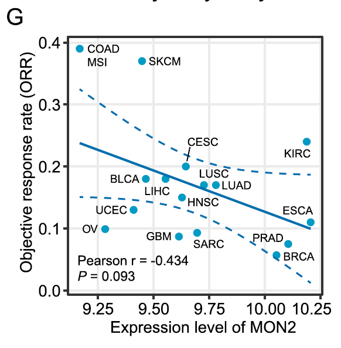

欢迎关注“小丫画图”公众号，回复“小白”，看小视频，实现点鼠标跑代码。

小丫微信: epigenomics  E-mail: figureya@126.com

作者：大鱼海棠，他的更多作品看这里<https://k.koudai.com/OFad8N0w>

单位：中国药科大学生物统计和计算药学研究中心，国家天然药物重点实验室

小丫编辑校验

```{r setup, include=FALSE}
knitr::opts_chunk$set(echo = TRUE)
```

# 需求描述

Fig. 4G这个是基因表达量和肿瘤客观缓解率orr相关性分析的图，主要难点是数据的来源问题及下载问题，纵坐标不会算。



出自<https://molecular-cancer.biomedcentral.com/articles/10.1186/s12943-021-01462-z>

Fig. 4 Determination of MON2 as novel immuno-oncology target.
G Pearson correlation between MON2 expression and objective response rate (ORR) for ICB. Only non-zero data was included

# 应用场景

绘制某感兴趣变量与肿瘤客观缓解率ORR的相关性图。

不包括计算ORR的过程，21种TCGA当中的癌症的ORR已经算好，直接拿来用。

# 环境设置

使用国内镜像安装包

```{r}
options("repos"= c(CRAN="https://mirrors.tuna.tsinghua.edu.cn/CRAN/"))
options(BioC_mirror="http://mirrors.tuna.tsinghua.edu.cn/bioconductor/")

```

加载包

```{r}
library(ggplot2)
library(data.table)
library(ggrepel)

Sys.setenv(LANGUAGE = "en") #显示英文报错信息
options(stringsAsFactors = FALSE) #禁止chr转成factor
```

# 输入文件

ORR.txt，TCGA 21种癌症的ORR客观缓解率数据。源自这篇文章（**记得引用**）补充材料cbr190007supp1_prod.pdf的eTable的前两行（中间还有一行肿瘤）：Lee JS, Ruppin E. Multiomics Prediction of Response Rates to Therapies to Inhibit Programmed Cell Death 1 and Programmed Cell Death 1 Ligand 1. JAMA Oncol. 2019 Nov 1;5(11):1614-1618.

merged_sample_quality_annotations.tsv，肿瘤注释文件。下载自<https://gdc.cancer.gov/about-data/publications/pancanatlas>，下载地址<http://api.gdc.cancer.gov/data/1a7d7be8-675d-4e60-a105-19d4121bdebf>。

EBPlusPlusAdjustPANCAN_IlluminaHiSeq_RNASeqV2.geneExp.tsv，表达矩阵，第一列是基因，之后是其在每个样本中的表达量。下载自<http://api.gdc.cancer.gov/data/3586c0da-64d0-4b74-a449-5ff4d9136611>

```{r}
# 设置感兴趣基因
geneOfInterest <- "MON2"

# 加载ORR数据
orr <- read.table("ORR.txt",sep = "\t",row.names = 1,check.names = F,stringsAsFactors = F,header = T)

# 读取肿瘤注释文件
rawAnno <- read.delim("merged_sample_quality_annotations.tsv",sep = "\t",row.names = NULL,check.names = F,stringsAsFactors = F,header = T) 
rawAnno$simple_barcode <- substr(rawAnno$aliquot_barcode,1,15)
samAnno <- rawAnno[!duplicated(rawAnno$simple_barcode),c("cancer type", "simple_barcode")]
samAnno <- samAnno[which(samAnno$`cancer type` != ""),]

# 快速读取表达谱数据并做数据预处理
expr <- fread("EBPlusPlusAdjustPANCAN_IlluminaHiSeq_RNASeqV2.geneExp.tsv",sep = "\t",stringsAsFactors = F,check.names = F,header = T) 
expr <- as.data.frame(expr); rownames(expr) <- expr[,1]; expr <- expr[,-1]
gene <- sapply(strsplit(rownames(expr),"|",fixed = T), "[",1)
expr$gene <- gene
expr <- expr[!duplicated(expr$gene),]
rownames(expr) <- expr$gene; expr <- expr[,-ncol(expr)]
expr[expr < 0] <- 0 # 对于这份泛癌数据，将略小于0的数值拉到0，否则不能取log（其他途径下载的泛癌数据可能不需要此操作）
colnames(expr) <- substr(colnames(expr),1,15)
gc()
is.element(geneOfInterest,rownames(expr))

# 由于原文包含了肠癌微卫星不稳定性的分类，这里直接加载通过TCGAbiolinks处理过的临床数据
(load("msi_results.rda"))
head(msi_results)

samAnno <- samAnno[which(substr(samAnno$simple_barcode,14,14) == "0"),] # 取出肿瘤样本
samAnno$index <- substr(samAnno$simple_barcode,9,12) # 截断TCGA barcode中的四位index
msi_results$index <- substr(msi_results$sample,9,12) # 截断MSI信息中barcode的四位index
samAnno <- merge(samAnno, msi_results, by = "index", all.x = TRUE) # 数据合并
samAnno$MSI <- as.character(samAnno$MSI) # 将因子转化为字符串
samAnno[which(samAnno$MSI %in% c("Indeterminate","MSI-H","MSI-L")),"MSI"] <- "MSI" # 这里认为设定不属于MSS的均为MSI
samAnno[which(is.na(samAnno$MSI)),"MSI"] <- "" # 其他NA设置为空
samAnno <- samAnno[order(samAnno$`cancer type`),] # 按照肿瘤排序
samAnno$`cancer type` <- ifelse(samAnno$MSI == "", samAnno$`cancer type`, paste0(samAnno$`cancer type`,"_",samAnno$MSI)) # 将COAD以及READ与MSI合并
samAnno <- samAnno[-which(samAnno$`cancer type` %in% c("COAD","READ")),] # 去掉无法找到MSI状态的COAD或READ
# 保存到文件
write.table(samAnno,"simple_sample_annotation.txt",sep = "\t",row.names = F,col.names = T,quote = F)
table(samAnno$`cancer type`)

tumors <- intersect(unique(samAnno$`cancer type`), rownames(orr)) # 21种肿瘤全部匹配
corTab <- NULL
for (i in tumors) {
  message("--",i,"...")
  tumsam <- samAnno[which(samAnno$`cancer type` == i),"simple_barcode"]
  tumsam <- intersect(tumsam,colnames(expr))
  es <- as.numeric(expr[geneOfInterest,tumsam]) # 取出感兴趣基因和当前肿瘤样本的表达谱子集
  es <- log2(es + 1) # 表达量取对数
  
  corTab <- rbind.data.frame(corTab,
                             data.frame(tumor = i, # 肿瘤名
                                        size = length(tumsam), # 肿瘤的样本量
                                        gene = geneOfInterest, # 感兴趣基因名
                                        AVG_EXPR = mean(es), # 感兴趣基因的表达量均值
                                        ORR = orr[i,"ORR",drop = F], # 对应该肿瘤的ORR
                                        stringsAsFactors = F),
                             stringsAsFactors = F)
}
write.table(corTab, file = paste0("summary of ", geneOfInterest," and ORR in 21 tumors.txt"),sep = "\t",row.names = F,col.names = T,quote = F)
```

# 表达量与ORR的相关性分析

```{r}
tmp <- corTab[which(corTab$size > 100 & corTab$ORR > 0),] # 根据作者描述，移除样本量小于100的肿瘤，且移除ORR为0的肿瘤
cor.res <- cor.test(tmp$AVG_EXPR, tmp$ORR, alternative = "less", method = "pearson") # 单侧检验渐进显著性
txt <- paste0("Pearson r = ", round(cor.res$estimate,3),"\n","P = ", round(cor.res$p.value,3)) # 创建相关性结果的标签
```

# 开始画图

```{r, fig.width=4.5, fig.height=4.5}
ggplot(tmp, aes(AVG_EXPR, ORR)) + 
  geom_point(color = "#009BC7", size = 2) + 
  geom_smooth(span = 2, method = glm, color = "#0070B2") +
  geom_text_repel(aes(label = tumor)) + 
  xlab(paste0("Expression level of ", geneOfInterest)) + 
  ylab("Objective response rate (ORR)") +
  theme_bw() +
  theme(axis.ticks = element_line(size = 0.2, color = "black"),
        axis.ticks.length = unit(0.2, "cm"),
        axis.text = element_text(size = 10, color = "black"),
        axis.title = element_text(size = 10, color = "black")) +
  annotate("text", x = min(tmp$AVG_EXPR), y = 0.03, 
           hjust = 0, fontface = 4, 
           label = txt)

ggsave(filename = paste0("correlation of ", geneOfInterest," and ORR in 21 tumors.pdf"), width = 4.5,height = 4.5)
```

这里我不会修改置信区间的边界颜色，原文作者表示是AI修饰的。

# Session Info

```{r}
sessionInfo()
```